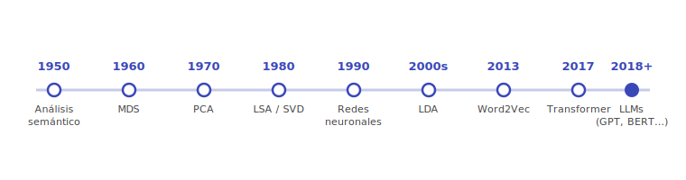
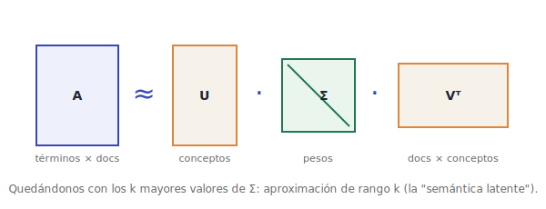
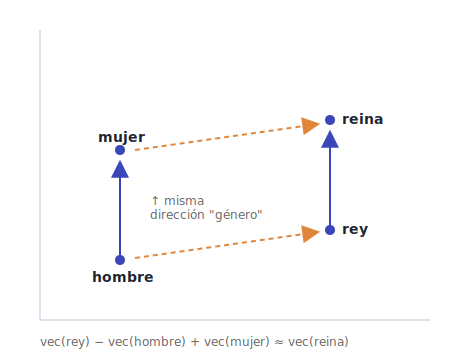
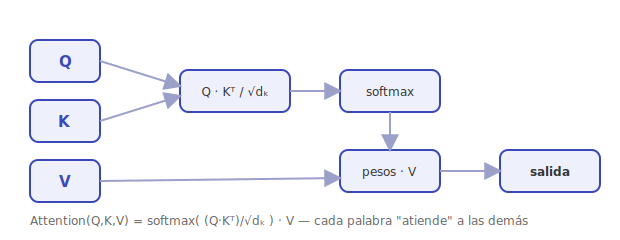

# Evolución de la Representación Semántica: Fundamentos del Procesamiento del Lenguaje Natural y la IA (1950–presente)

Este documento recorre la evolución histórica de un problema central: **cómo representar el significado de las palabras de forma que una máquina pueda procesarlo**. Desde los años 1950 hasta los grandes modelos de lenguaje (**LLM**) actuales, veremos cómo las técnicas para convertir palabras en vectores matemáticos fueron madurando hasta hacer posibles sistemas como **ChatGPT**.

---

## 🏠 Introducción

La representación semántica de palabras ha sido motor de los avances en procesamiento del lenguaje natural (PLN) e inteligencia artificial (IA). El recorrido, década a década:

- **1950** — Se sientan las bases del análisis semántico en plena posguerra: el lenguaje visto como estructura formal y los primeros intentos de capturar su significado de forma computable.
- **1960** — Kruskal y Shepard desarrollan el escalamiento multidimensional (MDS), que representa datos complejos en espacios de menor dimensión y permite visualizar relaciones semánticas.
- **1970** — Semántica latente y análisis de componentes principales (PCA): los vectores y las técnicas estadísticas empiezan a capturar el significado de las palabras.
- **1980** — El Análisis Semántico Latente (LSA), basado en la descomposición en valores singulares (SVD), gestiona grandes volúmenes de texto y mejora la recuperación de información.
- **1990** — Renacen las redes neuronales (Hopfield, redes recurrentes de Elman y Jordan) y las representaciones distribuidas, pese a problemas como el *vanishing gradient*.
- **Primeros 2000** — Modelos probabilísticos y *topic modeling* (LDA) modelan temas en grandes corpus con mayor flexibilidad.
- **2013** — Word2Vec (Mikolov, Google) populariza los *embeddings*: aritmética con significado lingüístico y un salto en las tareas de PLN.
- **2017** — Los **Transformers** ("Attention is All You Need") y el mecanismo de *self-attention* cambian el paradigma.
- **2018–hoy** — La era de los **LLM**: de los *embeddings* contextuales (BERT) a los modelos generativos a gran escala (GPT-3, ChatGPT, GPT-4, Claude), cerrando el arco que empezó en 1950.

<p align="center"></p>

## 📑 Índice

- [🏠 Introducción](#introducción)
- [🏠 Década de 1950: Fundamentos del Análisis Semántico](#década-de-1950-fundamentos-del-análisis-semántico)
    - [👾 1. Contexto Histórico](#1-contexto-histórico)
    - [👾 2. Teorías Lingüísticas Iniciales](#2-teorías-lingüísticas-iniciales)
    - [👾 3. Primeras Representaciones Semánticas](#3-primeras-representaciones-semánticas)
    - [👾 4. Conceptos Clave de la Semántica](#4-conceptos-clave-de-la-semántica)
    - [👾 5. Herramientas Matemáticas](#5-herramientas-matemáticas)
    - [👾 6. Aplicaciones Tempranas](#6-aplicaciones-tempranas)
    - [👾 7. Limitaciones y Desafíos](#7-limitaciones-y-desafíos)
    - [👾 Conclusión](#conclusión)
- [🏠 Años 1960: Mapeo Multidimensional](#años-1960-mapeo-multidimensional)
    - [👾 Joseph B. Kruskal](#joseph-b-kruskal)
    - [👾 James C. Shepherd](#james-c-shepherd)
    - [👾 Desarrollo del Análisis Multidimensional](#desarrollo-del-análisis-multidimensional)
    - [👾 Análisis de Escalamiento Multidimensional (MDS)](#análisis-de-escalamiento-multidimensional-mds)
    - [👾 Representar datos de alta dimensionalidad preservando relaciones](#representar-datos-de-alta-dimensionalidad-preservando-relaciones)
    - [👾 Propuesta del Mapeo Multidimensional y su Relevancia](#propuesta-del-mapeo-multidimensional-y-su-relevancia)
    - [👾 Aplicación en Lingüística](#aplicación-en-lingüística)
    - [👾 Método del MDS](#método-del-mds)
    - [👾 Impacto en Representaciones Vectoriales](#impacto-en-representaciones-vectoriales)
    - [👾 Limitaciones](#limitaciones)
    - [👾 Conclusión](#conclusión-1)
- [🏠 Década de 1970: Semántica Latente y Análisis de Componentes Principales (PCA)](#década-de-1970-semántica-latente-y-análisis-de-componentes-principales-pca)
    - [👾 Semántica Latente y la Importancia de los Vectores en el Análisis de Datos Semánticos](#semántica-latente-y-la-importancia-de-los-vectores-en-el-análisis-de-datos-semánticos)
    - [👾 Análisis de Componentes Principales (PCA)](#análisis-de-componentes-principales-pca)
    - [👾 Importancia de los Vectores](#importancia-de-los-vectores)
    - [👾 Técnicas Estadísticas para Comprender el Significado de las Palabras](#técnicas-estadísticas-para-comprender-el-significado-de-las-palabras)
    - [👾 Conclusión](#conclusión-2)
- [🏠 Década de 1980: Latent Semantic Analysis (LSA)](#década-de-1980-latent-semantic-analysis-lsa)
    - [👾 Desarrollo de LSA para representar y analizar grandes volúmenes de texto](#desarrollo-de-lsa-para-representar-y-analizar-grandes-volúmenes-de-texto)
    - [👾 Fundamentos del LSA](#fundamentos-del-lsa)
    - [👾 Proceso de LSA](#proceso-de-lsa)
    - [👾 El impacto de esta técnica en la comprensión automática del lenguaje](#el-impacto-de-esta-técnica-en-la-comprensión-automática-del-lenguaje)
    - [👾 Conclusión](#conclusión-3)
- [🏠 Década de 1990: Redes Neuronales y Representaciones Distribuidas](#década-de-1990-redes-neuronales-y-representaciones-distribuidas)
    - [👾 Uso Temprano de Redes Neuronales para Representaciones Distribuidas](#uso-temprano-de-redes-neuronales-para-representaciones-distribuidas)
    - [👾 Avances y Limitaciones frente a Enfoques Posteriores](#avances-y-limitaciones-frente-a-enfoques-posteriores)
    - [👾 Conclusión](#conclusión-4)
- [🏠 Primeros 2000: Modelos Probabilísticos y Topic Modeling](#primeros-2000-modelos-probabilísticos-y-topic-modeling)
    - [👾 Introducción de Modelos como Latent Dirichlet Allocation (LDA)](#introducción-de-modelos-como-latent-dirichlet-allocation-lda)
    - [👾 Cómo los Modelos Probabilísticos Influyeron en la Semántica Vectorial](#cómo-los-modelos-probabilísticos-influyeron-en-la-semántica-vectorial)
    - [👾 Conclusión](#conclusión-5)
- [🏠 2013: La Revolución de Word2Vec](#2013-la-revolución-de-word2vec)
    - [👾 Propuesta de Tomas Mikolov y su equipo de Google](#propuesta-de-tomas-mikolov-y-su-equipo-de-google)
    - [👾 Arquitecturas clave](#arquitecturas-clave)
    - [👾 Características principales de Word2Vec](#características-principales-de-word2vec)
    - [👾 Ventajas del modelo](#ventajas-del-modelo)
    - [👾 Impacto en el procesamiento del lenguaje natural](#impacto-en-el-procesamiento-del-lenguaje-natural)
    - [👾 Limitaciones y consideraciones éticas](#limitaciones-y-consideraciones-éticas)
    - [👾 Evolución posterior](#evolución-posterior)
    - [👾 Conclusión](#conclusión-6)
- [🏠 2017: La Arquitectura Transformer](#2017-la-arquitectura-transformer)
    - [👾 Contexto y motivación](#contexto-y-motivación)
    - [👾 El mecanismo de self-attention](#el-mecanismo-de-self-attention)
    - [👾 Codificación posicional (positional encoding)](#codificación-posicional-positional-encoding)
    - [👾 Arquitectura completa: encoder y decoder](#arquitectura-completa-encoder-y-decoder)
    - [👾 Por qué desplazó a las RNN y las LSTM](#por-qué-desplazó-a-las-rnn-y-las-lstm)
- [🏠 2018–hoy: La Era de los Grandes Modelos de Lenguaje (LLM)](#2018hoy-la-era-de-los-grandes-modelos-de-lenguaje-llm)
    - [👾 2018: el año de la divergencia (BERT, GPT-1, ELMo)](#2018-el-año-de-la-divergencia-bert-gpt-1-elmo)
    - [👾 2019: GPT-2 y el poder del escalado](#2019-gpt-2-y-el-poder-del-escalado)
    - [👾 2020: GPT-3, aprendizaje en contexto y leyes de escala](#2020-gpt-3-aprendizaje-en-contexto-y-leyes-de-escala)
    - [👾 2022: alineación, RLHF y la irrupción de ChatGPT](#2022-alineación-rlhf-y-la-irrupción-de-chatgpt)
    - [👾 2023 en adelante: multimodalidad, modelos abiertos y agentes](#2023-en-adelante-multimodalidad-modelos-abiertos-y-agentes)
    - [👾 El arco de la representación semántica](#el-arco-de-la-representación-semántica)
- [🏠 Conclusión General](#conclusión-general)

---

> [!TIP] 😄 Pausa
> Aviso: este documento cubre 75 años de IA y contiene chistes cada pocas páginas. Si encuentras uno bueno, fue sin querer.

## 🏠 Década de 1950: Fundamentos del Análisis Semántico

### 👾 1. Contexto Histórico

> [!TIP] 😄 Pausa
> Shannon midió la información en bits. Tu grupo de WhatsApp familiar transmite millones de bits y cero información.


#### 📌 Posguerra y avances tecnológicos

Tras la Segunda Guerra Mundial, el mundo experimentó un fuerte impulso en el desarrollo de tecnologías computacionales. Este período, conocido como la "revolución computacional de posguerra", fue catalizado por proyectos militares como ENIAC (1945), la primera computadora electrónica de propósito general, diseñada originalmente para calcular tablas de tiro de artillería. Avances logrados durante la guerra, como COLOSSUS en Bletchley Park para descifrar códigos nazis, establecieron las bases de la computación moderna.

La necesidad de procesar grandes cantidades de información impulsó innovaciones cruciales. Claude Shannon, en los Laboratorios Bell, publicó su obra seminal `Una Teoría Matemática de la Comunicación` (1948), que estableció los fundamentos de la teoría de la información y la codificación digital. En paralelo, John von Neumann propuso la arquitectura que lleva su nombre, fijando el paradigma de `programa almacenado` que seguimos usando hoy.

Gobiernos y universidades comenzaron a invertir masivamente en investigación. El MIT, Harvard y Stanford establecieron algunos de los primeros laboratorios de computación. La Universidad de Manchester desarrolló la `Manchester Baby (1948)`, la primera computadora capaz de almacenar programas en memoria. IBM, hasta entonces productora de máquinas tabuladoras mecánicas, hizo su transición a las computadoras electrónicas con el `IBM 701 (1952)`, marcando el inicio de la `computación comercial`.

#### 📌 Primeros intentos de procesamiento del lenguaje natural

Este período vio los primeros intentos de `procesamiento del lenguaje natural`. Warren Weaver, en su memorando de 1949 "Translation", sugirió por primera vez la posibilidad de usar `computadoras para la traducción`, estableciendo las bases conceptuales del análisis computacional del lenguaje. En 1954, el experimento Georgetown-IBM demostró la primera `traducción automática` de ruso a inglés, aunque con un vocabulario limitado de 250 palabras.

Los primeros programadores, muchos de ellos mujeres como `Grace Hopper` (autora del primer `compilador`) y las "computadoras humanas" del ENIAC, establecieron las bases de la programación moderna. El análisis de datos lingüísticos empezó a emerger como campo de estudio, con investigadores como `Noam Chomsky` desarrollando teorías formales sobre la estructura del lenguaje que más tarde influirían en el diseño de lenguajes de programación y sistemas de PLN.

#### 📌 Lingüística estructural

La `lingüística estructural` fue un enfoque dominante en el estudio del lenguaje durante el siglo XX, basado en la idea de que el lenguaje es una `estructura formal y organizada`: las palabras y oraciones no se estudian de forma aislada, sino como parte de un sistema más amplio en el que cada elemento tiene un papel y sigue ciertas reglas. Estas teorías influyeron en las primeras técnicas de `vectorización de palabras`, al llevar a pensar el lenguaje como un conjunto estructurado de relaciones analizable y representable matemáticamente.

Esta teoría fue fuertemente influida por `Ferdinand de Saussure`, quien estableció conceptos fundamentales como la `"langue"` (el sistema abstracto de reglas y convenciones del lenguaje) y la `"parole"` (el uso real del lenguaje por los hablantes).

En este enfoque, las palabras se analizan no por su significado aislado, sino por cómo se relacionan y contrastan con otras dentro del sistema. Por ejemplo, el significado de `"perro"` se entiende en parte porque no es `"gato"`, `"caballo"` o `"roca"`. Estas relaciones sentaron las bases del análisis semántico posterior, donde el significado se deriva del contexto y de las conexiones con otras palabras. La idea de que un lenguaje estructurado puede modelarse mediante relaciones y patrones describibles con `matrices` y `vectores` ofreció la base teórica de los métodos distribucionales usados después para vectorizar palabras.

### 👾 2. Teorías Lingüísticas Iniciales

#### 📌 Teoría de la Información de Shannon (1948)

La `Teoría de la Información`, desarrollada por Claude Shannon en 1948, es una piedra angular de la comunicación y el procesamiento de datos. Shannon se preguntó cómo transmitir información de manera eficiente y confiable a través de canales con ruido, como líneas telefónicas o sistemas de radio, algo crucial en la era de las comunicaciones electrónicas emergentes. Sus ideas revolucionaron el entendimiento de cómo codificar, transmitir y recibir datos.

##### Conceptos clave

1. **Información y entropía**:
   - Definió la **información** como una medida de la sorpresa o incertidumbre de un mensaje: cuanto más inesperado es, más información lleva.
   - Introdujo la **entropía**, que mide la cantidad promedio de información de un mensaje, es decir, lo impredecible que es una fuente. Si todos los mensajes posibles son igualmente probables, la entropía es máxima.
   - Ejemplo: al lanzar una moneda justa, cada resultado es igual de probable y la entropía es alta; si siempre sale "cara", la entropía es cero porque no hay incertidumbre.

2. **Redundancia y compresión**:
   - Shannon demostró que los mensajes pueden codificarse de forma más eficiente reduciendo la **redundancia** o información repetitiva, lo que conduce a la **compresión**: eliminar datos innecesarios para minimizar el tamaño transmitido.
   - En el lenguaje natural, algunas letras o palabras son más comunes que otras (por ejemplo, "e" frente a "z" en inglés). Aprovechando estas frecuencias se diseñan códigos más cortos para los elementos frecuentes.

3. **Capacidad del canal**:
   - La **capacidad del canal** es la cantidad máxima de información que puede transmitirse de forma confiable a través de un canal con ruido, estableciendo límites teóricos sobre cuántos datos pueden enviarse sin errores según el nivel de ruido.

##### Relación con la vectorización de palabras

- **Modelado de lenguaje**: las técnicas estadísticas posteriores, como los modelos de n-gramas, se basaron en los conceptos de probabilidad y entropía de Shannon, usando la frecuencia y distribución de palabras para predecir la probabilidad de una secuencia.
- **Optimización de representaciones semánticas**: vectorizar palabras busca capturar la máxima información semántica con la mínima redundancia. Técnicas de reducción de dimensionalidad como Latent Semantic Analysis (LSA) se inspiran en eliminar redundancia y conservar la esencia de la información.
- **Codificación y compresión de datos**: la noción de compresión es relevante para manejar grandes corpus de texto. Métodos modernos como Word2Vec o los embeddings contextuales representan palabras de manera compacta y eficiente.

La Teoría de la Información proporcionó así un marco matemático para comprender y optimizar cómo se procesan y transmiten datos textuales, un paso crucial hacia técnicas más avanzadas de vectorización.

#### 📌 Hipótesis Distribucional de Harris (1954)

La **Hipótesis Distribucional**, formulada por Zellig Harris en 1954, es un principio fundamental de la semántica computacional: el significado de una palabra puede inferirse a partir de los contextos en que aparece. Si dos palabras se usan en contextos similares, es probable que tengan significados relacionados. Por ejemplo, "perro" y "gato" aparecen en contextos similares (mascotas, animales domésticos), lo que sugiere una relación semántica.

##### Implicaciones

- **Semántica basada en contexto**: en lugar de centrarse en definiciones o características específicas, el significado se entiende por patrones de co-ocurrencia con otras palabras, lo que sentó las bases de enfoques matemáticos y estadísticos.
- **Representaciones vectoriales**: los investigadores empezaron a representar palabras como vectores en un espacio semántico, construidos a partir de las frecuencias con que aparecen junto a otras palabras. Así surge la **matriz de co-ocurrencia**, donde cada fila es una palabra y cada columna indica cuántas veces aparece junto a otra en un corpus.

##### Influencia en los modelos semánticos

- **Bolsa de palabras (Bag of Words)**: uno de los primeros enfoques; ignora el orden de las palabras y se basa en su frecuencia en un documento, usando la hipótesis distribucional para representar la importancia relativa.
- **Latent Semantic Analysis (LSA)**: usa la co-ocurrencia de palabras para representar palabras y documentos en un espacio semántico de menor dimensión, capturando relaciones implícitas.
- **Word embeddings modernos**: **Word2Vec**, **GloVe** y otros se fundan en esta hipótesis, aprendiendo vectores en los que palabras de contextos similares quedan más cerca. En Word2Vec, la proximidad de los vectores de "rey" y "reina" refleja su relación semántica.

##### Ejemplo práctico

Al leer muchos artículos de cocina, si "cuchara" y "tenedor" aparecen con frecuencia cerca de "comida", "mesa" y "cena", podemos inferir que tienen significados relacionados aunque sus funciones difieran.

**Frases**:
1. "La cuchara y el tenedor están en la mesa para la cena."
2. "La comida se sirve con cuchara y tenedor."
3. "La mesa está lista para la cena con cuchara, tenedor y comida."
4. "El tenedor y la cuchara son necesarios para la comida en la cena."

**Matriz de co-ocurrencia**:

|             | cuchara | tenedor | comida | mesa | cena |
| ----------- | ------- | ------- | ------ | ---- | ---- |
| **cuchara** | 0       | 3       | 2      | 2    | 3    |
| **tenedor** | 3       | 0       | 2      | 1    | 2    |
| **comida**  | 2       | 2       | 0      | 1    | 2    |
| **mesa**    | 2       | 1       | 1      | 0    | 2    |
| **cena**    | 3       | 2       | 2      | 2    | 0    |

La Hipótesis Distribucional ha tenido un impacto duradero: inspiró modelos matemáticos y computacionales que usan el contexto para capturar significado y sigue siendo un principio subyacente en métodos de PLN actuales, incluidos los basados en transformadores (BERT, GPT, etc.).

### 👾 3. Primeras Representaciones Semánticas

#### 📌 Análisis de co-ocurrencia

El **análisis de co-ocurrencia** examina la frecuencia con que ciertas palabras aparecen juntas en un texto o corpus. La idea central es que las palabras que co-aparecen con regularidad en contextos similares comparten una relación semántica. Es una base para construir representaciones vectoriales.

**Cómo funciona**:
- Se construye una matriz cuyas filas y columnas representan palabras del vocabulario; cada celda indica cuántas veces aparecen juntas en un contexto definido (una misma frase o ventana de palabras).
- Ejemplo: en un texto sobre animales, "perro" y "ladrar" suelen aparecer juntas, lo que sugiere una relación semántica.

**Importancia en PLN**:
- **Captura de relaciones semánticas**: identifica asociaciones entre palabras, crucial para la comprensión del lenguaje por máquinas.
- **Base para modelos vectoriales**: es un paso inicial en LSA y Word2Vec, que representan palabras en espacios donde la proximidad refleja similitud semántica.

**Limitaciones**:
- **Dependencia del contexto**: las co-ocurrencias pueden ser ambiguas si no se consideran los distintos significados de una palabra.
- **Escalabilidad**: construir y manejar estas matrices es costoso en almacenamiento y procesamiento para grandes corpus.

#### 📌 Matrices de contingencia

Las **matrices de contingencia** representan la frecuencia con que las palabras aparecen en distintos documentos de un corpus, permitiendo captar patrones y relaciones entre palabras y documentos.

**Cómo se construyen**:
- **Filas**: palabras únicas del vocabulario.
- **Columnas**: documentos del corpus.
- **Celdas**: número de veces que una palabra (fila) aparece en un documento (columna).

**Ejemplo práctico** con tres documentos y las palabras "gato", "perro" y "comer":

| **Palabra** | **Doc 1** | **Doc 2** | **Doc 3** |
| ----------- | --------- | --------- | --------- |
| gato        | 3         | 0         | 2         |
| perro       | 1         | 4         | 0         |
| comer       | 2         | 1         | 3         |

**Importancia en PLN**:
- **Fundamento del análisis semántico**: son esenciales para LSA y otras técnicas de reducción de dimensionalidad, e identifican qué palabras son importantes en cada documento.
- **Facilitan la vectorización**: palabras y documentos se representan como vectores, donde las frecuencias permiten medir similitudes y diferencias.

**Usos prácticos**: recuperación de información (búsqueda por frecuencia de términos clave) y clasificación de texto.

**Limitaciones**:
- **Dispersión (sparsity)**: en grandes corpus la mayoría de las celdas son ceros, lo que hace ineficiente el almacenamiento y procesamiento.
- **Información limitada**: las frecuencias brutas no capturan relaciones semánticas profundas, pues ignoran el contexto.

### 👾 4. Conceptos Clave de la Semántica

#### 📌 Semántica distribucional

La **semántica distribucional** define el significado de una palabra en función de los contextos en que se usa: las palabras adquieren su significado a través de sus relaciones y patrones con otras, no de forma aislada. Se basa en la Hipótesis Distribucional de Harris: "Las palabras que aparecen en contextos similares tienden a tener significados similares."

**Cómo funciona**:
- **Análisis de contexto**: se analizan las palabras que rodean a una palabra en un gran corpus. "Perro" y "gato" aparecen junto a términos como "mascota", "comida" o "veterinario", lo que sugiere su relación semántica.
- **Representación vectorial**: las palabras se representan como vectores en un espacio de alta dimensionalidad; la proximidad entre vectores indica similitud semántica.

**Aplicaciones en PLN**:
- **Word embeddings**: Word2Vec, GloVe y FastText capturan automáticamente relaciones semánticas como vectores.
- **Análisis de sentimiento y clasificación de texto**: representar palabras por sus contextos permite modelos que entienden el tono y el significado subyacente.

**Ejemplo**: con vectores se pueden manipular relaciones matemáticamente, como `"Rey - Hombre + Mujer ≈ Reina"`. Al enfocarse en el uso de las palabras, la semántica distribucional impulsó avances en traducción automática, generación de texto y comprensión del lenguaje.

#### 📌 Espacios vectoriales

Los **espacios vectoriales** representan palabras como vectores cuyas posiciones reflejan sus relaciones y similitudes semánticas.

**Concepto básico**:
- **Vectores**: en PLN son listas de números que representan palabras, derivados de la frecuencia y el contexto en un corpus.
- **Dimensiones**: cada una puede representar una característica contextual o semántica (por ejemplo, "animales" o "comida"); palabras de significado similar quedan cercanas.

**Ejemplo** con las palabras "perro", "gato", "comida", "plato", "cuchara", "zoológico", "cena", "león", "cocina", "selva" y las dimensiones animales, comida, doméstico, salvaje, utensilios:

| Palabra       | Animales | Comida | Doméstico | Salvaje | Utensilios |
| ------------- | -------- | ------ | --------- | ------- | ---------- |
| **perro**     | 0.9      | 0.1    | 0.8       | 0.0     | 0.1        |
| **gato**      | 0.8      | 0.1    | 0.7       | 0.0     | 0.1        |
| **comida**    | 0.2      | 1.0    | 0.3       | 0.0     | 0.0        |
| **plato**     | 0.0      | 0.9    | 0.4       | 0.0     | 0.8        |
| **cuchara**   | 0.0      | 0.8    | 0.3       | 0.0     | 1.0        |
| **zoológico** | 1.0      | 0.0    | 0.1       | 0.4     | 0.0        |
| **cena**      | 0.1      | 0.9    | 0.5       | 0.0     | 0.4        |
| **león**      | 1.0      | 0.0    | 0.0       | 1.0     | 0.0        |
| **cocina**    | 0.0      | 0.7    | 0.8       | 0.0     | 0.6        |
| **selva**     | 0.8      | 0.0    | 0.0       | 1.0     | 0.0        |

Así, "perro" y "gato" están cerca en "animales" y "doméstico"; "león" y "selva" en "animales" y "salvaje"; "cuchara" y "plato" en "comida" y "utensilios".

**Cómo capturan relaciones semánticas**:
- **Similitud de coseno**: mide el coseno del ángulo entre dos vectores; valores altos indican palabras usadas en contextos similares.
- **Operaciones semánticas**: permiten aritmética que refleja relaciones, como `"Rey - Hombre + Mujer = Reina"`, clave para analogías y razonamiento.

**Construcción del espacio**:
- **Modelos de co-ocurrencia**: las frecuencias con que las palabras aparecen juntas se convierten en valores de los vectores.
- **Reducción de dimensionalidad**: LSA y Word2Vec comprimen la alta dimensionalidad manteniendo las relaciones semánticas.

**Aplicaciones**: búsqueda y recuperación de información, traducción automática y análisis de sentimientos. Los espacios vectoriales transforman el lenguaje en un formato numérico procesable, base de chatbots, asistentes virtuales y sistemas de recomendación.

### 👾 5. Herramientas Matemáticas

#### 📌 Álgebra lineal

El **álgebra lineal** estudia vectores, matrices y sus operaciones. Es esencial en PLN e IA porque permite modelar y manipular grandes volúmenes de datos textuales de forma eficiente.

**Conceptos clave**:
- **Vectores**: listas ordenadas de números que representan magnitudes en un espacio multidimensional. En PLN representan palabras, frases o documentos. Por ejemplo, un vector de 3 dimensiones:

```
[2, 5, -1]
```

- **Matrices**: tablas de números en filas y columnas. En PLN almacenan datos como las frecuencias de palabras por documento (matrices de contingencia) o relaciones entre palabras. Ejemplo de matriz de 3 filas y 2 columnas:

```
⎛ 1   2 ⎞
⎜ 3   4 ⎟
⎝ 5   6 ⎠
```

- **Operaciones fundamentales**:
   - **Suma de vectores**: suma de elementos correspondientes.
   - **Multiplicación escalar**: multiplicar cada componente por un escalar.
   - **Multiplicación de matrices**: combina dos matrices para producir una tercera; clave en transformaciones lineales y redes neuronales.
   - **Producto punto**: mide la similitud entre dos vectores; clave para la cercanía semántica.

> [!TIP]
> La **similitud de coseno** y el **producto punto** están relacionados, pero no son lo mismo:
>
> 1. **Producto punto**: multiplica dos vectores elemento a elemento y suma los resultados. Indica cuánto se proyecta un vector sobre otro en términos absolutos, sin normalizar; depende de las magnitudes.
>
> ```
> A · B  =  A_x·B_x + A_y·B_y + ··· + A_n·B_n
> ```
>
> 2. **Similitud de coseno**: versión normalizada del producto punto; calcula el coseno del ángulo entre dos vectores. Da un valor entre -1 y 1, eliminando la influencia de las magnitudes y considerando solo la **dirección**.
>
> ```
>                              A · B
> Similitud de Coseno  =  ─────────────────
>                          ‖A‖ · ‖B‖
> ```
>
> El producto punto mide la alineación directa (afectada por las magnitudes); la similitud de coseno mide la similitud en dirección **independientemente de la magnitud**.

**Aplicaciones en vectorización de palabras**:
- **Representación y transformación**: vectores y matrices capturan el significado y las relaciones entre palabras; las operaciones algebraicas calculan su similitud.
- **Reducción de dimensionalidad**: técnicas como **Singular Value Decomposition (SVD)** reducen la complejidad manteniendo la información relevante, fundamentales en LSA.
- **Entrenamiento de modelos de IA**: las redes neuronales, incluidas las que generan representaciones como Word2Vec, se construyen sobre operaciones matriciales para ajustar pesos y optimizar el modelo.

Sin esta base sería imposible manejar grandes conjuntos de texto, calcular similitud semántica o entrenar modelos de lenguaje complejos.

#### 📌 Estadística básica

La **estadística básica** permite analizar y describir datos; en PLN es crucial para comprender patrones y relaciones en datos textuales.

**Conceptos fundamentales**:
- **Probabilidad**: mide la posibilidad de que ocurra un evento. Ejemplo: la probabilidad de que aparezca "gato" en un documento es el número de veces que aparece dividido por el total de palabras.
- **Frecuencias**: número de veces que ocurre una palabra. La **frecuencia absoluta** es el total de apariciones; la **frecuencia relativa**, la proporción respecto al total. Ejemplo: si "perro" aparece 50 veces en 1000 palabras, la frecuencia relativa es 50/1000 = 0.05.
- **Distribuciones**: describen cómo se dispersan los datos. En PLN destaca la **distribución de Zipf**: pocas palabras son muy frecuentes ("el", "de", "y") y la mayoría poco frecuentes ("algoritmo", "estocástico").

**Aplicaciones en PLN**:
- **Modelado de lenguaje**: probabilidades y frecuencias predicen la siguiente palabra de una secuencia (por ejemplo, "lluvia" es más probable que "nevado" en un contexto tropical).
- **Análisis de texto**: las distribuciones de palabras identifican términos clave y patrones, útiles para clasificación de documentos y análisis de sentimientos.

La estadística es fundamental para el análisis de co-ocurrencia y los modelos probabilísticos que representan el significado, infiriendo relaciones semánticas y construyendo representaciones vectoriales más precisas. Fue esencial en los primeros enfoques de PLN y sigue vigente en modelos avanzados.

### 👾 6. Aplicaciones Tempranas

#### 📌 Traducción automática

La **traducción automática** fue uno de los primeros intentos de aplicar computadoras al lenguaje humano. Los enfoques iniciales, de mediados del siglo XX, se basaban en reglas y patrones estadísticos, antes de los métodos neuronales y de aprendizaje profundo.

**Enfoques basados en reglas**:
- **Sistemas de reglas lingüísticas**: dependían de gramáticas complejas y diccionarios bilingües escritos a mano. Ejemplo: una regla podría indicar que en inglés "adjetivo + sustantivo" se traduce al francés como "sustantivo + adjetivo".
- **Limitaciones**: eran frágiles y difíciles de escalar, requerían conocimiento detallado de ambos idiomas y no manejaban bien las excepciones; la calidad solía ser baja en textos largos o complejos por no capturar sutilezas semánticas y contextuales.

**Enfoques estadísticos (décadas de 1980-1990)**:
- **Modelos basados en frecuencias y estadísticas**: con el acceso a grandes corpus bilingües, modelos como el **Modelo de Traducción de IBM** analizaban datos para hallar patrones en la traducción de palabras y frases, usando frecuencia y co-ocurrencias para determinar las traducciones más probables.
- **Cadenas de Markov y alineamiento de palabras**: algoritmos de alineamiento emparejaban frases entre idiomas calculando probabilidades. Los **modelos basados en frases** traducían bloques de texto en lugar de palabras individuales, mejorando fluidez y precisión.

**Desafíos**: los métodos estadísticos no capturaban bien el contexto ni las ambigüedades, generando traducciones inexactas, y requerían grandes cantidades de datos bilingües de alta calidad, no siempre disponibles para todos los idiomas.

Estos enfoques tempranos sentaron las bases de los modelos posteriores (modelos neuronales y transformadores como Google Translate y GPT) e impulsaron el desarrollo de técnicas de vectorización y análisis semántico.

#### 📌 Recuperación de información

La **Recuperación de Información (RI)** busca y localiza documentos relevantes en grandes volúmenes de datos a partir de términos clave del usuario. Es fundamental para motores de búsqueda y bibliotecas digitales.

**Concepto básico**:
- **Indexación de documentos**: se construyen índices que almacenan palabras clave y sus ubicaciones, acelerando la búsqueda.
- **Términos de consulta**: el usuario aporta uno o más términos clave que el sistema compara con su índice para hallar documentos relacionados.

**Modelos de RI**:
- **Modelo booleano**: combina términos con operadores "AND", "OR" y "NOT", devolviendo solo documentos que cumplen estrictamente las condiciones. Ejemplo: "gato AND perro" busca documentos con ambas palabras.
- **Modelo vectorial**: representa documentos y consulta en un espacio vectorial; los más relevantes son aquellos cuyos vectores están más cerca de la consulta según una métrica como el **coseno del ángulo**, midiendo la relevancia de forma continua.
- **Modelo probabilístico**: calcula la probabilidad de que un documento sea relevante para una consulta según la ocurrencia de términos clave y otros factores.

La RI fue uno de los primeros campos beneficiados por la vectorización de palabras: representar palabras y documentos como vectores mejoró la precisión y relevancia, capturando relaciones semánticas y permitiendo encontrar documentos relevantes aunque no coincidan exactamente los términos. Por eso un motor como Google considera sinónimos, contextos similares y otros factores semánticos.

**Desafíos y avances**:
- **Ambigüedad semántica**: las palabras tienen múltiples significados; los sistemas modernos usan modelos de lenguaje para desambiguar.
- **Expansión de consultas**: añadir sinónimos o términos relacionados mejora la recuperación.
- **Modelos basados en aprendizaje automático**: aprenden patrones para entregar información cada vez más precisa.

### 👾 7. Limitaciones y Desafíos

#### 📌 Capacidad computacional

La **capacidad computacional** de las primeras décadas era muy limitada frente a los estándares actuales. Las computadoras de mediados del siglo XX tenían fuertes restricciones de velocidad, memoria y almacenamiento.

**Limitaciones principales**:
- **Velocidad de procesamiento**: los procesadores eran lentos; cálculos como el análisis de co-ocurrencia o las operaciones con matrices tardaban mucho.
- **Memoria y almacenamiento**: la memoria se limitaba a unos pocos kilobytes o megabytes, y el almacenamiento era escaso y costoso, dificultando guardar grandes corpus.
- **Costos elevados**: las computadoras eran caras y solo grandes instituciones académicas, gubernamentales o corporativas podían usarlas, lo que frenaba el avance científico.

**Impacto en la vectorización de palabras**:
- **Simplificación de modelos**: los primeros modelos eran simples y priorizaban métodos ejecutables con los recursos disponibles, dependiendo de frecuencias de co-ocurrencia y matrices dispersas.
- **Reducción de dimensionalidad**: técnicas como el **Análisis de Componentes Principales (PCA)** y el **Latent Semantic Analysis (LSA)** simplificaban los datos manteniendo solo las dimensiones más importantes.
- **Aproximaciones y heurísticas**: en lugar de cálculos exactos se usaban aproximaciones para operar dentro de las capacidades de la época.

A medida que el hardware mejoró, se hizo posible ejecutar modelos más complejos, desde las matrices de co-ocurrencia simples hasta el aprendizaje profundo actual. La limitación fue un obstáculo, pero también impulsó la innovación en técnicas eficientes de procesamiento de texto.

#### 📌 Comprensión profunda del lenguaje

La **comprensión profunda del lenguaje** es la capacidad de entender no solo palabras y frases, sino los significados subyacentes, matices y contextos que los humanos captan naturalmente. Las primeras técnicas de PLN eran superficiales y limitadas para lograrlo.

**Características de las primeras técnicas**:
- **Enfoques basados en reglas y frecuencia**: contaban la frecuencia de palabras o aplicaban reglas gramaticales predefinidas, sin captar el sarcasmo, la ambigüedad o los significados implícitos. El análisis de co-ocurrencia medía cuántas veces aparecían juntas las palabras, pero no el motivo o contexto.
- **Sin comprensión de contexto**: trataban cada palabra como entidad independiente, incapaces de desambiguar palabras polisémicas (por ejemplo, "banco" como asiento o institución financiera) ni de procesar metáforas o ironías.
- **Limitaciones semánticas**: no capturaban sinónimos, antónimos ni la estructura narrativa; un sistema superficial podía traducir literalmente una expresión idiomática sin entender su significado real.

**Implicaciones**:
- **Resultados inexactos**: las aplicaciones generaban resultados poco naturales y no inferían la intención del mensaje; un sistema de RI podía devolver documentos irrelevantes por no entender las relaciones semánticas entre términos.
- **Falta de flexibilidad**: las reglas eran rígidas y poco efectivas ante texto no estructurado o lenguaje informal.

Con el avance del PLN aparecieron modelos más sofisticados, como **Word Embeddings** (Word2Vec, GloVe) y redes neuronales profundas, que captaron mejor los matices. Modelos como **BERT** y **GPT** usan representaciones contextuales que entienden cómo cambia el significado de una palabra según el contexto, abriendo la puerta a asistentes virtuales avanzados, análisis de texto más preciso y traducciones más naturales.

### 👾 Conclusión

La década de 1950 estableció los cimientos conceptuales, lingüísticos y matemáticos del análisis semántico computacional: la revolución de posguerra y los primeros computadores, la teoría de la información de Shannon, la hipótesis distribucional de Harris y la lingüística estructural convergieron para concebir el lenguaje como un sistema de relaciones representable mediante vectores y matrices. Pese a las severas limitaciones de cómputo y a la falta de comprensión contextual de aquellas técnicas, las ideas de esta década —co-ocurrencia, espacios vectoriales, semántica distribucional y las primeras aplicaciones de traducción automática y recuperación de información— siguen siendo el fundamento de los modelos de PLN modernos, desde LSA y Word2Vec hasta los transformadores actuales.

> [!TIP] 😄 Pausa
> En 1950, Turing preguntó si las máquinas podían pensar. 75 años después, siguen sin poder estacionar.

## 🏠 Años 1960: Mapeo Multidimensional

Contribuciones de Joseph B. Kruskal y James C. Shepherd.

### 👾 Joseph B. Kruskal

> [!TIP] 😄 Pausa
> Reducir dimensiones suena fácil hasta que intentas explicar tu semana en un solo número.


Joseph B. Kruskal (1928-2022) fue un estadístico y matemático estadounidense, conocido por su contribución a la teoría de grafos y el desarrollo del algoritmo de Kruskal, fundamental para construir árboles de expansión mínima en grafos ponderados.

#### 📌 Biografía

Nació el 2 de enero de 1928 en Nueva York. Se graduó en 1948 en la Universidad de Harvard y obtuvo su doctorado en 1955 en la Universidad de Princeton, con investigación centrada en la teoría de grafos y el análisis de datos multivariantes.

#### 📌 Algoritmo de Kruskal

El algoritmo de Kruskal encuentra el árbol de expansión mínima (MST) de un grafo ponderado: un subconjunto de aristas que conecta todos los vértices sin formar ciclos y con peso total mínimo. Se basa en seleccionar aristas de menor peso:

1. **Inicialización**: conjunto de aristas vacío; cada vértice es un componente separado.
2. **Ordenación**: ordena todas las aristas en orden ascendente de peso.
3. **Construcción del MST**:
   - Itera sobre las aristas ordenadas seleccionando la de menor peso.
   - Si no forma un ciclo (conecta dos componentes distintos), se agrega al árbol.
   - Se repite hasta incluir V − 1 aristas, donde V es el número de vértices.

Su complejidad temporal es:

```
O(E · log E)
```

donde E es el número de aristas. Esta eficiencia lo hace popular para problemas de optimización en redes.

> [!TIP]
> **Ejemplo: Red de cableado en un edificio**
>
> Una empresa quiere conectar todas las oficinas usando el menor cable posible.
>
> 1. **Listar todas las conexiones** posibles entre oficinas con su costo (distancia de cable).
> 2. **Ordenar las conexiones** de menor a mayor costo.
> 3. **Seleccionar en orden** y agregar solo las que no formen ciclos, evitando redundancias.
> 4. **Detenerse** cuando todas las oficinas están conectadas.
>
> Resultado: un cableado que conecta todas las oficinas con la mínima longitud, ahorrando en instalación y mantenimiento.

#### 📌 Otros aportes

Kruskal contribuyó a la estadística con métodos de análisis de datos multivariantes y técnicas de escalamiento. Su trabajo en escalamiento multidimensional fue fundamental para la visualización de datos complejos y la representación gráfica de relaciones entre variables.

#### 📌 Legado

El algoritmo de Kruskal sigue siendo un pilar en la enseñanza de la teoría de grafos y se aplica en redes de telecomunicaciones y diseño de circuitos. Kruskal fue además defensor de la educación matemática y la divulgación científica.

### 👾 James C. Shepherd

James C. Shepherd es un nombre destacado en el análisis multidimensional, técnica fundamental en la investigación de datos. Su trabajo ha influido en disciplinas que van desde la psicología hasta la estadística.

#### 📌 Contexto histórico

El análisis multidimensional surgió ante la necesidad de analizar conjuntos de datos que no podían representarse adecuadamente en uno o dos dimensiones. Al recolectar datos más complejos, se requirieron nuevas técnicas para descomponer y entender estas estructuras.

#### 📌 Desarrollo de técnicas

Shepherd colaboró en el desarrollo de:

- **Análisis de Componentes Principales (PCA)**: reduce la dimensionalidad conservando la mayor variabilidad posible. Shepherd ayudó a refinar sus algoritmos, haciéndolos más accesibles.
- **Análisis de Correspondencias**: analiza tablas de contingencia y visualiza relaciones entre variables categóricas. Shepherd formalizó los métodos de cálculo e interpretación, facilitando su uso en ciencias sociales y marketing.
- **Escalamiento Multidimensional (MDS)**: representa datos en un espacio geométrico, facilitando la visualización de similitudes; especialmente útil en estudios de percepción y preferencias.

#### 📌 Aplicaciones prácticas

- **Psicología**: entender relaciones entre variables psicológicas e identificar patrones subyacentes.
- **Marketing**: segmentar mercados y comprender preferencias de los consumidores.
- **Biología**: clasificar especies y entender la biodiversidad visualizando relaciones entre organismos.

> [!TIP]
> **Ejemplo de MDS aplicado a marcas de café**
>
> ```
>                Y
>                |                     A
>        B       |
>    D           |      C
>                |
>                |             E
>                |             F
>                ----------------------------- X
> ```
>
> - **Ejes X e Y**: dimensiones generadas por el MDS que representan percepciones de los consumidores.
> - **Marcas (A, B, C, D, E, F)**: la cercanía sugiere percepciones similares.
>   - **B y D** muy cerca: se perciben como similares.
>   - **E y F** juntos: otra agrupación similar.
>   - **A** más alejada: percepción diferenciada en el mercado.
>
> Ayuda a la empresa a identificar competidores directos y oportunidades de diferenciación.

Shepherd también participó en la creación de herramientas y software que permiten aplicar estas técnicas sin un profundo conocimiento matemático, democratizando el acceso al análisis avanzado de datos.

### 👾 Desarrollo del Análisis Multidimensional

### 👾 Análisis de Escalamiento Multidimensional (MDS)

El MDS es una técnica estadística para visualizar la similitud o disimilitud entre objetos o datos. Su objetivo es representar en un espacio de menor dimensión (2D o 3D) las relaciones de proximidad entre los elementos analizados.

#### 📌 Fundamentos teóricos

MDS se basa en que las relaciones de proximidad pueden representarse como distancias en un espacio euclidiano. Parte de una matriz de disimilitud que cuantifica las diferencias entre cada par de objetos, obtenida de encuestas, medidas de distancia u otras métricas.

#### 📌 Tipos de MDS

1. **MDS Clásico**: usa la descomposición en valores propios para hallar las coordenadas. Asume que las disimilitudes son métricas y representables exactamente en un espacio euclidiano.
2. **MDS No Métrico**: no requiere disimilitudes métricas; permite relaciones no euclidianas. Se basa en minimizar la función de estrés, que mide la discrepancia entre las distancias observadas y las representadas.

#### 📌 Proceso de MDS

1. **Recopilación de datos**: obtener una matriz de disimilitud (de datos cuantitativos o cualitativos).
2. **Elección del tipo de MDS**: clásico o no métrico, según la naturaleza de los datos.
3. **Cálculo de coordenadas**: en MDS clásico, descomposición en valores propios; en no métrico, métodos iterativos que minimizan el estrés.
4. **Visualización**: graficar las coordenadas en 2D o 3D; las proximidades reflejan similitudes o disimilitudes.
5. **Interpretación de resultados**: identificar patrones, agrupaciones y relaciones significativas.

#### 📌 Aplicaciones de MDS

- **Psicología**: analizar percepciones sobre distintos estímulos.
- **Marketing**: entender cómo los consumidores perciben marcas o productos.
- **Biología**: clasificar especies por características morfológicas o genéticas.
- **Análisis de Texto**: en PLN, visualizar similitudes entre documentos o palabras según sus contextos.

#### 📌 Consideraciones y limitaciones

- **Dimensionalidad**: el número de dimensiones influye en la interpretación. Muy bajo pierde información; muy alto dificulta la visualización.
- **Sensibilidad a la escala**: las distancias pueden verse afectadas por la escala de las variables; conviene normalizar.
- **Interpretación subjetiva**: distintos analistas pueden interpretar la misma visualización de forma diferente.

### 👾 Representar datos de alta dimensionalidad preservando relaciones

La reducción de dimensionalidad busca representar datos de alta dimensión en espacios menores preservando sus relaciones y estructuras, facilitando análisis y visualización.

#### 📌 Motivación

Los datos de alta dimensionalidad en PLN (por ejemplo, "bag of words" o embeddings de palabras) sufren la maldición de la dimensionalidad: en espacios de alta dimensión los puntos se vuelven escasos y las distancias poco informativas. La reducción mitiga estos problemas transformando los datos en un espacio más manejable.

#### 📌 Técnicas comunes de reducción

**Análisis de Componentes Principales (PCA)**: encuentra las direcciones (componentes) de mayor varianza y proyecta los datos sobre ellas, conservando la mayor parte de la varianza.
- Ventajas: sencillez y eficiencia computacional; buena preservación de la varianza.
- Desventajas: supone datos lineales; puede no capturar estructuras no lineales.

**t-SNE (t-Distributed Stochastic Neighbor Embedding)**: técnica no lineal centrada en preservar las relaciones locales; útil para visualización en 2D o 3D.
- Ventajas: excelente para visualización de datos complejos; preserva relaciones locales.
- Desventajas: computacionalmente intensivo; no preserva bien la estructura global.

**UMAP (Uniform Manifold Approximation and Projection)**: técnica no lineal basada en topología y geometría; preserva relaciones locales y globales.
- Ventajas: rápido y escalable; preserva estructura local y global.
- Desventajas: requiere ajustes de parámetros difíciles de optimizar.

#### 📌 Aplicaciones en PLN

- **Visualización de embeddings de palabras**: con t-SNE o UMAP, los embeddings (Word2Vec, GloVe) se visualizan en menor dimensión para explorar relaciones semánticas.
- **Preprocesamiento para aprendizaje automático**: elimina características redundantes o irrelevantes, mejorando el rendimiento.
- **Análisis de sentimientos y clasificación de textos**: revela patrones difíciles de discernir en alta dimensión.

Cada técnica tiene ventajas y desventajas; la elección depende del contexto y los objetivos, por lo que conviene experimentar con varios métodos y evaluar su rendimiento.

### 👾 Propuesta del Mapeo Multidimensional y su Relevancia

### 👾 Aplicación en Lingüística

#### 📌 Visualización de relaciones semánticas

La visualización de relaciones semánticas representa gráficamente las similitudes y relaciones entre palabras, dando comprensión sobre cómo se relacionan conceptos en un espacio semántico. Es útil para desambiguación, generación de texto y recuperación de información.

##### Espacios vectoriales

En PLN, las palabras se representan como vectores en un espacio de alta dimensión. Modelos como Word2Vec, GloVe y FastText mapean palabras a vectores numéricos según sus contextos de uso. Cuanto más cercanos dos vectores, más semánticamente similares son las palabras.

##### Dimensionalidad reducida

Para visualizar relaciones, se aplican técnicas de reducción como t-SNE o PCA, que proyectan los vectores de alta dimensión en 2D o 3D.

##### Mapas de calor

Cada celda representa la similitud entre dos palabras; colores más oscuros indican mayor similitud.

> [!TIP]
> **Ejemplo: mapa de calor para relaciones semánticas**
>
> Palabras relacionadas con tecnología: **IA**, **Big Data**, **Cloud Computing**, **Redes Neuronales**, **Almacenamiento**.
>
> ```
>                    IA   Big Data   Cloud    Redes   Almacenamiento
>         IA         1       0.8       0.6     0.9          0.5
>    Big Data       0.8       1        0.7     0.5          0.9
>    Cloud          0.6      0.7       1       0.4          0.8
>    Redes          0.9      0.5       0.4     1            0.3
>    Almacenamiento 0.5      0.9       0.8     0.3          1
> ```
>
> - **Valores** (0 a 1): intensidad de la relación. **1** = máxima (IA y Redes Neuronales); **0.5** = moderada (IA y Almacenamiento); **0** = sin relación.
> - **Relaciones fuertes**: IA ↔ Redes Neuronales (0.9), Big Data ↔ Almacenamiento (0.9).
> - **Relaciones débiles**: Redes ↔ Almacenamiento (0.3).

##### Gráficas de redes

Las palabras se representan como nodos y las conexiones (aristas) indican similitudes o relaciones semánticas. Pueden ser dirigidas o no dirigidas.

> [!TIP]
> **Ejemplo: gráfica de redes**
>
> ```
>                [Inteligencia Artificial]
>                         |
>                         |
>          [Aprendizaje Automático] -- [Redes Neuronales]
>                         |                     |
>          [Big Data] ----+          [Procesamiento de Lenguaje]
>                         |
>           [Cloud Computing] ---- [Infraestructura Tecnológica]
> ```
>
> - **Nodos**: cada término es un concepto.
> - **Conexiones**: relaciones semánticas (p. ej., "Inteligencia Artificial" con "Aprendizaje Automático"; "Redes Neuronales" con "Aprendizaje Automático" y "Procesamiento de Lenguaje").
> - Permite identificar conexiones fuertes y la centralidad de conceptos (p. ej., "Aprendizaje Automático").

##### Diagramas de Venn

Útiles para visualizar intersecciones entre conjuntos de palabras con características semánticas comunes.

> [!TIP]
> **Ejemplo: diagrama de Venn**
>
> Conjuntos:
> - **A (IA)**: red neuronal, aprendizaje automático, algoritmos.
> - **B (Big Data)**: datos masivos, almacenamiento, aprendizaje automático.
> - **C (Cloud)**: almacenamiento, infraestructura, virtualización.
>
> ```
>            +-----------(A)-----------+
>           /                           \
>          /  Aprendizaje Automático     \
>         /                               \
>        +-------------(B)--------------+ \
>       /                               \  \
>      /         Almacenamiento          \  \
>     /                                   \  \
>    +--------------(C)-------------------+  \
>                 Virtualización
> ```
>
> - **A ∩ B**: "Aprendizaje Automático".
> - **B ∩ C**: "Almacenamiento".
> - **A ∩ C**: sin intersección directa.
> - **A ∩ B ∩ C**: sin términos comunes a los tres.

##### Aplicaciones prácticas

- **Análisis de sentimientos**: identificar palabras asociadas a emociones específicas en un corpus.
- **Sistemas de recomendación**: entender relaciones semánticas entre productos o servicios para mejorar la relevancia.
- **Mejora de modelos de lenguaje**: observar agrupaciones de palabras para detectar sesgos o áreas de mejora.

#### 📌 Reducción de dimensionalidad: simplificación de datos complejos

La reducción de dimensionalidad disminuye el número de variables, obteniendo un conjunto de características más manejable. Es especialmente útil con datos de alta dimensionalidad.

##### Importancia

- **Maldición de la dimensionalidad**: al aumentar las dimensiones, los datos necesarios para entrenar modelos precisos crecen exponencialmente, favoreciendo el sobreajuste.
- **Visualización**: representar datos complejos en dos o tres dimensiones facilita identificar patrones.
- **Mejora del rendimiento**: menos características aumentan la velocidad de los algoritmos y la eficiencia de almacenamiento.

##### Métodos comunes

**PCA**: transforma variables correlacionadas en componentes principales no correlacionados.
1. **Normalización**: media cero y varianza uno.
2. **Matriz de covarianza**: cómo varían las características entre sí.
3. **Valores y vectores propios** de la matriz de covarianza.
4. **Selección de componentes**: los primeros k vectores propios (mayores valores propios).

**t-SNE**: técnica no lineal que minimiza la divergencia de Kullback-Leibler entre distribuciones de probabilidad en dimensiones altas y bajas. Preserva la estructura local; común para embeddings de palabras o características de imágenes.

**Autoencoders**: redes neuronales con dos partes:
- **Codificador**: reduce la entrada a una representación compacta.
- **Decodificador**: reconstruye la entrada original desde esa representación.

Entrenados para capturar características significativas, permiten reducir la dimensionalidad.

##### Aplicaciones

- **Procesamiento de imágenes**: compresión y extracción de características para clasificación.
- **Análisis de texto**: reducir representaciones como embeddings de palabras.
- **Bioinformática**: análisis de datos genómicos con miles de dimensiones.

### 👾 Método del MDS

#### 📌 Cálculo de distancias

El cálculo de distancias mide la similitud entre elementos. Se usa en aprendizaje automático, recuperación de información y PLN para agrupar, clasificar y encontrar patrones.

##### Distancia Euclidiana

La más común; se basa en el teorema de Pitágoras. Para dos puntos A(x1, y1) y B(x2, y2):

```
d(A, B) = √( (x2 − x1)² + (y2 − y1)² )
```

Adecuada para datos continuos y espacios de alta dimensión.

##### Distancia Manhattan

Mide la distancia en una cuadrícula como la suma de las diferencias absolutas de las coordenadas. Para A(x1, y1) y B(x2, y2):

```
d(A, B) = |x2 − x1| + |y2 − y1|
```

Útil cuando solo se permiten movimientos ortogonales.

> [!TIP]
> **Distancia Manhattan**
>
> De P(2, 3) a Q(5, 1):
>
> ```
>   y
>   3 |           P --->
>   2 |                |
>   1 |                ---> ---> Q
>   0 +------------------------------ x
>       0    1    2    3    4    5
> ```
>
> **Cálculo**: |5 − 2| + |1 − 3| = 3 + 2 = 5.
> **Resultado**: 5 unidades (3 derecha, 2 abajo).

##### Distancia Coseno

Mide la similitud entre dos vectores según el ángulo entre ellos, no su magnitud. Común en PLN para comparar documentos representados como vectores:

```
sim(A, B) = (A · B) / ( ‖A‖ · ‖B‖ )
```

donde A · B es el producto punto y ‖A‖, ‖B‖ son las normas. Un valor de 1 indica vectores idénticos; 0 indica ortogonalidad.

> [!TIP]
> **Representación de distancia coseno**
>
> Vectores: A = [1, 0], B = [0, 1]
>
> ```
>     y
>     ^
>     |       B (0,1)
>     |       |
>     |       |
>     |---- A (1,0) ----> x
> ```
>
> 1. **Producto punto**: A · B = 0.
> 2. **Coseno del ángulo θ**:
>
> ```
> cos(θ) = (A · B) / ( ‖A‖ · ‖B‖ ) = 0
> ```
>
> 3. **Distancia coseno**: 1 − cos(θ) = 1 − 0 = 1.
>
> **Resultado**: los vectores son ortogonales (θ = 90°) y tienen máxima distancia coseno.

##### Distancia de Jaccard

Mide la similitud entre conjuntos: tamaño de la intersección dividido por el de la unión. Para conjuntos A y B:

```
J(A, B) = |A ∩ B| / |A ∪ B|
```

La distancia se deriva como:

```
d(A, B) = 1 − J(A, B)
```

Especialmente útil con datos categóricos en clasificación y agrupamiento.

> [!TIP]
> **Representación de distancia de Jaccard**
>
> Conjuntos: A = {1, 2, 3}, B = {2, 3, 4, 5}
>
> ```
>   A: [1, 2, 3]
>          |-------| (Intersección: {2, 3})
>   B:    [2, 3, 4, 5]
>          |-------------------------| (Unión: {1, 2, 3, 4, 5})
> ```
>
> 1. Intersección |A ∩ B| = 2 elementos: {2, 3}.
> 2. Unión |A ∪ B| = 5 elementos: {1, 2, 3, 4, 5}.
> 3. Distancia de Jaccard:
>
> ```
> 1 − ( |A ∩ B| / |A ∪ B| ) = 1 − 2/5 = 0.6
> ```
>
> **Resultado**: la distancia de Jaccard entre A y B es **0.6**, una disimilitud moderada.

##### Aplicaciones del cálculo de distancias

- **Clasificación**: K-Vecinos Más Cercanos (KNN) clasifica por similitud con ejemplos conocidos.
- **Agrupamiento**: K-Means y DBSCAN agrupan datos similares.
- **Recomendaciones**: métricas de distancia sugieren productos según preferencias de usuarios similares.
- **Análisis de texto**: medir similitud entre documentos para detección de plagio o recuperación de información.

La elección de la métrica depende del tipo de datos (continuos, categóricos, binarios) y del problema, considerando también la escalabilidad y la eficiencia computacional.

#### 📌 Optimización: minimizar la diferencia entre distancias originales y representadas

La optimización en PLN ajusta modelos y representaciones para un desempeño óptimo. Aquí, el foco es minimizar la diferencia entre las distancias originales y las representadas en un espacio de características.

- **Distancias originales**: calculadas entre objetos en su espacio original (p. ej., características de palabras o documentos).
- **Distancias representadas**: obtenidas tras aplicar un modelo de representación (embedding o reducción de dimensionalidad).

El objetivo es minimizar la discrepancia entre ambas, logrando una representación más fiel de las relaciones semánticas en el espacio reducido.

##### Métodos de optimización

1. **Aprendizaje supervisado**: usa etiquetas conocidas para guiar la optimización (regresión logística, máquinas de soporte vectorial / SVM).
2. **Aprendizaje no supervisado**: aprende relaciones inherentes sin etiquetas (PCA, t-SNE).
3. **Algoritmos de optimización**: descenso de gradiente y variantes (Adam, RMSprop) ajustan los parámetros minimizando una función de pérdida.

##### Funciones de pérdida

- **Error Cuadrático Medio (MSE)**: media de los cuadrados de las diferencias entre distancias originales y representadas.
- **Divergencia de Kullback-Leibler**: en modelos probabilísticos, mide la diferencia entre dos distribuciones.
- **Contrastive Loss**: penaliza la distancia entre ejemplos similares y favorece la separación de los disímiles.

##### Evaluación de resultados

- **Correlación de Spearman**: evalúa la relación entre distancias originales y representadas.
- **Visualización**: en 2D o 3D, da intuición sobre la calidad de la representación.

La evaluación continua y la iteración son claves para mejorar las representaciones.

### 👾 Impacto en Representaciones Vectoriales

#### 📌 Fundamento para técnicas posteriores: PCA y LSA

La reducción dimensional simplifica datos complejos sin perder información relevante. Dos algoritmos destacados son el Análisis de Componentes Principales (PCA) y el Análisis Semántico Latente (LSA).

##### Análisis de Componentes Principales (PCA)

Transforma variables posiblemente correlacionadas en componentes principales no correlacionados, ordenados de modo que el primero retiene la mayor varianza, el segundo la mayor varianza restante, y así sucesivamente.

1. **Estandarización**: cada variable con media cero y desviación estándar uno, para que las distintas escalas no dominen.
2. **Matriz de covarianza**: cómo varían conjuntamente las variables.
3. **Autovalores y autovectores**: los autovectores dan las direcciones de máxima varianza; los autovalores, su magnitud.
4. **Selección de componentes principales**: los que retienen la mayor varianza, reduciendo la dimensionalidad.

##### Análisis Semántico Latente (LSA)

Combina reducción dimensional con análisis semántico para descubrir relaciones latentes entre términos y documentos. A diferencia del PCA, centrado en la varianza, LSA se enfoca en la estructura semántica del texto.

1. **Matriz término-documento**: filas = términos, columnas = documentos; las entradas pueden ser frecuencias de término, TF-IDF, etc.
2. **Descomposición en Valores Singulares (SVD)**: descompone la matriz en una de términos, una de valores singulares y una de documentos.
3. **Reducción dimensional**: se seleccionan los primeros k valores singulares y sus vectores, que representan las relaciones semánticas más significativas.
4. **Representación semántica**: términos y documentos en un espacio reducido donde se identifican similitudes y relaciones.

#### 📌 Entendimiento de estructuras semánticas

Las estructuras semánticas son la manera en que las palabras y sus significados se organizan y relacionan en un espacio semántico: las palabras forman parte de un entramado de significados interrelacionados.

##### Espacios semánticos

Representaciones multidimensionales donde las palabras se agrupan según significados y relaciones. Cada dimensión puede representar similitud, antonimia o jerarquía. Por ejemplo, "gato", "perro" y "animal" pueden ocupar posiciones que reflejan su relación jerárquica y de similitud.

##### Tipos de relaciones semánticas

1. **Sinonimia**: significados similares ("feliz" y "contento").
2. **Antonimia**: significados opuestos ("caliente" y "frío").
3. **Hiponimia e hiperonimia**: el hipónimo es un tipo específico del hiperónimo ("rosa" es hipónimo de "flor").
4. **Meronimia**: una palabra denota una parte de un todo ("rueda" respecto de "coche").

##### Modelos de representación semántica

- **Basados en distribución** (Word2Vec, GloVe): el significado de una palabra se infiere de su contexto; crean vectores donde palabras de contextos similares quedan cercanas.
- **Basados en redes semánticas**: palabras como nodos y relaciones como aristas; permiten visualizar interconexiones entre conceptos (p. ej., grafos de categorías y subcategorías).
- **Basados en atención** (Transformadores): modelos como BERT y GPT usan mecanismos de atención para entender el contexto de las palabras en oraciones completas, mejorando la representación semántica.

##### Aplicaciones

- **Análisis de sentimientos**: identificar emociones y opiniones según relaciones semánticas.
- **Sistemas de recomendación**: sugerir productos o contenidos relacionados.
- **Traducción automática**: mayor precisión al entender relaciones entre palabras de distintos idiomas.
- **Chatbots y asistentes virtuales**: interpretar correctamente las intenciones del usuario.

### 👾 Limitaciones

#### 📌 Interpretabilidad de dimensiones reducidas

A medida que los modelos se vuelven más complejos, interpretar las representaciones en espacios reducidos se dificulta. Métodos comunes de reducción incluyen PCA (direcciones de máxima varianza), t-SNE (visualización no lineal en 2D/3D) y autoencoders (representación comprimida).

Desafíos:

1. **Pérdida de información**: al proyectar a menor dimensión se pueden eliminar características cruciales para el contexto semántico, generando interpretaciones erróneas.
2. **Ambigüedad semántica**: las nuevas dimensiones no siempre tienen significado claro. En PCA, las componentes son combinaciones lineales de las características originales, difíciles de interpretar.
3. **Complejidad matemática**: las transformaciones implicadas son una barrera para quienes carecen de base matemática o estadística.
4. **Dependencia del contexto**: lo interpretable en un dominio puede no serlo en otro (p. ej., dimensiones que no se relacionan con las emociones en análisis de sentimientos).

Estrategias para mejorar la interpretabilidad:

- **Visualización**: representar gráficamente las dimensiones reducidas para identificar patrones.
- **Análisis de carga**: en PCA, entender cómo las variables originales contribuyen a cada componente.
- **Incorporación de conocimientos previos**: integrar conocimiento del dominio para guiar la interpretación.

#### 📌 Computación intensiva

El procesamiento de grandes volúmenes de datos exige recursos computacionales significativos, cada vez más críticos por la explosión de datos digitales.

##### Hardware

- **CPU**: procesadores multinúcleo de alto rendimiento para ejecutar múltiples hilos simultáneos.
- **GPU**: muy efectivas en aprendizaje profundo por sus operaciones en paralelo, acelerando el entrenamiento.
- **Memoria RAM**: mínimo recomendado de 32 GB; 64 GB o más es ideal para grandes conjuntos.
- **Almacenamiento**: SSD para acceso rápido, con capacidad para datos de entrada y resultados intermedios y finales.

##### Software

- **Sistemas operativos**: Linux, por su eficiencia y manejo de múltiples tareas.
- **Frameworks**: TensorFlow y PyTorch, optimizados para GPU.
- **Gestión de datos**: bases distribuidas y sistemas como Hadoop y Apache Spark para análisis en paralelo.

##### Estrategias para grandes conjuntos de datos

- **Procesamiento en paralelo**: dividir una tarea en subtareas ejecutadas a la vez en distintos núcleos o máquinas.
- **Muestreo de datos**: seleccionar una representación menor que preserve las características esenciales.
- **Aprendizaje federado**: entrenar en múltiples dispositivos locales manteniendo los datos en su lugar, reduciendo transferencia y mejorando la privacidad.

### 👾 Conclusión

El mapeo multidimensional de los años 1960, impulsado por figuras como Joseph B. Kruskal y James C. Shepherd, sentó las bases del análisis y la visualización de datos complejos. Del algoritmo de Kruskal y el MDS a las técnicas de reducción de dimensionalidad (PCA, t-SNE, UMAP, autoencoders), las métricas de distancia y los modelos semánticos (Word2Vec, GloVe, LSA, BERT, GPT), estas ideas constituyen el fundamento de las representaciones vectoriales del PLN moderno. Su aplicación exige equilibrar la preservación de información, la interpretabilidad de las dimensiones y los elevados requerimientos computacionales, áreas que siguen siendo objeto de investigación activa.

> [!TIP] 😄 Pausa
> El MDS reduce mil dimensiones a dos. Mi capacidad de atención hizo lo mismo con este párrafo.

## 🏠 Década de 1970: Semántica Latente y Análisis de Componentes Principales (PCA)

### 👾 Semántica Latente y la Importancia de los Vectores en el Análisis de Datos Semánticos

> [!TIP] 😄 Pausa
> Un autovector es el que no cambia de dirección cuando lo transformas. Como ese amigo que opina lo mismo pase lo que pase.


#### 📌 Introducción a las Variables Latentes

Las variables latentes son conceptos fundamentales en el análisis estadístico y el modelado de datos: factores que no son directamente observables, pero que influyen en los datos observados. Se utilizan para explicar la variabilidad de los datos e inferir relaciones entre variables observadas.

Una variable latente no se puede medir directamente, pero se infiere a partir de otras variables observables. Por ejemplo, en psicología, la inteligencia es una variable latente: no se mide directamente, pero se infiere a través de resultados en pruebas estandarizadas.

Su importancia se debe a varias razones:

1. **Simplificación del modelo**: reducen la dimensionalidad de los datos, permitiendo trabajar con menos variables que capturan la esencia de la variabilidad.
2. **Interpretación**: representan constructos teóricos más fáciles de entender que un conjunto de variables observables.
3. **Mejora de la predicción**: al incluir factores subyacentes, mejoran la capacidad predictiva del modelo.

Ejemplos de variables latentes:

- **Psicología**: constructos como la ansiedad, la depresión o la autoestima, evaluados mediante cuestionarios con múltiples ítems.
- **Economía**: la "confianza del consumidor", inferida a través de indicadores como el gasto de los consumidores y las encuestas de confianza.
- **Procesamiento de Lenguaje Natural (PLN)**: temas o conceptos en un conjunto de documentos. Técnicas como el Análisis de Temas (Topic Modeling) usan variables latentes para descubrir temas ocultos en textos.

Métodos para estimar variables latentes:

1. **Análisis Factorial**: identifica las variables latentes que explican las correlaciones entre variables observadas.
2. **Modelos de Ecuaciones Estructurales (SEM)**: evalúan relaciones complejas entre variables latentes y observadas, dando un marco robusto para la inferencia causal.
3. **Modelos de Mezcla**: identifican subgrupos dentro de los datos representados por diferentes variables latentes.

Las variables latentes permiten comprender la estructura subyacente que influye en las observaciones, ofreciendo una visión más profunda en disciplinas que van de la psicología a la economía y el PLN.

#### 📌 Aplicación en Lingüística: Descubrimiento de Temas Subyacentes

El descubrimiento de temas subyacentes en textos identifica y extrae patrones semánticos y temáticos que no son evidentes a simple vista. Es cada vez más relevante en la era del big data, donde grandes volúmenes de texto requieren técnicas automatizadas.

Metodologías:

1. **Análisis de Frecuencia de Términos**: cuenta cuántas veces aparece cada palabra o frase en un corpus. Identifica los temas prominentes, aunque no revela las relaciones subyacentes entre ellos.
2. **Modelos de Tópicos**: técnicas avanzadas como **Latent Dirichlet Allocation (LDA)**, que descubre temas a partir de la co-ocurrencia de palabras. LDA asume que cada documento es una mezcla de varios temas y que cada tema está representado por una distribución de palabras.
3. **Análisis de Sentimiento**: complementa el descubrimiento de temas evaluando emociones y opiniones (positiva, negativa o neutral) sobre un tema.

Herramientas y técnicas:

- **PLN**: bibliotecas como NLTK, SpaCy y Gensim facilitan la tokenización, la eliminación de stopwords y la lematización, preparando el texto para el análisis.
- **Visualización de datos**: herramientas como pyLDAvis permiten visualizar la distribución de temas y sus relaciones.

Aplicaciones prácticas:

- **Documentos académicos**: identificar tendencias de investigación, áreas emergentes y conexiones entre campos.
- **Redes sociales**: comprender opiniones y sentimientos de usuarios sobre productos, servicios o eventos, informando decisiones estratégicas.
- **Filtrado de contenido**: agrupar documentos similares en sistemas de recomendación.

Desafíos y consideraciones éticas: la ambigüedad del lenguaje, la variabilidad cultural en la interpretación de temas y la necesidad de contextos específicos. Además, deben considerarse las implicaciones éticas de la minería de datos, en especial la privacidad y el consentimiento sobre los datos utilizados.

### 👾 Análisis de Componentes Principales (PCA)

**Objetivo**: reducir la dimensionalidad de los datos manteniendo la mayor varianza posible.

#### 📌 Reducción de Dimensionalidad

La reducción de dimensionalidad simplifica los datos disminuyendo el número de variables consideradas, manteniendo la mayor cantidad de información posible. Es crucial para mejorar la eficiencia de los algoritmos, reducir el ruido y facilitar la visualización.

Su importancia:

1. **Eficiencia computacional**: menos dimensiones reducen la carga computacional; los algoritmos se ejecutan más rápido con menos recursos.
2. **Prevención del sobreajuste**: con demasiadas dimensiones los modelos se ajustan en exceso a los datos de entrenamiento y rinden mal en datos no vistos.
3. **Visualización**: permite representar datos de alta dimensión en un espacio menor, facilitando la comprensión de las estructuras subyacentes.
4. **Interpretabilidad**: con menos variables se entienden mejor las relaciones entre las restantes.

Además de PCA, otros métodos comunes de reducción de dimensionalidad son:

- **t-Distributed Stochastic Neighbor Embedding (t-SNE)**: método no lineal usado para visualizar datos de alta dimensión. Mantiene la estructura local: calcula similitudes entre puntos en el espacio original y los proyecta en un espacio de menor dimensión (normalmente 2D o 3D), minimizando la divergencia entre las distribuciones de similitud mediante un algoritmo de optimización (como el descenso de gradiente).
- **Autoencoders**: redes neuronales que aprenden una representación compacta de los datos. Constan de un codificador, que reduce la dimensionalidad, y un decodificador, que reconstruye los datos originales; se entrenan minimizando la pérdida entre los datos originales y las reconstrucciones.

La elección del método depende de la naturaleza de los datos, la cantidad de dimensiones a reducir y el tipo de análisis posterior.

#### 📌 Procedimiento Detallado para Aplicar PCA

El **Análisis de Componentes Principales (PCA)** es una técnica estadística de reducción de dimensionalidad muy utilizada en ciencia de datos y PLN. Transforma un conjunto de variables correlacionadas en un conjunto más pequeño de variables no correlacionadas, llamadas **componentes principales**, que son combinaciones lineales de las originales y se ordenan de modo que el primero retiene la mayor varianza, seguido del segundo, y así sucesivamente.

##### 1. Calcular la media: centrar los datos

Centrar los datos significa restar la media de cada variable para que tengan un promedio de cero. Es esencial porque PCA se basa en la varianza y las relaciones lineales, y centrar garantiza que las variaciones se calculen desde un punto de referencia común. Para una matriz de datos X, se calcula la media de cada columna (variable) y se resta de cada valor:

```
X_centrado = X − media(X)
```

Resultado: los datos centrados tienen promedio cero en cada dimensión.

##### 2. Matriz de covarianza: cómo varían conjuntamente las variables

La matriz de covarianza mide cómo varían conjuntamente las variables. Una covarianza positiva indica que las variables aumentan o disminuyen juntas; una negativa, que cuando una aumenta la otra tiende a disminuir. Se obtiene a partir de los datos centrados:

```
Matriz de Covarianza = (1/(n−1)) · X_centradoᵀ · X_centrado
```

donde X_centradoᵀ es la transpuesta de la matriz de datos centrados y n es el número de observaciones. La matriz resultante es cuadrada: cada elemento (i, j) representa la covarianza entre la variable i y la variable j.

##### 3. Eigenvalores y eigenvectores: direcciones principales

Los eigenvectores representan las direcciones de mayor variación (los componentes principales) y los eigenvalores indican la magnitud de la varianza en cada dirección. Se calculan resolviendo la ecuación característica:

```
det(Matriz de Covarianza − λ·I) = 0
```

donde λ son los eigenvalores e I es la matriz identidad.

- Los **eigenvalores** indican cuánta varianza hay en cada dirección principal: cuanto mayor, más importante es esa dirección.
- Los **eigenvectores** definen las nuevas direcciones (componentes principales) sobre las que se proyectan los datos.

Una vez calculados, se seleccionan los componentes con los eigenvalores más grandes (los más importantes) y los datos originales se proyectan en estas nuevas direcciones. Esto reduce la dimensionalidad reteniendo la mayor parte de la información relevante.

### 👾 Importancia de los Vectores

#### 📌 Representación Matemática: palabras y documentos como vectores

En PLN, representar palabras y documentos como vectores en un espacio matemático es fundamental para tareas como la clasificación, la traducción automática y la búsqueda de información. Transforma datos textuales no estructurados en un formato procesable por algoritmos de aprendizaje automático.

Un espacio vectorial es una colección de vectores que pueden sumarse y multiplicarse por un escalar. En PLN, cada dimensión corresponde a una característica del texto, como la frecuencia de una palabra. Con un vocabulario de n palabras, cada palabra puede representarse como un vector de n dimensiones, donde cada dimensión indica la presencia o frecuencia de la palabra en un contexto.

Representaciones de palabras:

1. **Bolsa de Palabras (BoW)**: un documento se representa como un vector donde cada dimensión es una palabra del vocabulario y su valor es la frecuencia de esa palabra. Es fácil de implementar, pero ignora el orden de las palabras y la semántica contextual.

2. **TF-IDF (Term Frequency-Inverse Document Frequency)**: mejora BoW considerando no solo la frecuencia de las palabras, sino su importancia relativa en el corpus:

```
TF-IDF(t, d) = TF(t, d) × IDF(t)
```

donde TF(t, d) es la frecuencia del término t en el documento d, e IDF(t) es el logaritmo del número total de documentos dividido por el número de documentos que contienen t. Reduce el peso de las palabras comunes y resalta las más significativas.

3. **Word Embeddings**: representaciones densas que capturan relaciones semánticas y sintácticas. A diferencia de BoW y TF-IDF (dispersas), asignan a cada palabra un vector en un espacio de dimensión reducida donde la distancia entre vectores refleja la similitud semántica. Modelos populares:
   - **Word2Vec**: usa Skip-gram y Continuous Bag of Words (CBOW) para aprender representaciones a partir de grandes corpus.
   - **GloVe (Global Vectors for Word Representation)**: se basa en la matriz de coocurrencia de palabras, buscando que el producto escalar de los vectores refleje la probabilidad de que las palabras aparezcan juntas.
   - **FastText**: representa palabras como la suma de los vectores de sus n-gramas de caracteres, mejorando la representación de palabras raras y la morfología.

Representación de documentos (por agregación de las palabras que los componen):

- **Promedio de Word Embeddings**: promedia los vectores de las palabras del documento; simple, pero captura cierta información semántica.
- **Doc2Vec**: extensión de Word2Vec que aprende representaciones de documentos enteros incorporando un vector adicional para el propio documento, capturando información contextual y estructura.

#### 📌 Similitud Semántica: distancias y ángulos entre vectores

La similitud semántica mide en qué grado dos o más elementos lingüísticos (palabras, frases, documentos) son similares en significado. Con representaciones vectoriales, se calcula mediante distancias y ángulos entre vectores en un espacio multidimensional. Además de Word2Vec (CBOW y Skip-Gram) y GloVe, otro método de generación de vectores es **FastText**, que representa palabras como la suma de los vectores de sus n-gramas de caracteres.

Métricas de distancia:

- **Distancia Euclidiana**: raíz cuadrada de la suma de las diferencias al cuadrado de las coordenadas. Útil cuando las dimensiones son comparables.

```
d(a, b) = √( Σᵢ₌₁ⁿ (aᵢ − bᵢ)² )
```

- **Distancia (similitud) Coseno**: mide el ángulo entre dos vectores; se centra en la orientación, no en la magnitud, lo que la hace especialmente útil para la similitud semántica.

```
sim(a, b) = (a · b) / (‖a‖ · ‖b‖)
```

Un valor de 1 indica vectores idénticos; un valor de 0 indica que son ortogonales (sin similitud).

El ángulo entre vectores también mide similitud: un ángulo pequeño indica vectores similares; uno grande, diferentes. Se relaciona con la similitud coseno:

```
θ = arccos( (a · b) / (‖a‖ · ‖b‖) )
```

**Ejemplo práctico**: para dos palabras "rey" y "reina", representadas por los vectores v_rey y v_reina, se calcula su similitud coseno: (1) producto punto de los vectores, (2) magnitud de cada vector, (3) aplicación de la fórmula. El resultado indica cuán semánticamente similares son.

Las métricas de distancia y ángulo proporcionan un enfoque cuantitativo para evaluar la relación semántica, fundamental en la búsqueda de información, la traducción automática y la generación de texto.

### 👾 Técnicas Estadísticas para Comprender el Significado de las Palabras

#### 📌 Modelado Estadístico del Lenguaje

##### Frecuencias de Palabras

La frecuencia de una palabra es el número de veces que aparece en un texto o conjunto de textos. Permite comprender la importancia y relevancia de términos y revelar patrones semánticos y temáticos. Tipos:

- **Frecuencia Absoluta**: conteo total de apariciones de una palabra.
- **Frecuencia Relativa**: porcentaje respecto al total de palabras, lo que permite comparar entre contextos.

El cálculo más sencillo es el conteo directo, automatizable con herramientas de procesamiento de texto o Python. Conviene normalizar los datos mediante:

- **Eliminación de Stop Words**: palabras comunes ("y", "el", "de") sin valor semántico significativo.
- **Lematización**: reducir las palabras a su forma base o raíz.
- **Minúsculas**: convertir todo a minúsculas para evitar duplicados por capitalización.

Visualización de resultados: nubes de palabras (el tamaño indica la frecuencia relativa), histogramas (distribución de frecuencias) y gráficos de barras (comparación directa).

Aplicaciones: análisis de sentimiento (tono emocional), detección de temas (palabras clave de alta frecuencia) y comparación de textos (estilo, vocabulario, enfoque).

Limitaciones: **falta de contexto** (la frecuencia no informa sobre el uso) y **ambigüedad semántica** (palabras con varios significados se cuentan sin distinguir su uso).

##### Distribuciones de Probabilidad

Las distribuciones de probabilidad modelan la incertidumbre y describen cómo se distribuyen los resultados de un experimento aleatorio. En PLN son esenciales para entender la frecuencia y co-ocurrencia de palabras y predecir el comportamiento del lenguaje.

Conceptos básicos:

- **Experimento aleatorio**: proceso de resultado incierto (p. ej., lanzar un dado).
- **Espacio muestral**: conjunto de todos los resultados posibles; para un dado, {1, 2, 3, 4, 5, 6}.
- **Evento**: subconjunto del espacio muestral; p. ej., obtener par = {2, 4, 6}.
- **Probabilidad** de un evento A: resultados favorables sobre resultados totales.

```
P(A) = (Número de resultados favorables) / (Número total de resultados)
```

Tipos de distribuciones:

**Discretas** (número finito o contable de valores). Ejemplo, la **distribución binomial**, con parámetros n (número de ensayos) y p (probabilidad de éxito):

```
P(X = k) = C(n, k) · pᵏ · (1−p)ⁿ⁻ᵏ
```

donde k es el número de éxitos.

**Continuas** (cualquier valor dentro de un intervalo). Ejemplo, la **distribución normal**, con media μ y desviación estándar σ:

```
f(x) = ( 1 / (σ·√(2π)) ) · e^( −(x−μ)² / (2σ²) )
```

donde e es la base del logaritmo natural.

Aplicaciones en PLN: modelar la ocurrencia de palabras y frases, influyendo en la clasificación de texto, la generación de lenguaje y el reconocimiento de voz. Los **modelos de lenguaje** n-gram predicen la próxima palabra en función de las (n−1) palabras anteriores:

```
P(wₙ | wₙ₋₁, wₙ₋₂, …, wₙ₋ₙ₊₁) = C(wₙ₋₁, …, wₙ₋ₙ₊₁, wₙ) / C(wₙ₋₁, …, wₙ₋ₙ₊₁)
```

donde C representa la función de conteo.

#### 📌 Aplicaciones del PCA en Lingüística

##### Detección de Temas

La detección de temas identifica los temas principales presentes en un corpus. Un **tema** es una idea central o conjunto de conceptos que aparece con frecuencia; puede ser explícito (mencionado claramente) o implícito (inferido del contexto).

Métodos:

1. **Análisis de Frecuencia de Palabras**: cuenta la frecuencia; las palabras más frecuentes indican temas. No considera la semántica y es sensible al ruido.
2. **Modelos de Tópicos**:
   - **Latent Dirichlet Allocation (LDA)**: modelo generativo que asume que cada documento es una mezcla de tópicos y cada tópico una mezcla de palabras; descubre temas mediante la co-ocurrencia.
   - **Non-negative Matrix Factorization (NMF)**: descompone la matriz de documentos y términos en dos matrices menores, que representan los temas y su relación con los documentos. Útil para textos no estructurados.
3. **Algoritmos de Clustering**: K-means y DBSCAN agrupan documentos similares (representados como vectores) para identificar temas comunes.
4. **Modelos de Lenguaje Preentrenados**: BERT, GPT y variantes captan la semántica y aportan representaciones contextuales para identificar temas con mayor precisión.

Evaluación: métricas como la coherencia del tema (consistencia de las palabras dentro de un tema) o la precisión y el recall (comparando con un conjunto de temas de referencia).

Aplicaciones: análisis de sentimientos (opinión pública sobre un producto o servicio), minería de textos (información de investigaciones académicas) y recomendaciones de contenido (intereses de los usuarios según su historial de lectura).

##### Filtrado de Ruido

El filtrado de ruido elimina información redundante, irrelevante o menos significativa que interfiere con el análisis, mejorando la calidad de los datos y la efectividad de los modelos. Tipos de ruido:

1. **Redundancia**: información repetida sin valor adicional.
2. **Palabras de relleno**: conectores o muletillas que no aportan significado.
3. **Errores tipográficos y gramaticales**: distorsionan el significado.
4. **Contenido irrelevante**: información ajena al tema principal.

Técnicas:

- **Preprocesamiento de texto**: tokenización (dividir en tokens), eliminación de stop words, y lematización/stemming (reducir a la forma base o raíz).
- **Filtrado basado en frecuencia**: **TF-IDF** valora la importancia de una palabra en un documento respecto al corpus; las de alta frecuencia en un documento pero baja en el corpus se consideran más significativas.
- **Modelos de aprendizaje automático**: la clasificación de texto identifica y elimina segmentos irrelevantes o redundantes.
- **Análisis de sentimiento y temática**: determinan enfoque y tono para filtrar contenido no alineado con los objetivos.

Importancia: aumenta la precisión de los modelos, reduce el tiempo de procesamiento y facilita la interpretación al centrarse en lo relevante. Es indispensable en proyectos de PLN, desde la minería de texto hasta la traducción automática y el análisis de sentimientos.

#### 📌 Ejemplos Prácticos

##### Análisis de Textos: libros, artículos científicos, etc.

El análisis de textos extrae información, identifica patrones y comprende significados a partir de textos escritos, con aplicaciones en literatura, investigación científica, periodismo y marketing. Tipos:

1. **Análisis Descriptivo**: características textuales como frecuencia de palabras, longitud de oraciones y estructura gramatical; ofrece una visión general del contenido y el estilo.
2. **Análisis Semántico**: comprende el significado; incluye la identificación de entidades nombradas, la relación entre conceptos y la polaridad emocional.
3. **Análisis de Sentimiento**: determina la actitud del autor (positivo, negativo o neutral); relevante en opiniones de redes sociales y reseñas de productos.
4. **Análisis Comparativo**: compara textos para identificar similitudes y diferencias de estilo, contenido y enfoque; común en estudios literarios y revisión de literatura.

Metodologías y herramientas:

- **Análisis de Frecuencia de Palabras**: NLTK (Python) calcula frecuencias e identifica términos clave y temas recurrentes.
- **Modelos basados en redes neuronales**: BERT y GPT mejoran el análisis semántico al comprender el contexto y la relación entre palabras.
- **Software de análisis cualitativo**: NVivo y Atlas.ti permiten codificar y categorizar datos textuales.

Aplicaciones específicas:

- **En libros**: análisis de estilo (características únicas y tendencias de cada autor) y estudios de recepción (reseñas y críticas literarias en distintos contextos culturales y temporales).
- **En artículos científicos**: revisión de literatura (tendencias, áreas emergentes y vacíos de conocimiento) y meta-análisis (síntesis de múltiples estudios para conclusiones más robustas).

Desafíos: **ambigüedad lingüística** (múltiples significados según el contexto), **variabilidad del lenguaje** (dialectos, jergas y estilos) y **volumen de datos** (que hace impracticable el análisis manual y exige técnicas automatizadas).

##### Mejora en Recuperación de Información

La Recuperación de Información (RI) obtiene información relevante de un conjunto de datos (documentos, imágenes, contenido digital). Con el crecimiento exponencial de los datos, la relevancia de los resultados es el aspecto central de su efectividad.

La relevancia mide en qué grado un documento responde a la consulta. Factores que influyen:

- **Consulta del usuario**: las consultas más específicas generan resultados más relevantes.
- **Contenido del documento**: documentos con términos relevantes y bien estructurados son más relevantes.
- **Contexto**: ubicación geográfica e historial de búsqueda del usuario.

Técnicas de mejora:

1. **Indexación avanzada**: organiza y almacena los datos para recuperarlos eficientemente; los índices invertidos permiten acceso rápido según los términos de búsqueda.
2. **Modelos de recuperación**:
   - **Modelo Booleano**: operadores lógicos (AND, OR, NOT) y coincidencia exacta de términos.
   - **Modelo Vectorial**: representa documentos y consultas como vectores y calcula su similitud (p. ej., el coseno del ángulo).
   - **Modelos Probabilísticos**: estiman la relevancia de un documento dado un conjunto de términos.
3. **Aprendizaje automático**: algoritmos supervisados y no supervisados aprenden de datos históricos; incluye clasificación de documentos (relevantes o no) y sistemas de recomendación (según preferencias y comportamientos pasados).
4. **PLN**: análisis de sentimientos, desambiguación del significado y extracción de entidades nombradas mejoran la comprensión de consultas y documentos. Incluye tokenización y normalización, y modelos de lenguaje como BERT y GPT, efectivos para comprender el contexto y la semántica de las consultas.

Evaluación de la relevancia:

- **Precisión**: documentos relevantes recuperados sobre el total de recuperados.
- **Recall**: documentos relevantes recuperados sobre el total de relevantes disponibles.
- **F-score**: media armónica de precisión y recall, medida equilibrada de la efectividad.

#### 📌 Desafíos y Limitaciones

##### Interpretación de Componentes: variables abstractas

La interpretación de componentes descompone un conjunto de variables en componentes más simples. Una **variable** es una característica que puede medirse o categorizarse; un **componente** es una combinación lineal de las variables originales que captura la esencia de la variabilidad de forma simplificada. (En PCA, los componentes principales se ordenan de modo que el primero retiene la mayor variabilidad.)

Los componentes generados por PCA pueden ser difíciles de interpretar cuando las variables originales son abstractas, como en las representaciones semánticas en PLN. Si las variables representan características lingüísticas (frecuencia de palabras, longitud de oraciones, etc.), los componentes resultantes pueden no tener un significado claro. Ejemplos de variables abstractas:

1. **Sentimiento**: los componentes pueden representar la polaridad (positiva o negativa) y la intensidad, no observables directamente pero cruciales para el tono.
2. **Temática**: en el modelado de tópicos, un componente puede capturar el concepto de "salud" a partir de palabras como "bienestar", "enfermedad" y "tratamiento".

Desafíos: la falta de significado directo dificulta comunicar los resultados a un público no especializado, y la elección del número de componentes influye en la interpretación (demasiados causan sobreajuste; muy pocos, pérdida de información).

Técnicas para facilitar la interpretación:

- **Visualización**: gráficos de dispersión y mapas de calor para ver la distribución de los componentes.
- **Análisis de carga**: examinar las cargas de las variables originales en cada componente revela qué variables influyen más.
- **Interpretación contextual**: considerar el contexto semántico, usando técnicas de embeddings para representar la similitud semántica.

##### Datos Escasos: palabras raras o documentos cortos

La escasez de datos afecta el rendimiento de los modelos de PLN, limitando su capacidad de generalizar y comprender el contexto semántico.

Las **palabras raras** u "out-of-vocabulary" (OOV) no aparecen en el vocabulario del modelo entrenado, por:

1. **Frecuencia baja** en el corpus de entrenamiento.
2. **Neologismos y términos técnicos** no representados en los datos.
3. **Errores tipográficos** que no coinciden con el vocabulario.

Consecuencias: pérdida de información (se pierde el contexto y el significado), ambigüedad semántica y degradación del rendimiento en tareas como clasificación de texto, análisis de sentimientos y traducción automática.

Los **documentos cortos** carecen de la riqueza contextual de los más largos, lo que provoca:

1. **Contexto limitado**: insuficiente para entender el significado completo.
2. **Dificultad para el aprendizaje**: pocos ejemplos representativos de uso de palabras o frases.
3. **Ruido en los datos**: mayor probabilidad de incluir palabras irrelevantes.

Estrategias para documentos cortos:

- **Ampliación de datos**: generar datos adicionales mediante parafraseo o sinónimos.
- **Modelos preentrenados**: BERT o GPT, entrenados en grandes corpus, manejan mejor la ambigüedad y la falta de contexto.
- **Contextualización**: incorporar información adicional o metadatos que enriquezcan el contenido.

### 👾 Conclusión

La década de 1970 sentó las bases de la semántica latente y la representación vectorial del lenguaje. Las **variables latentes** permiten descubrir la estructura subyacente de los datos, y el **PCA** reduce la dimensionalidad reteniendo la máxima varianza mediante el centrado de los datos, la matriz de covarianza y el cálculo de eigenvalores y eigenvectores. Representar palabras y documentos como **vectores** (BoW, TF-IDF, word embeddings como Word2Vec, GloVe, FastText, y Doc2Vec) hace posible medir la **similitud semántica** con distancias y ángulos. Junto a las técnicas estadísticas (frecuencias de palabras, distribuciones de probabilidad y modelos n-gram), estos métodos sustentan aplicaciones como la detección de temas, el filtrado de ruido, el análisis de textos y la recuperación de información, pese a desafíos como la interpretación de componentes abstractos y la escasez de datos. Su evolución continua mejora la capacidad de interpretar y generar lenguaje humano de manera efectiva.

> [!TIP] 😄 Pausa
> El PCA apunta a la dirección de máxima varianza. Como tu tío en Navidad: siempre hacia donde hay más drama.

## 🏠 Década de 1980: Latent Semantic Analysis (LSA)

<p align="center"></p>


### 👾 Desarrollo de LSA para representar y analizar grandes volúmenes de texto

> [!TIP] 😄 Pausa
> SVD parte una matriz en tres. Es básicamente un divorcio de matrices, pero todos quedan en buenos términos.


#### 📌 Orígenes del LSA

El Análisis Semántico Latente (LSA, por sus siglas en inglés) fue propuesto formalmente por Deerwester et al. en 1990, aunque su desarrollo y las ideas que lo sustentan comenzaron a surgir durante la década de 1980. Este método se convirtió en un hito del procesamiento del lenguaje natural (PLN) y la recuperación de información gracias a su capacidad de capturar relaciones semánticas entre términos y documentos, superando las limitaciones de las búsquedas tradicionales basadas en palabras clave.

Antes de LSA, los sistemas de búsqueda dependían de la coincidencia exacta de palabras clave. Si un usuario buscaba un término específico, el sistema solo recuperaba documentos que contuvieran exactamente ese término, lo que resultaba ineficaz ante sinónimos o polisemia. El objetivo principal de LSA era abordar este problema representando palabras y documentos en un espacio semántico compartido, donde las similitudes entre términos se basaran en contextos y no solo en coincidencias literales.

#### 📌 Limitaciones de las búsquedas basadas en palabras clave

Las búsquedas por palabras clave fueron durante mucho tiempo el método estándar para recuperar información, pero presentan varias limitaciones inherentes que afectan la precisión y relevancia de los resultados:

1. **Ambigüedad lingüística**: una palabra puede tener varios significados según el contexto. "Banco" puede referirse a una entidad financiera o a un objeto para sentarse; sin un contexto claro, el motor de búsqueda puede devolver resultados irrelevantes.
2. **Sinónimos y variaciones léxicas**: este enfoque no considera la diversidad del lenguaje. Una búsqueda de "automóvil" no devuelve documentos que contengan "coche" o "vehículo", lo que limita encontrar información relevante.
3. **Falta de comprensión semántica**: no se entiende el significado detrás de las palabras. La consulta "mejores restaurantes italianos" puede no captar que el usuario busca recomendaciones, no solo una lista de nombres.
4. **Dependencia del formato de consulta**: los usuarios no siempre formulan la consulta de forma óptima, y la manera de estructurarla condiciona los resultados aunque la idea de búsqueda sea clara.

#### 📌 Enfoques para superar las limitaciones

Para abordar estas limitaciones se han desarrollado enfoques que permiten una representación semántica más rica y una comprensión más profunda del lenguaje natural:

- **Modelos de lenguaje basados en contexto**: con el avance del aprendizaje profundo, modelos como BERT (Bidirectional Encoder Representations from Transformers) y GPT (Generative Pre-trained Transformer) revolucionaron el procesamiento de las consultas. Captan el contexto de las palabras en una oración para desambiguar significados y generan representaciones semánticas que reflejan la intención del usuario, mejorando la relevancia de los resultados.
- **Análisis de sentimientos y entidades**: identificar entidades y analizar sentimientos permite comprender mejor lo que busca el usuario; por ejemplo, reconocer que "mejores" en "mejores restaurantes italianos" implica una evaluación cualitativa.
- **Búsqueda semántica**: parte de que los sistemas deben entender el significado y no solo la forma. Se apoya en **ontologías** (representaciones estructuradas de conocimiento que definen las relaciones entre conceptos) y en **grafos de conocimiento** (estructuras que almacenan entidades y sus relaciones, facilitando la recuperación basada en significado).
- **Interacción natural con el usuario**: interfaces que permiten consultas en lenguaje natural, como los asistentes virtuales, capaces de interpretar preguntas complejas y devolver respuestas más precisas y relevantes.

La evolución hacia métodos que incorporan una comprensión semántica más profunda, considerando el contexto, las relaciones semánticas y la intención del usuario, transforma la manera en que interactuamos con la información.

### 👾 Fundamentos del LSA

#### 📌 Descomposición en Valores Singulares (SVD)

La Descomposición en Valores Singulares (SVD) es una técnica crucial del álgebra lineal que descompone una matriz en tres matrices componentes. Es una herramienta fundamental en aplicaciones como el procesamiento de señales, la compresión de imágenes y, de manera muy relevante, en el PLN y la reducción de dimensionalidad para el análisis de grandes volúmenes de datos.

**Definición formal.** Dada una matriz A de dimensión m×n, la SVD la expresa como el producto de tres matrices:

```
A  =  U · Σ · Vᵀ          (A: m×n)

U   ortogonal m×m  → columnas = vectores singulares izquierdos
                     (direcciones de las filas originales de A)
Σ   diagonal m×n   → valores singulares ≥ 0, ordenados de mayor a menor
Vᵀ  transpuesta de V ortogonal n×n
                     columnas de V = vectores singulares derechos
                     (direcciones de las columnas originales de A)
```

Los valores de la diagonal Σ se denominan **valores singulares** y representan la magnitud de las dimensiones más importantes de la matriz original: indican qué tan significativa es cada dimensión en la representación de los datos.

**Aplicaciones en reducción de dimensionalidad.** La SVD simplifica datos complejos de alta dimensionalidad. Al eliminar las dimensiones con valores singulares pequeños se retienen las características más importantes, reduciendo el ruido y manteniendo la esencia de la información:

- **PLN**: la SVD es central en técnicas como LSA, donde descompone una matriz término-documento. Esto ayuda a identificar temas subyacentes en un corpus grande y a representar documentos y términos en un espacio de menor dimensión.
- **Compresión de datos**: en la compresión de imágenes, permite representar una imagen con un menor número de dimensiones sin perder demasiada calidad visual, reconstruyéndola con los valores singulares más significativos.
- **Filtrado de ruido**: al reducir las dimensiones se eliminan las componentes que corresponden a ruido o información redundante, mejorando la calidad de los datos procesados.

**Ventajas**: reduce la dimensionalidad (datos más manejables, algoritmos más rápidos y con menos memoria), mejora la interpretación de las principales características o patrones y aporta robustez frente al ruido.

**Limitaciones**: la descomposición es computacionalmente costosa, sobre todo en matrices grandes; y si se agregan nuevos datos a la matriz original, la SVD debe recalcularse desde cero, lo que puede ser ineficiente.

**Ejemplos prácticos**: una imagen representada como matriz de píxeles se descompone con SVD y se reconstruye con calidad aceptable conservando solo los valores singulares más grandes, reduciendo el tamaño del archivo. En PLN, LSA usa SVD para identificar patrones y relaciones semánticas entre palabras y documentos, mejorando la recuperación de información y la clasificación de textos.

#### 📌 Espacio Semántico Latente

El Espacio Semántico Latente (ESL) es un modelo matemático y computacional que representa palabras y documentos en un espacio vectorial común. Captura la relación semántica entre términos y textos, facilitando tareas como la recuperación de información, la clasificación de texto y el análisis de sentimientos.

- **Espacio vectorial**: la idea central es representar palabras y documentos como vectores en un espacio de alta dimensión, donde cada dimensión se interpreta como una característica semántica. Así, palabras con significados similares quedan más cerca entre sí.
- **Matriz de co-ocurrencia**: captura la frecuencia con la que las palabras aparecen juntas en un contexto determinado. Se genera a partir de un corpus (filas = palabras, columnas = contextos, p. ej. otras palabras en una ventana de texto) y resulta típicamente muy dispersa y de alta dimensión.
- **SVD sobre la co-ocurrencia**: reduce la dimensionalidad del espacio descomponiendo la matriz en una que representa las palabras, otra que representa los contextos y una matriz diagonal con los valores singulares. Los vectores resultantes capturan las relaciones semánticas más relevantes y se elimina ruido y redundancia.

**Vectores de palabras**: cada palabra es un vector; las que comparten contextos similares tienen vectores más cercanos. Esto captura sinónimos y analogías semánticas (por ejemplo, "rey" es a "reina" como "hombre" es a "mujer").

**Vectores de documentos**: se obtienen agregando los vectores de las palabras que los componen, por promedio o por ponderación según su importancia (por ejemplo, mediante TF-IDF).

**Aplicaciones**: en **recuperación de información**, representar consultas y documentos en el mismo espacio permite hallar documentos semánticamente relevantes aunque no compartan términos exactos. En **clasificación de texto** (correos, comentarios en redes), las relaciones semánticas mejoran la precisión de las predicciones. En **análisis de sentimientos**, ayuda a identificar no solo las palabras explícitas, sino también las relaciones y contextos que indican una opinión positiva o negativa.

### 👾 Proceso de LSA

#### 📌 Construcción de la matriz término-documento

La matriz término-documento (también llamada matriz TF-IDF cuando se aplica una ponderación adicional) es una estructura bidimensional donde las **filas** representan los términos únicos extraídos del conjunto de documentos y las **columnas** representan los documentos individuales. Cada celda contiene la frecuencia de un término en un documento: un conteo simple de ocurrencias o un valor ponderado que refleje su importancia en el contexto de todos los documentos (TF-IDF).

Pasos de construcción:

1. **Recolección de documentos** relevantes y representativos del dominio de interés (textos, artículos, correos electrónicos, etc.).
2. **Preprocesamiento de textos**:
   - **Tokenización**: dividir el texto en términos o tokens (palabras o frases).
   - **Eliminación de *stop words***: filtrar palabras comunes ("y", "el", "de") sin valor semántico significativo.
   - **Lematización o *stemming***: reducir los términos a su forma base o raíz, agrupando variantes de una misma palabra.
3. **Cálculo de frecuencias de términos**:
   - **Frecuencia absoluta**: cuántas veces aparece un término en un documento (si "gato" aparece 5 veces, la frecuencia absoluta es 5).
   - **Frecuencia relativa**: frecuencia absoluta dividida por el número total de términos del documento, para normalizar documentos de distinta longitud.
   - **TF-IDF (Term Frequency–Inverse Document Frequency)**: método más sofisticado que considera la frecuencia del término en el documento y en el conjunto total. Los términos que aparecen en muchos documentos ("el", "y") tienen menos importancia, mientras que los específicos de un documento son más relevantes.

Ejemplo de representación:

| Término | Documento 1 | Documento 2 | Documento 3 |
| ------- | ----------- | ----------- | ----------- |
| gato    | 3           | 0           | 1           |
| perro   | 1           | 2           | 0           |
| pájaro  | 0           | 1           | 1           |

Aquí "gato" aparece 3 veces en el Documento 1, 0 en el 2 y 1 en el 3. Aplicaciones: clasificación de textos (representación numérica para algoritmos de machine learning), búsqueda de información (indexación eficiente de documentos) y análisis de sentimientos (patrones y sentimientos en datos textuales).

#### 📌 Aplicación del SVD: descomponer la matriz y reducir dimensiones

La SVD permite descomponer una matriz en componentes que facilitan la comprensión y manipulación de datos complejos de alta dimensión. Dada una matriz A de dimensión m×n:

```
A  =  U · Σ · Vᵀ

U   ortogonal m×m  → vectores singulares izquierdos
Σ   diagonal m×n   → valores singulares en orden descendente
Vᵀ  transpuesta de V ortogonal n×n → vectores singulares derechos
```

Proceso de descomposición:

```
1. Calcular Aᵀ·A           → matriz cuadrada n×n
2. Valores y vectores propios de Aᵀ·A
                           → valores propios positivos = (valores singulares de A)²
3. Construir V             → vectores propios normalizados de Aᵀ·A
4. Calcular U              → U = A · V · Σ⁻¹     (Σ⁻¹: inversa de la diagonal Σ)
5. Construir Σ             → valores singulares colocados en la diagonal
```

**Reducción de dimensiones.** Una de las aplicaciones más poderosas de la SVD es simplificar la representación de los datos conservando la mayor parte de la información relevante:

1. **Selección de componentes**: tomar los k valores singulares más grandes de Σ y sus columnas correspondientes en U y V, según un umbral que determine cuáles se consideran significativos.
2. **Matrices reducidas**: formar U_k, Σ_k y V_k con solo los k componentes seleccionados.
3. **Reconstrucción aproximada**:

```
A_k  =  U_k · Σ_k · V_kᵀ          (conserva la estructura principal, elimina ruido y redundancia)
```

Ventajas de la reducción: disminuye el impacto del ruido al eliminar componentes menos significativos, facilita la visualización de datos complejos en dimensiones más bajas y acelera los algoritmos de aprendizaje automático al trabajar con matrices de menor dimensión.

#### 📌 Representación vectorial

La representación vectorial transforma palabras, frases y documentos en vectores de un espacio de alta dimensión, facilitando su análisis y manipulación mediante técnicas matemáticas y estadísticas.

- **Vectores y espacios vectoriales**: un vector tiene magnitud y dirección; en PLN, cada palabra o documento se representa como un vector cuyas dimensiones representan características únicas.
- **Dimensionalidad**: número de características usadas para representar la palabra o documento (con 100 dimensiones, cada palabra es un vector de 100 elementos). Una dimensionalidad demasiado baja pierde información; una demasiado alta provoca sobreajuste y aumenta el tiempo de procesamiento.

Métodos de representación:

- **Bolsa de palabras (Bag of Words)**: cada dimensión corresponde a una palabra del vocabulario, con su conteo en el documento o su TF-IDF. *Ventajas*: simplicidad, fácil implementación y eficacia en clasificación de texto. *Desventajas*: ignora el orden de las palabras y no captura relaciones semánticas.
- **Word Embeddings**: representan palabras de forma que las de significado similar queden más cerca.
  - **Word2Vec**: usa redes neuronales para aprender representaciones a partir de grandes corpus. Tiene dos arquitecturas: **CBOW** (Continuous Bag of Words), que predice una palabra a partir de su contexto, y **Skip-Gram**, que hace lo contrario.
  - **GloVe** (Global Vectors for Word Representation): se basa en la matriz de coocurrencia de palabras, captura información global del corpus y produce vectores en un espacio semántico.
- **Representación de documentos**: media de los vectores de sus palabras, o modelos más complejos como **Doc2Vec**, que extiende Word2Vec a documentos completos.

Aplicaciones: **clasificación de texto** (los vectores de características alimentan modelos como SVM, Naive Bayes o redes neuronales), **búsqueda semántica** (similitud entre vectores mediante la distancia coseno, para recuperar documentos semánticamente relevantes) y **análisis de sentimiento** (patrones del lenguaje asociados a opiniones positivas o negativas).

Desafíos: necesidad de grandes cantidades de datos para entrenar modelos efectivos, dificultad para capturar el contexto y la ambigüedad del lenguaje, y la representación de distintos idiomas y dialectos. La investigación futura busca entender mejor el contexto y las relaciones semánticas, y crear representaciones más eficientes para aplicaciones de PLN en tiempo real.

### 👾 El impacto de esta técnica en la comprensión automática del lenguaje

#### 📌 Mejoras en recuperación de información

##### Sinónimos y polisemia

Relacionar términos similares y desambiguar significados es clave para mejorar la comprensión del lenguaje y la interacción humano-máquina.

- **Sinónimos**: palabras o expresiones de significado similar o idéntico en ciertos contextos; permiten variar el lenguaje y evitar la repetición (por ejemplo, "feliz", "contento" y "alegre" al describir un estado emocional positivo).
  - **Absolutos**: intercambiables en cualquier contexto sin alterar el significado ("coche" y "automóvil").
  - **Parciales**: significado similar pero no intercambiables en todos los contextos; "casa" se refiere a la estructura física, mientras que "hogar" conlleva una connotación emocional.
- **Polisemia**: capacidad de una palabra para tener múltiples significados, frecuente fuente de ambigüedad ("banco": institución financiera u objeto para sentarse).
  - **Desambiguación** mediante el **contexto lingüístico** (las palabras que rodean a la palabra polisémica dan pistas: en "Fui al banco a retirar dinero", el contexto financiero indica la institución) o mediante **métodos basados en datos** (algoritmos de aprendizaje automático y modelos como Word2Vec o BERT que aprenden patrones de uso para identificar el significado más probable).

Importancia en PLN: la correcta identificación de sinónimos y la desambiguación mejoran la **traducción automática**, el **análisis de sentimientos** y los **sistemas de recomendación**, al comprender mejor las preferencias del usuario a través de sinónimos y distintos significados.

##### Consultas más efectivas

La calidad de los resultados depende en gran medida de cómo se estructuran y formulan las consultas.

- **Semántica de la consulta**: entender cómo el motor interpreta el lenguaje natural exige **desambiguar** palabras con múltiples interpretaciones y considerar el **contexto**, que puede cambiar su significado.
- **Estructura de la consulta**: usar palabras clave relevantes y específicas; con frecuencia, las frases completas o preguntas generan resultados más relevantes que palabras sueltas.

Estrategias:

- **Especificidad**: en lugar de "perros", una consulta más efectiva es "mejores razas de perros para familias con niños".
- **Operadores booleanos**: **AND** incluye ambos términos ("perros AND entrenamiento"); **OR** incluye cualquiera ("perros OR gatos"); **NOT** excluye uno ("perros NOT bulldogs").
- **Frases exactas y comillas**: "cuidado de perros" devuelve resultados con esa secuencia exacta.
- **Sinónimos y variaciones**: además de "comprar coche", probar "adquirir automóvil" amplía los resultados.

La evaluación de resultados atiende a su **relevancia** (pertinencia a la consulta) y **precisión** (exactitud frente a las expectativas del usuario), ajustando las consultas de forma iterativa: cambiar palabras clave, reestructurar o experimentar con operadores.

#### 📌 Aplicaciones en educación

##### Evaluación automática de ensayos

Usa algoritmos y modelos computacionales para analizar la calidad y el contenido de los textos de los estudiantes, comparándolos con materiales de referencia mediante el análisis de similitud entre textos.

La **similitud de textos** mide en qué grado dos o más textos comparten contenido o significado:

- **Similitud léxica**: coincidencia en el vocabulario, con técnicas como la distancia de Levenshtein o el coeficiente de Jaccard.
- **Similitud semántica**: evalúa el significado con Word2Vec, GloVe y modelos basados en transformadores (por ejemplo, BERT), capturando relaciones más profundas.

Técnicas de evaluación: análisis basado en reglas (búsqueda de frases o estructuras gramaticales predefinidas), modelos de aprendizaje automático (clasificación y regresión entrenados sobre datos etiquetados) y redes neuronales profundas (LSTM, Transformers, con comprensión contextual del texto).

Tras el preprocesamiento (tokenización, lematización/stemming y eliminación de *stop words*), se calcula la similitud:

- **Cosine Similarity**: coseno del ángulo entre dos vectores, independiente de la longitud de los textos.
- **Similitud de Jaccard**: tamaño de la intersección dividido por el de la unión de dos conjuntos.
- **Similitud semántica basada en embeddings**: distancia entre vectores generados con Word2Vec o BERT.

Desafíos: la **ambigüedad y polisemia** (los modelos deben contextualizar el uso de las palabras), el **estilo y la creatividad** (reconocer la originalidad sin penalizar en exceso las diferencias estilísticas) y el **sesgo en los datos** (los modelos heredan sesgos del entrenamiento, por lo que se requieren conjuntos diversos y representativos).

##### Herramientas de tutoría inteligente

Las herramientas de tutoría inteligente (ITS, Intelligent Tutoring Systems) ofrecen una experiencia educativa personalizada, adaptando contenido y estrategias a las necesidades de cada estudiante mediante PLN y aprendizaje automático.

- **Personalización del aprendizaje**: analizan el rendimiento en tiempo real, identifican fortalezas y debilidades y adaptan contenido, dificultad y tipo de actividades, ofreciendo recursos adicionales (ejercicios, lecturas) en las áreas a mejorar.
- **Evaluación continua**: pruebas cortas, cuestionarios y ejercicios interactivos cuyos resultados permiten ajustes dinámicos; si el estudiante muestra dificultades en un concepto, el sistema añade ejemplos y explicaciones antes de avanzar.
- **Retroalimentación inmediata**: ante un error, ofrece explicaciones y sugerencias instantáneas, lo que corrige en el momento y fomenta un aprendizaje más profundo mediante la reflexión.

Tecnologías: el **PLN** interpreta y analiza las respuestas del estudiante, identifica patrones y mide su nivel de comprensión para ajustar la dificultad; el **aprendizaje automático** refina los algoritmos a partir de las interacciones para predecir qué contenido será más útil.

Ejemplos de herramientas:

1. **Knewton**: usa algoritmos de aprendizaje adaptativo para personalizar el contenido según el rendimiento y el estilo de aprendizaje.
2. **Duolingo**: en aprendizaje de idiomas, adapta las lecciones al progreso del usuario, ajustando la dificultad y reforzando las áreas más débiles.
3. **ALEKS**: en matemáticas, evalúa el conocimiento con un enfoque adaptativo, identifica los conceptos dominados y los que requieren atención y ofrece un camino de aprendizaje optimizado.

#### 📌 Avances en procesamiento del lenguaje natural

##### Traducción automática

La traducción automática (TA) convierte texto de un idioma a otro mediante algoritmos y modelos. La **alineación** empareja segmentos del idioma origen con sus equivalentes en el destino, garantizando que la traducción sea correcta y conserve el significado:

- **A nivel de palabra**: empareja palabras individuales; útil, pero a menudo insuficiente porque ignora el contexto más amplio de las frases.
- **A nivel de frase**: empareja bloques mayores, como oraciones o frases completas, capturando mejor las relaciones semánticas y sintácticas y produciendo traducciones más coherentes y naturales.

Una alineación efectiva aporta **precisión** (mejor comprensión del contexto, menos errores), **fluidez** (respeto de las estructuras gramaticales del idioma destino) y **consistencia** terminológica, especialmente importante en textos técnicos.

Métodos de mejora:

- **Modelos estadísticos**: los modelos basados en frases (Phrase-Based Models) aprenden patrones de alineación a partir de grandes corpus paralelos y de la frecuencia de aparición de frases, estableciendo probabilidades de alineación; su limitación es que captan mal las complejidades semánticas.
- **Aprendizaje profundo**: redes neuronales recurrentes (RNN) y transformadores aprenden representaciones más complejas entre frases y términos. Los **transformadores**, introducidos por Vaswani et al. en 2017, revolucionaron la TA: capturan dependencias a largo plazo y, mediante el mecanismo de atención, enfocan distintas partes de la entrada al generar la salida, mejorando precisión y fluidez.
- **Alineación contextual**: enfoque más reciente que usa modelos preentrenados (BERT, GPT) para entender el significado según el contexto, útil ante palabras o frases con múltiples significados.

Evaluación de la alineación:

- **BLEU (Bilingual Evaluation Understudy)**: mide la coincidencia de n-gramas con una o más traducciones de referencia; ampliamente usado, pero limitado para captar fluidez y adecuación semántica.
- **METEOR (Metric for Evaluation of Translation with Explicit ORdering)**: considera sinónimos y variaciones morfológicas, permitiendo una evaluación más precisa.
- **TER (Translation Edit Rate)**: mide las ediciones necesarias para transformar la traducción en la referencia; un TER más bajo indica mejor alineación y calidad.

##### Resumen automático

Condensa textos extensos extrayendo las ideas más relevantes, esencial ante el crecimiento exponencial de la información.

- **Resumen extractivo**: selecciona y extrae las oraciones más relevantes del texto original, reutilizándolas para formar un resumen coherente.
  - *Métodos*: frecuencia de términos (TF-IDF) para identificar oraciones con términos significativos, y algoritmos de puntuación como PageRank adaptado para evaluar la importancia de las oraciones.
  - *Ventajas*: mantiene la integridad del original, es más fácil de implementar y menos propenso a errores semánticos.
  - *Desventajas*: puede carecer de fluidez y no captar el contexto general del documento.
- **Resumen abstractivo**: genera un texto nuevo que parafrasea y sintetiza la información, lo que exige comprensión profunda del contenido.
  - *Métodos*: modelos de aprendizaje profundo como Transformers (BERT, GPT) y técnicas de generación con mecanismos de atención.
  - *Ventajas*: resúmenes más coherentes y legibles, que pueden incluir información no explícita en el original.
  - *Desventajas*: mayor complejidad computacional y riesgo de generar información incorrecta o incoherente.

Evaluación: métodos automáticos como **ROUGE** (compara la superposición de n-gramas con un resumen de referencia) y **BLEU** (proveniente de la TA); y evaluación humana de coherencia, relevancia y fluidez.

Aplicaciones: medios de comunicación (resúmenes de artículos para lectura rápida), investigación académica (resúmenes de trabajos científicos para identificar estudios relevantes) y asistentes virtuales (resúmenes de correos y documentos). Desafíos: la ambigüedad del lenguaje y la necesidad de contextualización.

#### 📌 Limitaciones y críticas

##### Requerimientos computacionales

Se considera un **gran corpus** aquel que contiene millones o miles de millones de palabras (Common Crawl, Wikipedia, grandes colecciones académicas o de redes sociales), lo que plantea retos de almacenamiento, procesamiento y análisis.

- **Almacenamiento**: los corpus ocupan desde varios gigabytes hasta terabytes. Conviene usar sistemas de archivos distribuidos o bases NoSQL —como Hadoop Distributed File System (HDFS) o MongoDB— y formatos eficientes (JSON, Parquet o Avro), que optimizan el acceso frente a formatos simples como CSV.
- **Procesamiento**: las **GPU** aceleran el entrenamiento de modelos complejos mediante cálculo en paralelo, mientras que las **CPU** son más adecuadas para tareas secuenciales. La **memoria RAM** es crítica: se recomiendan al menos 16 GB para tareas básicas y 64 GB o más para tareas intensivas.
- **Software**: frameworks como TensorFlow, PyTorch y spaCy, optimizados para el hardware disponible, junto con la optimización de algoritmos (reducción de dimensionalidad, muestreo de datos y aprendizaje en línea que se actualiza sin reentrenar desde cero).
- **Escalabilidad y distribución**: la computación distribuida (Apache Spark) procesa datos en paralelo a través de múltiples nodos, superando la capacidad de un solo sistema; una carga de trabajo equilibrada evita cuellos de botella y maximiza el uso de recursos.

##### Estática del modelo

Los modelos estáticos se entrenan sobre un conjunto de datos específico y fijan su estructura y parámetros tras el entrenamiento, de modo que cualquier cambio en los datos exige un nuevo ciclo de entrenamiento, intensivo en tiempo y recursos.

- **Costos computacionales**: reentrenar desde cero, sobre todo con redes neuronales profundas, requiere mucho hardware (GPU) y tiempo de convergencia; poco práctico cuando la velocidad de actualización es crítica, como en sistemas de recomendación o chatbots que interactúan en tiempo real.
- **Desactualización**: sin integrar nuevos datos, los modelos se vuelven obsoletos y dejan de reflejar patrones y tendencias actuales, algo especialmente relevante en contextos cambiantes como el análisis de sentimientos en redes sociales, lo que degrada el rendimiento.
- **Estrategias de mitigación**:
  - **Aprendizaje incremental**: actualiza el modelo de forma continua ajustando solo los parámetros necesarios para incorporar la nueva información, sin reentrenar todo; difícil de implementar y no siempre efectivo según el tipo de modelo.
  - **Transferencia de aprendizaje**: parte de un modelo preentrenado y lo ajusta con un conjunto más pequeño y específico, reduciendo el tiempo de entrenamiento y permitiendo adaptarse a nuevos contextos sin empezar de cero.
  - **Modelos de ensembles**: combinan múltiples modelos entrenados en distintos conjuntos de datos para mejorar la robustez y la capacidad de adaptación, seleccionando el más adecuado según la situación.

### 👾 Conclusión

El LSA, propuesto formalmente por Deerwester et al. (1990) a partir de ideas gestadas en los años 80, marcó un punto de inflexión al representar términos y documentos en un espacio semántico común mediante la SVD aplicada a la matriz término-documento, superando la rigidez de las búsquedas por palabras clave y abordando los problemas de sinónimos y polisemia. Sus aplicaciones se extienden a la recuperación de información, a la educación —con la evaluación automática de ensayos y la tutoría inteligente (Knewton, Duolingo, ALEKS)— y a avances del PLN como la traducción automática, impulsada por los transformadores de Vaswani et al. (2017) y evaluada con BLEU, METEOR y TER, y el resumen automático extractivo y abstractivo, evaluado con ROUGE y BLEU. Sus principales limitaciones son el alto costo computacional sobre grandes corpus y la estática del modelo, mitigable mediante aprendizaje incremental, transferencia de aprendizaje y ensembles. Con ello, el LSA sentó las bases conceptuales de los modelos semánticos y embeddings posteriores —Word2Vec, GloVe, BERT y GPT— que hoy dominan la comprensión automática del lenguaje.

> [!TIP] 😄 Pausa
> LSA descompone el significado en valores singulares. Yo me descompongo en cualquier reunión antes de las 9 am.

## 🏠 Década de 1990: Redes Neuronales y Representaciones Distribuidas

### 👾 Uso Temprano de Redes Neuronales para Representaciones Distribuidas

> [!TIP] 😄 Pausa
> Backpropagation: aprender de los errores propagándolos hacia atrás. Algo que los humanos llevamos haciendo mal desde siempre.


#### 📌 Renacimiento de las Redes Neuronales

##### Backpropagation (retropropagación)

La retropropagación es el algoritmo que permite a las redes neuronales ajustar sus pesos y sesgos durante el entrenamiento. Se basa en el cálculo del gradiente y fue clave en la popularización de las redes neuronales desde la década de 1980.

**Historia y contexto.** El concepto fue introducido por primera vez en 1974 por Paul Werbos. Sin embargo, ganó atención generalizada con el artículo "Learning representations by back-propagating errors", de Geoffrey Hinton, David Rumelhart y Ronald Williams (1986), que demostró que la retropropagación podía entrenar redes neuronales multicapa, abriendo la puerta a aplicaciones complejas en procesamiento de señales y reconocimiento de patrones.

**Fundamentos.** El objetivo es minimizar una función de pérdida que mide la discrepancia entre las predicciones de la red y los valores reales. El proceso consta de dos fases:

1. **Propagación hacia adelante**: se calcula la salida de la red; los datos pasan por las capas y en cada una se aplican funciones de activación que introducen no linealidades.
2. **Retropropagación**: con la salida obtenida, se calcula el error mediante la función de pérdida y se propaga hacia atrás, calculando el gradiente de la pérdida respecto a cada peso y sesgo mediante la regla de la cadena.

**Implementación.**

1. **Inicialización** aleatoria de pesos y sesgos.
2. **Cálculo de la salida** mediante propagación hacia adelante.
3. **Cálculo del error** con una función de pérdida adecuada (error cuadrático medio para regresión, entropía cruzada para clasificación).
4. **Cálculo de gradientes** mediante derivadas parciales.
5. **Actualización de parámetros** con un algoritmo de optimización como el descenso de gradiente.

**Ventajas:**
- **Eficiencia computacional**: cálculo eficiente de gradientes, crucial para redes con muchos parámetros.
- **Flexibilidad**: aplicable a perceptrones multicapa, redes convolucionales y recurrentes.

**Desventajas:**
- **Problemas de convergencia**, especialmente en redes profundas, donde aparecen gradientes vanishing o exploding.
- **Dependencia de la inicialización** de los pesos, que afecta significativamente el rendimiento.

La retropropagación ha sido un pilar del aprendizaje profundo, con avances en visión por computadora, procesamiento del lenguaje natural y robótica.

##### Modelos conexistas

Los modelos conexistas, o modelos basados en redes neuronales, simulan procesos cognitivos humanos mediante redes neuronales artificiales inspiradas en la estructura y funcionalidad del cerebro.

**Principios fundamentales.** El conocimiento se representa y procesa a través de conexiones entre unidades simples (neuronas), organizadas en capas. La activación de una neurona depende de la suma ponderada de las señales que recibe, lo que permite a la red representar patrones complejos modificando las conexiones (pesos). El aprendizaje se realiza mediante ajuste de pesos, siendo el más conocido la retropropagación: la red ajusta sus pesos según el error en la predicción y mejora su capacidad de generalizar a nuevos datos.

**Arquitecturas de redes neuronales.**

- **Redes Neuronales Artificiales (ANN)**: forma más básica, con una capa de entrada, una o más capas ocultas y una de salida. Realizan clasificación y regresión; en PLN se usan para clasificación de texto y análisis de sentimientos.
- **Redes Neuronales Convolucionales (CNN)**: efectivas con datos en estructura de grid (imágenes, texto). Usan capas convolucionales que detectan patrones locales.
- **Redes Neuronales Recurrentes (RNN)**: procesan secuencias; mantienen un estado interno que recuerda entradas anteriores, útil para traducción automática y modelado de lenguaje.
- **Transformers**: usan mecanismos de atención para enfocarse en distintas partes de la entrada, mejorando la traducción y la generación de texto.

**Aplicaciones en procesos cognitivos:** reconocimiento de patrones (identificar patrones en datos complejos), procesamiento del lenguaje natural (traducción automática, análisis de sentimientos, generación de texto) y simulación de procesos cognitivos como memoria, aprendizaje y toma de decisiones.

#### 📌 Representaciones Distribuidas

##### Concepto: representar información mediante patrones de activación

La representación de información en PLN evolucionó con las redes neuronales. Una idea central es representar información mediante patrones de activación, lo que captura la complejidad del lenguaje humano de un modo que los métodos tradicionales no lograban.

Las redes neuronales se componen de capas de nodos (neuronas) interconectados. Cada neurona recibe entradas, las procesa y produce una salida. La activación es el valor resultante de aplicar una función de activación a la suma ponderada de las entradas.

- **Función de activación**: funciones como la sigmoide, ReLU (Rectified Linear Unit) y la tangente hiperbólica transforman la entrada en una salida usable por la siguiente capa, introduciendo no linealidades esenciales para aprender patrones complejos.
- **Patrones de activación**: forma en que las neuronas se activan ante distintas entradas. En PLN se interpretan como representaciones semánticas de palabras, frases o documentos; al entrenarse la red, se ajustan para reflejar relaciones y similitudes entre conceptos lingüísticos.

**Representación semántica.** Permite capturar significados contextuales y relaciones semánticas mediante:

- **Word Embeddings**: Word2Vec y GloVe crean representaciones densas de palabras en un espacio vectorial, donde palabras con significados similares quedan más cercanas. Se generan a partir de patrones de activación en redes entrenadas sobre grandes corpus.
- **Transformers**: BERT y GPT usan arquitecturas de atención; sus patrones de activación representan palabras y capturan también el contexto, logrando una comprensión más rica del lenguaje.

El entrenamiento optimiza los pesos de conexión para minimizar la diferencia entre salidas predichas y reales; los patrones de activación se vuelven más precisos y la red generaliza a datos no vistos.

##### Ventajas: generalizar y manejar información incompleta

La capacidad de generalizar y manejar información incompleta es una característica destacada de los modelos de PLN, fundamental en traducción automática, análisis de sentimientos y respuesta a preguntas.

**Generalización**: aplicar lo aprendido a ejemplos no vistos.

1. **Adaptación a nuevos contextos**: un modelo que generaliza bien se adapta a nuevos dominios sin reentrenamiento exhaustivo (p. ej., un modelo entrenado en noticias puede analizar textos de redes sociales si aprendió patrones semánticos y sintácticos relevantes).
2. **Reducción de overfitting**: mitiga el ajuste excesivo a los datos de entrenamiento, dando modelos más robustos y confiables.
3. **Mejora de la interpretabilidad**: ofrece explicaciones más claras de sus decisiones (p. ej., palabras indicativas de sentimiento positivo en varios contextos).

**Manejo de información incompleta**: los datos suelen ser ruidosos, incompletos o ambiguos.

1. **Robustez ante datos ruidosos**: infiere, por ejemplo, el sentimiento general aunque partes del texto falten o sean contradictorias.
2. **Inferencia y razonamiento**: deduce información implícita, dando respuestas más precisas aun cuando la pregunta no contiene todos los detalles.
3. **Mejoras en la experiencia del usuario**: en aplicaciones interactivas, completar información faltante favorece interacciones exitosas cuando el usuario no formula sus preguntas de forma completa.

#### 📌 Modelos Pioneros

##### Redes de Hopfield: memoria asociativa

Las redes de Hopfield son redes neuronales recurrentes usadas como modelos de memoria asociativa. Fueron introducidas por John Hopfield en 1982 y destacan por almacenar patrones y recuperarlos eficientemente incluso con ruido o datos incompletos. Se han aplicado desde la inteligencia artificial hasta la neurociencia.

**Estructura.** Conjunto de neuronas conectadas entre sí; cada neurona está activada (1) o desactivada (0). Las conexiones son sinápticas, con pesos simétricos y sin auto-conexiones (una neurona no se conecta a sí misma).

**Representación de patrones.** Los pesos se asignan según el patrón a memorizar. Para un patrón de `p` bits se necesitan al menos `p` neuronas. Los pesos se calculan con la regla de Hebb: la conexión entre dos neuronas se fortalece cuando ambas se activan simultáneamente.

**Matriz de pesos** `W`, donde ξ^k es el k-ésimo patrón a almacenar y N el número total de neuronas:

```
W_ij = 0                                  si i = j
W_ij = (1/N) · Σ_{k=1..p} ξ_i^k · ξ_j^k    si i ≠ j
```

**Dinámica: actualización de estados.** El estado se actualiza de forma asincrónica: en cada iteración se selecciona una neurona al azar y se calcula su nuevo estado, donde s_i(t) es el estado de la neurona i en el tiempo t y sign devuelve 1 si el argumento es positivo y −1 si es negativo:

```
s_i(t+1) = sign( Σ_{j ≠ i} W_ij · s_j(t) )
```

**Convergencia y estabilidad.** La red converge a un estado estable correspondiente a uno de los patrones almacenados, asemejándose a la minimización de una función de energía hacia un mínimo local. La energía se define como:

```
E = -(1/2) · Σ_{i ≠ j} W_ij · s_i · s_j
```

La red evoluciona hacia configuraciones de menor energía y se estabiliza en uno de los patrones almacenados.

**Propiedades.**
- **Capacidad de almacenamiento** limitada: el máximo de patrones sin interferencia es aproximadamente `0.15 · N`, donde N es el número de neuronas.
- **Robustez ante ruido**: ante un patrón de entrada ruidoso, la red converge al patrón original más cercano por su naturaleza asociativa.

**Aplicaciones:** reconocimiento de patrones en datos ruidosos o incompletos; optimización combinatoria (p. ej., el problema del vendedor viajero); modelado de memoria (cómo se almacenan y recuperan recuerdos en el cerebro humano).

##### Modelos de Elman y Jordan: redes recurrentes para secuencias temporales

Las redes neuronales recurrentes (RNN) procesan datos secuenciales como texto o series temporales. Los modelos de Elman y Jordan son arquitecturas fundamentales que introdujeron mecanismos para que las redes "recuerden" información de entradas anteriores, crucial para el contexto en secuencias temporales.

**Modelo de Elman** (Jeffrey Elman, 1990). Red feedforward con un componente recurrente:

- **Capa de entrada**: recibe las entradas de la secuencia temporal.
- **Capa oculta**: procesa la información y genera activaciones.
- **Capa de salida**: produce la salida de la entrada actual.

Su rasgo distintivo es la **capa de contexto**, que almacena las activaciones de la capa oculta del tiempo anterior y las retroalimenta a la capa oculta en el siguiente paso, permitiendo usar información pasada.

Funcionamiento: (1) propagación hacia adelante, combinando la entrada actual con las activaciones de la capa de contexto; (2) cálculo de salida desde la capa oculta; (3) retropropagación a través del tiempo (BPTT) para actualizar los pesos considerando entradas actuales y pasadas. Es sencillo y fácil de entrenar, pero sufre desvanecimiento y explosión del gradiente, lo que dificulta el aprendizaje en secuencias largas.

**Modelo de Jordan** (misma época). Arquitectura similar, pero retroalimenta las **salidas** de la red como entradas del siguiente paso, en lugar de las activaciones de la capa oculta:

- **Capa de entrada**: similar a Elman.
- **Capa oculta**: procesa la entrada.
- **Capa de salida**: genera la salida y se retroalimenta a la capa de entrada en el siguiente paso.

Funcionamiento: (1) la red toma la entrada actual y la salida del paso anterior; (2) cálculo de salida desde la capa oculta; (3) BPTT para actualizar los pesos. Es útil cuando la salida anterior influye en la entrada actual, como en la generación de texto, pero también enfrenta desvanecimiento y explosión del gradiente.

**Comparación:**

| Característica    | Modelo de Elman                           | Modelo de Jordan                          |
| ----------------- | ----------------------------------------- | ----------------------------------------- |
| Retroalimentación | Capa de contexto (activaciones)           | Salida anterior                           |
| Aplicaciones      | Predicción de secuencias                  | Generación de texto y secuencias          |
| Problemas         | Desvanecimiento y explosión del gradiente | Desvanecimiento y explosión del gradiente |

Ambos son hitos en las RNN y sentaron las bases de arquitecturas más avanzadas como LSTM (Long Short-Term Memory) y GRU (Gated Recurrent Unit).

### 👾 Avances y Limitaciones frente a Enfoques Posteriores

#### 📌 Aplicaciones en Lenguaje

##### Modelado del lenguaje: predicción de la palabra siguiente

El modelado del lenguaje se centra en comprender y generar texto; una de sus aplicaciones más comunes es predecir la siguiente palabra en una secuencia, esencial para traducción automática, resumen y respuesta a preguntas.

**Conceptos fundamentales.**

- **Secuencias de palabras**: serie de tokens (p. ej., en "El gato está en el tejado", cada palabra es un token).
- **Probabilidades condicionales**: el objetivo es calcular la probabilidad de una palabra en un contexto, donde w_n es la palabra a predecir y w_1...w_{n-1} las anteriores:

```
P( w_n | w_1, w_2, ..., w_{n-1} )
```

- **Modelos N-gram**: usan la cadena de Markov para estimar la probabilidad de la siguiente palabra a partir de las n−1 anteriores. Se definen modelos bigram (n=2), trigram (n=3), etc.:

```
P( w_n | w_{n-1} )              modelo bigram
P( w_n | w_{n-2}, w_{n-1} )     modelo trigram
```

- **Limitaciones de los N-gram**: escalabilidad (al crecer n, las combinaciones crecen exponencialmente y requieren más datos); sparsity (muchos N-grams no aparecen en el corpus); contexto limitado (solo consideran un número fijo de palabras anteriores).

**Modelos basados en redes neuronales.**

- **Word Embeddings**: Word2Vec y GloVe representan palabras en un espacio vectorial continuo capturando relaciones semánticas y sintácticas.
- **RNN**: trabajan con secuencias de longitud variable y mantienen un estado interno con información de palabras anteriores.
- **LSTM y GRU**: variantes de RNN que abordan el desvanecimiento del gradiente y permiten aprender dependencias a largo plazo.
- **Transformers**: con mecanismos de atención, capturan relaciones complejas y contextos amplios sin las limitaciones de las RNN.

**Evaluación.** Se usa comúnmente la **perplejidad**, que mide la capacidad del modelo para predecir una muestra de texto; menor perplejidad indica mejor rendimiento.

##### Desambiguación lexical

La desambiguación lexical determina el significado correcto de una palabra polisémica según su contexto, esencial para que las máquinas interpreten el lenguaje natural.

La ambigüedad lexical es común: "banco" puede referirse a una institución financiera o a un asiento. Sin desambiguación, los sistemas de PLN generan errores en traducción automática, recuperación de información y análisis de sentimientos.

**Métodos basados en el conocimiento** (recursos lexicográficos):
- **WordNet**: base de datos léxica del inglés que agrupa palabras en conjuntos de sinónimos (synsets) y aporta definiciones y relaciones semánticas; permite hallar el synset más relevante.
- **Ontologías**: representaciones formales de conceptos de un dominio y sus relaciones, que aportan contexto semántico más rico.

**Métodos basados en datos** (aprendizaje automático y estadística):
- **Modelos de clasificación**: modelos supervisados con características contextuales (palabras circundantes), como Support Vector Machines (SVM) y Random Forests.
- **Word Embeddings**: Word2Vec y GloVe sitúan palabras de significado similar cerca en un espacio semántico, ayudando a capturar el contexto.
- **Modelos basados en transformadores**: BERT y GPT representan las palabras según su contexto inmediato, mejorando la precisión.

**Evaluación.** Mediante conjuntos de datos anotados con los significados correctos; las métricas incluyen precisión, recuperación y F1-score.

**Desafíos**: ambigüedad contextual (el contexto a veces no basta); variabilidad del lenguaje (evoluciona y reduce la relevancia de modelos antiguos); recursos limitados para idiomas menos comunes (la mayoría están diseñados para el inglés).

#### 📌 Limitaciones

##### Capacidad computacional: entrenamiento lento y grandes volúmenes de datos

La capacidad computacional es un desafío persistente, visible en el entrenamiento lento de modelos y la gestión de grandes volúmenes de datos.

**Entrenamiento lento.**

1. **Complejidad de los modelos**: los modelos basados en redes neuronales profundas pueden tener millones o miles de millones de parámetros. Modelos como BERT y GPT-3 requieren tiempo significativo para converger.
2. **Costos computacionales**: el uso de GPU o TPU para acelerar el entrenamiento puede ser prohibitivamente caro, generando una brecha de accesibilidad.
3. **Tamaño del conjunto de datos**: a mayor complejidad, mayores conjuntos de datos; su recolección, limpieza y preprocesamiento exigen tiempo y esfuerzo.
4. **Optimización del entrenamiento**: técnicas de paralelización y algoritmos de optimización más eficientes requieren comprensión profunda de la arquitectura y la infraestructura.

**Grandes volúmenes de datos.**

1. **Almacenamiento y gestión**: el crecimiento exponencial de los datos obliga a soluciones de almacenamiento distribuidas y escalables.
2. **Sesgo y representatividad**: los grandes volúmenes pueden introducir sesgos; hay que asegurar que los datos sean representativos de la diversidad del lenguaje.
3. **Ruido en los datos**: los conjuntos grandes contienen datos irrelevantes o incorrectos cuya identificación y eliminación es laboriosa.
4. **Escalabilidad del modelo**: el modelo debe manejar más datos y aprender de ellos eficientemente, factor crítico en entornos reales.

##### Vanishing Gradient: dificultad para entrenar redes profundas

El vanishing gradient ocurre cuando los gradientes de los pesos se vuelven extremadamente pequeños al retropropagarse por las capas, de modo que las capas cercanas a la entrada reciben actualizaciones mínimas y no aprenden representaciones complejas.

**Retropropagación y gradientes.** La retropropagación calcula el gradiente de la pérdida respecto a cada peso mediante la regla de la cadena, multiplicando gradientes a través de las capas. En redes profundas esta multiplicación puede volver los gradientes muy pequeños (vanishing) o muy grandes (exploding).

**Causas.** Se debe principalmente a funciones de activación como la sigmoide y la tangente hiperbólica (tanh), cuyas derivadas son pequeñas en los extremos de su rango; en redes profundas los gradientes disminuyen exponencialmente.

**Ejemplo.** En una red con capas ocultas y activación sigmoide, si una neurona está en la parte plana de la sigmoide (cerca de 0 o 1), su derivada es cercana a 0; el producto de derivadas tiende a cero y los pesos de esa capa apenas se actualizan.

**Consecuencias:**
1. **Dificultad para entrenar redes profundas**: las capas iniciales no aprenden adecuadamente.
2. **Suboptimización**: la red converge a un mínimo local no óptimo.
3. **Inestabilidad**: unas capas aprenden y otras no, dando rendimiento inconsistente.

**Soluciones:**
1. **Funciones de activación alternativas**: ReLU y variantes (Leaky ReLU, Parametric ReLU), menos propensas al vanishing gradient.
2. **Inicialización adecuada de pesos**: inicialización de He o de Xavier.
3. **Arquitecturas alternativas**: redes residuales (ResNets) con conexiones de salto que dejan fluir los gradientes.
4. **Técnicas de normalización**: normalización por lotes (Batch Normalization) para estabilizar y acelerar el entrenamiento.

#### 📌 Comparación con Enfoques Posteriores

##### Frente a Word2Vec y modelos actuales

Word2Vec, introducido por Mikolov et al. en 2013, marcó un hito en PLN al representar palabras en un espacio vectorial de forma eficiente mediante Continuous Bag of Words (CBOW) y Skip-Gram, capturando relaciones semánticas y sintácticas por proximidad. Aun así, presenta limitaciones frente a modelos más recientes.

**Limitaciones de Word2Vec:**
1. **Representación estática**: cada palabra tiene un único vector independiente del contexto, de modo que las palabras polisémicas comparten un mismo vector, generando confusiones en desambiguación.
2. **Captura de contexto limitada**: usa una ventana de contexto fija, limitando las relaciones complejas y las dependencias a largo plazo.
3. **Escalabilidad y eficiencia**: con grandes vocabularios o conjuntos de datos, calcular similitudes entre todos los vectores resulta costoso.

**Modelos actuales y sus ventajas:**
1. **Embeddings contextuales**: ELMo, BERT y GPT generan representaciones que cambian según el contexto (p. ej., "banco" en "banco de peces" frente a "banco de dinero"), mejorando la desambiguación.
2. **Arquitecturas de atención**: los Transformers capturan relaciones a larga distancia, dando representaciones más ricas y matizadas.
3. **Transferencia de aprendizaje**: modelos preentrenados como BERT y GPT se entrenan en grandes corpus y luego se ajustan a tareas específicas, frente a Word2Vec, que entrena desde cero para cada tarea.

**Comparación.** En eficiencia, Word2Vec es eficiente en su contexto pero su enfoque estático y el cálculo de similitudes por tarea lo limitan a gran escala; los modelos actuales, aunque más costosos en recursos, reutilizan embeddings contextuales y escalan mediante transferencia de aprendizaje. En capacidad de representación, Word2Vec ofrece una representación semántica básica sin capturar contexto ni polisemia, mientras que los modelos actuales aportan representaciones ricas y dinámicas adaptables al contexto.

##### Aprendizaje no supervisado

En los 90 predominaban los métodos supervisados, lo que limitaba la escalabilidad y la flexibilidad. El aprendizaje no supervisado surgió como alternativa, permitiendo aprender de datos sin etiquetas predefinidas.

**Definición y características.** Algoritmos que extraen patrones de un conjunto de datos sin etiquetas, descubriendo estructuras subyacentes:
- **Exploración de datos**: identifica patrones, tendencias y agrupaciones sin supervisión.
- **Reducción de dimensionalidad**: técnicas como PCA (Análisis de Componentes Principales) simplifican los datos manteniendo su esencia.
- **Agrupamiento**: K-means y DBSCAN segmentan los datos en grupos según similitudes.

**Contexto histórico.** En los 90 predominaba el aprendizaje supervisado por la disponibilidad de datos etiquetados, pero presentaba desafíos: requerimiento de datos etiquetados (costoso y laborioso); adaptabilidad limitada ante cambios de dominio (exige reentrenamiento); sobrecarga de información (etiquetar cada instancia es impráctico con grandes volúmenes).

**Avances:**
- **Algoritmos de clustering mejorados**: clustering jerárquico y basado en densidad.
- **Modelos generativos**: Redes Generativas Antagónicas (GANs) y Modelos de Mezcla Gaussiana (GMM) generan nuevos datos a partir de patrones aprendidos.
- **Aprendizaje profundo**: combinado con métodos no supervisados, permite extracción automática de características y representación de datos de alta dimensión.

**Aplicaciones:** análisis de clientes (segmentación en marketing); detección de anomalías (datos financieros o de seguridad, prevención de fraudes); recomendaciones de productos (a partir de patrones de comportamiento sin etiquetas explícitas).

#### 📌 Legado y Contribución

##### Fundamentos teóricos

El PLN se apoya en fundamentos teóricos de la lingüística, la estadística y la informática que permitieron crear algoritmos para comprender y generar lenguaje.

**Lingüística.** Aporta el marco teórico esencial:
1. **Fonología**: estudia los sonidos del lenguaje, base del reconocimiento de voz y la síntesis de texto a voz.
2. **Sintaxis**: estructura gramatical de las oraciones; la gramática generativa de Noam Chomsky influyó en modelos sintácticos.
3. **Semántica**: significado de palabras y oraciones; la semántica formal llevó a representaciones semánticas.
4. **Pragmática**: uso del lenguaje en contextos específicos; guio sistemas que entienden contexto e intención.

**Modelos estadísticos.** Posibilitados por grandes volúmenes de datos y mayor capacidad computacional:
1. **N-gramas**: probabilidad de que una palabra siga a otra, base de la corrección ortográfica y la predicción de texto.
2. **Modelos de Markov**: modelan secuencias de eventos; los modelos ocultos de Markov (HMM) son útiles en el etiquetado de partes del discurso.
3. **Vectorización y espacios vectoriales**: palabras como vectores multidimensionales que capturan relaciones semánticas y sintácticas (similitud de documentos, clasificación de texto).

**Aprendizaje automático y redes neuronales.** Permiten aprender de los datos sin programación explícita:
1. **ANN**: imitan la estructura del cerebro y aprenden patrones complejos.
2. **CNN**: usadas en imágenes y también en análisis de texto (clasificación de sentimientos).
3. **RNN**: útiles para secuencias, ya que mantienen información de estados anteriores (traducción automática).

##### Inspiración para investigación futura

Los modelos pioneros motivaron mejoras en arquitecturas y algoritmos:

**Representaciones semánticas.**
- **Word Embeddings**: Word2Vec y GloVe captan relaciones semánticas complejas, mejorando traducción automática y análisis de sentimientos.
- **Contextualización**: ELMo y BERT consideran el contexto de la palabra, con representaciones más precisas; la investigación futura podría integrar múltiples capas de contexto.

**Transformadores y aprendizaje profundo.**
- **Arquitecturas de transformadores**: manejan dependencias a largo plazo y procesamiento paralelo, base de modelos como GPT-3 y T5.
- **Aprendizaje auto-supervisado**: aprende de grandes cantidades de datos no etiquetados, dando modelos más robustos y generalizables.

**Multimodalidad.** La integración de texto con imágenes y sonido gana atención; modelos como CLIP y DALL-E muestran que la información multimodal enriquece la comprensión semántica.

**Ética y responsabilidad.**
- **Sesgos en modelos de lenguaje**: necesidad de identificar y mitigar los sesgos de los datos de entrenamiento para sistemas justos.
- **Transparencia y explicabilidad**: la opacidad del aprendizaje profundo plantea desafíos de confianza; las técnicas de explicabilidad son cruciales.

### 👾 Conclusión

La década de 1990 consolidó las redes neuronales y las representaciones distribuidas como base del PLN moderno. La popularización de la retropropagación (Werbos 1974; Rumelhart, Hinton y Williams 1986), los modelos conexistas y arquitecturas pioneras como las redes de Hopfield (1982) y las redes recurrentes de Elman (1990) y Jordan sentaron los fundamentos teóricos del aprendizaje profundo. Sus aplicaciones en modelado del lenguaje y desambiguación lexical convivieron con limitaciones serias: alto coste computacional, predominio de métodos supervisados y el problema del vanishing gradient. Estas limitaciones, superadas en parte por LSTM, GRU, Word2Vec, los embeddings contextuales (ELMo, BERT, GPT) y los Transformers, junto con los avances en aprendizaje no supervisado, multimodalidad y ética, confirman a esta etapa como punto de partida imprescindible de la evolución posterior del procesamiento del lenguaje natural.

> [!TIP] 😄 Pausa
> Las redes de los 90 sufrían el *vanishing gradient*: la motivación se desvanece capa tras capa. Relatable.

## 🏠 Primeros 2000: Modelos Probabilísticos y Topic Modeling

### 👾 Introducción de Modelos como Latent Dirichlet Allocation (LDA)

> [!TIP] 😄 Pausa
> Un "tópico" en LDA es una distribución de palabras. Mi tópico favorito es una distribución de siestas.


#### 📌 1. Evolución del Topic Modeling

##### Pritchard et al. (2000): Introducción de modelos genéticos que influyeron en LDA

La obra de Pritchard et al. (2000) fue fundamental en el desarrollo de modelos genéticos que influyeron en diversas áreas, incluido el procesamiento de lenguaje natural (PLN) y, en particular, la modelización de temas mediante Latent Dirichlet Allocation (LDA). Sus conceptos de genética y evolución se aplican a la inferencia estadística y al aprendizaje automático.

Los modelos genéticos son herramientas matemáticas que representan la variabilidad genética en poblaciones. Pritchard y sus coautores introdujeron un enfoque bayesiano para inferir la estructura poblacional a partir de datos genéticos, modelando las poblaciones como mezclas de subpoblaciones, cada una con una distribución particular de genotipos.

LDA es un modelo generativo que descubre temas en colecciones de documentos. Asume que cada documento es una mezcla de temas y que cada tema es una distribución de palabras, infiriendo las distribuciones subyacentes a partir de los datos observados.

La conexión entre ambos modelos radica en cómo abordan la mezcla y la inferencia:

1. **Inferencia bayesiana**: ambos usan técnicas bayesianas para inferir las distribuciones subyacentes. En LDA se emplea el muestreo de Gibbs, similar a los enfoques de Pritchard para inferir la estructura poblacional.
2. **Modelos de mezcla**: en Pritchard et al. las poblaciones son mezclas de subpoblaciones; en LDA los documentos son mezclas de temas, cada uno con su distribución de palabras.
3. **Distribución de Dirichlet**: Pritchard et al. introdujeron su uso, componente crucial también en LDA, que captura la variabilidad en el número de temas y su representación en los documentos.

Estos modelos permitieron una mayor comprensión de la inferencia en contextos complejos e influyeron en el desarrollo de técnicas de PLN. La intersección de genética y PLN resalta la importancia de los enfoques interdisciplinarios en el análisis de datos.

##### Blei, Ng y Jordan (2003): Proponen LDA como modelo generativo

#### 📌 2. Fundamentos de LDA

##### Modelo Generativo: los documentos son mezcla de temas, y los temas son distribuciones de palabras

Los modelos generativos son modelos estadísticos que explican cómo se generan los datos. En PLN son útiles para el análisis de texto y la representación semántica, ya que capturan la estructura subyacente de los documentos: asumen que los documentos son mezclas de temas y que cada tema es una distribución de palabras.

###### Documentos como mezcla de temas

Cada documento se considera una mezcla de varios temas. Por ejemplo, un artículo de noticias puede contener política, deportes y economía, con proporciones variables. El modelo formaliza esto asignando probabilidades a los temas de cada documento.

###### Temas como distribuciones de palabras

Cada tema se modela como una distribución de palabras: se asocia una probabilidad a cada palabra del vocabulario. En un tema de "salud", palabras como "medicina", "enfermedad" y "tratamiento" tendrían alta probabilidad, mientras que "deporte" o "tecnología" tendrían probabilidad baja.

###### Proceso generativo

1. **Selección de temas**: se selecciona una mezcla de temas mediante un vector de proporciones que indica cuánto de cada tema hay en el documento.
2. **Generación de palabras**: para cada palabra se elige un tema según esa mezcla y luego una palabra de la distribución de palabras de ese tema.
3. **Iteración**: se repite hasta generar el número deseado de palabras.

Idea central del modelo generativo:

```
P(palabra | documento) = Σ_tópico  P(palabra | tópico) · P(tópico | documento)
```

###### Componentes de LDA

- **Parámetros de Dirichlet**: LDA usa distribuciones de Dirichlet para modelar la mezcla de temas en documentos y la mezcla de palabras en temas, controlando su diversidad.
- **Inferencia**: estima las distribuciones de temas y palabras mediante técnicas como el muestreo de Gibbs o la inferencia variacional (variational inference).

###### Aplicaciones de modelos generativos

- **Agrupamiento de documentos** similares según sus temas.
- **Recomendaciones de contenido** según los temas de interés del usuario.
- **Análisis de sentimientos**, identificando temas subyacentes en opiniones o reseñas.

##### Dirichlet Distribution: distribución usada para modelar las distribuciones de temas y palabras

La distribución de Dirichlet es fundamental en el modelado de temas y palabras dentro del PLN, especialmente en modelos generativos.

###### Definición y propiedades

Es una distribución continua en el espacio de probabilidad de K dimensiones, donde K es el número de categorías o temas:

```
p(x) = (1 / B(α)) · Π_{k=1..K}  x_k^(α_k − 1)

donde:
  x = (x_1, ..., x_K)   proporciones de cada categoría, con x_k ≥ 0 y Σ_{k=1..K} x_k = 1
  α = (α_1, ..., α_K)   vector de parámetros que determina la forma
  B(α)                  función beta multivariada (factor de normalización)
```

Los parámetros α = (α_1, ..., α_K) se interpretan como "pseudo-contadores" del número esperado de apariciones de cada categoría:

- Si todos los α_k son iguales y mayores que 1, la distribución es más uniforme.
- Si algunos α_k son menores que 1, se concentra en ciertas categorías.

Propiedades clave:

1. **Suma a uno**: Σ x_k = 1, lo que permite interpretarlas como probabilidades.
2. **Concentración**: valores altos de α dan una distribución concentrada en torno a la media; valores bajos permiten más variabilidad.
3. **Conexión con la distribución beta**: la Dirichlet es una generalización de la beta; con K = 2 se reduce a la beta, usada para modelar proporciones.

###### Aplicaciones en PLN

En LDA, la Dirichlet modela tanto la distribución de temas en un documento como la distribución de palabras en un tema:

1. **Distribución de temas por documento**: cada documento es una Dirichlet sobre el conjunto de temas, con una mezcla única.
2. **Distribución de palabras por tema**: cada tema es una Dirichlet sobre el vocabulario, con su propio estilo y léxico.

Su capacidad para manejar proporciones y su flexibilidad paramétrica la hacen idónea para representar la complejidad del lenguaje.

#### 📌 3. Proceso de LDA

##### Asignación de Temas a Palabras: cada palabra de un documento se asigna a un tema

La asignación de temas a palabras identifica y categoriza el contenido semántico de un documento, organizando la información y facilitando la recuperación de datos y el análisis semántico.

###### Conceptos clave

1. **Tema**: conjunto de palabras con significado o contexto común, representado como distribución de palabras frecuentes en contextos similares.
2. **Palabra**: unidad básica de análisis; puede asignarse a uno o más temas según su contexto.
3. **Modelo de asignación de temas**: algoritmos que identifican patrones y asignan cada palabra a temas. Ejemplos: LDA (Latent Dirichlet Allocation) y NMF (Non-negative Matrix Factorization).

###### Proceso de asignación

1. **Preprocesamiento de texto**:
   - **Tokenización**: dividir el texto en palabras.
   - **Normalización**: minúsculas y eliminación de puntuación.
   - **Eliminación de palabras vacías**: filtrar palabras sin significado ("y", "el", "de").
2. **Representación de documentos**:
   - **Matriz de términos**: filas = documentos, columnas = palabras; cada celda contiene la frecuencia de una palabra en un documento.
3. **Aplicación del modelo**: identificar la distribución de palabras y asignar temas. En LDA, cada documento es una mezcla de temas y cada tema una mezcla de palabras.
4. **Interpretación de resultados**: analizar los temas y palabras asociadas para interpretar su significado y relevancia.

###### Métodos comunes

1. **Latent Dirichlet Allocation (LDA)**: cada documento es combinación de temas y cada tema combinación de palabras; usa un enfoque probabilístico para inferir la distribución de temas.
2. **Non-negative Matrix Factorization (NMF)**: descompone la matriz de términos en dos matrices menores (temas y su distribución en documentos). No asume una Dirichlet y es más adecuado para datos no negativos.
3. **Modelos basados en redes neuronales**: autoencoders y redes convolucionales capturan relaciones más complejas entre palabras y temas.

###### Aplicaciones

- **Organización de contenidos**: clasificar grandes volúmenes de texto (artículos, libros, redes sociales).
- **Análisis de sentimiento**: identificar temas relevantes en opiniones.
- **Recomendación de contenidos**: entender intereses temáticos de los usuarios.
- **Resumen automático**: identificar los temas más relevantes de un documento.

###### Desafíos

- **Ambigüedad semántica**: una palabra puede tener múltiples significados según el contexto.
- **Escalabilidad**: procesar grandes volúmenes exige algoritmos eficientes.
- **Interpretabilidad**: los resultados suelen ser difíciles de interpretar.

##### Inferencia de Temas: métodos como Gibbs Sampling para estimar distribuciones

La inferencia de temas descubre la estructura latente en grandes colecciones de textos, identificando temas que agrupan palabras y documentos de forma coherente. Uno de los métodos más usados es el muestreo de Gibbs, dentro de los modelos de tópicos.

Los modelos de tópicos como LDA asumen que cada documento es mezcla de temas y que cada tema se caracteriza por una distribución de palabras. Componentes clave:

1. **Documentos**: conjuntos de palabras que representan información textual.
2. **Temas**: conjuntos de palabras agrupadas por su coocurrencia.
3. **Distribuciones**: de probabilidad, entre documentos-temas y temas-palabras.

###### Muestreo de Gibbs

Método de muestreo estadístico para estimar distribuciones de probabilidad complejas. En la inferencia de temas se usa para inferir las variables latentes (asignaciones de temas a palabras y documentos).

Proceso:

1. **Inicialización**: se asignan aleatoriamente temas a cada palabra del corpus, de forma uniforme o heurística.
2. **Iteración**: para cada palabra de cada documento se calcula la probabilidad de que pertenezca a cada tema (dado el contexto y las asignaciones actuales) y se le asigna un tema en función de esas probabilidades.
3. **Convergencia**: se repite durante un número de iteraciones o hasta que las asignaciones se estabilicen.

El cálculo de probabilidades se basa en la regla de Bayes, considerando la proporción de palabras del documento ya asignadas a ese tema y la proporción de palabras del corpus asociadas a ese tema:

```
P(z_i = k | z_{-i}, w)  ∝  ( (n_dk + α) / (n_d + K·α) ) · ( (n_kw + β) / (n_k + V·β) )

donde:
  z_i   asignación de tema para la palabra i
  n_dk  nº de palabras del documento d asignadas al tema k
  n_kw  nº de veces que la palabra w fue asignada al tema k
  n_d   total de palabras en el documento d
  n_k   total de palabras asignadas al tema k
  V     vocabulario total
  α, β  hiperparámetros que controlan las distribuciones de temas y palabras
```

Ventajas: **simplicidad** (fácil de implementar y entender) y **flexibilidad** (se adapta a distintos modelos y distribuciones).

Desventajas: **convergencia lenta** (muchas iteraciones) y **dependencia de la inicialización**.

### 👾 Cómo los Modelos Probabilísticos Influyeron en la Semántica Vectorial

#### 📌 1. Representación Probabilística del Lenguaje

##### Captura de Incertidumbre: palabras y temas con distribuciones de probabilidad asociadas

La captura de incertidumbre modela la variabilidad inherente del lenguaje. Como palabras y temas pueden interpretarse de varias maneras, se representan mediante distribuciones de probabilidad, lo que permite manejar la ambigüedad.

Cada palabra puede asociarse a una distribución que refleja su probabilidad de ocurrencia en distintos contextos. Por ejemplo, "banco" puede ser institución financiera o asiento, según el contexto:

- "banco" como institución financiera: 70%
- "banco" como asiento: 20%
- "banco" en otros contextos: 10%

Los temas también se modelan con distribuciones. En un corpus de deportes y tecnología:

- Tema 1 (Deportes): "fútbol" 40%, "baloncesto" 30%, "tenis" 30%
- Tema 2 (Tecnología): "inteligencia artificial" 50%, "computación cuántica" 30%, "robótica" 20%

Estos temas permiten clasificar documentos y entender la estructura semántica del corpus.

###### Técnicas para capturar incertidumbre

1. **Modelos de lenguaje basados en n-gramas**: usan la frecuencia de secuencias de palabras para estimar la probabilidad de una palabra dado su contexto.
2. **Word embeddings**: representaciones vectoriales como Word2Vec y GloVe que capturan relaciones semánticas y distribuciones de contexto.
3. **Modelos basados en atención**: redes neuronales que ponderan la importancia de cada palabra de una oración.
4. **Inferencia bayesiana (Bayesian inference)**: actualiza las creencias sobre la probabilidad de un evento al obtener nueva información.

##### Flexibilidad: manejo probabilístico de polisemia y sinónimos

La flexibilidad es la capacidad de manejar la polisemia y los sinónimos de manera probabilística, fundamental para comprender y generar lenguaje.

###### Polisemia

Fenómeno por el que una palabra tiene múltiples significados. "Banco" puede ser institución financiera u objeto para sentarse; el significado depende del contexto. En "El banco estaba lleno de gente" se refiere a la institución; en "Me senté en el banco del parque", al asiento.

###### Sinónimos

Palabras con significados similares o idénticos, como "feliz" y "contento". Su uso varía según el contexto: "Ella estaba feliz con su regalo" puede transmitir un sentimiento más intenso que "Ella estaba contenta con su regalo". El sistema debe elegir el sinónimo adecuado para mantener la precisión semántica.

###### Manejo probabilístico

Se logra con enfoques probabilísticos que infieren a partir de datos mediante técnicas estadísticas y de aprendizaje automático. Modelos de lenguaje como **Word2Vec**, **GloVe** y **BERT** emplean representaciones vectoriales:

- **Word2Vec**: aprende representaciones semánticas mediante el contexto de palabras; cada palabra es un vector en un espacio multidimensional donde las de significado similar están más cerca.
- **BERT**: introduce el concepto de "atención" y considera el contexto completo de la palabra en la oración, muy efectivo para la polisemia.

Consideraciones: el **contexto** es crucial para desambiguar; la calidad y diversidad de los **datos de entrenamiento** son vitales; y la **interpretabilidad** se dificulta a medida que los modelos se vuelven más complejos.

#### 📌 2. Ventajas sobre Modelos Determinísticos

##### Escalabilidad: manejo eficiente de grandes corpus

La escalabilidad es la capacidad de manejar un aumento de la carga, ya sea ampliando recursos (escalabilidad vertical) o distribuyéndola entre varios recursos (escalabilidad horizontal). En PLN implica procesar, almacenar y analizar grandes cantidades de texto con eficiencia.

Desafíos con grandes corpus:

1. **Almacenamiento**: requieren soluciones rápidas y multiformato. Las bases NoSQL como MongoDB y Elasticsearch son frecuentes por su flexibilidad y escalado horizontal.
2. **Procesamiento**: exige algoritmos eficientes en tiempo y espacio, con técnicas por lotes o en tiempo real.
3. **Análisis**: requiere algoritmos escalables y modelos de aprendizaje automático entrenables en datos masivos sin perder calidad.

Estrategias:

1. **Sistemas distribuidos**: Apache Hadoop y Apache Spark dividen el procesamiento entre múltiples nodos.
2. **Procesamiento por lotes**: acumular y procesar datos en conjunto (tokenización, etiquetado, extracción de características).
3. **Optimización de algoritmos**: muestreo, reducción de dimensionalidad y paralelización.
4. **Almacenamiento eficiente**: formatos como Parquet o Avro y técnicas de compresión.

Herramientas: **Apache Hadoop** (procesamiento distribuido en clústeres), **Apache Spark** (programación de clústeres orientada a velocidad y facilidad), **Elasticsearch** (búsqueda y análisis en tiempo real) y **Dask** (computación paralela en Python).

##### Actualización Incremental: incorporar nuevos datos sin reconstruir el modelo completo

Permite añadir nuevos datos a un modelo existente sin reconstruirlo desde cero. Es valiosa cuando los datos son dinámicos (minería de textos, análisis de sentimientos, sistemas de recomendación).

Importancia:

1. **Eficiencia computacional**: ajusta solo los parámetros necesarios, reduciendo tiempo y recursos.
2. **Adaptabilidad**: mantiene el modelo relevante ante nuevas tendencias (redes sociales, comercio electrónico).
3. **Minimización de la pérdida de información**: preserva las características aprendidas previamente.

Métodos:

1. **Ajuste de parámetros**: modificar solo los parámetros afectados (pesos en regresión o redes neuronales).
2. **Algoritmos basados en ejemplos**: aprendizaje por refuerzo o en línea, que se adaptan a nuevas entradas sin acceder a todo el conjunto previo.
3. **Modelos de memoria**: redes como LSTM almacenan información relevante y se actualizan eficientemente.

Desafíos:

1. **Desviación de concepto (drift)**: los patrones cambian con el tiempo y el modelo puede quedar obsoleto.
2. **Manejo de ruido**: los nuevos datos pueden introducir ruido; se requieren filtrado y validación.
3. **Complejidad de implementación**: exige una arquitectura más compleja que el entrenamiento tradicional.

#### 📌 3. Aplicaciones Prácticas

##### Análisis de Sentimiento: detección de emociones y opiniones en textos

Subdisciplina del PLN que identifica y extrae opiniones y emociones de un texto. Ha cobrado relevancia por el crecimiento de datos generados por usuarios (redes sociales, reseñas, foros), permitiendo decisiones informadas basadas en la percepción del público.

Tipos:

1. **A nivel de documento**: evalúa el sentimiento general del texto (positivo, negativo o neutral).
2. **A nivel de oración**: analiza cada oración por separado, captando sentimientos contradictorios.
3. **A nivel de aspecto**: identifica sentimientos sobre aspectos específicos; p. ej., en una reseña de restaurante, separa comida, servicio y ambiente.

Técnicas:

- **Enfoques basados en reglas**: usan diccionarios o léxicos de sentimientos ("excelente" positivo, "terrible" negativo). Sencillos, pero dependen de la exhaustividad del léxico y no manejan bien el contexto.
- **Enfoques basados en aprendizaje automático**: entrenados con datos etiquetados. Algoritmos comunes: **Regresión Logística**, **Máquinas de Vectores de Soporte (SVM)** y **Redes Neuronales**.
- **Enfoques basados en aprendizaje profundo**: modelos como **LSTM** (Long Short-Term Memory) y **Transformers** como BERT (Bidirectional Encoder Representations from Transformers), efectivos por considerar el contexto de las palabras.

Desafíos:

1. **Ironía y sarcasmo**: las palabras pueden significar lo opuesto a lo esperado.
2. **Ambigüedad lingüística**: una palabra puede tener varios significados según el contexto (p. ej., "banco").
3. **Contexto cultural y lingüístico**: las expresiones varían entre culturas e idiomas.

Aplicaciones:

- **Análisis de reseñas de productos**: evaluar la percepción de consumidores.
- **Monitoreo de redes sociales**: rastrear la opinión pública sobre eventos o campañas.
- **Atención al cliente**: identificar problemas y mejorar la satisfacción.

##### Recomendación de Contenidos: sugerencias según temas de interés del usuario

Área del PLN y la IA que ofrece sugerencias personalizadas según intereses y comportamientos previos del usuario, cada vez más necesaria ante el crecimiento exponencial de información en línea.

Tipos de sistemas:

1. **Basados en contenidos**: analizan las características de los elementos y las comparan con las preferencias del usuario, usando PLN para extraer características semánticas. *Ejemplo*: recomendar libros por género, autor y temas leídos previamente.
2. **Colaborativos**: usan las interacciones de múltiples usuarios, identificando patrones y gustos comunes. *Ejemplo*: sugerir películas según lo que vieron y valoraron usuarios con gustos similares.
3. **Híbridos**: combinan ambos enfoques para mayor precisión. *Ejemplo*: un servicio de streaming que usa el historial del usuario y las valoraciones de otros.

Técnicas de PLN:

- **Análisis de sentimiento**: entiende opiniones y emociones de comentarios o reseñas.
- **Extracción de temas**: algoritmos como LDA (Latent Dirichlet Allocation) identifican temas recurrentes para categorizar y recomendar.
- **Modelado de lenguaje**: word embeddings como Word2Vec o GloVe capturan relaciones semánticas y facilitan la comparación de contenido.

Métricas de evaluación: **precisión** (proporción de recomendaciones relevantes), **cobertura** (ítems únicos recomendables), **diversidad** (variedad de recomendaciones) y **satisfacción del usuario** (encuestas o feedback).

Desafíos: **escalabilidad** ante más usuarios y elementos, **frío inicial (cold start)** con nuevos usuarios o elementos sin datos históricos, y **cambios en el comportamiento del usuario** que exigen sistemas dinámicos.

#### 📌 4. Limitaciones

##### Número de Temas: necesidad de predefinir la cantidad de temas

La predefinición del número de temas influye en la calidad y relevancia de los resultados en tareas como clasificación de texto, análisis de sentimientos y generación de resúmenes.

1. **Claridad y enfoque**: un número específico de temas establece un marco claro y facilita identificar patrones y relaciones.
2. **Precisión del modelo**: demasiados temas pueden causar sobreajuste (el modelo memoriza en vez de generalizar); muy pocos pierden información relevante. Es clave equilibrar.
3. **Interpretación de resultados**: temas bien definidos facilitan comprender las conclusiones, importante para tomadores de decisiones (p. ej., opiniones en redes sociales).
4. **Optimización de recursos**: limitar los temas reduce la complejidad del modelo, el tiempo de entrenamiento y la carga computacional.
5. **Análisis comparativo**: un marco común permite evaluar distintos enfoques bajo las mismas condiciones, mejorando la validez de las conclusiones.
6. **Selección de temas**: hay que considerar la naturaleza del corpus, los objetivos del análisis, las características del modelo y las técnicas de agrupamiento y clasificación.

##### Interpretabilidad: dificultad para asignar significado concreto a los temas descubiertos

La interpretabilidad es la capacidad de entender y explicar cómo y por qué un modelo toma decisiones, especialmente relevante en modelos complejos como las redes neuronales profundas, cuyos patrones suelen ser opacos.

Importancia:

- **Confianza del usuario**: necesaria en aplicaciones sensibles (medicina, justicia).
- **Diagnóstico de errores**: comprender las conclusiones permite identificar y corregir errores o sesgos.
- **Cumplimiento normativo**: muchas jurisdicciones exigen decisiones automatizadas explicables (banca, atención médica).

Desafíos:

- **Complejidad de los modelos**: los basados en transformadores (BERT, GPT) suelen ser "cajas negras".
- **Representaciones semánticas**: los vectores capturan relaciones semánticas, pero son difíciles de traducir a conceptos humanos concretos.
- **Ambigüedad del lenguaje**: el significado de los patrones varía según el contexto.

Métodos de mejora:

- **Visualización**: t-SNE o PCA para visualizar representaciones de alta dimensión.
- **Modelos más simples**: regresiones lineales o árboles de decisión, más interpretables aunque con menor rendimiento.
- **Técnicas de explicación**: LIME (Local Interpretable Model-agnostic Explanations) y SHAP (SHapley Additive exPlanations) destacan qué características fueron más importantes en una predicción.

Aplicaciones: **análisis de sentimientos** (entender clasificaciones para ajustar marketing), **chatbots y asistentes virtuales** (explicar respuestas mejora la satisfacción) y **detección de sesgos** (identificar y mitigar sesgos para un uso más ético).

### 👾 Conclusión

Los modelos probabilísticos de los primeros 2000 sentaron las bases del topic modeling moderno. Desde los modelos genéticos de Pritchard et al. (2000) hasta la formulación de LDA por Blei, Ng y Jordan (2003), la inferencia bayesiana y la distribución de Dirichlet ofrecieron un marco generativo para representar documentos como mezclas de temas y temas como distribuciones de palabras. Estos enfoques aportaron captura de incertidumbre, flexibilidad ante la polisemia y los sinónimos, escalabilidad y actualización incremental frente a los modelos determinísticos, e impulsaron aplicaciones como el análisis de sentimiento y la recomendación de contenidos. Sus limitaciones —la necesidad de predefinir el número de temas y la dificultad de interpretación— siguen siendo retos abiertos, y la intersección interdisciplinaria que originó LDA continúa guiando el desarrollo de modelos más sofisticados de PLN.

> [!TIP] 😄 Pausa
> LDA asume que cada documento es una mezcla de tópicos. Este: 60% historia, 30% álgebra, 10% chistes malos.

## 🏠 2013: La Revolución de Word2Vec

<p align="center"></p>


### 👾 Propuesta de Tomas Mikolov y su equipo de Google

> [!TIP] 😄 Pausa
> Word2Vec aprende del contexto: "dime con qué palabras andas y te diré qué significas".


En 2013, Tomas Mikolov y su equipo en Google presentaron Word2Vec, un avance que cambió la forma de representar el significado de las palabras en el procesamiento del lenguaje natural (PLN). Su propuesta simplificó y popularizó las representaciones vectoriales de palabras, haciéndolas eficientes y aplicables a gran escala.

#### 📌 Contexto del descubrimiento

La motivación principal fue la necesidad de representaciones eficientes para manejar grandes volúmenes de datos textuales en Google. En la era digital, el volumen de texto generado diariamente es asombroso, y Google, como uno de los principales motores de búsqueda, se enfrenta al desafío de procesarlo y entenderlo de manera eficiente. La representación semántica (la forma en que se codifica el significado de palabras y frases en un formato que las máquinas pueden procesar) se convierte en una herramienta crucial para:

1. **Mejorar la comprensión del lenguaje natural**: entender el contexto y el significado detrás de las palabras es esencial para ofrecer resultados de búsqueda precisos y relevantes.
2. **Facilitar la búsqueda de información**: las representaciones semánticas permiten ir más allá de la simple coincidencia de palabras clave, comprendiendo la intención del usuario.
3. **Manejar la ambigüedad**: una palabra puede tener múltiples significados; una representación eficiente ayuda a desambiguar según el contexto.

El manejo de grandes volúmenes de texto plantea tres desafíos centrales:

- **Escalabilidad**: a medida que crece la cantidad de datos, las técnicas de representación deben escalar para manejar la carga sin comprometer el rendimiento.
- **Velocidad de procesamiento**: la rapidez con la que se procesa y analiza el texto es crítica, por lo que las representaciones deben ser computacionalmente eficientes.
- **Diversidad de datos**: los datos provienen de fuentes diversas, en distintos formatos y estilos, y la representación debe ser robusta frente a esa variabilidad.

Para afrontar estos desafíos se han desarrollado varias familias de métodos de representación semántica: modelos basados en palabras (como Word2Vec y GloVe, eficientes y escalables, que crean vectores capaces de capturar relaciones semánticas en vocabularios grandes); modelos basados en frases y documentos (como BERT, que considera el contexto de las palabras en oraciones completas); y representaciones distribuidas, que sitúan el significado de palabras y frases en un espacio vectorial continuo, facilitando la comparación y el análisis semántico. A medida que Google y otras plataformas afrontan el crecimiento exponencial de la información textual, la evolución de estas técnicas resulta fundamental para mejorar la precisión y la relevancia de los resultados de búsqueda.

#### 📌 Innovación técnica: simplificación de modelos neuronales

La gran aportación de Mikolov fue simplificar los modelos neuronales para entrenar más rápido y con menos recursos. La simplificación de modelos neuronales es un área de creciente interés en PLN y aprendizaje profundo: con el aumento del tamaño y la complejidad de los modelos, resultó esencial encontrar métodos eficientes en tiempo y cómputo, lo que no solo facilita el acceso a tecnologías avanzadas, sino que permite su implementación en dispositivos de recursos limitados. Las motivaciones principales son:

1. **Eficiencia computacional**: reducir el tamaño del modelo disminuye la carga de cómputo y memoria durante el entrenamiento y la inferencia.
2. **Velocidad de entrenamiento**: modelos más pequeños se entrenan más rápido, permitiendo experimentos y ajustes más ágiles.
3. **Despliegue en dispositivos móviles**: con la computación en el borde, es crucial que los modelos quepan en dispositivos de recursos limitados.
4. **Reducción del overfitting**: modelos más simples tienden a generalizar mejor en datos no vistos.

Entre las estrategias de simplificación de modelos neuronales destacan:

- **Pruning (poda)**: eliminar conexiones o neuronas con impacto mínimo en el rendimiento, de forma estática (antes del entrenamiento) o dinámica (durante el entrenamiento). Permite modelos mucho más pequeños sin pérdida notable de precisión.
- **Cuantización**: reducir la precisión de los pesos (por ejemplo, de 32 bits a 8 bits), reduciendo el tamaño y acelerando la inferencia en hardware compatible.
- **Knowledge distillation (destilación de conocimiento)**: un modelo grande (el "profesor") entrena a uno más pequeño (el "estudiante"), que aprende a replicar sus salidas manteniendo un rendimiento aceptable.
- **Arquitecturas eficientes**: diseños como MobileNet y EfficientNet equilibran precisión y tamaño mediante técnicas como convoluciones separables y bloques optimizados.

La evaluación de los modelos simplificados se hace comparándolos con sus versiones grandes mediante métricas como precisión (exactitud de las predicciones), tiempo de inferencia (tiempo para realizar una predicción) y uso de memoria (cantidad necesaria para almacenar el modelo y realizar inferencias). Los experimentos deben diseñarse para asegurar que el modelo simplificado mantenga un rendimiento competitivo en las tareas específicas de PLN. Esta simplificación, además de acelerar el desarrollo, permite implementar modelos avanzados en una amplia variedad de aplicaciones y dispositivos.

### 👾 Arquitecturas clave

Word2Vec se entrena con dos arquitecturas principales propuestas por Mikolov et al. (2013) para producir representaciones vectoriales de palabras (*word embeddings*): CBOW y Skip-Gram. Ambas son fundamentales en el PLN y se han usado ampliamente por su simplicidad y eficiencia.

#### 📌 Continuous Bag of Words (CBOW): predice una palabra a partir de su contexto

CBOW es una de las dos arquitecturas principales propuestas por Mikolov y su equipo. Predice una palabra objetivo a partir de la ventana de palabras de contexto que la rodean. Es decir, el modelo aprende a adivinar una palabra basándose en las palabras vecinas que aparecen antes y después de ella en una oración.

1. **Entrada del modelo**: las palabras de contexto que rodean la palabra objetivo. Por ejemplo, en "El gato está en el jardín", con objetivo "está", el contexto sería "El", "gato", "en" y "el".
2. **Salida del modelo**: la predicción de la palabra objetivo ("está"). El modelo ajusta sus pesos internos para maximizar la probabilidad de predecirla correctamente a partir del contexto.

**Ventajas**:
- **Eficiencia computacional**: es más rápido de entrenar porque promedia las representaciones del contexto en lugar de procesarlas individualmente.
- **Buen rendimiento en datos grandes**: aprende representaciones precisas cuando se entrena con grandes cantidades de texto.

**Aplicaciones**: análisis de sentimiento (clasificar opiniones positivas o negativas), traducción automática y recuperación de información (mejor búsqueda al capturar relaciones semánticas).

**Limitaciones**:
- **Pérdida de orden**: no considera el orden de las palabras del contexto, problemático cuando el orden importa.
- **Significados polifacéticos**: asigna un único vector a cada palabra, por lo que tiene dificultades con la polisemia.

#### 📌 Skip-Gram: predice el contexto a partir de una palabra objetivo

Skip-Gram, introducido por Mikolov et al. en 2013 como parte de Word2Vec, parte de la idea inversa: una palabra sirve para predecir el contexto en que aparece. El contexto son las palabras que rodean a la palabra objetivo dentro de una ventana de texto. En la frase "El gato se sienta en la alfombra", con objetivo "gato", el contexto serían "El", "se", "sienta", "en", "la", "alfombra". Este enfoque ha tenido un impacto significativo en la forma de manejar y representar palabras en el aprendizaje automático.

**Ventana de contexto**: parámetro clave que indica cuántas palabras se consideran a izquierda y derecha de la palabra objetivo. Con una ventana de 2 se toman dos palabras a cada lado. Una ventana más amplia puede capturar relaciones semánticas más complejas.

**Proceso de entrenamiento**: el entrenamiento de Skip-Gram usa un corpus de texto para aprender las representaciones vectoriales, a través de estos pasos:

1. **Construcción del corpus**: se selecciona un conjunto de datos con un número significativo de ejemplos de uso de las palabras, representativo del lenguaje y del dominio estudiados.
2. **Generación de pares de palabras**: se forman pares (objetivo, contexto). Con "gato" y ventana 2 se generan pares como ("gato", "El"), ("gato", "se"), ("gato", "sienta"), etc.
3. **Modelo predictivo**: una red neuronal simple, con una capa oculta, predice la probabilidad de que una palabra del contexto aparezca dada la palabra objetivo. Se entrena con técnicas de optimización como el descenso del gradiente para minimizar la función de pérdida, que mide la discrepancia entre las predicciones del modelo y las ocurrencias reales de las palabras en el contexto.
4. **Obtención de embeddings**: una vez entrenado el modelo, los vectores de palabras se extraen de la capa oculta. Estos vectores son las representaciones semánticas de las palabras: las de significados similares quedan cerca en el espacio vectorial.

**Ventajas**:
- **Captura de relaciones semánticas**: por ejemplo, aprende que "rey" y "reina" están relacionadas, igual que "hombre" y "mujer".
- **Escalabilidad**: maneja grandes volúmenes de datos, adecuado para aplicaciones reales.
- **Flexibilidad**: admite distintos tamaños de ventana y configuraciones de red.

**Desafíos y limitaciones**:
- **Ambigüedad del contexto**: una palabra con varios significados según el contexto dificulta representaciones precisas.
- **Dependencia del tamaño del corpus**: un corpus pequeño o sesgado produce representaciones pobres.
- **No captura relaciones complejas**: es eficaz en relaciones semánticas simples, pero no tanto en frases o estructuras sintácticas elaboradas.

### 👾 Características principales de Word2Vec

Word2Vec simplificó y popularizó las representaciones vectoriales de palabras. Dos rasgos lo definen: representa cada palabra como un vector en un espacio de dimensiones reducidas, y permite que esos vectores admitan operaciones aritméticas semánticamente significativas.

#### 📌 Vectores de palabras: cada palabra como vector en un espacio reducido

Uno de los mayores desafíos del PLN ha sido representar de forma efectiva el significado de las palabras. Los vectores de palabras emergen como una solución poderosa: permiten representar cada palabra como un vector en un espacio de dimensiones reducidas, facilitando la captura de relaciones semánticas y sintácticas. Un vector de palabras es una representación numérica de una palabra en un espacio vectorial. En lugar de tratar las palabras como entidades discretas, las posiciona en un espacio continuo donde la distancia y la dirección entre los vectores reflejan similitudes y relaciones semánticas. Así, en un modelo de vectores de palabras, "rey" y "reina" están más cerca entre sí que "rey" y "perro". Estos vectores son, además, escalables a grandes volúmenes de datos, lo que los hace adecuados para aplicaciones en tiempo real y análisis de grandes corpus.

**Dimensionalidad**: el número de características usadas para representar cada palabra. Cada dimensión puede entenderse como una característica semántica. Suele elegirse entre 50 y 300 dimensiones según el tamaño del corpus y la complejidad del lenguaje. Un espacio reducido ofrece una representación más manejable, facilitando tanto el almacenamiento como el procesamiento computacional.

**Métodos de generación de vectores de palabras**:

1. **Word2Vec** (Google): emplea las arquitecturas CBOW y Skip-Gram para capturar relaciones contextuales y semánticas.
2. **GloVe (Global Vectors for Word Representation)** (Stanford): se basa en la matriz de coocurrencia de palabras, buscando representarlas de manera que se conserven las relaciones semánticas, mediante estadísticas globales del corpus.
3. **FastText** (Facebook): mejora a Word2Vec al considerar subpalabras (n-gramas de caracteres), lo que permite representar mejor palabras raras o derivadas.

Los vectores de palabras tienen múltiples aplicaciones en PLN: **clasificación de texto** (representando documentos en un espacio vectorial para que los algoritmos los clasifiquen mejor), **sistemas de recomendación** (modelando la similitud entre productos o contenidos según las preferencias del usuario) y **traducción automática** (capturando relaciones semánticas entre palabras de distintos idiomas). Esta forma de representar las palabras como vectores en un espacio reducido revolucionó el PLN al convertirse en una herramienta básica para sistemas de inteligencia artificial cada vez más sofisticados.

#### 📌 Captura de relaciones semánticas: operaciones aritméticas con significado

La representación de palabras y conceptos en un espacio vectorial ha transformado la manera de entender y manipular el lenguaje. Las palabras se representan como vectores en un espacio de alta dimensión, donde cada dimensión puede considerarse una característica semántica; métodos como Word2Vec, GloVe y FastText los generan a partir de grandes corpus, aprendiendo del contexto en que aparecen las palabras. Una de las propiedades más notables de estos vectores es que admiten operaciones aritméticas con sentido semántico, lo que permite a los modelos realizar inferencias que reflejan la estructura y el significado del lenguaje humano. El ejemplo más famoso es:

```
vec("rey") − vec("hombre") + vec("mujer")  ≈  vec("reina")
```

Al restar el vector de "hombre" del de "rey" y sumar el de "mujer", el resultado se aproxima al vector de "reina". Las relaciones semánticas pueden, por tanto, modelarse como operaciones en el espacio vectorial. Propiedades destacadas:

1. **Linealidad**: las relaciones semánticas suelen ser lineales, expresables como combinaciones (sumas y restas) de vectores; sirve para sinónimos, antónimos y otros tipos de relación.
2. **Cierre**: el espacio es cerrado bajo suma y resta, de modo que combinar vectores siempre produce otro vector del mismo espacio, permitiendo explorar nuevas relaciones.
3. **Escalabilidad**: estas operaciones son computacionalmente eficientes, viables sobre grandes volúmenes de datos sin un costo prohibitivo en tiempo o recursos.

Esta capacidad de realizar operaciones aritméticas con sentido semántico tiene aplicaciones prácticas en sistemas de recomendación (sugerir opciones semánticamente similares a las preferencias del usuario), análisis de sentimiento (comparar la polaridad semántica de palabras y frases) y traducción automática (captar matices y relaciones entre términos de distintos idiomas). No obstante, presenta desafíos: la **ambigüedad** (una palabra con varios significados puede dar resultados erróneos sin el contexto adecuado), la **dimensionalidad alta** (que complica la interpretación y el manejo de los datos a medida que crecen las palabras y sus relaciones) y la **pérdida de información** (la representación vectorial no captura del todo sutilezas como la ironía o el sarcasmo).

### 👾 Ventajas del modelo

Dos ventajas explican gran parte del éxito de Word2Vec: su eficiencia computacional, que permite entrenar con rapidez incluso sobre grandes corpus, y su escalabilidad, que lo hace aplicable a vocabularios muy extensos.

#### 📌 Eficiencia computacional: entrenamiento rápido incluso con grandes corpus

La eficiencia computacional se ha vuelto crucial en PLN ante el crecimiento exponencial de los datos textuales: poder entrenar modelos de manera rápida y efectiva, incluso con grandes corpus, es fundamental tanto para las aplicaciones prácticas como para la investigación. No se refiere solo a la velocidad de entrenamiento, sino también al uso óptimo de recursos: reducir el tiempo de entrenamiento (lo que permite iteraciones más rápidas), manejar grandes volúmenes de datos (esencial para la precisión y robustez) y optimizar memoria y cómputo (haciendo el entrenamiento más accesible incluso con recursos limitados). Estrategias habituales:

1. **Técnicas de muestreo**: seleccionar un subconjunto representativo del corpus, ya sea con muestreo aleatorio o estratificado (asegurando que todas las clases estén bien representadas).
2. **Paralelización y distribución del cálculo**: dividir el trabajo entre varios procesadores o máquinas, incluyendo entrenamiento en paralelo y uso de GPUs, muy eficaces en las operaciones matriciales del PLN.
3. **Optimización de algoritmos de aprendizaje**: optar por algoritmos que converjan más rápido, como el descenso de gradiente estocástico (SGD) o variantes como Adam, junto con técnicas de regularización que prevengan el sobreajuste y reduzcan la necesidad de grandes volúmenes de datos para generalizar.
4. **Preentrenamiento y transfer learning**: aprovechar modelos preentrenados (BERT, GPT) y ajustarlos (ajuste fino) a tareas concretas con datos más pequeños, ahorrando tiempo y recursos.
5. **Representaciones eficientes**: embeddings densos como Word2Vec o GloVe comprimen la información semántica en menos dimensiones; modelos contextuales como ELMo y BERT capturan el contexto sin necesitar corpus adicionales enormes.

#### 📌 Escalabilidad: aplicable a vocabularios extensos

La escalabilidad es la capacidad de un sistema para manejar un aumento en la cantidad o complejidad de los datos sin que el rendimiento se degrade, principio crucial en aplicaciones que manejan grandes volúmenes de texto como motores de búsqueda, sistemas de recomendación y análisis de sentimiento. Los vocabularios extensos plantean desafíos específicos porque, al ampliarse el vocabulario, aumenta la dimensionalidad del espacio semántico:

- **Sparsity**: al crecer el vocabulario, la representación se vuelve más dispersa y dificulta la generalización.
- **Costo computacional**: almacenar y procesar más parámetros eleva el coste en memoria y tiempo.
- **Mantenimiento y actualización**: mantener el vocabulario relevante es difícil en dominios donde el lenguaje evoluciona rápido.

Estrategias para mejorar la escalabilidad:

1. **Submuestreo de vocabulario**: usar solo las palabras más frecuentes o relevantes para reducir la dimensionalidad.
2. **Representaciones distribuidas**: Word2Vec o GloVe representan palabras en un espacio de menor dimensión y capturan relaciones semánticas.
3. **Modelos de lenguaje preentrenados**: BERT o GPT manejan vocabularios extensos y aprenden representaciones contextuales.
4. **Técnicas de compresión**: poda de parámetros o cuantización reducen el tamaño del modelo sin sacrificar mucho rendimiento.
5. **Transferencia de aprendizaje**: trasladar conocimiento de modelos entrenados en grandes conjuntos a tareas específicas.

La escalabilidad se evalúa midiendo el tiempo de entrenamiento en distintos tamaños de vocabulario, el rendimiento en tareas concretas a medida que crece el vocabulario y el uso de recursos computacionales (CPU, GPU y memoria) durante el entrenamiento y la inferencia. Aplicando estas estrategias y evaluando continuamente el rendimiento, es posible desarrollar sistemas de PLN eficientes que mantengan una alta calidad en la representación semántica.

### 👾 Impacto en el procesamiento del lenguaje natural

El impacto de Word2Vec en el PLN se aprecia en dos planos: sirvió de base para modelos más avanzados (GloVe, FastText y los transformadores) y propició mejoras concretas en numerosas tareas del lenguaje.

#### 📌 Base para modelos avanzados: GloVe, FastText y transformadores

La representación semántica de palabras y textos ha avanzado mucho, y a medida que la tecnología progresa se han desarrollado técnicas que mejoran la comprensión del lenguaje humano por parte de las máquinas. Word2Vec, precursor de la representación moderna de palabras, inspiró un conjunto de técnicas que lo extienden o superan:

- **GloVe**: se basa en la matriz de coocurrencias de palabras en un corpus, donde cada entrada representa la frecuencia con que dos palabras aparecen juntas. A diferencia de Word2Vec, centrado en el contexto local, GloVe incorpora información estadística global; la relación entre palabras se captura mediante la división de sus frecuencias de coocurrencia, de modo que los vectores representan tanto el significado como las relaciones semánticas, y la relación "rey"–"reina" resulta similar a la de "hombre"–"mujer".
- **FastText**: desarrollado por Facebook, extiende Word2Vec considerando subpalabras (n-gramas de caracteres) en lugar de solo palabras completas, lo que ayuda a manejar palabras raras o no vistas al generalizar a partir de sus componentes. Representa cada palabra como la suma de los vectores de sus n-gramas, capturando información morfológica y semántica; mejora notablemente la clasificación y el análisis de sentimientos, sobre todo en idiomas de rica morfología.
- **Modelos basados en transformadores**: introducidos en "Attention is All You Need" (Vaswani et al., 2017), revolucionaron el PLN al reemplazar a las redes neuronales recurrentes (RNN). Usan mecanismos de **atención** que procesan todas las palabras de una secuencia simultáneamente y permiten al modelo enfocarse en distintas partes de la entrada al generar una salida, algo crucial en tareas como la traducción, donde el contexto de cada palabra puede ser vital. Modelos como BERT y GPT capturan estas relaciones contextuales de forma muy efectiva; se preentrenan en grandes corpus con tareas de lenguaje no supervisadas (predicción de palabras enmascaradas en BERT, predicción de la siguiente palabra en GPT) y luego se ajustan finamente para generalizar bien en una amplia variedad de tareas concretas.

#### 📌 Mejoras en tareas de PLN

El PLN ha experimentado avances notables impulsados por algoritmos más sofisticados y el acceso a grandes volúmenes de datos. Las representaciones vectoriales y los modelos posteriores impulsaron numerosas tareas:

- **Traducción automática**: evolucionó de sistemas basados en reglas a modelos neuronales como el Transformer, que aportan atención (enfocarse en distintas partes de la entrada durante la traducción, mejorando la calidad) y contexto a largo plazo (traducciones más coherentes y precisas). El aprendizaje transferido permite entrenar en grandes corpus y luego ajustar a dominios específicos, mejorando la calidad en contextos especializados.
- **Análisis de sentimiento**: determina la actitud de un hablante o escritor respecto a un tema. Redes como LSTM y GRU capturan la secuencia y el contexto de las palabras, y modelos como BERT mejoran la precisión al interpretarlas según su contexto; el acceso a grandes conjuntos etiquetados (reseñas de productos, publicaciones en redes sociales) ha facilitado modelos más robustos y precisos.
- **Respuesta a preguntas**: busca dar respuestas a preguntas formuladas en lenguaje natural. Los sistemas basados en recuperación buscan en una base de documentos la respuesta más relevante usando embeddings y técnicas de similitud; los modelos generativos tipo Transformer producen respuestas más naturales y contextuales a partir de la comprensión del contenido, en lugar de limitarse a recuperar información.
- **Resumen automático**: los avances permiten generar resúmenes coherentes y precisos de grandes volúmenes de texto, mediante métodos tanto extractivos como abstractivos.
- **Reconocimiento de entidades nombradas (NER)**: identifica y clasifica entidades en el texto con alta precisión gracias al aprendizaje profundo.
- **Conversación y chatbots**: han evolucionado con los modelos de lenguaje avanzados, que permiten mantener conversaciones más fluidas y contextualmente relevantes.

Estas mejoras son fruto de combinar modelos avanzados, grandes volúmenes de datos y técnicas de aprendizaje profundo, lo que ha permitido que las máquinas entiendan y generen lenguaje humano de manera más efectiva y abran nuevas oportunidades en aplicaciones prácticas y comerciales.

### 👾 Limitaciones y consideraciones éticas

Pese a su éxito, Word2Vec presenta limitaciones importantes que conviene tener presentes: por un lado, puede reflejar y amplificar los sesgos contenidos en los datos de entrenamiento; por otro, su contexto limitado le impide tratar bien las palabras polisémicas.

#### 📌 Sesgos en los datos

Los sesgos en los datos son un fenómeno crítico en el PLN y el aprendizaje automático: influyen en cómo los modelos interpretan y generan lenguaje, afectando la equidad y la precisión de las aplicaciones de inteligencia artificial. Los vectores de palabras y otros embeddings pueden reflejar prejuicios presentes en los datos de entrenamiento. Los sesgos surgen de varias fuentes:

1. **Selección de datos**: si el corpus proviene predominantemente de una cultura o grupo, el modelo no generaliza bien a otros contextos.
2. **Representación de grupos**: grupos subrepresentados o sobrerrepresentados llevan a estereotipos o generalizaciones inapropiadas.
3. **Lenguaje y estilo**: términos despectivos o connotaciones negativas pueden ser aprendidos y reproducidos.

Estos sesgos pueden surgir de la propia naturaleza de los datos y reproducirse en los vectores. Ejemplos en vectores de palabras (Word2Vec, GloVe, FastText), que son representaciones numéricas capaces de heredar los sesgos del entrenamiento:

- **Sesgos de género**: el vector de "médico" puede quedar más cerca de "hombre" que de "mujer".
- **Estereotipos étnicos**: términos como "criminal" pueden asociarse desproporcionadamente con ciertos grupos.

Estos sesgos tienen consecuencias importantes: **discriminación** (decisiones injustas en aplicaciones como contratación, crédito o justicia penal), **desinformación** (propagación de información errónea o estereotipada que afecta la percepción pública) y **falta de representatividad** (sistemas poco inclusivos en los que las voces de ciertos grupos quedan ignoradas o mal representadas).

Estrategias de mitigación:

1. **Diversificación de datos**: asegurar que los datos representen variedad demográfica y cultural.
2. **Auditorías de sesgo**: identificar y evaluar sesgos en modelos y resultados de forma regular.
3. **Técnicas de desensibilización (debiasing)**: ajustar los vectores para neutralizar asociaciones sesgadas.
4. **Transparencia y responsabilidad**: fomentar la transparencia en la creación y el uso de los modelos de PLN y establecer mecanismos de rendición de cuentas para abordar las preocupaciones éticas relacionadas con los sesgos.

Comprender cómo se manifiestan estos sesgos en los vectores y trabajar activamente para mitigarlos es crucial para construir sistemas de inteligencia artificial más justos y equitativos, de modo que la tecnología beneficie a todos los grupos de la sociedad.

#### 📌 Contexto limitado: la polisemia

El "contexto limitado" es la incapacidad de ciertos modelos de PLN para interpretar correctamente el significado de palabras con múltiples sentidos, conocidas como polisémicas. La **polisemia** ocurre cuando una misma palabra tiene varios significados relacionados según el contexto. Word2Vec no la captura bien: por ejemplo, "banco" puede ser una entidad financiera o un objeto para sentarse. En la frase "Fui al banco a retirar dinero", el contexto aclara el sentido, pero un modelo que solo ve una ventana reducida ("Fui al", "a retirar") puede confundir "banco" con su otro significado al no disponer de información suficiente para desambiguar.

Los modelos tradicionales basados en n-gramas tienen este contexto limitado porque consideran solo un número fijo de palabras adyacentes, por lo que no captan la complejidad del significado que surge de oraciones largas o de la estructura del discurso. Los modelos más avanzados (redes neuronales y Transformers) capturan contextos más amplios, aunque aún pueden fallar cuando la información relevante está lejos en la secuencia. La desambiguación del significado de palabras (word sense disambiguation, WSD) es crucial en traducción automática, análisis de sentimientos y respuesta a preguntas, ya que interpretar mal una palabra polisémica produce errores significativos. Estrategias para mejorarla:

- **Incremento del contexto**: usar modelos como los Transformers, que capturan relaciones a largo plazo.
- **Contextualización dinámica**: ajustar el significado según el contexto inmediato con embeddings contextuales como ELMo o BERT.
- **Uso de conocimiento externo**: integrar bases de datos u ontologías con relaciones semánticas entre palabras.

### 👾 Evolución posterior

A partir de Word2Vec, la investigación avanzó en dos direcciones complementarias: los word embeddings contextuales (ELMo, BERT), que asignan representaciones dependientes del contexto, y los modelos basados en Transformers y deep learning, que superan las capacidades de Word2Vec.

#### 📌 Modelos contextuales: ELMo y BERT

Los modelos contextuales revolucionaron la representación de palabras. A diferencia de Word2Vec y GloVe, que asignan un vector fijo a cada palabra (la misma representación para "banco" en "banco de peces" y "banco financiero", pese a sus significados distintos), los modelos contextuales generan representaciones que varían según el contexto en que aparece la palabra, lo que ha permitido avances significativos en traducción automática, análisis de sentimientos y respuesta a preguntas.

Antes de los modelos contextuales, los word embeddings tradicionales como Word2Vec y GloVe generaban representaciones fijas basadas en la coocurrencia de palabras en grandes corpus; capturaban algunas relaciones semánticas y sintácticas, pero no consideraban el contexto específico de uso.

**ELMo (Embeddings from Language Models)** fue uno de los primeros en introducir representaciones contextuales, mediante redes neuronales bidireccionales (BiLSTM) que generan embeddings adaptados a la oración completa:

1. **Entrenamiento como modelo de lenguaje**: ELMo se entrena para predecir la siguiente palabra de una secuencia usando una arquitectura LSTM bidireccional (BiLSTM), que tiene en cuenta tanto el contexto anterior como el posterior.
2. **Generación de representaciones**: para cada palabra de una oración, ELMo genera un vector que combina las representaciones de las capas ocultas del modelo, de modo que la palabra recibe distintas representaciones según su contexto.
3. **Uso en tareas de PLN**: se integra fácilmente como capa adicional en modelos existentes, mejorando significativamente su rendimiento con representaciones más ricas y contextuales.

**BERT (Bidirectional Encoder Representations from Transformers)** llevó las representaciones contextuales más lejos y, a diferencia de ELMo (basado en LSTM), emplea una arquitectura de Transformer, más efectiva para capturar relaciones a largo plazo:

1. **Transformers**: usa mecanismos de atención para ponderar la importancia de cada palabra y capturar relaciones complejas.
2. **Entrenamiento bidireccional**: a diferencia de los modelos de lenguaje unidireccionales, al predecir una palabra considera simultáneamente el contexto que la precede y el que la sigue, lo que da representaciones más precisas.
3. **Máscaras de palabras (Masked Language Model)**: oculta algunas palabras y el modelo debe predecirlas a partir de las restantes, fomentando una comprensión profunda del contexto.
4. **Transferencia de aprendizaje**: se preentrena en grandes corpus y luego se ajusta (fine-tuning) a tareas específicas, lo que le permite adaptarse a diferentes dominios y mejorar el rendimiento.

BERT ha superado a ELMo en muchas métricas gracias a su arquitectura más avanzada y su enfoque bidireccional. Ambos se aplican con éxito a clasificación de texto (categorizar textos comprendiendo el contexto de las palabras), análisis de sentimientos (captando matices del lenguaje para mayor precisión) y respuesta a preguntas (donde BERT es especialmente efectivo al comprender la relación entre preguntas y respuestas en un contexto dado).

#### 📌 Transformers y deep learning: más allá de Word2Vec

Aunque Word2Vec fue un hito, presenta limitaciones que los Transformers superan:

1. **Falta de contexto**: asigna un único vector a cada palabra, ignorando el contexto y la polisemia.
2. **Ventana de contexto fija**: limita la representación a palabras adyacentes, omitiendo información lejana.
3. **Incapacidad para manejar secuencias**: no captura la estructura secuencial del lenguaje, fundamental para tareas como la traducción automática o el análisis de sentimientos.

El avance del PLN ha estado marcado por la evolución de la representación semántica, donde Word2Vec fue un hito al situar las palabras en un espacio vectorial. Con la llegada de la arquitectura de Transformers se superaron sus limitaciones, aportando nuevas capacidades de comprensión y generación de lenguaje. Los Transformers (Vaswani et al., 2017) introdujeron un paradigma basado en atención que, frente a las arquitecturas recurrentes secuenciales, permite procesamiento paralelo, mejorando la eficiencia y la capacidad de modelado. Sus componentes clave:

- **Mecanismo de atención**: pondera cada palabra de la entrada, considerando el contexto global y no solo las palabras cercanas.
- **Codificadores y decodificadores**: la arquitectura se compone de bloques de codificadores, que procesan la entrada y generan representaciones contextuales, y de decodificadores, que las utilizan para generar la salida.
- **Positional encoding**: incorpora información sobre la posición de cada palabra, ya que el Transformer carece de estructura secuencial intrínseca.

Ventajas de los Transformers sobre Word2Vec:

1. **Captura del contexto dinámico**: generan representaciones que varían según el contexto, manejando bien la polisemia (distinta representación para "banco" en "banco de peces" y "banco financiero").
2. **Dependencias a largo plazo**: la atención conecta palabras distantes en la secuencia.
3. **Escalabilidad y eficiencia**: el procesamiento paralelo facilita el entrenamiento en grandes conjuntos de datos.
4. **Transferencia de aprendizaje**: BERT y GPT (Generative Pre-trained Transformer) se preentrenan en grandes corpus y se ajustan a tareas específicas con resultados excepcionales.

La introducción de los Transformers marcó un cambio paradigmático en el PLN: superando las limitaciones de Word2Vec, han permitido una comprensión más profunda y matizada del lenguaje, abriendo nuevas posibilidades en traducción automática, análisis de sentimientos y generación de texto, entre otras aplicaciones.

### 👾 Conclusión

La aparición de Word2Vec en 2013, de la mano de Tomas Mikolov y Google, revolucionó el procesamiento del lenguaje natural al representar las palabras como vectores en un espacio reducido, capturando relaciones semánticas y sintácticas y habilitando operaciones aritméticas con significado. Sus arquitecturas CBOW y Skip-Gram, eficientes y escalables, sentaron las bases de técnicas posteriores como GloVe, FastText y los modelos basados en transformadores, e impulsaron mejoras en traducción automática, análisis de sentimiento, respuesta a preguntas y otras tareas. Pese a sus limitaciones (vectores estáticos que no resuelven la polisemia y riesgo de heredar sesgos de los datos), abrió el camino hacia los modelos contextuales (ELMo, BERT) y los Transformers, que continúan expandiendo la capacidad de las máquinas para comprender y generar lenguaje humano.

> [!TIP] 😄 Pausa
> La analogía famosa de Word2Vec, en el espacio vectorial:
> 
> ```
>   rey  ──(− hombre)──▶  ·realeza·  ──(+ mujer)──▶  reina
>    │                                                 │
>    └──────────── misma dirección semántica ──────────┘
> ```
> 
> Restas "hombre" a "rey" y sumas "mujer" → "reina". Restas el café a un lunes → nada bueno.

## 🏠 2017: La Arquitectura Transformer

<p align="center"></p>


En 2017, un equipo de ocho investigadores de Google (Vaswani, Shazeer, Parmar, Uszkoreit, Jones, Gomez, Kaiser y Polosukhin) publicó en la conferencia NeurIPS el artículo **"Attention is All You Need"**. El título era casi un manifiesto: proponía que el mecanismo de **atención**, hasta entonces un componente auxiliar de las redes recurrentes, podía por sí solo sostener toda una arquitectura de procesamiento de secuencias. El resultado fue el **Transformer**, la arquitectura que hoy sustenta a prácticamente todos los grandes modelos de lenguaje.

Su impacto fue tan profundo que dividió la historia reciente del procesamiento del lenguaje natural (PLN) en un antes y un después. No se trató de una mejora incremental, sino de un cambio de paradigma que resolvió de raíz las limitaciones estructurales de las arquitecturas previas.

### 👾 Contexto y motivación

Hasta 2017, el estado del arte en tareas de secuencias (traducción automática, modelado de lenguaje) lo dominaban las **redes neuronales recurrentes** (RNN) y sus variantes mejoradas, las **LSTM** y las **GRU**. Estas redes procesan el texto palabra por palabra, manteniendo un "estado oculto" que se actualiza en cada paso. Este diseño arrastraba dos problemas serios:

#### 📌 Procesamiento secuencial inherente

Como cada palabra depende del estado calculado para la anterior, una RNN **no puede paralelizar** el cómputo dentro de una frase: debe esperar al paso *t* para poder calcular el paso *t+1*. Esto desaprovecha por completo el hardware moderno —especialmente las GPU, optimizadas para operaciones matriciales masivas en paralelo— y convierte el entrenamiento sobre grandes corpus en un proceso lento y costoso.

#### 📌 Dependencias a largo plazo

La información de las primeras palabras debe "viajar" a través de muchos pasos hasta llegar a las últimas. En ese trayecto, la señal se diluye (el conocido problema del *vanishing gradient*). Aunque las LSTM mitigaban este efecto con sus mecanismos de compuertas, capturar relaciones entre palabras muy distantes en un texto seguía siendo frágil. Para el Transformer, en cambio, la distancia entre dos palabras es irrelevante: cualquier par de tokens se conecta en una sola operación.

### 👾 El mecanismo de self-attention

La idea central es la **auto-atención** (*self-attention*): permitir que cada palabra de la secuencia "mire" directamente a todas las demás y pondere cuánta importancia darle a cada una para construir su propia representación. Así, en la frase "el animal no cruzó la calle porque *estaba* cansado", el modelo puede aprender que "estaba" se refiere a "animal" y no a "calle", conectando ambos términos sin importar cuántas palabras los separen.

#### 📌 Query, Key y Value (Q/K/V)

El mecanismo se inspira en la metáfora de un sistema de recuperación de información. Cada palabra (representada por su vector de entrada) se proyecta, mediante tres matrices de pesos **aprendidas durante el entrenamiento**, en tres vectores distintos:

- **Query (Q)**: lo que la palabra "busca" o pregunta.
- **Key (K)**: la "etiqueta" con la que cada palabra se ofrece a ser encontrada.
- **Value (V)**: la información o contenido que la palabra aporta si resulta relevante.

El proceso funciona así: la *Query* de una palabra se compara con las *Keys* de todas las demás mediante un **producto escalar**, que mide su afinidad o relevancia. Esas puntuaciones se escalan y se pasan por una función **softmax**, que las convierte en pesos que suman 1. Finalmente, esos pesos se aplican a los vectores *Value*: la representación resultante de cada palabra es una **suma ponderada** del contenido de todas las palabras de la secuencia, dando más peso a las más relevantes.

La fórmula de la atención escalada por producto escalar (*scaled dot-product attention*) se expresa de forma compacta así:

```
Attention(Q, K, V) = softmax( (Q · Kᵀ) / √d_k ) · V
```

Donde:

```
Q   = matriz de Queries   (una fila por token)
K   = matriz de Keys
V   = matriz de Values
Kᵀ  = traspuesta de K
d_k = dimensión de los vectores Key/Query
√d_k = factor de escala que estabiliza los gradientes
```

La división entre `√d_k` es un detalle importante: sin ella, para dimensiones grandes los productos escalares alcanzan valores muy altos que empujan la softmax a zonas de gradiente casi nulo, dificultando el aprendizaje.

#### 📌 Multi-head attention

En lugar de calcular una sola atención, el Transformer ejecuta varias en paralelo: la **atención multi-cabezal** (*multi-head attention*). El modelo original usa 8 cabezas. Cada cabeza dispone de sus propias matrices Q/K/V y, por tanto, aprende a fijarse en un tipo distinto de relación: una cabeza puede especializarse en concordancias sintácticas, otra en correferencias, otra en relaciones semánticas. Las salidas de todas las cabezas se **concatenan** y se proyectan de nuevo mediante una capa lineal. El resultado es una representación mucho más rica que la de una atención única.

### 👾 Codificación posicional (positional encoding)

El precio de abandonar el procesamiento secuencial es que el Transformer, por sí mismo, **no tiene noción del orden** de las palabras: para él, una frase es un conjunto sin orden. Como el significado del lenguaje depende crucialmente del orden ("el perro muerde al hombre" no es lo mismo que "el hombre muerde al perro"), hace falta reinyectar esa información.

#### 📌 Funciones sinusoidales

Los autores resolvieron el problema sumando a cada *embedding* de palabra un vector de **codificación posicional** que depende de la posición del token en la secuencia. En la propuesta original, este vector se genera con **funciones seno y coseno** de distintas frecuencias:

```
PE(pos, 2i)   = sin( pos / 10000^(2i/d_model) )
PE(pos, 2i+1) = cos( pos / 10000^(2i/d_model) )
```

Estas funciones producen un patrón único para cada posición y permiten al modelo inferir distancias relativas entre palabras. Variantes posteriores adoptaron codificaciones posicionales *aprendidas* o *relativas*, pero la idea fundamental se mantiene.

### 👾 Arquitectura completa: encoder y decoder

El Transformer original es un modelo de traducción y combina dos pilas:

- El **encoder** (6 capas idénticas en el modelo base) lee la frase de entrada completa y construye una representación contextual de cada palabra. Cada capa contiene una sub-capa de *self-attention* y una red *feed-forward*, ambas envueltas en conexiones residuales y normalización de capa.
- El **decoder** (otras 6 capas) genera la traducción palabra por palabra. Añade una sub-capa de atención *enmascarada* (para no "ver el futuro" al generar) y una sub-capa de **atención cruzada** que consulta la salida del encoder.

### 👾 Por qué desplazó a las RNN y las LSTM

El Transformer ganó por una combinación de factores decisivos:

- **Paralelización total**: al procesar todos los tokens a la vez, exprime las GPU y reduce drásticamente los tiempos de entrenamiento.
- **Dependencias largas en un solo paso**: cualquier palabra se conecta con cualquier otra directamente, eliminando la degradación de señal de las RNN.
- **Escalabilidad**: la arquitectura crece bien al aumentar datos y parámetros, una propiedad que resultaría fundamental en los años siguientes.

En tareas de traducción (WMT inglés-alemán e inglés-francés), el Transformer superó al estado del arte previo a una fracción del coste de entrenamiento. Pero su verdadera consecuencia histórica no fue ganar un *benchmark*, sino convertirse en el **ladrillo universal** del PLN: encoders puros darían lugar a BERT; decoders puros, a la familia GPT. La revolución de los grandes modelos de lenguaje empezó aquí.

## 🏠 2018–hoy: La Era de los Grandes Modelos de Lenguaje (LLM)

Si 2017 aportó la arquitectura, los años siguientes aportaron la **escala**. La historia de los LLM es, en buena medida, la historia de aplicar el Transformer a corpus cada vez mayores, con más parámetros y más cómputo, y descubrir que de esa receta emergían capacidades que nadie había programado explícitamente. En este capítulo cerramos el arco que recorre el documento: de las representaciones semánticas estáticas a modelos generativos capaces de conversar.

### 👾 2018: el año de la divergencia (BERT, GPT-1, ELMo)

Apenas un año después del Transformer, dos grandes laboratorios tomaron caminos complementarios a partir de la misma arquitectura.

#### 📌 ELMo: el puente hacia los embeddings contextuales

Antes de los Transformers de gran escala, **ELMo** (*Embeddings from Language Models*, Allen Institute for AI / Peters et al., 2018) marcó un punto de inflexión conceptual. Basado todavía en LSTM bidireccionales, ELMo demostró la potencia de los **embeddings contextuales**: a diferencia de Word2Vec —donde la palabra "banco" tiene siempre el mismo vector—, ELMo generaba una representación distinta según el contexto de la frase. Esta idea de "el significado depende del contexto" sería el corazón de lo que vino después.

#### 📌 BERT: comprensión bidireccional (encoder)

Google presentó **BERT** (*Bidirectional Encoder Representations from Transformers*, Devlin et al., 2018), que usa **solo la pila de encoders** del Transformer. Su innovación clave es la **bidireccionalidad**: BERT considera simultáneamente el contexto a la izquierda y a la derecha de cada palabra. Para lograrlo se preentrena con dos objetivos:

- **Masked Language Modeling (MLM)**: se ocultan aleatoriamente algunas palabras (alrededor del 15 %) y el modelo debe predecirlas a partir del contexto completo.
- **Next Sentence Prediction (NSP)**: el modelo aprende a juzgar si una frase sigue a otra.

BERT se ofreció en dos tamaños, *base* (unos 110 millones de parámetros) y *large* (unos 340 millones), y pulverizó récords en numerosos *benchmarks* de comprensión (GLUE, SQuAD). Su orientación es la **comprensión** del lenguaje: clasificación, respuesta a preguntas, análisis de sentimiento. Google lo integró en su buscador para entender mejor las consultas. De BERT brotó toda una familia: **RoBERTa** (Facebook AI, sin NSP y más datos), **DistilBERT** (versión destilada y ligera), **ALBERT** (parámetros compartidos) y **XLNet**, entre otros.

#### 📌 GPT-1: generación autorregresiva (decoder)

En paralelo, OpenAI presentó **GPT-1** (*Generative Pre-trained Transformer*, Radford et al., 2018), que usa **solo la pila de decoders**. Su objetivo de preentrenamiento es más simple: **predecir la siguiente palabra** dada la secuencia anterior (modelado de lenguaje autorregresivo). Con unos 117 millones de parámetros, entrenado sobre el corpus BooksCorpus, GPT-1 demostró que un preentrenamiento no supervisado seguido de un ajuste fino ligero podía resolver muchas tareas. Su orientación es la **generación** de texto.

La divergencia de 2018 quedó así fijada: **encoders para comprender, decoders para generar**. El tiempo acabaría dando un protagonismo casi total a la línea generativa.

### 👾 2019: GPT-2 y el poder del escalado

OpenAI publicó **GPT-2**, que llevó la receta de GPT-1 a **1.500 millones de parámetros** (1.5B) en su versión mayor, entrenado sobre WebText (texto de enlaces de Reddit). El salto de calidad fue notable: GPT-2 generaba párrafos coherentes y temáticamente consistentes a partir de una simple indicación. Fue tan convincente que OpenAI optó inicialmente por una **publicación escalonada**, reteniendo el modelo completo por temor a usos maliciosos (desinformación, *spam*), antes de liberarlo meses después. GPT-2 consolidó una intuición que dominaría la década: **más parámetros y más datos producen mejores modelos**, de forma sorprendentemente predecible.

### 👾 2020: GPT-3, aprendizaje en contexto y leyes de escala

#### 📌 GPT-3 y el in-context learning

En 2020, OpenAI presentó **GPT-3** (*Language Models are Few-Shot Learners*, Brown et al.), con **175.000 millones de parámetros** (175B), unas cien veces más que GPT-2. Más allá del tamaño, GPT-3 reveló una capacidad emergente que cambió la forma de usar estos modelos: el **aprendizaje en contexto** (*in-context learning*). Sin reentrenar ni ajustar pesos, bastaba con describir la tarea en el propio *prompt* y, opcionalmente, dar unos pocos ejemplos:

- **Zero-shot**: solo la instrucción.
- **One-shot**: la instrucción y un ejemplo.
- **Few-shot**: la instrucción y varios ejemplos.

El modelo "entendía" la tarea sobre la marcha. Esto desplazó el paradigma del *fine-tuning* específico hacia el **diseño de prompts**, abriendo la puerta a un uso mucho más flexible y accesible.

#### 📌 Leyes de escala (scaling laws)

Ese mismo año, **Kaplan et al.** (OpenAI) formalizaron las **leyes de escala** (*Scaling Laws for Neural Language Models*): observaron que la pérdida (el error) del modelo disminuye de forma **predecible**, siguiendo leyes de potencia, a medida que crecen los parámetros, el tamaño del conjunto de datos y el cómputo. Por primera vez, mejorar un modelo dejó de ser puro ensayo y error y pasó a ser, en parte, un problema de ingeniería predecible. En 2022, el trabajo **Chinchilla** de DeepMind (Hoffmann et al.) refinó estas leyes, mostrando que muchos modelos estaban **infraentrenados en datos**: para un presupuesto de cómputo dado, conviene equilibrar parámetros y volumen de datos, en lugar de solo agrandar el modelo.

### 👾 2022: alineación, RLHF y la irrupción de ChatGPT

Un modelo grande es potente, pero no necesariamente **útil ni seguro**: puede ignorar la intención del usuario, divagar o generar contenido problemático. El reto pasó de la *capacidad* a la **alineación**.

#### 📌 InstructGPT y RLHF

OpenAI publicó **InstructGPT** (Ouyang et al., 2022), que introdujo a gran escala el **aprendizaje por refuerzo a partir de retroalimentación humana** (*RLHF*, Reinforcement Learning from Human Feedback). El proceso tiene tres fases:

1. **Ajuste fino supervisado**: humanos redactan respuestas ejemplares a diversas instrucciones y se ajusta el modelo con ellas.
2. **Modelo de recompensa**: personas ordenan por preferencia varias respuestas del modelo, y con esos rankings se entrena un modelo que predice qué respuesta preferiría un humano.
3. **Optimización por refuerzo**: se afina el LLM (típicamente con el algoritmo PPO) para maximizar esa recompensa.

El resultado fue notable: un InstructGPT mucho más pequeño que GPT-3 producía respuestas que los usuarios preferían, por seguir mejor las instrucciones. La clave no era más tamaño, sino mejor **alineación con la intención humana**.

#### 📌 ChatGPT y el impacto masivo

El **30 de noviembre de 2022**, OpenAI lanzó **ChatGPT**, una interfaz conversacional construida sobre un modelo de la familia GPT-3.5 afinado con esta metodología. El efecto fue sin precedentes: alcanzó cifras de adopción enormes en cuestión de días y se convirtió en una de las aplicaciones de consumo de más rápido crecimiento de la historia. ChatGPT sacó a los LLM de los laboratorios y los puso en manos del gran público, desatando una ola de inversión, competencia y debate social, económico y ético sobre la IA generativa.

### 👾 2023 en adelante: multimodalidad, modelos abiertos y agentes

#### 📌 GPT-4 y la multimodalidad

En marzo de 2023, OpenAI presentó **GPT-4**, con mejoras sustanciales en razonamiento, precisión y fiabilidad. Su novedad más visible fue la **multimodalidad**: además de texto, podía aceptar **imágenes** como entrada. OpenAI no reveló el número de parámetros ni los detalles arquitectónicos, marcando una tendencia hacia el secretismo comercial. La multimodalidad —texto, imagen, audio y vídeo combinados— se consolidó después como una dirección central del campo.

#### 📌 Claude y la IA Constitucional

**Anthropic** —empresa fundada en 2021 por antiguos investigadores de OpenAI— lanzó su asistente **Claude** en 2023, con un fuerte énfasis en la **seguridad y la alineación**. Su aportación metodológica distintiva es la **IA Constitucional** (*Constitutional AI*): en lugar de depender únicamente de retroalimentación humana, el modelo se guía por un conjunto explícito de principios (una "constitución") y aprende a criticar y revisar sus propias respuestas conforme a ellos, una variante conocida como RLAIF (*RL from AI Feedback*). Claude evolucionó a través de sucesivas generaciones, ampliando capacidades de razonamiento, longitud de contexto y multimodalidad.

#### 📌 Modelos abiertos

Frente a los modelos cerrados, surgió un vigoroso ecosistema **abierto**. Meta liberó **LLaMA** (2023) y, poco después, **LLaMA 2** con licencia de uso amplio, democratizando el acceso a modelos potentes. La francesa **Mistral AI** publicó modelos compactos y eficientes (como Mistral 7B) que rivalizaban con otros mucho mayores. Estos lanzamientos impulsaron una comunidad enorme dedicada a ejecutar, adaptar y mejorar LLM con recursos modestos.

#### 📌 Adaptación eficiente: fine-tuning y LoRA

Reentrenar todos los parámetros de un modelo gigantesco es caro. Surgieron técnicas de **ajuste fino eficiente en parámetros** (PEFT), entre las que destaca **LoRA** (*Low-Rank Adaptation*, Hu et al., 2021): en lugar de modificar todos los pesos, se entrenan pequeñas matrices de bajo rango que se añaden al modelo congelado. Así se adapta un LLM a un dominio o estilo concreto con una fracción del coste y la memoria.

#### 📌 RAG: conocimiento externo

Los LLM "saben" solo lo que vieron durante el entrenamiento y pueden **alucinar** (inventar datos). La **generación aumentada por recuperación** (*RAG*, Retrieval-Augmented Generation, Lewis et al., 2020) ataca el problema: ante una consulta, el sistema primero **recupera** documentos relevantes de una base de conocimiento externa (usando búsqueda semántica sobre embeddings) y los inserta en el *prompt* para que el modelo responda **fundamentado** en ellos. RAG permite respuestas actualizadas, verificables y específicas de una organización sin reentrenar el modelo.

#### 📌 Agentes

La frontera más reciente son los **agentes**: sistemas que usan un LLM como "motor de razonamiento" capaz de **planificar, usar herramientas** (buscadores, código, APIs, calculadoras) y actuar en varios pasos para cumplir un objetivo, observando los resultados y corrigiendo el rumbo. De responder preguntas, los LLM pasan a **ejecutar tareas**.

### 👾 El arco de la representación semántica

Esta cronología cierra el hilo conductor del documento. La pregunta de fondo —¿cómo representar el **significado** en una máquina?— ha recibido respuestas cada vez más ricas:

- **Embeddings estáticos** (Word2Vec, 2013): cada palabra, un único vector fijo. "Banco" significa siempre lo mismo.
- **Embeddings contextuales** (ELMo y BERT, 2018): el vector de una palabra cambia según la frase. El contexto entra en la representación.
- **Modelos generativos a gran escala** (GPT-3 y posteriores): la representación deja de ser un vector estático para convertirse en un proceso dinámico capaz de **producir** lenguaje, razonar en contexto y conectarse con otras modalidades y con el conocimiento externo.

Del estructuralismo de los años 50 a los agentes multimodales de hoy, el viaje ha sido el de acercar progresivamente la representación del significado a la flexibilidad del lenguaje humano.

## 🏠 Conclusión General

La trayectoria de la **representación semántica** es la historia de un refinamiento constante. Partió en los años 50 de las bases lingüísticas y matemáticas del significado; maduró con técnicas estadísticas y de reducción dimensional como **PCA**, el escalamiento multidimensional y la **semántica latente (LSA)**, capaces de extraer estructura de grandes corpus pero limitadas para captar relaciones complejas. Los modelos probabilísticos de los 2000, como **LDA**, aportaron una mejor gestión de la incertidumbre, y en 2013 **Word2Vec** popularizó los *embeddings*, vectores densos que capturaban relaciones semánticas con notable eficiencia, aunque todavía estáticos.

El verdadero punto de inflexión llegó en 2017 con el **Transformer** y su mecanismo de **self-attention**, que resolvió las limitaciones de las RNN —falta de paralelización y dependencias largas frágiles— y se convirtió en la base universal del PLN. De él surgieron dos linajes: los **encoders bidireccionales** (BERT) para comprender y los **decoders generativos** (GPT) para producir lenguaje. A partir de 2018, la combinación de esa arquitectura con una escala creciente de datos, parámetros y cómputo —guiada por las **leyes de escala**— hizo emerger capacidades nuevas: el aprendizaje en contexto de **GPT-3**, la alineación con **RLHF**, y, con **ChatGPT** en 2022, la llegada masiva de la IA generativa al público. El presente añade multimodalidad, modelos abiertos, alineación basada en principios como la de **Claude**, y técnicas como **LoRA**, **RAG** y los **agentes** que conectan a los modelos con herramientas y conocimiento externo.

En conjunto, el campo ha avanzado de representar palabras aisladas a **comprender y generar** lenguaje en contexto, integrando texto, imagen y acción. Cada década aportó una pieza imprescindible, y el resultado es un conjunto de sistemas que se aproximan, como nunca antes, a la riqueza con que los seres humanos usamos el lenguaje. El recorrido no ha terminado: las fronteras del razonamiento, la fiabilidad y la alineación marcan los próximos capítulos de esta misma historia.

> [!TIP] 😄 Pausa
> De Word2Vec a ChatGPT en una década. Y todavía le ponemos "por favor" por si acaso.
