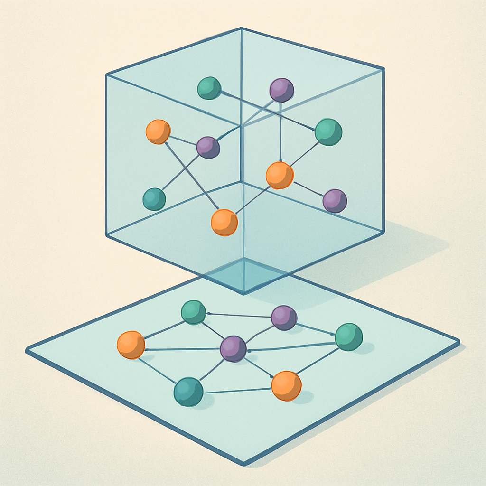

# 1 · Orígenes del PLN y la IA (1950–1979)

**Serie _Fundamentos del PLN y la IA_:** [Intro](fundamento-del-pln-y-la-ia.md) · **1 · Orígenes** · [2 · Estadística y redes](fundamentos-2-estadistica-redes.md) · [3 · Era LLM](fundamentos-3-era-llm.md) · [4 · Investigación y futuro](fundamentos-4-investigacion-futuro.md)

## 📑 Índice

- [🏠 Década de 1950: Fundamentos del Análisis Semántico](#-década-de-1950-fundamentos-del-análisis-semántico)
    - [👾 1. Contexto Histórico](#-1-contexto-histórico)
    - [👾 2. Teorías Lingüísticas Iniciales](#-2-teorías-lingüísticas-iniciales)
    - [👾 3. Primeras Representaciones Semánticas](#-3-primeras-representaciones-semánticas)
    - [👾 4. Conceptos Clave de la Semántica](#-4-conceptos-clave-de-la-semántica)
    - [👾 5. Herramientas Matemáticas](#-5-herramientas-matemáticas)
    - [👾 6. Aplicaciones Tempranas](#-6-aplicaciones-tempranas)
    - [👾 7. Limitaciones y Desafíos](#-7-limitaciones-y-desafíos)
    - [👾 Conclusión](#-conclusión)
- [🏠 Años 1960: Mapeo Multidimensional](#-años-1960-mapeo-multidimensional)
    - [👾 Joseph B. Kruskal](#-joseph-b-kruskal)
    - [👾 James C. Shepherd](#-james-c-shepherd)
    - [👾 Desarrollo del Análisis Multidimensional](#-desarrollo-del-análisis-multidimensional)
    - [👾 Análisis de Escalamiento Multidimensional (MDS)](#-análisis-de-escalamiento-multidimensional-mds)
    - [👾 Representar datos de alta dimensionalidad preservando relaciones](#-representar-datos-de-alta-dimensionalidad-preservando-relaciones)
    - [👾 Propuesta del Mapeo Multidimensional y su Relevancia](#-propuesta-del-mapeo-multidimensional-y-su-relevancia)
    - [👾 Aplicación en Lingüística](#-aplicación-en-lingüística)
    - [👾 Método del MDS](#-método-del-mds)
    - [👾 Impacto en Representaciones Vectoriales](#-impacto-en-representaciones-vectoriales)
    - [👾 Limitaciones](#-limitaciones)
    - [👾 Conclusión](#-conclusión_1)
- [🏠 Década de 1970: Semántica Latente y Análisis de Componentes Principales (PCA)](#-década-de-1970-semántica-latente-y-análisis-de-componentes-principales-pca)
    - [👾 Semántica Latente y la Importancia de los Vectores en el Análisis de Datos Semánticos](#-semántica-latente-y-la-importancia-de-los-vectores-en-el-análisis-de-datos-semánticos)
    - [👾 Análisis de Componentes Principales (PCA)](#-análisis-de-componentes-principales-pca)
    - [👾 Importancia de los Vectores](#-importancia-de-los-vectores)
    - [👾 Técnicas Estadísticas para Comprender el Significado de las Palabras](#-técnicas-estadísticas-para-comprender-el-significado-de-las-palabras)
    - [👾 Conclusión](#-conclusión_2)

---

## 🏠 Década de 1950: Fundamentos del Análisis Semántico

<p align="center"></p>


### 👾 1. Contexto Histórico

> [!TIP] 😄 Pausa
> Shannon midió la información en bits. Tu grupo de WhatsApp familiar transmite millones de bits y cero información.


#### 📌 Posguerra y avances tecnológicos

Tras la Segunda Guerra Mundial, el mundo experimentó un fuerte impulso en el desarrollo de tecnologías computacionales. Este período, conocido como la "revolución computacional de posguerra", fue catalizado por proyectos militares como ENIAC (1945), la primera computadora electrónica de propósito general, diseñada originalmente para calcular tablas de tiro de artillería. Avances logrados durante la guerra, como COLOSSUS en Bletchley Park para descifrar códigos nazis, establecieron las bases de la computación moderna.

La necesidad de procesar grandes cantidades de información impulsó innovaciones cruciales. Claude Shannon, en los Laboratorios Bell, publicó su obra seminal `Una Teoría Matemática de la Comunicación` (1948), que estableció los fundamentos de la teoría de la información y la codificación digital. En paralelo, John von Neumann propuso la arquitectura que lleva su nombre, fijando el paradigma de `programa almacenado` que seguimos usando hoy.

Gobiernos y universidades comenzaron a invertir masivamente en investigación. El MIT, Harvard y Stanford establecieron algunos de los primeros laboratorios de computación. La Universidad de Manchester desarrolló la `Manchester Baby (1948)`, la primera computadora capaz de almacenar programas en memoria. IBM, hasta entonces productora de máquinas tabuladoras mecánicas, hizo su transición a las computadoras electrónicas con el `IBM 701 (1952)`, marcando el inicio de la `computación comercial`.

#### 📌 Primeros intentos de procesamiento del lenguaje natural

Este período vio los primeros intentos de `procesamiento del lenguaje natural`. Warren Weaver, en su memorando de 1949 "Translation", sugirió por primera vez la posibilidad de usar `computadoras para la traducción`, estableciendo las bases conceptuales del análisis computacional del lenguaje. En 1954, el experimento Georgetown-IBM demostró la primera `traducción automática` de ruso a inglés, aunque con un vocabulario limitado de 250 palabras.

Los primeros programadores, muchos de ellos mujeres como `Grace Hopper` (autora del primer `compilador`) y las "computadoras humanas" del ENIAC, establecieron las bases de la programación moderna. El análisis de datos lingüísticos empezó a emerger como campo de estudio, con investigadores como `Noam Chomsky` desarrollando teorías formales sobre la estructura del lenguaje que más tarde influirían en el diseño de lenguajes de programación y sistemas de PLN.

#### 📌 Lingüística estructural

La `lingüística estructural` fue un enfoque dominante en el estudio del lenguaje durante el siglo XX, basado en la idea de que el lenguaje es una `estructura formal y organizada`: las palabras y oraciones no se estudian de forma aislada, sino como parte de un sistema más amplio en el que cada elemento tiene un papel y sigue ciertas reglas. Estas teorías influyeron en las primeras técnicas de `vectorización de palabras`, al llevar a pensar el lenguaje como un conjunto estructurado de relaciones analizable y representable matemáticamente.

Esta teoría fue fuertemente influida por `Ferdinand de Saussure`, quien estableció conceptos fundamentales como la `"langue"` (el sistema abstracto de reglas y convenciones del lenguaje) y la `"parole"` (el uso real del lenguaje por los hablantes).

En este enfoque, las palabras se analizan no por su significado aislado, sino por cómo se relacionan y contrastan con otras dentro del sistema. Por ejemplo, el significado de `"perro"` se entiende en parte porque no es `"gato"`, `"caballo"` o `"roca"`. Estas relaciones sentaron las bases del análisis semántico posterior, donde el significado se deriva del contexto y de las conexiones con otras palabras. La idea de que un lenguaje estructurado puede modelarse mediante relaciones y patrones describibles con `matrices` y `vectores` ofreció la base teórica de los métodos distribucionales usados después para vectorizar palabras.

### 👾 2. Teorías Lingüísticas Iniciales

#### 📌 Teoría de la Información de Shannon (1948)

La `Teoría de la Información`, desarrollada por Claude Shannon en 1948, es una piedra angular de la comunicación y el procesamiento de datos. Shannon se preguntó cómo transmitir información de manera eficiente y confiable a través de canales con ruido, como líneas telefónicas o sistemas de radio, algo crucial en la era de las comunicaciones electrónicas emergentes. Sus ideas revolucionaron el entendimiento de cómo codificar, transmitir y recibir datos.

##### Conceptos clave

1. **Información y entropía**:
   - Definió la **información** como una medida de la sorpresa o incertidumbre de un mensaje: cuanto más inesperado es, más información lleva.
   - Introdujo la **entropía**, que mide la cantidad promedio de información de un mensaje, es decir, lo impredecible que es una fuente. Si todos los mensajes posibles son igualmente probables, la entropía es máxima.
   - Ejemplo: al lanzar una moneda justa, cada resultado es igual de probable y la entropía es alta; si siempre sale "cara", la entropía es cero porque no hay incertidumbre.

2. **Redundancia y compresión**:
   - Shannon demostró que los mensajes pueden codificarse de forma más eficiente reduciendo la **redundancia** o información repetitiva, lo que conduce a la **compresión**: eliminar datos innecesarios para minimizar el tamaño transmitido.
   - En el lenguaje natural, algunas letras o palabras son más comunes que otras (por ejemplo, "e" frente a "z" en inglés). Aprovechando estas frecuencias se diseñan códigos más cortos para los elementos frecuentes.

3. **Capacidad del canal**:
   - La **capacidad del canal** es la cantidad máxima de información que puede transmitirse de forma confiable a través de un canal con ruido, estableciendo límites teóricos sobre cuántos datos pueden enviarse sin errores según el nivel de ruido.

##### Relación con la vectorización de palabras

- **Modelado de lenguaje**: las técnicas estadísticas posteriores, como los modelos de n-gramas, se basaron en los conceptos de probabilidad y entropía de Shannon, usando la frecuencia y distribución de palabras para predecir la probabilidad de una secuencia.
- **Optimización de representaciones semánticas**: vectorizar palabras busca capturar la máxima información semántica con la mínima redundancia. Técnicas de reducción de dimensionalidad como Latent Semantic Analysis (LSA) se inspiran en eliminar redundancia y conservar la esencia de la información.
- **Codificación y compresión de datos**: la noción de compresión es relevante para manejar grandes corpus de texto. Métodos modernos como Word2Vec o los embeddings contextuales representan palabras de manera compacta y eficiente.

La Teoría de la Información proporcionó así un marco matemático para comprender y optimizar cómo se procesan y transmiten datos textuales, un paso crucial hacia técnicas más avanzadas de vectorización.

#### 📌 Hipótesis Distribucional de Harris (1954)

La **Hipótesis Distribucional**, formulada por Zellig Harris en 1954, es un principio fundamental de la semántica computacional: el significado de una palabra puede inferirse a partir de los contextos en que aparece. Si dos palabras se usan en contextos similares, es probable que tengan significados relacionados. Por ejemplo, "perro" y "gato" aparecen en contextos similares (mascotas, animales domésticos), lo que sugiere una relación semántica.

##### Implicaciones

- **Semántica basada en contexto**: en lugar de centrarse en definiciones o características específicas, el significado se entiende por patrones de co-ocurrencia con otras palabras, lo que sentó las bases de enfoques matemáticos y estadísticos.
- **Representaciones vectoriales**: los investigadores empezaron a representar palabras como vectores en un espacio semántico, construidos a partir de las frecuencias con que aparecen junto a otras palabras. Así surge la **matriz de co-ocurrencia**, donde cada fila es una palabra y cada columna indica cuántas veces aparece junto a otra en un corpus.

##### Influencia en los modelos semánticos

- **Bolsa de palabras (Bag of Words)**: uno de los primeros enfoques; ignora el orden de las palabras y se basa en su frecuencia en un documento, usando la hipótesis distribucional para representar la importancia relativa.
- **Latent Semantic Analysis (LSA)**: usa la co-ocurrencia de palabras para representar palabras y documentos en un espacio semántico de menor dimensión, capturando relaciones implícitas.
- **Word embeddings modernos**: **Word2Vec**, **GloVe** y otros se fundan en esta hipótesis, aprendiendo vectores en los que palabras de contextos similares quedan más cerca. En Word2Vec, la proximidad de los vectores de "rey" y "reina" refleja su relación semántica.

##### Ejemplo práctico

Al leer muchos artículos de cocina, si "cuchara" y "tenedor" aparecen con frecuencia cerca de "comida", "mesa" y "cena", podemos inferir que tienen significados relacionados aunque sus funciones difieran.

**Frases**:
1. "La cuchara y el tenedor están en la mesa para la cena."
2. "La comida se sirve con cuchara y tenedor."
3. "La mesa está lista para la cena con cuchara, tenedor y comida."
4. "El tenedor y la cuchara son necesarios para la comida en la cena."

**Matriz de co-ocurrencia**:

|             | cuchara | tenedor | comida | mesa | cena |
| ----------- | ------- | ------- | ------ | ---- | ---- |
| **cuchara** | 0       | 3       | 2      | 2    | 3    |
| **tenedor** | 3       | 0       | 2      | 1    | 2    |
| **comida**  | 2       | 2       | 0      | 1    | 2    |
| **mesa**    | 2       | 1       | 1      | 0    | 2    |
| **cena**    | 3       | 2       | 2      | 2    | 0    |

La Hipótesis Distribucional ha tenido un impacto duradero: inspiró modelos matemáticos y computacionales que usan el contexto para capturar significado y sigue siendo un principio subyacente en métodos de PLN actuales, incluidos los basados en transformadores (BERT, GPT, etc.).

### 👾 3. Primeras Representaciones Semánticas

<p align="center"></p>


#### 📌 Análisis de co-ocurrencia

El **análisis de co-ocurrencia** examina la frecuencia con que ciertas palabras aparecen juntas en un texto o corpus. La idea central es que las palabras que co-aparecen con regularidad en contextos similares comparten una relación semántica. Es una base para construir representaciones vectoriales.

**Cómo funciona**:
- Se construye una matriz cuyas filas y columnas representan palabras del vocabulario; cada celda indica cuántas veces aparecen juntas en un contexto definido (una misma frase o ventana de palabras).
- Ejemplo: en un texto sobre animales, "perro" y "ladrar" suelen aparecer juntas, lo que sugiere una relación semántica.

**Importancia en PLN**:
- **Captura de relaciones semánticas**: identifica asociaciones entre palabras, crucial para la comprensión del lenguaje por máquinas.
- **Base para modelos vectoriales**: es un paso inicial en LSA y Word2Vec, que representan palabras en espacios donde la proximidad refleja similitud semántica.

**Limitaciones**:
- **Dependencia del contexto**: las co-ocurrencias pueden ser ambiguas si no se consideran los distintos significados de una palabra.
- **Escalabilidad**: construir y manejar estas matrices es costoso en almacenamiento y procesamiento para grandes corpus.

#### 📌 Matrices de contingencia

Las **matrices de contingencia** representan la frecuencia con que las palabras aparecen en distintos documentos de un corpus, permitiendo captar patrones y relaciones entre palabras y documentos.

**Cómo se construyen**:
- **Filas**: palabras únicas del vocabulario.
- **Columnas**: documentos del corpus.
- **Celdas**: número de veces que una palabra (fila) aparece en un documento (columna).

**Ejemplo práctico** con tres documentos y las palabras "gato", "perro" y "comer":

| **Palabra** | **Doc 1** | **Doc 2** | **Doc 3** |
| ----------- | --------- | --------- | --------- |
| gato        | 3         | 0         | 2         |
| perro       | 1         | 4         | 0         |
| comer       | 2         | 1         | 3         |

**Importancia en PLN**:
- **Fundamento del análisis semántico**: son esenciales para LSA y otras técnicas de reducción de dimensionalidad, e identifican qué palabras son importantes en cada documento.
- **Facilitan la vectorización**: palabras y documentos se representan como vectores, donde las frecuencias permiten medir similitudes y diferencias.

**Usos prácticos**: recuperación de información (búsqueda por frecuencia de términos clave) y clasificación de texto.

**Limitaciones**:
- **Dispersión (sparsity)**: en grandes corpus la mayoría de las celdas son ceros, lo que hace ineficiente el almacenamiento y procesamiento.
- **Información limitada**: las frecuencias brutas no capturan relaciones semánticas profundas, pues ignoran el contexto.

### 👾 4. Conceptos Clave de la Semántica

#### 📌 Semántica distribucional

La **semántica distribucional** define el significado de una palabra en función de los contextos en que se usa: las palabras adquieren su significado a través de sus relaciones y patrones con otras, no de forma aislada. Se basa en la Hipótesis Distribucional de Harris: "Las palabras que aparecen en contextos similares tienden a tener significados similares."

**Cómo funciona**:
- **Análisis de contexto**: se analizan las palabras que rodean a una palabra en un gran corpus. "Perro" y "gato" aparecen junto a términos como "mascota", "comida" o "veterinario", lo que sugiere su relación semántica.
- **Representación vectorial**: las palabras se representan como vectores en un espacio de alta dimensionalidad; la proximidad entre vectores indica similitud semántica.

**Aplicaciones en PLN**:
- **Word embeddings**: Word2Vec, GloVe y FastText capturan automáticamente relaciones semánticas como vectores.
- **Análisis de sentimiento y clasificación de texto**: representar palabras por sus contextos permite modelos que entienden el tono y el significado subyacente.

**Ejemplo**: con vectores se pueden manipular relaciones matemáticamente, como `"Rey - Hombre + Mujer ≈ Reina"`. Al enfocarse en el uso de las palabras, la semántica distribucional impulsó avances en traducción automática, generación de texto y comprensión del lenguaje.

#### 📌 Espacios vectoriales

Los **espacios vectoriales** representan palabras como vectores cuyas posiciones reflejan sus relaciones y similitudes semánticas.

**Concepto básico**:
- **Vectores**: en PLN son listas de números que representan palabras, derivados de la frecuencia y el contexto en un corpus.
- **Dimensiones**: cada una puede representar una característica contextual o semántica (por ejemplo, "animales" o "comida"); palabras de significado similar quedan cercanas.

**Ejemplo** con las palabras "perro", "gato", "comida", "plato", "cuchara", "zoológico", "cena", "león", "cocina", "selva" y las dimensiones animales, comida, doméstico, salvaje, utensilios:

| Palabra       | Animales | Comida | Doméstico | Salvaje | Utensilios |
| ------------- | -------- | ------ | --------- | ------- | ---------- |
| **perro**     | 0.9      | 0.1    | 0.8       | 0.0     | 0.1        |
| **gato**      | 0.8      | 0.1    | 0.7       | 0.0     | 0.1        |
| **comida**    | 0.2      | 1.0    | 0.3       | 0.0     | 0.0        |
| **plato**     | 0.0      | 0.9    | 0.4       | 0.0     | 0.8        |
| **cuchara**   | 0.0      | 0.8    | 0.3       | 0.0     | 1.0        |
| **zoológico** | 1.0      | 0.0    | 0.1       | 0.4     | 0.0        |
| **cena**      | 0.1      | 0.9    | 0.5       | 0.0     | 0.4        |
| **león**      | 1.0      | 0.0    | 0.0       | 1.0     | 0.0        |
| **cocina**    | 0.0      | 0.7    | 0.8       | 0.0     | 0.6        |
| **selva**     | 0.8      | 0.0    | 0.0       | 1.0     | 0.0        |

Así, "perro" y "gato" están cerca en "animales" y "doméstico"; "león" y "selva" en "animales" y "salvaje"; "cuchara" y "plato" en "comida" y "utensilios".

**Cómo capturan relaciones semánticas**:
- **Similitud de coseno**: mide el coseno del ángulo entre dos vectores; valores altos indican palabras usadas en contextos similares.
- **Operaciones semánticas**: permiten aritmética que refleja relaciones, como `"Rey - Hombre + Mujer = Reina"`, clave para analogías y razonamiento.

**Construcción del espacio**:
- **Modelos de co-ocurrencia**: las frecuencias con que las palabras aparecen juntas se convierten en valores de los vectores.
- **Reducción de dimensionalidad**: LSA y Word2Vec comprimen la alta dimensionalidad manteniendo las relaciones semánticas.

**Aplicaciones**: búsqueda y recuperación de información, traducción automática y análisis de sentimientos. Los espacios vectoriales transforman el lenguaje en un formato numérico procesable, base de chatbots, asistentes virtuales y sistemas de recomendación.

### 👾 5. Herramientas Matemáticas

<p align="center"></p>


#### 📌 Álgebra lineal

El **álgebra lineal** estudia vectores, matrices y sus operaciones. Es esencial en PLN e IA porque permite modelar y manipular grandes volúmenes de datos textuales de forma eficiente.

**Conceptos clave**:
- **Vectores**: listas ordenadas de números que representan magnitudes en un espacio multidimensional. En PLN representan palabras, frases o documentos. Por ejemplo, un vector de 3 dimensiones:

```
[2, 5, -1]
```

- **Matrices**: tablas de números en filas y columnas. En PLN almacenan datos como las frecuencias de palabras por documento (matrices de contingencia) o relaciones entre palabras. Ejemplo de matriz de 3 filas y 2 columnas:

```
⎛ 1   2 ⎞
⎜ 3   4 ⎟
⎝ 5   6 ⎠
```

- **Operaciones fundamentales**:
   - **Suma de vectores**: suma de elementos correspondientes.
   - **Multiplicación escalar**: multiplicar cada componente por un escalar.
   - **Multiplicación de matrices**: combina dos matrices para producir una tercera; clave en transformaciones lineales y redes neuronales.
   - **Producto punto**: mide la similitud entre dos vectores; clave para la cercanía semántica.

> [!TIP]
> La **similitud de coseno** y el **producto punto** están relacionados, pero no son lo mismo:
>
> 1. **Producto punto**: multiplica dos vectores elemento a elemento y suma los resultados. Indica cuánto se proyecta un vector sobre otro en términos absolutos, sin normalizar; depende de las magnitudes.
>
> ```
> A · B  =  A_x·B_x + A_y·B_y + ··· + A_n·B_n
> ```
>
> 2. **Similitud de coseno**: versión normalizada del producto punto; calcula el coseno del ángulo entre dos vectores. Da un valor entre -1 y 1, eliminando la influencia de las magnitudes y considerando solo la **dirección**.
>
> ```
>                              A · B
> Similitud de Coseno  =  ─────────────────
>                          ‖A‖ · ‖B‖
> ```
>
> El producto punto mide la alineación directa (afectada por las magnitudes); la similitud de coseno mide la similitud en dirección **independientemente de la magnitud**.

**Aplicaciones en vectorización de palabras**:
- **Representación y transformación**: vectores y matrices capturan el significado y las relaciones entre palabras; las operaciones algebraicas calculan su similitud.
- **Reducción de dimensionalidad**: técnicas como **Singular Value Decomposition (SVD)** reducen la complejidad manteniendo la información relevante, fundamentales en LSA.
- **Entrenamiento de modelos de IA**: las redes neuronales, incluidas las que generan representaciones como Word2Vec, se construyen sobre operaciones matriciales para ajustar pesos y optimizar el modelo.

Sin esta base sería imposible manejar grandes conjuntos de texto, calcular similitud semántica o entrenar modelos de lenguaje complejos.

#### 📌 Estadística básica

La **estadística básica** permite analizar y describir datos; en PLN es crucial para comprender patrones y relaciones en datos textuales.

**Conceptos fundamentales**:
- **Probabilidad**: mide la posibilidad de que ocurra un evento. Ejemplo: la probabilidad de que aparezca "gato" en un documento es el número de veces que aparece dividido por el total de palabras.
- **Frecuencias**: número de veces que ocurre una palabra. La **frecuencia absoluta** es el total de apariciones; la **frecuencia relativa**, la proporción respecto al total. Ejemplo: si "perro" aparece 50 veces en 1000 palabras, la frecuencia relativa es 50/1000 = 0.05.
- **Distribuciones**: describen cómo se dispersan los datos. En PLN destaca la **distribución de Zipf**: pocas palabras son muy frecuentes ("el", "de", "y") y la mayoría poco frecuentes ("algoritmo", "estocástico").

**Aplicaciones en PLN**:
- **Modelado de lenguaje**: probabilidades y frecuencias predicen la siguiente palabra de una secuencia (por ejemplo, "lluvia" es más probable que "nevado" en un contexto tropical).
- **Análisis de texto**: las distribuciones de palabras identifican términos clave y patrones, útiles para clasificación de documentos y análisis de sentimientos.

La estadística es fundamental para el análisis de co-ocurrencia y los modelos probabilísticos que representan el significado, infiriendo relaciones semánticas y construyendo representaciones vectoriales más precisas. Fue esencial en los primeros enfoques de PLN y sigue vigente en modelos avanzados.

### 👾 6. Aplicaciones Tempranas

#### 📌 Traducción automática

La **traducción automática** fue uno de los primeros intentos de aplicar computadoras al lenguaje humano. Los enfoques iniciales, de mediados del siglo XX, se basaban en reglas y patrones estadísticos, antes de los métodos neuronales y de aprendizaje profundo.

**Enfoques basados en reglas**:
- **Sistemas de reglas lingüísticas**: dependían de gramáticas complejas y diccionarios bilingües escritos a mano. Ejemplo: una regla podría indicar que en inglés "adjetivo + sustantivo" se traduce al francés como "sustantivo + adjetivo".
- **Limitaciones**: eran frágiles y difíciles de escalar, requerían conocimiento detallado de ambos idiomas y no manejaban bien las excepciones; la calidad solía ser baja en textos largos o complejos por no capturar sutilezas semánticas y contextuales.

**Enfoques estadísticos (décadas de 1980-1990)**:
- **Modelos basados en frecuencias y estadísticas**: con el acceso a grandes corpus bilingües, modelos como el **Modelo de Traducción de IBM** analizaban datos para hallar patrones en la traducción de palabras y frases, usando frecuencia y co-ocurrencias para determinar las traducciones más probables.
- **Cadenas de Markov y alineamiento de palabras**: algoritmos de alineamiento emparejaban frases entre idiomas calculando probabilidades. Los **modelos basados en frases** traducían bloques de texto en lugar de palabras individuales, mejorando fluidez y precisión.

**Desafíos**: los métodos estadísticos no capturaban bien el contexto ni las ambigüedades, generando traducciones inexactas, y requerían grandes cantidades de datos bilingües de alta calidad, no siempre disponibles para todos los idiomas.

Estos enfoques tempranos sentaron las bases de los modelos posteriores (modelos neuronales y transformadores como Google Translate y GPT) e impulsaron el desarrollo de técnicas de vectorización y análisis semántico.

#### 📌 Recuperación de información

La **Recuperación de Información (RI)** busca y localiza documentos relevantes en grandes volúmenes de datos a partir de términos clave del usuario. Es fundamental para motores de búsqueda y bibliotecas digitales.

**Concepto básico**:
- **Indexación de documentos**: se construyen índices que almacenan palabras clave y sus ubicaciones, acelerando la búsqueda.
- **Términos de consulta**: el usuario aporta uno o más términos clave que el sistema compara con su índice para hallar documentos relacionados.

**Modelos de RI**:
- **Modelo booleano**: combina términos con operadores "AND", "OR" y "NOT", devolviendo solo documentos que cumplen estrictamente las condiciones. Ejemplo: "gato AND perro" busca documentos con ambas palabras.
- **Modelo vectorial**: representa documentos y consulta en un espacio vectorial; los más relevantes son aquellos cuyos vectores están más cerca de la consulta según una métrica como el **coseno del ángulo**, midiendo la relevancia de forma continua.
- **Modelo probabilístico**: calcula la probabilidad de que un documento sea relevante para una consulta según la ocurrencia de términos clave y otros factores.

La RI fue uno de los primeros campos beneficiados por la vectorización de palabras: representar palabras y documentos como vectores mejoró la precisión y relevancia, capturando relaciones semánticas y permitiendo encontrar documentos relevantes aunque no coincidan exactamente los términos. Por eso un motor como Google considera sinónimos, contextos similares y otros factores semánticos.

**Desafíos y avances**:
- **Ambigüedad semántica**: las palabras tienen múltiples significados; los sistemas modernos usan modelos de lenguaje para desambiguar.
- **Expansión de consultas**: añadir sinónimos o términos relacionados mejora la recuperación.
- **Modelos basados en aprendizaje automático**: aprenden patrones para entregar información cada vez más precisa.

### 👾 7. Limitaciones y Desafíos

<p align="center"></p>


#### 📌 Capacidad computacional

La **capacidad computacional** de las primeras décadas era muy limitada frente a los estándares actuales. Las computadoras de mediados del siglo XX tenían fuertes restricciones de velocidad, memoria y almacenamiento.

**Limitaciones principales**:
- **Velocidad de procesamiento**: los procesadores eran lentos; cálculos como el análisis de co-ocurrencia o las operaciones con matrices tardaban mucho.
- **Memoria y almacenamiento**: la memoria se limitaba a unos pocos kilobytes o megabytes, y el almacenamiento era escaso y costoso, dificultando guardar grandes corpus.
- **Costos elevados**: las computadoras eran caras y solo grandes instituciones académicas, gubernamentales o corporativas podían usarlas, lo que frenaba el avance científico.

**Impacto en la vectorización de palabras**:
- **Simplificación de modelos**: los primeros modelos eran simples y priorizaban métodos ejecutables con los recursos disponibles, dependiendo de frecuencias de co-ocurrencia y matrices dispersas.
- **Reducción de dimensionalidad**: técnicas como el **Análisis de Componentes Principales (PCA)** y el **Latent Semantic Analysis (LSA)** simplificaban los datos manteniendo solo las dimensiones más importantes.
- **Aproximaciones y heurísticas**: en lugar de cálculos exactos se usaban aproximaciones para operar dentro de las capacidades de la época.

A medida que el hardware mejoró, se hizo posible ejecutar modelos más complejos, desde las matrices de co-ocurrencia simples hasta el aprendizaje profundo actual. La limitación fue un obstáculo, pero también impulsó la innovación en técnicas eficientes de procesamiento de texto.

#### 📌 Comprensión profunda del lenguaje

La **comprensión profunda del lenguaje** es la capacidad de entender no solo palabras y frases, sino los significados subyacentes, matices y contextos que los humanos captan naturalmente. Las primeras técnicas de PLN eran superficiales y limitadas para lograrlo.

**Características de las primeras técnicas**:
- **Enfoques basados en reglas y frecuencia**: contaban la frecuencia de palabras o aplicaban reglas gramaticales predefinidas, sin captar el sarcasmo, la ambigüedad o los significados implícitos. El análisis de co-ocurrencia medía cuántas veces aparecían juntas las palabras, pero no el motivo o contexto.
- **Sin comprensión de contexto**: trataban cada palabra como entidad independiente, incapaces de desambiguar palabras polisémicas (por ejemplo, "banco" como asiento o institución financiera) ni de procesar metáforas o ironías.
- **Limitaciones semánticas**: no capturaban sinónimos, antónimos ni la estructura narrativa; un sistema superficial podía traducir literalmente una expresión idiomática sin entender su significado real.

**Implicaciones**:
- **Resultados inexactos**: las aplicaciones generaban resultados poco naturales y no inferían la intención del mensaje; un sistema de RI podía devolver documentos irrelevantes por no entender las relaciones semánticas entre términos.
- **Falta de flexibilidad**: las reglas eran rígidas y poco efectivas ante texto no estructurado o lenguaje informal.

Con el avance del PLN aparecieron modelos más sofisticados, como **Word Embeddings** (Word2Vec, GloVe) y redes neuronales profundas, que captaron mejor los matices. Modelos como **BERT** y **GPT** usan representaciones contextuales que entienden cómo cambia el significado de una palabra según el contexto, abriendo la puerta a asistentes virtuales avanzados, análisis de texto más preciso y traducciones más naturales.

### 👾 Conclusión

La década de 1950 estableció los cimientos conceptuales, lingüísticos y matemáticos del análisis semántico computacional: la revolución de posguerra y los primeros computadores, la teoría de la información de Shannon, la hipótesis distribucional de Harris y la lingüística estructural convergieron para concebir el lenguaje como un sistema de relaciones representable mediante vectores y matrices. Pese a las severas limitaciones de cómputo y a la falta de comprensión contextual de aquellas técnicas, las ideas de esta década —co-ocurrencia, espacios vectoriales, semántica distribucional y las primeras aplicaciones de traducción automática y recuperación de información— siguen siendo el fundamento de los modelos de PLN modernos, desde LSA y Word2Vec hasta los transformadores actuales.

> [!TIP] 😄 Pausa
> En 1950, Turing preguntó si las máquinas podían pensar. 75 años después, siguen sin poder estacionar.

## 🏠 Años 1960: Mapeo Multidimensional

<p align="center"></p>


Contribuciones de Joseph B. Kruskal y James C. Shepherd.

### 👾 Joseph B. Kruskal

> [!TIP] 😄 Pausa
> Reducir dimensiones suena fácil hasta que intentas explicar tu semana en un solo número.


Joseph B. Kruskal (1928-2022) fue un estadístico y matemático estadounidense, conocido por su contribución a la teoría de grafos y el desarrollo del algoritmo de Kruskal, fundamental para construir árboles de expansión mínima en grafos ponderados.

#### 📌 Biografía

Nació el 2 de enero de 1928 en Nueva York. Se graduó en 1948 en la Universidad de Harvard y obtuvo su doctorado en 1955 en la Universidad de Princeton, con investigación centrada en la teoría de grafos y el análisis de datos multivariantes.

#### 📌 Algoritmo de Kruskal

El algoritmo de Kruskal encuentra el árbol de expansión mínima (MST) de un grafo ponderado: un subconjunto de aristas que conecta todos los vértices sin formar ciclos y con peso total mínimo. Se basa en seleccionar aristas de menor peso:

1. **Inicialización**: conjunto de aristas vacío; cada vértice es un componente separado.
2. **Ordenación**: ordena todas las aristas en orden ascendente de peso.
3. **Construcción del MST**:
   - Itera sobre las aristas ordenadas seleccionando la de menor peso.
   - Si no forma un ciclo (conecta dos componentes distintos), se agrega al árbol.
   - Se repite hasta incluir V − 1 aristas, donde V es el número de vértices.

Su complejidad temporal es:

```
O(E · log E)
```

donde E es el número de aristas. Esta eficiencia lo hace popular para problemas de optimización en redes.

> [!TIP]
> **Ejemplo: Red de cableado en un edificio**
>
> Una empresa quiere conectar todas las oficinas usando el menor cable posible.
>
> 1. **Listar todas las conexiones** posibles entre oficinas con su costo (distancia de cable).
> 2. **Ordenar las conexiones** de menor a mayor costo.
> 3. **Seleccionar en orden** y agregar solo las que no formen ciclos, evitando redundancias.
> 4. **Detenerse** cuando todas las oficinas están conectadas.
>
> Resultado: un cableado que conecta todas las oficinas con la mínima longitud, ahorrando en instalación y mantenimiento.

#### 📌 Otros aportes

Kruskal contribuyó a la estadística con métodos de análisis de datos multivariantes y técnicas de escalamiento. Su trabajo en escalamiento multidimensional fue fundamental para la visualización de datos complejos y la representación gráfica de relaciones entre variables.

#### 📌 Legado

El algoritmo de Kruskal sigue siendo un pilar en la enseñanza de la teoría de grafos y se aplica en redes de telecomunicaciones y diseño de circuitos. Kruskal fue además defensor de la educación matemática y la divulgación científica.

### 👾 James C. Shepherd

James C. Shepherd es un nombre destacado en el análisis multidimensional, técnica fundamental en la investigación de datos. Su trabajo ha influido en disciplinas que van desde la psicología hasta la estadística.

#### 📌 Contexto histórico

El análisis multidimensional surgió ante la necesidad de analizar conjuntos de datos que no podían representarse adecuadamente en uno o dos dimensiones. Al recolectar datos más complejos, se requirieron nuevas técnicas para descomponer y entender estas estructuras.

#### 📌 Desarrollo de técnicas

Shepherd colaboró en el desarrollo de:

- **Análisis de Componentes Principales (PCA)**: reduce la dimensionalidad conservando la mayor variabilidad posible. Shepherd ayudó a refinar sus algoritmos, haciéndolos más accesibles.
- **Análisis de Correspondencias**: analiza tablas de contingencia y visualiza relaciones entre variables categóricas. Shepherd formalizó los métodos de cálculo e interpretación, facilitando su uso en ciencias sociales y marketing.
- **Escalamiento Multidimensional (MDS)**: representa datos en un espacio geométrico, facilitando la visualización de similitudes; especialmente útil en estudios de percepción y preferencias.

#### 📌 Aplicaciones prácticas

- **Psicología**: entender relaciones entre variables psicológicas e identificar patrones subyacentes.
- **Marketing**: segmentar mercados y comprender preferencias de los consumidores.
- **Biología**: clasificar especies y entender la biodiversidad visualizando relaciones entre organismos.

> [!TIP]
> **Ejemplo de MDS aplicado a marcas de café**
>
> ```
>                Y
>                |                     A
>        B       |
>    D           |      C
>                |
>                |             E
>                |             F
>                ----------------------------- X
> ```
>
> - **Ejes X e Y**: dimensiones generadas por el MDS que representan percepciones de los consumidores.
> - **Marcas (A, B, C, D, E, F)**: la cercanía sugiere percepciones similares.
>   - **B y D** muy cerca: se perciben como similares.
>   - **E y F** juntos: otra agrupación similar.
>   - **A** más alejada: percepción diferenciada en el mercado.
>
> Ayuda a la empresa a identificar competidores directos y oportunidades de diferenciación.

Shepherd también participó en la creación de herramientas y software que permiten aplicar estas técnicas sin un profundo conocimiento matemático, democratizando el acceso al análisis avanzado de datos.

### 👾 Desarrollo del Análisis Multidimensional

<p align="center"></p>


### 👾 Análisis de Escalamiento Multidimensional (MDS)

El MDS es una técnica estadística para visualizar la similitud o disimilitud entre objetos o datos. Su objetivo es representar en un espacio de menor dimensión (2D o 3D) las relaciones de proximidad entre los elementos analizados.

#### 📌 Fundamentos teóricos

MDS se basa en que las relaciones de proximidad pueden representarse como distancias en un espacio euclidiano. Parte de una matriz de disimilitud que cuantifica las diferencias entre cada par de objetos, obtenida de encuestas, medidas de distancia u otras métricas.

#### 📌 Tipos de MDS

1. **MDS Clásico**: usa la descomposición en valores propios para hallar las coordenadas. Asume que las disimilitudes son métricas y representables exactamente en un espacio euclidiano.
2. **MDS No Métrico**: no requiere disimilitudes métricas; permite relaciones no euclidianas. Se basa en minimizar la función de estrés, que mide la discrepancia entre las distancias observadas y las representadas.

#### 📌 Proceso de MDS

1. **Recopilación de datos**: obtener una matriz de disimilitud (de datos cuantitativos o cualitativos).
2. **Elección del tipo de MDS**: clásico o no métrico, según la naturaleza de los datos.
3. **Cálculo de coordenadas**: en MDS clásico, descomposición en valores propios; en no métrico, métodos iterativos que minimizan el estrés.
4. **Visualización**: graficar las coordenadas en 2D o 3D; las proximidades reflejan similitudes o disimilitudes.
5. **Interpretación de resultados**: identificar patrones, agrupaciones y relaciones significativas.

#### 📌 Aplicaciones de MDS

- **Psicología**: analizar percepciones sobre distintos estímulos.
- **Marketing**: entender cómo los consumidores perciben marcas o productos.
- **Biología**: clasificar especies por características morfológicas o genéticas.
- **Análisis de Texto**: en PLN, visualizar similitudes entre documentos o palabras según sus contextos.

#### 📌 Consideraciones y limitaciones

- **Dimensionalidad**: el número de dimensiones influye en la interpretación. Muy bajo pierde información; muy alto dificulta la visualización.
- **Sensibilidad a la escala**: las distancias pueden verse afectadas por la escala de las variables; conviene normalizar.
- **Interpretación subjetiva**: distintos analistas pueden interpretar la misma visualización de forma diferente.

### 👾 Representar datos de alta dimensionalidad preservando relaciones

<p align="center"></p>


La reducción de dimensionalidad busca representar datos de alta dimensión en espacios menores preservando sus relaciones y estructuras, facilitando análisis y visualización.

#### 📌 Motivación

Los datos de alta dimensionalidad en PLN (por ejemplo, "bag of words" o embeddings de palabras) sufren la maldición de la dimensionalidad: en espacios de alta dimensión los puntos se vuelven escasos y las distancias poco informativas. La reducción mitiga estos problemas transformando los datos en un espacio más manejable.

#### 📌 Técnicas comunes de reducción

**Análisis de Componentes Principales (PCA)**: encuentra las direcciones (componentes) de mayor varianza y proyecta los datos sobre ellas, conservando la mayor parte de la varianza.
- Ventajas: sencillez y eficiencia computacional; buena preservación de la varianza.
- Desventajas: supone datos lineales; puede no capturar estructuras no lineales.

**t-SNE (t-Distributed Stochastic Neighbor Embedding)**: técnica no lineal centrada en preservar las relaciones locales; útil para visualización en 2D o 3D.
- Ventajas: excelente para visualización de datos complejos; preserva relaciones locales.
- Desventajas: computacionalmente intensivo; no preserva bien la estructura global.

**UMAP (Uniform Manifold Approximation and Projection)**: técnica no lineal basada en topología y geometría; preserva relaciones locales y globales.
- Ventajas: rápido y escalable; preserva estructura local y global.
- Desventajas: requiere ajustes de parámetros difíciles de optimizar.

#### 📌 Aplicaciones en PLN

- **Visualización de embeddings de palabras**: con t-SNE o UMAP, los embeddings (Word2Vec, GloVe) se visualizan en menor dimensión para explorar relaciones semánticas.
- **Preprocesamiento para aprendizaje automático**: elimina características redundantes o irrelevantes, mejorando el rendimiento.
- **Análisis de sentimientos y clasificación de textos**: revela patrones difíciles de discernir en alta dimensión.

Cada técnica tiene ventajas y desventajas; la elección depende del contexto y los objetivos, por lo que conviene experimentar con varios métodos y evaluar su rendimiento.

### 👾 Propuesta del Mapeo Multidimensional y su Relevancia

### 👾 Aplicación en Lingüística

<p align="center"></p>


#### 📌 Visualización de relaciones semánticas

La visualización de relaciones semánticas representa gráficamente las similitudes y relaciones entre palabras, dando comprensión sobre cómo se relacionan conceptos en un espacio semántico. Es útil para desambiguación, generación de texto y recuperación de información.

##### Espacios vectoriales

En PLN, las palabras se representan como vectores en un espacio de alta dimensión. Modelos como Word2Vec, GloVe y FastText mapean palabras a vectores numéricos según sus contextos de uso. Cuanto más cercanos dos vectores, más semánticamente similares son las palabras.

##### Dimensionalidad reducida

Para visualizar relaciones, se aplican técnicas de reducción como t-SNE o PCA, que proyectan los vectores de alta dimensión en 2D o 3D.

##### Mapas de calor

Cada celda representa la similitud entre dos palabras; colores más oscuros indican mayor similitud.

> [!TIP]
> **Ejemplo: mapa de calor para relaciones semánticas**
>
> Palabras relacionadas con tecnología: **IA**, **Big Data**, **Cloud Computing**, **Redes Neuronales**, **Almacenamiento**.
>
> ```
>                    IA   Big Data   Cloud    Redes   Almacenamiento
>         IA         1       0.8       0.6     0.9          0.5
>    Big Data       0.8       1        0.7     0.5          0.9
>    Cloud          0.6      0.7       1       0.4          0.8
>    Redes          0.9      0.5       0.4     1            0.3
>    Almacenamiento 0.5      0.9       0.8     0.3          1
> ```
>
> - **Valores** (0 a 1): intensidad de la relación. **1** = máxima (IA y Redes Neuronales); **0.5** = moderada (IA y Almacenamiento); **0** = sin relación.
> - **Relaciones fuertes**: IA ↔ Redes Neuronales (0.9), Big Data ↔ Almacenamiento (0.9).
> - **Relaciones débiles**: Redes ↔ Almacenamiento (0.3).

##### Gráficas de redes

Las palabras se representan como nodos y las conexiones (aristas) indican similitudes o relaciones semánticas. Pueden ser dirigidas o no dirigidas.

> [!TIP]
> **Ejemplo: gráfica de redes**
>
> ```
>                [Inteligencia Artificial]
>                         |
>                         |
>          [Aprendizaje Automático] -- [Redes Neuronales]
>                         |                     |
>          [Big Data] ----+          [Procesamiento de Lenguaje]
>                         |
>           [Cloud Computing] ---- [Infraestructura Tecnológica]
> ```
>
> - **Nodos**: cada término es un concepto.
> - **Conexiones**: relaciones semánticas (p. ej., "Inteligencia Artificial" con "Aprendizaje Automático"; "Redes Neuronales" con "Aprendizaje Automático" y "Procesamiento de Lenguaje").
> - Permite identificar conexiones fuertes y la centralidad de conceptos (p. ej., "Aprendizaje Automático").

##### Diagramas de Venn

Útiles para visualizar intersecciones entre conjuntos de palabras con características semánticas comunes.

> [!TIP]
> **Ejemplo: diagrama de Venn**
>
> Conjuntos:
> - **A (IA)**: red neuronal, aprendizaje automático, algoritmos.
> - **B (Big Data)**: datos masivos, almacenamiento, aprendizaje automático.
> - **C (Cloud)**: almacenamiento, infraestructura, virtualización.
>
> ```
>            +-----------(A)-----------+
>           /                           \
>          /  Aprendizaje Automático     \
>         /                               \
>        +-------------(B)--------------+ \
>       /                               \  \
>      /         Almacenamiento          \  \
>     /                                   \  \
>    +--------------(C)-------------------+  \
>                 Virtualización
> ```
>
> - **A ∩ B**: "Aprendizaje Automático".
> - **B ∩ C**: "Almacenamiento".
> - **A ∩ C**: sin intersección directa.
> - **A ∩ B ∩ C**: sin términos comunes a los tres.

##### Aplicaciones prácticas

- **Análisis de sentimientos**: identificar palabras asociadas a emociones específicas en un corpus.
- **Sistemas de recomendación**: entender relaciones semánticas entre productos o servicios para mejorar la relevancia.
- **Mejora de modelos de lenguaje**: observar agrupaciones de palabras para detectar sesgos o áreas de mejora.

#### 📌 Reducción de dimensionalidad: simplificación de datos complejos

La reducción de dimensionalidad disminuye el número de variables, obteniendo un conjunto de características más manejable. Es especialmente útil con datos de alta dimensionalidad.

##### Importancia

- **Maldición de la dimensionalidad**: al aumentar las dimensiones, los datos necesarios para entrenar modelos precisos crecen exponencialmente, favoreciendo el sobreajuste.
- **Visualización**: representar datos complejos en dos o tres dimensiones facilita identificar patrones.
- **Mejora del rendimiento**: menos características aumentan la velocidad de los algoritmos y la eficiencia de almacenamiento.

##### Métodos comunes

**PCA**: transforma variables correlacionadas en componentes principales no correlacionados.
1. **Normalización**: media cero y varianza uno.
2. **Matriz de covarianza**: cómo varían las características entre sí.
3. **Valores y vectores propios** de la matriz de covarianza.
4. **Selección de componentes**: los primeros k vectores propios (mayores valores propios).

**t-SNE**: técnica no lineal que minimiza la divergencia de Kullback-Leibler entre distribuciones de probabilidad en dimensiones altas y bajas. Preserva la estructura local; común para embeddings de palabras o características de imágenes.

**Autoencoders**: redes neuronales con dos partes:
- **Codificador**: reduce la entrada a una representación compacta.
- **Decodificador**: reconstruye la entrada original desde esa representación.

Entrenados para capturar características significativas, permiten reducir la dimensionalidad.

##### Aplicaciones

- **Procesamiento de imágenes**: compresión y extracción de características para clasificación.
- **Análisis de texto**: reducir representaciones como embeddings de palabras.
- **Bioinformática**: análisis de datos genómicos con miles de dimensiones.

### 👾 Método del MDS

#### 📌 Cálculo de distancias

El cálculo de distancias mide la similitud entre elementos. Se usa en aprendizaje automático, recuperación de información y PLN para agrupar, clasificar y encontrar patrones.

##### Distancia Euclidiana

La más común; se basa en el teorema de Pitágoras. Para dos puntos A(x1, y1) y B(x2, y2):

```
d(A, B) = √( (x2 − x1)² + (y2 − y1)² )
```

Adecuada para datos continuos y espacios de alta dimensión.

##### Distancia Manhattan

Mide la distancia en una cuadrícula como la suma de las diferencias absolutas de las coordenadas. Para A(x1, y1) y B(x2, y2):

```
d(A, B) = |x2 − x1| + |y2 − y1|
```

Útil cuando solo se permiten movimientos ortogonales.

> [!TIP]
> **Distancia Manhattan**
>
> De P(2, 3) a Q(5, 1):
>
> ```
>   y
>   3 |           P --->
>   2 |                |
>   1 |                ---> ---> Q
>   0 +------------------------------ x
>       0    1    2    3    4    5
> ```
>
> **Cálculo**: |5 − 2| + |1 − 3| = 3 + 2 = 5.
> **Resultado**: 5 unidades (3 derecha, 2 abajo).

##### Distancia Coseno

Mide la similitud entre dos vectores según el ángulo entre ellos, no su magnitud. Común en PLN para comparar documentos representados como vectores:

```
sim(A, B) = (A · B) / ( ‖A‖ · ‖B‖ )
```

donde A · B es el producto punto y ‖A‖, ‖B‖ son las normas. Un valor de 1 indica vectores idénticos; 0 indica ortogonalidad.

> [!TIP]
> **Representación de distancia coseno**
>
> Vectores: A = [1, 0], B = [0, 1]
>
> ```
>     y
>     ^
>     |       B (0,1)
>     |       |
>     |       |
>     |---- A (1,0) ----> x
> ```
>
> 1. **Producto punto**: A · B = 0.
> 2. **Coseno del ángulo θ**:
>
> ```
> cos(θ) = (A · B) / ( ‖A‖ · ‖B‖ ) = 0
> ```
>
> 3. **Distancia coseno**: 1 − cos(θ) = 1 − 0 = 1.
>
> **Resultado**: los vectores son ortogonales (θ = 90°) y tienen máxima distancia coseno.

##### Distancia de Jaccard

Mide la similitud entre conjuntos: tamaño de la intersección dividido por el de la unión. Para conjuntos A y B:

```
J(A, B) = |A ∩ B| / |A ∪ B|
```

La distancia se deriva como:

```
d(A, B) = 1 − J(A, B)
```

Especialmente útil con datos categóricos en clasificación y agrupamiento.

> [!TIP]
> **Representación de distancia de Jaccard**
>
> Conjuntos: A = {1, 2, 3}, B = {2, 3, 4, 5}
>
> ```
>   A: [1, 2, 3]
>          |-------| (Intersección: {2, 3})
>   B:    [2, 3, 4, 5]
>          |-------------------------| (Unión: {1, 2, 3, 4, 5})
> ```
>
> 1. Intersección |A ∩ B| = 2 elementos: {2, 3}.
> 2. Unión |A ∪ B| = 5 elementos: {1, 2, 3, 4, 5}.
> 3. Distancia de Jaccard:
>
> ```
> 1 − ( |A ∩ B| / |A ∪ B| ) = 1 − 2/5 = 0.6
> ```
>
> **Resultado**: la distancia de Jaccard entre A y B es **0.6**, una disimilitud moderada.

##### Aplicaciones del cálculo de distancias

- **Clasificación**: K-Vecinos Más Cercanos (KNN) clasifica por similitud con ejemplos conocidos.
- **Agrupamiento**: K-Means y DBSCAN agrupan datos similares.
- **Recomendaciones**: métricas de distancia sugieren productos según preferencias de usuarios similares.
- **Análisis de texto**: medir similitud entre documentos para detección de plagio o recuperación de información.

La elección de la métrica depende del tipo de datos (continuos, categóricos, binarios) y del problema, considerando también la escalabilidad y la eficiencia computacional.

#### 📌 Optimización: minimizar la diferencia entre distancias originales y representadas

La optimización en PLN ajusta modelos y representaciones para un desempeño óptimo. Aquí, el foco es minimizar la diferencia entre las distancias originales y las representadas en un espacio de características.

- **Distancias originales**: calculadas entre objetos en su espacio original (p. ej., características de palabras o documentos).
- **Distancias representadas**: obtenidas tras aplicar un modelo de representación (embedding o reducción de dimensionalidad).

El objetivo es minimizar la discrepancia entre ambas, logrando una representación más fiel de las relaciones semánticas en el espacio reducido.

##### Métodos de optimización

1. **Aprendizaje supervisado**: usa etiquetas conocidas para guiar la optimización (regresión logística, máquinas de soporte vectorial / SVM).
2. **Aprendizaje no supervisado**: aprende relaciones inherentes sin etiquetas (PCA, t-SNE).
3. **Algoritmos de optimización**: descenso de gradiente y variantes (Adam, RMSprop) ajustan los parámetros minimizando una función de pérdida.

##### Funciones de pérdida

- **Error Cuadrático Medio (MSE)**: media de los cuadrados de las diferencias entre distancias originales y representadas.
- **Divergencia de Kullback-Leibler**: en modelos probabilísticos, mide la diferencia entre dos distribuciones.
- **Contrastive Loss**: penaliza la distancia entre ejemplos similares y favorece la separación de los disímiles.

##### Evaluación de resultados

- **Correlación de Spearman**: evalúa la relación entre distancias originales y representadas.
- **Visualización**: en 2D o 3D, da intuición sobre la calidad de la representación.

La evaluación continua y la iteración son claves para mejorar las representaciones.

### 👾 Impacto en Representaciones Vectoriales

#### 📌 Fundamento para técnicas posteriores: PCA y LSA

La reducción dimensional simplifica datos complejos sin perder información relevante. Dos algoritmos destacados son el Análisis de Componentes Principales (PCA) y el Análisis Semántico Latente (LSA).

##### Análisis de Componentes Principales (PCA)

Transforma variables posiblemente correlacionadas en componentes principales no correlacionados, ordenados de modo que el primero retiene la mayor varianza, el segundo la mayor varianza restante, y así sucesivamente.

1. **Estandarización**: cada variable con media cero y desviación estándar uno, para que las distintas escalas no dominen.
2. **Matriz de covarianza**: cómo varían conjuntamente las variables.
3. **Autovalores y autovectores**: los autovectores dan las direcciones de máxima varianza; los autovalores, su magnitud.
4. **Selección de componentes principales**: los que retienen la mayor varianza, reduciendo la dimensionalidad.

##### Análisis Semántico Latente (LSA)

Combina reducción dimensional con análisis semántico para descubrir relaciones latentes entre términos y documentos. A diferencia del PCA, centrado en la varianza, LSA se enfoca en la estructura semántica del texto.

1. **Matriz término-documento**: filas = términos, columnas = documentos; las entradas pueden ser frecuencias de término, TF-IDF, etc.
2. **Descomposición en Valores Singulares (SVD)**: descompone la matriz en una de términos, una de valores singulares y una de documentos.
3. **Reducción dimensional**: se seleccionan los primeros k valores singulares y sus vectores, que representan las relaciones semánticas más significativas.
4. **Representación semántica**: términos y documentos en un espacio reducido donde se identifican similitudes y relaciones.

#### 📌 Entendimiento de estructuras semánticas

Las estructuras semánticas son la manera en que las palabras y sus significados se organizan y relacionan en un espacio semántico: las palabras forman parte de un entramado de significados interrelacionados.

##### Espacios semánticos

Representaciones multidimensionales donde las palabras se agrupan según significados y relaciones. Cada dimensión puede representar similitud, antonimia o jerarquía. Por ejemplo, "gato", "perro" y "animal" pueden ocupar posiciones que reflejan su relación jerárquica y de similitud.

##### Tipos de relaciones semánticas

1. **Sinonimia**: significados similares ("feliz" y "contento").
2. **Antonimia**: significados opuestos ("caliente" y "frío").
3. **Hiponimia e hiperonimia**: el hipónimo es un tipo específico del hiperónimo ("rosa" es hipónimo de "flor").
4. **Meronimia**: una palabra denota una parte de un todo ("rueda" respecto de "coche").

##### Modelos de representación semántica

- **Basados en distribución** (Word2Vec, GloVe): el significado de una palabra se infiere de su contexto; crean vectores donde palabras de contextos similares quedan cercanas.
- **Basados en redes semánticas**: palabras como nodos y relaciones como aristas; permiten visualizar interconexiones entre conceptos (p. ej., grafos de categorías y subcategorías).
- **Basados en atención** (Transformadores): modelos como BERT y GPT usan mecanismos de atención para entender el contexto de las palabras en oraciones completas, mejorando la representación semántica.

##### Aplicaciones

- **Análisis de sentimientos**: identificar emociones y opiniones según relaciones semánticas.
- **Sistemas de recomendación**: sugerir productos o contenidos relacionados.
- **Traducción automática**: mayor precisión al entender relaciones entre palabras de distintos idiomas.
- **Chatbots y asistentes virtuales**: interpretar correctamente las intenciones del usuario.

### 👾 Limitaciones

#### 📌 Interpretabilidad de dimensiones reducidas

A medida que los modelos se vuelven más complejos, interpretar las representaciones en espacios reducidos se dificulta. Métodos comunes de reducción incluyen PCA (direcciones de máxima varianza), t-SNE (visualización no lineal en 2D/3D) y autoencoders (representación comprimida).

Desafíos:

1. **Pérdida de información**: al proyectar a menor dimensión se pueden eliminar características cruciales para el contexto semántico, generando interpretaciones erróneas.
2. **Ambigüedad semántica**: las nuevas dimensiones no siempre tienen significado claro. En PCA, las componentes son combinaciones lineales de las características originales, difíciles de interpretar.
3. **Complejidad matemática**: las transformaciones implicadas son una barrera para quienes carecen de base matemática o estadística.
4. **Dependencia del contexto**: lo interpretable en un dominio puede no serlo en otro (p. ej., dimensiones que no se relacionan con las emociones en análisis de sentimientos).

Estrategias para mejorar la interpretabilidad:

- **Visualización**: representar gráficamente las dimensiones reducidas para identificar patrones.
- **Análisis de carga**: en PCA, entender cómo las variables originales contribuyen a cada componente.
- **Incorporación de conocimientos previos**: integrar conocimiento del dominio para guiar la interpretación.

#### 📌 Computación intensiva

El procesamiento de grandes volúmenes de datos exige recursos computacionales significativos, cada vez más críticos por la explosión de datos digitales.

##### Hardware

- **CPU**: procesadores multinúcleo de alto rendimiento para ejecutar múltiples hilos simultáneos.
- **GPU**: muy efectivas en aprendizaje profundo por sus operaciones en paralelo, acelerando el entrenamiento.
- **Memoria RAM**: mínimo recomendado de 32 GB; 64 GB o más es ideal para grandes conjuntos.
- **Almacenamiento**: SSD para acceso rápido, con capacidad para datos de entrada y resultados intermedios y finales.

##### Software

- **Sistemas operativos**: Linux, por su eficiencia y manejo de múltiples tareas.
- **Frameworks**: TensorFlow y PyTorch, optimizados para GPU.
- **Gestión de datos**: bases distribuidas y sistemas como Hadoop y Apache Spark para análisis en paralelo.

##### Estrategias para grandes conjuntos de datos

- **Procesamiento en paralelo**: dividir una tarea en subtareas ejecutadas a la vez en distintos núcleos o máquinas.
- **Muestreo de datos**: seleccionar una representación menor que preserve las características esenciales.
- **Aprendizaje federado**: entrenar en múltiples dispositivos locales manteniendo los datos en su lugar, reduciendo transferencia y mejorando la privacidad.

### 👾 Conclusión

El mapeo multidimensional de los años 1960, impulsado por figuras como Joseph B. Kruskal y James C. Shepherd, sentó las bases del análisis y la visualización de datos complejos. Del algoritmo de Kruskal y el MDS a las técnicas de reducción de dimensionalidad (PCA, t-SNE, UMAP, autoencoders), las métricas de distancia y los modelos semánticos (Word2Vec, GloVe, LSA, BERT, GPT), estas ideas constituyen el fundamento de las representaciones vectoriales del PLN moderno. Su aplicación exige equilibrar la preservación de información, la interpretabilidad de las dimensiones y los elevados requerimientos computacionales, áreas que siguen siendo objeto de investigación activa.

> [!TIP] 😄 Pausa
> El MDS reduce mil dimensiones a dos. Mi capacidad de atención hizo lo mismo con este párrafo.

## 🏠 Década de 1970: Semántica Latente y Análisis de Componentes Principales (PCA)

<p align="center"></p>


### 👾 Semántica Latente y la Importancia de los Vectores en el Análisis de Datos Semánticos

> [!TIP] 😄 Pausa
> Un autovector es el que no cambia de dirección cuando lo transformas. Como ese amigo que opina lo mismo pase lo que pase.


#### 📌 Introducción a las Variables Latentes

Las variables latentes son conceptos fundamentales en el análisis estadístico y el modelado de datos: factores que no son directamente observables, pero que influyen en los datos observados. Se utilizan para explicar la variabilidad de los datos e inferir relaciones entre variables observadas.

Una variable latente no se puede medir directamente, pero se infiere a partir de otras variables observables. Por ejemplo, en psicología, la inteligencia es una variable latente: no se mide directamente, pero se infiere a través de resultados en pruebas estandarizadas.

Su importancia se debe a varias razones:

1. **Simplificación del modelo**: reducen la dimensionalidad de los datos, permitiendo trabajar con menos variables que capturan la esencia de la variabilidad.
2. **Interpretación**: representan constructos teóricos más fáciles de entender que un conjunto de variables observables.
3. **Mejora de la predicción**: al incluir factores subyacentes, mejoran la capacidad predictiva del modelo.

Ejemplos de variables latentes:

- **Psicología**: constructos como la ansiedad, la depresión o la autoestima, evaluados mediante cuestionarios con múltiples ítems.
- **Economía**: la "confianza del consumidor", inferida a través de indicadores como el gasto de los consumidores y las encuestas de confianza.
- **Procesamiento de Lenguaje Natural (PLN)**: temas o conceptos en un conjunto de documentos. Técnicas como el Análisis de Temas (Topic Modeling) usan variables latentes para descubrir temas ocultos en textos.

Métodos para estimar variables latentes:

1. **Análisis Factorial**: identifica las variables latentes que explican las correlaciones entre variables observadas.
2. **Modelos de Ecuaciones Estructurales (SEM)**: evalúan relaciones complejas entre variables latentes y observadas, dando un marco robusto para la inferencia causal.
3. **Modelos de Mezcla**: identifican subgrupos dentro de los datos representados por diferentes variables latentes.

Las variables latentes permiten comprender la estructura subyacente que influye en las observaciones, ofreciendo una visión más profunda en disciplinas que van de la psicología a la economía y el PLN.

#### 📌 Aplicación en Lingüística: Descubrimiento de Temas Subyacentes

El descubrimiento de temas subyacentes en textos identifica y extrae patrones semánticos y temáticos que no son evidentes a simple vista. Es cada vez más relevante en la era del big data, donde grandes volúmenes de texto requieren técnicas automatizadas.

Metodologías:

1. **Análisis de Frecuencia de Términos**: cuenta cuántas veces aparece cada palabra o frase en un corpus. Identifica los temas prominentes, aunque no revela las relaciones subyacentes entre ellos.
2. **Modelos de Tópicos**: técnicas avanzadas como **Latent Dirichlet Allocation (LDA)**, que descubre temas a partir de la co-ocurrencia de palabras. LDA asume que cada documento es una mezcla de varios temas y que cada tema está representado por una distribución de palabras.
3. **Análisis de Sentimiento**: complementa el descubrimiento de temas evaluando emociones y opiniones (positiva, negativa o neutral) sobre un tema.

Herramientas y técnicas:

- **PLN**: bibliotecas como NLTK, SpaCy y Gensim facilitan la tokenización, la eliminación de stopwords y la lematización, preparando el texto para el análisis.
- **Visualización de datos**: herramientas como pyLDAvis permiten visualizar la distribución de temas y sus relaciones.

Aplicaciones prácticas:

- **Documentos académicos**: identificar tendencias de investigación, áreas emergentes y conexiones entre campos.
- **Redes sociales**: comprender opiniones y sentimientos de usuarios sobre productos, servicios o eventos, informando decisiones estratégicas.
- **Filtrado de contenido**: agrupar documentos similares en sistemas de recomendación.

Desafíos y consideraciones éticas: la ambigüedad del lenguaje, la variabilidad cultural en la interpretación de temas y la necesidad de contextos específicos. Además, deben considerarse las implicaciones éticas de la minería de datos, en especial la privacidad y el consentimiento sobre los datos utilizados.

### 👾 Análisis de Componentes Principales (PCA)

<p align="center"></p>


**Objetivo**: reducir la dimensionalidad de los datos manteniendo la mayor varianza posible.

#### 📌 Reducción de Dimensionalidad

La reducción de dimensionalidad simplifica los datos disminuyendo el número de variables consideradas, manteniendo la mayor cantidad de información posible. Es crucial para mejorar la eficiencia de los algoritmos, reducir el ruido y facilitar la visualización.

Su importancia:

1. **Eficiencia computacional**: menos dimensiones reducen la carga computacional; los algoritmos se ejecutan más rápido con menos recursos.
2. **Prevención del sobreajuste**: con demasiadas dimensiones los modelos se ajustan en exceso a los datos de entrenamiento y rinden mal en datos no vistos.
3. **Visualización**: permite representar datos de alta dimensión en un espacio menor, facilitando la comprensión de las estructuras subyacentes.
4. **Interpretabilidad**: con menos variables se entienden mejor las relaciones entre las restantes.

Además de PCA, otros métodos comunes de reducción de dimensionalidad son:

- **t-Distributed Stochastic Neighbor Embedding (t-SNE)**: método no lineal usado para visualizar datos de alta dimensión. Mantiene la estructura local: calcula similitudes entre puntos en el espacio original y los proyecta en un espacio de menor dimensión (normalmente 2D o 3D), minimizando la divergencia entre las distribuciones de similitud mediante un algoritmo de optimización (como el descenso de gradiente).
- **Autoencoders**: redes neuronales que aprenden una representación compacta de los datos. Constan de un codificador, que reduce la dimensionalidad, y un decodificador, que reconstruye los datos originales; se entrenan minimizando la pérdida entre los datos originales y las reconstrucciones.

La elección del método depende de la naturaleza de los datos, la cantidad de dimensiones a reducir y el tipo de análisis posterior.

#### 📌 Procedimiento Detallado para Aplicar PCA

El **Análisis de Componentes Principales (PCA)** es una técnica estadística de reducción de dimensionalidad muy utilizada en ciencia de datos y PLN. Transforma un conjunto de variables correlacionadas en un conjunto más pequeño de variables no correlacionadas, llamadas **componentes principales**, que son combinaciones lineales de las originales y se ordenan de modo que el primero retiene la mayor varianza, seguido del segundo, y así sucesivamente.

##### 1. Calcular la media: centrar los datos

Centrar los datos significa restar la media de cada variable para que tengan un promedio de cero. Es esencial porque PCA se basa en la varianza y las relaciones lineales, y centrar garantiza que las variaciones se calculen desde un punto de referencia común. Para una matriz de datos X, se calcula la media de cada columna (variable) y se resta de cada valor:

```
X_centrado = X − media(X)
```

Resultado: los datos centrados tienen promedio cero en cada dimensión.

##### 2. Matriz de covarianza: cómo varían conjuntamente las variables

La matriz de covarianza mide cómo varían conjuntamente las variables. Una covarianza positiva indica que las variables aumentan o disminuyen juntas; una negativa, que cuando una aumenta la otra tiende a disminuir. Se obtiene a partir de los datos centrados:

```
Matriz de Covarianza = (1/(n−1)) · X_centradoᵀ · X_centrado
```

donde X_centradoᵀ es la transpuesta de la matriz de datos centrados y n es el número de observaciones. La matriz resultante es cuadrada: cada elemento (i, j) representa la covarianza entre la variable i y la variable j.

##### 3. Eigenvalores y eigenvectores: direcciones principales

Los eigenvectores representan las direcciones de mayor variación (los componentes principales) y los eigenvalores indican la magnitud de la varianza en cada dirección. Se calculan resolviendo la ecuación característica:

```
det(Matriz de Covarianza − λ·I) = 0
```

donde λ son los eigenvalores e I es la matriz identidad.

- Los **eigenvalores** indican cuánta varianza hay en cada dirección principal: cuanto mayor, más importante es esa dirección.
- Los **eigenvectores** definen las nuevas direcciones (componentes principales) sobre las que se proyectan los datos.

Una vez calculados, se seleccionan los componentes con los eigenvalores más grandes (los más importantes) y los datos originales se proyectan en estas nuevas direcciones. Esto reduce la dimensionalidad reteniendo la mayor parte de la información relevante.

### 👾 Importancia de los Vectores

<p align="center"></p>


#### 📌 Representación Matemática: palabras y documentos como vectores

En PLN, representar palabras y documentos como vectores en un espacio matemático es fundamental para tareas como la clasificación, la traducción automática y la búsqueda de información. Transforma datos textuales no estructurados en un formato procesable por algoritmos de aprendizaje automático.

Un espacio vectorial es una colección de vectores que pueden sumarse y multiplicarse por un escalar. En PLN, cada dimensión corresponde a una característica del texto, como la frecuencia de una palabra. Con un vocabulario de n palabras, cada palabra puede representarse como un vector de n dimensiones, donde cada dimensión indica la presencia o frecuencia de la palabra en un contexto.

Representaciones de palabras:

1. **Bolsa de Palabras (BoW)**: un documento se representa como un vector donde cada dimensión es una palabra del vocabulario y su valor es la frecuencia de esa palabra. Es fácil de implementar, pero ignora el orden de las palabras y la semántica contextual.

2. **TF-IDF (Term Frequency-Inverse Document Frequency)**: mejora BoW considerando no solo la frecuencia de las palabras, sino su importancia relativa en el corpus:

```
TF-IDF(t, d) = TF(t, d) × IDF(t)
```

donde TF(t, d) es la frecuencia del término t en el documento d, e IDF(t) es el logaritmo del número total de documentos dividido por el número de documentos que contienen t. Reduce el peso de las palabras comunes y resalta las más significativas.

3. **Word Embeddings**: representaciones densas que capturan relaciones semánticas y sintácticas. A diferencia de BoW y TF-IDF (dispersas), asignan a cada palabra un vector en un espacio de dimensión reducida donde la distancia entre vectores refleja la similitud semántica. Modelos populares:
   - **Word2Vec**: usa Skip-gram y Continuous Bag of Words (CBOW) para aprender representaciones a partir de grandes corpus.
   - **GloVe (Global Vectors for Word Representation)**: se basa en la matriz de coocurrencia de palabras, buscando que el producto escalar de los vectores refleje la probabilidad de que las palabras aparezcan juntas.
   - **FastText**: representa palabras como la suma de los vectores de sus n-gramas de caracteres, mejorando la representación de palabras raras y la morfología.

Representación de documentos (por agregación de las palabras que los componen):

- **Promedio de Word Embeddings**: promedia los vectores de las palabras del documento; simple, pero captura cierta información semántica.
- **Doc2Vec**: extensión de Word2Vec que aprende representaciones de documentos enteros incorporando un vector adicional para el propio documento, capturando información contextual y estructura.

#### 📌 Similitud Semántica: distancias y ángulos entre vectores

La similitud semántica mide en qué grado dos o más elementos lingüísticos (palabras, frases, documentos) son similares en significado. Con representaciones vectoriales, se calcula mediante distancias y ángulos entre vectores en un espacio multidimensional. Además de Word2Vec (CBOW y Skip-Gram) y GloVe, otro método de generación de vectores es **FastText**, que representa palabras como la suma de los vectores de sus n-gramas de caracteres.

Métricas de distancia:

- **Distancia Euclidiana**: raíz cuadrada de la suma de las diferencias al cuadrado de las coordenadas. Útil cuando las dimensiones son comparables.

```
d(a, b) = √( Σᵢ₌₁ⁿ (aᵢ − bᵢ)² )
```

- **Distancia (similitud) Coseno**: mide el ángulo entre dos vectores; se centra en la orientación, no en la magnitud, lo que la hace especialmente útil para la similitud semántica.

```
sim(a, b) = (a · b) / (‖a‖ · ‖b‖)
```

Un valor de 1 indica vectores idénticos; un valor de 0 indica que son ortogonales (sin similitud).

El ángulo entre vectores también mide similitud: un ángulo pequeño indica vectores similares; uno grande, diferentes. Se relaciona con la similitud coseno:

```
θ = arccos( (a · b) / (‖a‖ · ‖b‖) )
```

**Ejemplo práctico**: para dos palabras "rey" y "reina", representadas por los vectores v_rey y v_reina, se calcula su similitud coseno: (1) producto punto de los vectores, (2) magnitud de cada vector, (3) aplicación de la fórmula. El resultado indica cuán semánticamente similares son.

Las métricas de distancia y ángulo proporcionan un enfoque cuantitativo para evaluar la relación semántica, fundamental en la búsqueda de información, la traducción automática y la generación de texto.

### 👾 Técnicas Estadísticas para Comprender el Significado de las Palabras

<p align="center"></p>


#### 📌 Modelado Estadístico del Lenguaje

##### Frecuencias de Palabras

La frecuencia de una palabra es el número de veces que aparece en un texto o conjunto de textos. Permite comprender la importancia y relevancia de términos y revelar patrones semánticos y temáticos. Tipos:

- **Frecuencia Absoluta**: conteo total de apariciones de una palabra.
- **Frecuencia Relativa**: porcentaje respecto al total de palabras, lo que permite comparar entre contextos.

El cálculo más sencillo es el conteo directo, automatizable con herramientas de procesamiento de texto o Python. Conviene normalizar los datos mediante:

- **Eliminación de Stop Words**: palabras comunes ("y", "el", "de") sin valor semántico significativo.
- **Lematización**: reducir las palabras a su forma base o raíz.
- **Minúsculas**: convertir todo a minúsculas para evitar duplicados por capitalización.

Visualización de resultados: nubes de palabras (el tamaño indica la frecuencia relativa), histogramas (distribución de frecuencias) y gráficos de barras (comparación directa).

Aplicaciones: análisis de sentimiento (tono emocional), detección de temas (palabras clave de alta frecuencia) y comparación de textos (estilo, vocabulario, enfoque).

Limitaciones: **falta de contexto** (la frecuencia no informa sobre el uso) y **ambigüedad semántica** (palabras con varios significados se cuentan sin distinguir su uso).

##### Distribuciones de Probabilidad

Las distribuciones de probabilidad modelan la incertidumbre y describen cómo se distribuyen los resultados de un experimento aleatorio. En PLN son esenciales para entender la frecuencia y co-ocurrencia de palabras y predecir el comportamiento del lenguaje.

Conceptos básicos:

- **Experimento aleatorio**: proceso de resultado incierto (p. ej., lanzar un dado).
- **Espacio muestral**: conjunto de todos los resultados posibles; para un dado, {1, 2, 3, 4, 5, 6}.
- **Evento**: subconjunto del espacio muestral; p. ej., obtener par = {2, 4, 6}.
- **Probabilidad** de un evento A: resultados favorables sobre resultados totales.

```
P(A) = (Número de resultados favorables) / (Número total de resultados)
```

Tipos de distribuciones:

**Discretas** (número finito o contable de valores). Ejemplo, la **distribución binomial**, con parámetros n (número de ensayos) y p (probabilidad de éxito):

```
P(X = k) = C(n, k) · pᵏ · (1−p)ⁿ⁻ᵏ
```

donde k es el número de éxitos.

**Continuas** (cualquier valor dentro de un intervalo). Ejemplo, la **distribución normal**, con media μ y desviación estándar σ:

```
f(x) = ( 1 / (σ·√(2π)) ) · e^( −(x−μ)² / (2σ²) )
```

donde e es la base del logaritmo natural.

Aplicaciones en PLN: modelar la ocurrencia de palabras y frases, influyendo en la clasificación de texto, la generación de lenguaje y el reconocimiento de voz. Los **modelos de lenguaje** n-gram predicen la próxima palabra en función de las (n−1) palabras anteriores:

```
P(wₙ | wₙ₋₁, wₙ₋₂, …, wₙ₋ₙ₊₁) = C(wₙ₋₁, …, wₙ₋ₙ₊₁, wₙ) / C(wₙ₋₁, …, wₙ₋ₙ₊₁)
```

donde C representa la función de conteo.

#### 📌 Aplicaciones del PCA en Lingüística

##### Detección de Temas

La detección de temas identifica los temas principales presentes en un corpus. Un **tema** es una idea central o conjunto de conceptos que aparece con frecuencia; puede ser explícito (mencionado claramente) o implícito (inferido del contexto).

Métodos:

1. **Análisis de Frecuencia de Palabras**: cuenta la frecuencia; las palabras más frecuentes indican temas. No considera la semántica y es sensible al ruido.
2. **Modelos de Tópicos**:
   - **Latent Dirichlet Allocation (LDA)**: modelo generativo que asume que cada documento es una mezcla de tópicos y cada tópico una mezcla de palabras; descubre temas mediante la co-ocurrencia.
   - **Non-negative Matrix Factorization (NMF)**: descompone la matriz de documentos y términos en dos matrices menores, que representan los temas y su relación con los documentos. Útil para textos no estructurados.
3. **Algoritmos de Clustering**: K-means y DBSCAN agrupan documentos similares (representados como vectores) para identificar temas comunes.
4. **Modelos de Lenguaje Preentrenados**: BERT, GPT y variantes captan la semántica y aportan representaciones contextuales para identificar temas con mayor precisión.

Evaluación: métricas como la coherencia del tema (consistencia de las palabras dentro de un tema) o la precisión y el recall (comparando con un conjunto de temas de referencia).

Aplicaciones: análisis de sentimientos (opinión pública sobre un producto o servicio), minería de textos (información de investigaciones académicas) y recomendaciones de contenido (intereses de los usuarios según su historial de lectura).

##### Filtrado de Ruido

El filtrado de ruido elimina información redundante, irrelevante o menos significativa que interfiere con el análisis, mejorando la calidad de los datos y la efectividad de los modelos. Tipos de ruido:

1. **Redundancia**: información repetida sin valor adicional.
2. **Palabras de relleno**: conectores o muletillas que no aportan significado.
3. **Errores tipográficos y gramaticales**: distorsionan el significado.
4. **Contenido irrelevante**: información ajena al tema principal.

Técnicas:

- **Preprocesamiento de texto**: tokenización (dividir en tokens), eliminación de stop words, y lematización/stemming (reducir a la forma base o raíz).
- **Filtrado basado en frecuencia**: **TF-IDF** valora la importancia de una palabra en un documento respecto al corpus; las de alta frecuencia en un documento pero baja en el corpus se consideran más significativas.
- **Modelos de aprendizaje automático**: la clasificación de texto identifica y elimina segmentos irrelevantes o redundantes.
- **Análisis de sentimiento y temática**: determinan enfoque y tono para filtrar contenido no alineado con los objetivos.

Importancia: aumenta la precisión de los modelos, reduce el tiempo de procesamiento y facilita la interpretación al centrarse en lo relevante. Es indispensable en proyectos de PLN, desde la minería de texto hasta la traducción automática y el análisis de sentimientos.

#### 📌 Ejemplos Prácticos

##### Análisis de Textos: libros, artículos científicos, etc.

El análisis de textos extrae información, identifica patrones y comprende significados a partir de textos escritos, con aplicaciones en literatura, investigación científica, periodismo y marketing. Tipos:

1. **Análisis Descriptivo**: características textuales como frecuencia de palabras, longitud de oraciones y estructura gramatical; ofrece una visión general del contenido y el estilo.
2. **Análisis Semántico**: comprende el significado; incluye la identificación de entidades nombradas, la relación entre conceptos y la polaridad emocional.
3. **Análisis de Sentimiento**: determina la actitud del autor (positivo, negativo o neutral); relevante en opiniones de redes sociales y reseñas de productos.
4. **Análisis Comparativo**: compara textos para identificar similitudes y diferencias de estilo, contenido y enfoque; común en estudios literarios y revisión de literatura.

Metodologías y herramientas:

- **Análisis de Frecuencia de Palabras**: NLTK (Python) calcula frecuencias e identifica términos clave y temas recurrentes.
- **Modelos basados en redes neuronales**: BERT y GPT mejoran el análisis semántico al comprender el contexto y la relación entre palabras.
- **Software de análisis cualitativo**: NVivo y Atlas.ti permiten codificar y categorizar datos textuales.

Aplicaciones específicas:

- **En libros**: análisis de estilo (características únicas y tendencias de cada autor) y estudios de recepción (reseñas y críticas literarias en distintos contextos culturales y temporales).
- **En artículos científicos**: revisión de literatura (tendencias, áreas emergentes y vacíos de conocimiento) y meta-análisis (síntesis de múltiples estudios para conclusiones más robustas).

Desafíos: **ambigüedad lingüística** (múltiples significados según el contexto), **variabilidad del lenguaje** (dialectos, jergas y estilos) y **volumen de datos** (que hace impracticable el análisis manual y exige técnicas automatizadas).

##### Mejora en Recuperación de Información

La Recuperación de Información (RI) obtiene información relevante de un conjunto de datos (documentos, imágenes, contenido digital). Con el crecimiento exponencial de los datos, la relevancia de los resultados es el aspecto central de su efectividad.

La relevancia mide en qué grado un documento responde a la consulta. Factores que influyen:

- **Consulta del usuario**: las consultas más específicas generan resultados más relevantes.
- **Contenido del documento**: documentos con términos relevantes y bien estructurados son más relevantes.
- **Contexto**: ubicación geográfica e historial de búsqueda del usuario.

Técnicas de mejora:

1. **Indexación avanzada**: organiza y almacena los datos para recuperarlos eficientemente; los índices invertidos permiten acceso rápido según los términos de búsqueda.
2. **Modelos de recuperación**:
   - **Modelo Booleano**: operadores lógicos (AND, OR, NOT) y coincidencia exacta de términos.
   - **Modelo Vectorial**: representa documentos y consultas como vectores y calcula su similitud (p. ej., el coseno del ángulo).
   - **Modelos Probabilísticos**: estiman la relevancia de un documento dado un conjunto de términos.
3. **Aprendizaje automático**: algoritmos supervisados y no supervisados aprenden de datos históricos; incluye clasificación de documentos (relevantes o no) y sistemas de recomendación (según preferencias y comportamientos pasados).
4. **PLN**: análisis de sentimientos, desambiguación del significado y extracción de entidades nombradas mejoran la comprensión de consultas y documentos. Incluye tokenización y normalización, y modelos de lenguaje como BERT y GPT, efectivos para comprender el contexto y la semántica de las consultas.

Evaluación de la relevancia:

- **Precisión**: documentos relevantes recuperados sobre el total de recuperados.
- **Recall**: documentos relevantes recuperados sobre el total de relevantes disponibles.
- **F-score**: media armónica de precisión y recall, medida equilibrada de la efectividad.

#### 📌 Desafíos y Limitaciones

##### Interpretación de Componentes: variables abstractas

La interpretación de componentes descompone un conjunto de variables en componentes más simples. Una **variable** es una característica que puede medirse o categorizarse; un **componente** es una combinación lineal de las variables originales que captura la esencia de la variabilidad de forma simplificada. (En PCA, los componentes principales se ordenan de modo que el primero retiene la mayor variabilidad.)

Los componentes generados por PCA pueden ser difíciles de interpretar cuando las variables originales son abstractas, como en las representaciones semánticas en PLN. Si las variables representan características lingüísticas (frecuencia de palabras, longitud de oraciones, etc.), los componentes resultantes pueden no tener un significado claro. Ejemplos de variables abstractas:

1. **Sentimiento**: los componentes pueden representar la polaridad (positiva o negativa) y la intensidad, no observables directamente pero cruciales para el tono.
2. **Temática**: en el modelado de tópicos, un componente puede capturar el concepto de "salud" a partir de palabras como "bienestar", "enfermedad" y "tratamiento".

Desafíos: la falta de significado directo dificulta comunicar los resultados a un público no especializado, y la elección del número de componentes influye en la interpretación (demasiados causan sobreajuste; muy pocos, pérdida de información).

Técnicas para facilitar la interpretación:

- **Visualización**: gráficos de dispersión y mapas de calor para ver la distribución de los componentes.
- **Análisis de carga**: examinar las cargas de las variables originales en cada componente revela qué variables influyen más.
- **Interpretación contextual**: considerar el contexto semántico, usando técnicas de embeddings para representar la similitud semántica.

##### Datos Escasos: palabras raras o documentos cortos

La escasez de datos afecta el rendimiento de los modelos de PLN, limitando su capacidad de generalizar y comprender el contexto semántico.

Las **palabras raras** u "out-of-vocabulary" (OOV) no aparecen en el vocabulario del modelo entrenado, por:

1. **Frecuencia baja** en el corpus de entrenamiento.
2. **Neologismos y términos técnicos** no representados en los datos.
3. **Errores tipográficos** que no coinciden con el vocabulario.

Consecuencias: pérdida de información (se pierde el contexto y el significado), ambigüedad semántica y degradación del rendimiento en tareas como clasificación de texto, análisis de sentimientos y traducción automática.

Los **documentos cortos** carecen de la riqueza contextual de los más largos, lo que provoca:

1. **Contexto limitado**: insuficiente para entender el significado completo.
2. **Dificultad para el aprendizaje**: pocos ejemplos representativos de uso de palabras o frases.
3. **Ruido en los datos**: mayor probabilidad de incluir palabras irrelevantes.

Estrategias para documentos cortos:

- **Ampliación de datos**: generar datos adicionales mediante parafraseo o sinónimos.
- **Modelos preentrenados**: BERT o GPT, entrenados en grandes corpus, manejan mejor la ambigüedad y la falta de contexto.
- **Contextualización**: incorporar información adicional o metadatos que enriquezcan el contenido.

### 👾 Conclusión

La década de 1970 sentó las bases de la semántica latente y la representación vectorial del lenguaje. Las **variables latentes** permiten descubrir la estructura subyacente de los datos, y el **PCA** reduce la dimensionalidad reteniendo la máxima varianza mediante el centrado de los datos, la matriz de covarianza y el cálculo de eigenvalores y eigenvectores. Representar palabras y documentos como **vectores** (BoW, TF-IDF, word embeddings como Word2Vec, GloVe, FastText, y Doc2Vec) hace posible medir la **similitud semántica** con distancias y ángulos. Junto a las técnicas estadísticas (frecuencias de palabras, distribuciones de probabilidad y modelos n-gram), estos métodos sustentan aplicaciones como la detección de temas, el filtrado de ruido, el análisis de textos y la recuperación de información, pese a desafíos como la interpretación de componentes abstractos y la escasez de datos. Su evolución continua mejora la capacidad de interpretar y generar lenguaje humano de manera efectiva.

> [!TIP] 😄 Pausa
> El PCA apunta a la dirección de máxima varianza. Como tu tío en Navidad: siempre hacia donde hay más drama.
