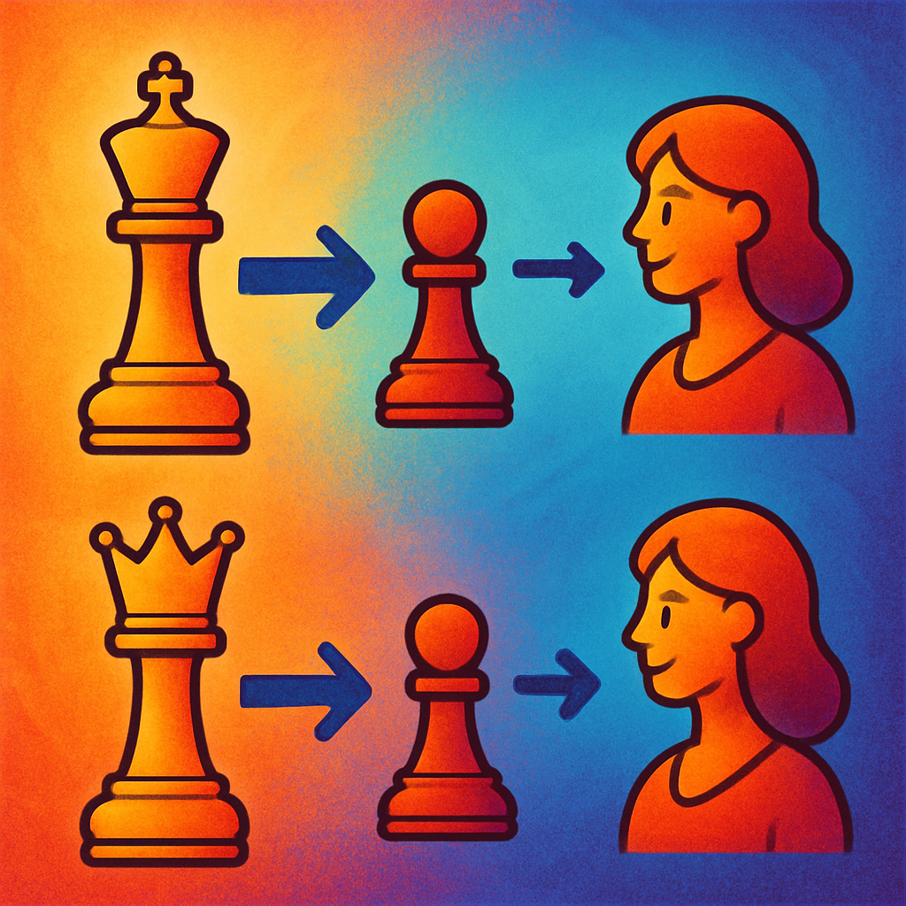
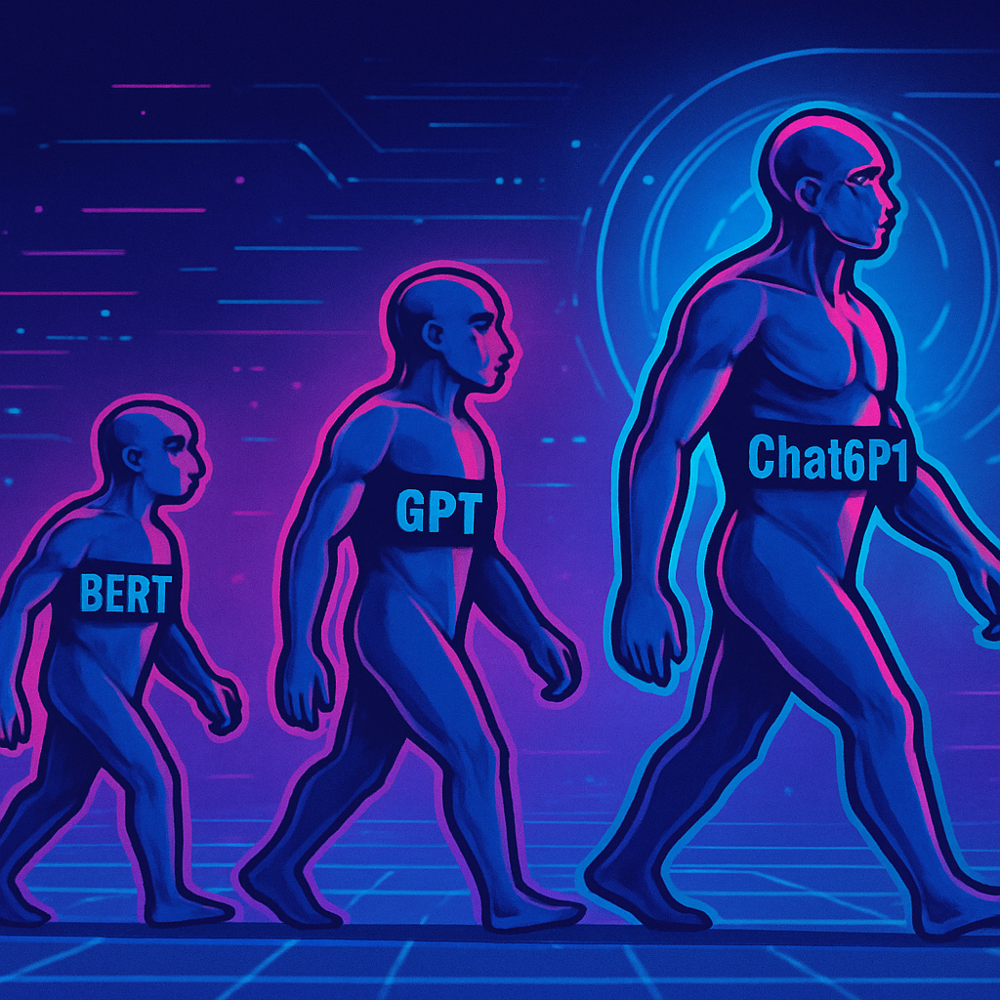

# 3 · La era de los grandes modelos de lenguaje (2013–2026)

**Serie _Fundamentos del PLN y la IA_:** [Intro](fundamento-del-pln-y-la-ia.md) · [1 · Orígenes](fundamentos-1-origenes.md) · [2 · Estadística y redes](fundamentos-2-estadistica-redes.md) · **3 · Era LLM** · [4 · Investigación y futuro](fundamentos-4-investigacion-futuro.md)

## 📑 Índice

- [🏠 2013: La Revolución de Word2Vec](#-2013-la-revolución-de-word2vec)
    - [👾 Propuesta de Tomas Mikolov y su equipo de Google](#-propuesta-de-tomas-mikolov-y-su-equipo-de-google)
    - [👾 Arquitecturas clave](#-arquitecturas-clave)
    - [👾 Características principales de Word2Vec](#-características-principales-de-word2vec)
    - [👾 Ventajas del modelo](#-ventajas-del-modelo)
    - [👾 Impacto en el procesamiento del lenguaje natural](#-impacto-en-el-procesamiento-del-lenguaje-natural)
    - [👾 Limitaciones y consideraciones éticas](#-limitaciones-y-consideraciones-éticas)
    - [👾 Evolución posterior](#-evolución-posterior)
    - [👾 Conclusión](#-conclusión)
- [🏠 2017: La Arquitectura Transformer](#-2017-la-arquitectura-transformer)
    - [👾 Contexto y motivación](#-contexto-y-motivación)
    - [👾 El mecanismo de self-attention](#-el-mecanismo-de-self-attention)
    - [👾 Codificación posicional (positional encoding)](#-codificación-posicional-positional-encoding)
    - [👾 Arquitectura completa: encoder y decoder](#-arquitectura-completa-encoder-y-decoder)
    - [👾 Por qué desplazó a las RNN y las LSTM](#-por-qué-desplazó-a-las-rnn-y-las-lstm)
- [🏠 2018–hoy: La Era de los Grandes Modelos de Lenguaje (LLM)](#-2018hoy-la-era-de-los-grandes-modelos-de-lenguaje-llm)
    - [👾 2018: el año de la divergencia (BERT, GPT-1, ELMo)](#-2018-el-año-de-la-divergencia-bert-gpt-1-elmo)
    - [👾 2019: GPT-2 y el poder del escalado](#-2019-gpt-2-y-el-poder-del-escalado)
    - [👾 2020: GPT-3, aprendizaje en contexto y leyes de escala](#-2020-gpt-3-aprendizaje-en-contexto-y-leyes-de-escala)
    - [👾 2022: alineación, RLHF y la irrupción de ChatGPT](#-2022-alineación-rlhf-y-la-irrupción-de-chatgpt)
    - [👾 2023 en adelante: multimodalidad, modelos abiertos y agentes](#-2023-en-adelante-multimodalidad-modelos-abiertos-y-agentes)
    - [👾 El arco de la representación semántica](#-el-arco-de-la-representación-semántica)
- [🏠 Cómo funcionan los LLM hoy: del texto al token y de vuelta](#-cómo-funcionan-los-llm-hoy-del-texto-al-token-y-de-vuelta)
    - [👾 Tokenización: la unidad mínima](#-tokenización-la-unidad-mínima)
    - [👾 Preentrenamiento: predecir el siguiente token a escala](#-preentrenamiento-predecir-el-siguiente-token-a-escala)
    - [👾 Post-entrenamiento: de loro estadístico a asistente útil](#-post-entrenamiento-de-loro-estadístico-a-asistente-útil)
    - [👾 Inferencia y decodificación: por qué generar es caro](#-inferencia-y-decodificación-por-qué-generar-es-caro)
    - [👾 La ventana de contexto y su coste cuadrático](#-la-ventana-de-contexto-y-su-coste-cuadrático)
    - [👾 Cuantización: modelos grandes en hardware modesto](#-cuantización-modelos-grandes-en-hardware-modesto)
    - [👾 Capacidades emergentes y limitaciones](#-capacidades-emergentes-y-limitaciones)
- [🏠 Agentes: LLM que razonan, usan herramientas y actúan](#-agentes-llm-que-razonan-usan-herramientas-y-actúan)
    - [👾 De chatbot a agente](#-de-chatbot-a-agente)
    - [👾 Uso de herramientas y *function calling*](#-uso-de-herramientas-y-function-calling)
    - [👾 El patrón ReAct: razonar y actuar](#-el-patrón-react-razonar-y-actuar)
    - [👾 Memoria: contexto inmediato y largo plazo](#-memoria-contexto-inmediato-y-largo-plazo)
    - [👾 Protocolos y estandarización](#-protocolos-y-estandarización)
    - [👾 Sistemas multi-agente](#-sistemas-multi-agente)
    - [👾 *Computer use*: agentes que operan interfaces](#-computer-use-agentes-que-operan-interfaces)
    - [👾 Aplicaciones y límites](#-aplicaciones-y-límites)
- [🏠 La infraestructura: chips, cómputo y energía detrás de los LLM](#-la-infraestructura-chips-cómputo-y-energía-detrás-de-los-llm)
    - [👾 Por qué GPUs y no CPUs](#-por-qué-gpus-y-no-cpus)
    - [👾 Alternativas: un ecosistema que se diversifica](#-alternativas-un-ecosistema-que-se-diversifica)
    - [👾 Interconexión: cuando comunicar es el cuello de botella](#-interconexión-cuando-comunicar-es-el-cuello-de-botella)
    - [👾 Paralelismo de entrenamiento: por qué el modelo no cabe en una GPU](#-paralelismo-de-entrenamiento-por-qué-el-modelo-no-cabe-en-una-gpu)
    - [👾 Costos: entrenamiento e inferencia](#-costos-entrenamiento-e-inferencia)
    - [👾 Energía y medio ambiente](#-energía-y-medio-ambiente)
    - [👾 Optimización de inferencia](#-optimización-de-inferencia)
- [🏠 Más allá del texto: modelos multimodales](#-más-allá-del-texto-modelos-multimodales)
    - [👾 Cómo entra el mundo en el modelo](#-cómo-entra-el-mundo-en-el-modelo)
    - [👾 Un espacio común: embeddings compartidos](#-un-espacio-común-embeddings-compartidos)
    - [👾 Modelos nativos multimodales y "any-to-any"](#-modelos-nativos-multimodales-y-any-to-any)
    - [👾 Generar imágenes y vídeo: la difusión](#-generar-imágenes-y-vídeo-la-difusión)
- [🏠 Evaluación, seguridad y alineación](#-evaluación-seguridad-y-alineación)
    - [👾 Benchmarks: medir es más difícil de lo que parece](#-benchmarks-medir-es-más-difícil-de-lo-que-parece)
    - [👾 Cómo fallan los modelos](#-cómo-fallan-los-modelos)
    - [👾 Alineación: que el modelo quiera lo correcto](#-alineación-que-el-modelo-quiera-lo-correcto)
    - [👾 Gobernanza y regulación](#-gobernanza-y-regulación)

---

## 🏠 2013: La Revolución de Word2Vec

<p align="center"></p>


### 👾 Propuesta de Tomas Mikolov y su equipo de Google

> [!TIP] 😄 Pausa
> Word2Vec aprende del contexto: "dime con qué palabras andas y te diré qué significas".


En 2013, Tomas Mikolov y su equipo en Google presentaron Word2Vec, un avance que cambió la forma de representar el significado de las palabras en el procesamiento del lenguaje natural (PLN). Su propuesta simplificó y popularizó las representaciones vectoriales de palabras, haciéndolas eficientes y aplicables a gran escala.

#### 📌 Contexto del descubrimiento

La motivación principal fue la necesidad de representaciones eficientes para manejar grandes volúmenes de datos textuales en Google. En la era digital, el volumen de texto generado diariamente es asombroso, y Google, como uno de los principales motores de búsqueda, se enfrenta al desafío de procesarlo y entenderlo de manera eficiente. La representación semántica (la forma en que se codifica el significado de palabras y frases en un formato que las máquinas pueden procesar) se convierte en una herramienta crucial para:

1. **Mejorar la comprensión del lenguaje natural**: entender el contexto y el significado detrás de las palabras es esencial para ofrecer resultados de búsqueda precisos y relevantes.
2. **Facilitar la búsqueda de información**: las representaciones semánticas permiten ir más allá de la simple coincidencia de palabras clave, comprendiendo la intención del usuario.
3. **Manejar la ambigüedad**: una palabra puede tener múltiples significados; una representación eficiente ayuda a desambiguar según el contexto.

El manejo de grandes volúmenes de texto plantea tres desafíos centrales:

- **Escalabilidad**: a medida que crece la cantidad de datos, las técnicas de representación deben escalar para manejar la carga sin comprometer el rendimiento.
- **Velocidad de procesamiento**: la rapidez con la que se procesa y analiza el texto es crítica, por lo que las representaciones deben ser computacionalmente eficientes.
- **Diversidad de datos**: los datos provienen de fuentes diversas, en distintos formatos y estilos, y la representación debe ser robusta frente a esa variabilidad.

Para afrontar estos desafíos se han desarrollado varias familias de métodos de representación semántica: modelos basados en palabras (como Word2Vec y GloVe, eficientes y escalables, que crean vectores capaces de capturar relaciones semánticas en vocabularios grandes); modelos basados en frases y documentos (como BERT, que considera el contexto de las palabras en oraciones completas); y representaciones distribuidas, que sitúan el significado de palabras y frases en un espacio vectorial continuo, facilitando la comparación y el análisis semántico. A medida que Google y otras plataformas afrontan el crecimiento exponencial de la información textual, la evolución de estas técnicas resulta fundamental para mejorar la precisión y la relevancia de los resultados de búsqueda.

#### 📌 Innovación técnica: simplificación de modelos neuronales

La gran aportación de Mikolov fue simplificar los modelos neuronales para entrenar más rápido y con menos recursos. La simplificación de modelos neuronales es un área de creciente interés en PLN y aprendizaje profundo: con el aumento del tamaño y la complejidad de los modelos, resultó esencial encontrar métodos eficientes en tiempo y cómputo, lo que no solo facilita el acceso a tecnologías avanzadas, sino que permite su implementación en dispositivos de recursos limitados. Las motivaciones principales son:

1. **Eficiencia computacional**: reducir el tamaño del modelo disminuye la carga de cómputo y memoria durante el entrenamiento y la inferencia.
2. **Velocidad de entrenamiento**: modelos más pequeños se entrenan más rápido, permitiendo experimentos y ajustes más ágiles.
3. **Despliegue en dispositivos móviles**: con la computación en el borde, es crucial que los modelos quepan en dispositivos de recursos limitados.
4. **Reducción del overfitting**: modelos más simples tienden a generalizar mejor en datos no vistos.

Entre las estrategias de simplificación de modelos neuronales destacan:

- **Pruning (poda)**: eliminar conexiones o neuronas con impacto mínimo en el rendimiento, de forma estática (antes del entrenamiento) o dinámica (durante el entrenamiento). Permite modelos mucho más pequeños sin pérdida notable de precisión.
- **Cuantización**: reducir la precisión de los pesos (por ejemplo, de 32 bits a 8 bits), reduciendo el tamaño y acelerando la inferencia en hardware compatible.
- **Knowledge distillation (destilación de conocimiento)**: un modelo grande (el "profesor") entrena a uno más pequeño (el "estudiante"), que aprende a replicar sus salidas manteniendo un rendimiento aceptable.
- **Arquitecturas eficientes**: diseños como MobileNet y EfficientNet equilibran precisión y tamaño mediante técnicas como convoluciones separables y bloques optimizados.

La evaluación de los modelos simplificados se hace comparándolos con sus versiones grandes mediante métricas como precisión (exactitud de las predicciones), tiempo de inferencia (tiempo para realizar una predicción) y uso de memoria (cantidad necesaria para almacenar el modelo y realizar inferencias). Los experimentos deben diseñarse para asegurar que el modelo simplificado mantenga un rendimiento competitivo en las tareas específicas de PLN. Esta simplificación, además de acelerar el desarrollo, permite implementar modelos avanzados en una amplia variedad de aplicaciones y dispositivos.

### 👾 Arquitecturas clave

<p align="center"></p>


Word2Vec se entrena con dos arquitecturas principales propuestas por Mikolov et al. (2013) para producir representaciones vectoriales de palabras (*word embeddings*): CBOW y Skip-Gram. Ambas son fundamentales en el PLN y se han usado ampliamente por su simplicidad y eficiencia.

#### 📌 Continuous Bag of Words (CBOW): predice una palabra a partir de su contexto

CBOW es una de las dos arquitecturas principales propuestas por Mikolov y su equipo. Predice una palabra objetivo a partir de la ventana de palabras de contexto que la rodean. Es decir, el modelo aprende a adivinar una palabra basándose en las palabras vecinas que aparecen antes y después de ella en una oración.

1. **Entrada del modelo**: las palabras de contexto que rodean la palabra objetivo. Por ejemplo, en "El gato está en el jardín", con objetivo "está", el contexto sería "El", "gato", "en" y "el".
2. **Salida del modelo**: la predicción de la palabra objetivo ("está"). El modelo ajusta sus pesos internos para maximizar la probabilidad de predecirla correctamente a partir del contexto.

**Ventajas**:
- **Eficiencia computacional**: es más rápido de entrenar porque promedia las representaciones del contexto en lugar de procesarlas individualmente.
- **Buen rendimiento en datos grandes**: aprende representaciones precisas cuando se entrena con grandes cantidades de texto.

**Aplicaciones**: análisis de sentimiento (clasificar opiniones positivas o negativas), traducción automática y recuperación de información (mejor búsqueda al capturar relaciones semánticas).

**Limitaciones**:
- **Pérdida de orden**: no considera el orden de las palabras del contexto, problemático cuando el orden importa.
- **Significados polifacéticos**: asigna un único vector a cada palabra, por lo que tiene dificultades con la polisemia.

#### 📌 Skip-Gram: predice el contexto a partir de una palabra objetivo

Skip-Gram, introducido por Mikolov et al. en 2013 como parte de Word2Vec, parte de la idea inversa: una palabra sirve para predecir el contexto en que aparece. El contexto son las palabras que rodean a la palabra objetivo dentro de una ventana de texto. En la frase "El gato se sienta en la alfombra", con objetivo "gato", el contexto serían "El", "se", "sienta", "en", "la", "alfombra". Este enfoque ha tenido un impacto significativo en la forma de manejar y representar palabras en el aprendizaje automático.

**Ventana de contexto**: parámetro clave que indica cuántas palabras se consideran a izquierda y derecha de la palabra objetivo. Con una ventana de 2 se toman dos palabras a cada lado. Una ventana más amplia puede capturar relaciones semánticas más complejas.

**Proceso de entrenamiento**: el entrenamiento de Skip-Gram usa un corpus de texto para aprender las representaciones vectoriales, a través de estos pasos:

1. **Construcción del corpus**: se selecciona un conjunto de datos con un número significativo de ejemplos de uso de las palabras, representativo del lenguaje y del dominio estudiados.
2. **Generación de pares de palabras**: se forman pares (objetivo, contexto). Con "gato" y ventana 2 se generan pares como ("gato", "El"), ("gato", "se"), ("gato", "sienta"), etc.
3. **Modelo predictivo**: una red neuronal simple, con una capa oculta, predice la probabilidad de que una palabra del contexto aparezca dada la palabra objetivo. Se entrena con técnicas de optimización como el descenso del gradiente para minimizar la función de pérdida, que mide la discrepancia entre las predicciones del modelo y las ocurrencias reales de las palabras en el contexto.
4. **Obtención de embeddings**: una vez entrenado el modelo, los vectores de palabras se extraen de la capa oculta. Estos vectores son las representaciones semánticas de las palabras: las de significados similares quedan cerca en el espacio vectorial.

**Ventajas**:
- **Captura de relaciones semánticas**: por ejemplo, aprende que "rey" y "reina" están relacionadas, igual que "hombre" y "mujer".
- **Escalabilidad**: maneja grandes volúmenes de datos, adecuado para aplicaciones reales.
- **Flexibilidad**: admite distintos tamaños de ventana y configuraciones de red.

**Desafíos y limitaciones**:
- **Ambigüedad del contexto**: una palabra con varios significados según el contexto dificulta representaciones precisas.
- **Dependencia del tamaño del corpus**: un corpus pequeño o sesgado produce representaciones pobres.
- **No captura relaciones complejas**: es eficaz en relaciones semánticas simples, pero no tanto en frases o estructuras sintácticas elaboradas.

### 👾 Características principales de Word2Vec

<p align="center"></p>


Word2Vec simplificó y popularizó las representaciones vectoriales de palabras. Dos rasgos lo definen: representa cada palabra como un vector en un espacio de dimensiones reducidas, y permite que esos vectores admitan operaciones aritméticas semánticamente significativas.

#### 📌 Vectores de palabras: cada palabra como vector en un espacio reducido

Uno de los mayores desafíos del PLN ha sido representar de forma efectiva el significado de las palabras. Los vectores de palabras emergen como una solución poderosa: permiten representar cada palabra como un vector en un espacio de dimensiones reducidas, facilitando la captura de relaciones semánticas y sintácticas. Un vector de palabras es una representación numérica de una palabra en un espacio vectorial. En lugar de tratar las palabras como entidades discretas, las posiciona en un espacio continuo donde la distancia y la dirección entre los vectores reflejan similitudes y relaciones semánticas. Así, en un modelo de vectores de palabras, "rey" y "reina" están más cerca entre sí que "rey" y "perro". Estos vectores son, además, escalables a grandes volúmenes de datos, lo que los hace adecuados para aplicaciones en tiempo real y análisis de grandes corpus.

**Dimensionalidad**: el número de características usadas para representar cada palabra. Cada dimensión puede entenderse como una característica semántica. Suele elegirse entre 50 y 300 dimensiones según el tamaño del corpus y la complejidad del lenguaje. Un espacio reducido ofrece una representación más manejable, facilitando tanto el almacenamiento como el procesamiento computacional.

**Métodos de generación de vectores de palabras**:

1. **Word2Vec** (Google): emplea las arquitecturas CBOW y Skip-Gram para capturar relaciones contextuales y semánticas.
2. **GloVe (Global Vectors for Word Representation)** (Stanford): se basa en la matriz de coocurrencia de palabras, buscando representarlas de manera que se conserven las relaciones semánticas, mediante estadísticas globales del corpus.
3. **FastText** (Facebook): mejora a Word2Vec al considerar subpalabras (n-gramas de caracteres), lo que permite representar mejor palabras raras o derivadas.

Los vectores de palabras tienen múltiples aplicaciones en PLN: **clasificación de texto** (representando documentos en un espacio vectorial para que los algoritmos los clasifiquen mejor), **sistemas de recomendación** (modelando la similitud entre productos o contenidos según las preferencias del usuario) y **traducción automática** (capturando relaciones semánticas entre palabras de distintos idiomas). Esta forma de representar las palabras como vectores en un espacio reducido revolucionó el PLN al convertirse en una herramienta básica para sistemas de inteligencia artificial cada vez más sofisticados.

#### 📌 Captura de relaciones semánticas: operaciones aritméticas con significado

La representación de palabras y conceptos en un espacio vectorial ha transformado la manera de entender y manipular el lenguaje. Las palabras se representan como vectores en un espacio de alta dimensión, donde cada dimensión puede considerarse una característica semántica; métodos como Word2Vec, GloVe y FastText los generan a partir de grandes corpus, aprendiendo del contexto en que aparecen las palabras. Una de las propiedades más notables de estos vectores es que admiten operaciones aritméticas con sentido semántico, lo que permite a los modelos realizar inferencias que reflejan la estructura y el significado del lenguaje humano. El ejemplo más famoso es:

```
vec("rey") − vec("hombre") + vec("mujer")  ≈  vec("reina")
```

Al restar el vector de "hombre" del de "rey" y sumar el de "mujer", el resultado se aproxima al vector de "reina". Las relaciones semánticas pueden, por tanto, modelarse como operaciones en el espacio vectorial. Propiedades destacadas:

1. **Linealidad**: las relaciones semánticas suelen ser lineales, expresables como combinaciones (sumas y restas) de vectores; sirve para sinónimos, antónimos y otros tipos de relación.
2. **Cierre**: el espacio es cerrado bajo suma y resta, de modo que combinar vectores siempre produce otro vector del mismo espacio, permitiendo explorar nuevas relaciones.
3. **Escalabilidad**: estas operaciones son computacionalmente eficientes, viables sobre grandes volúmenes de datos sin un costo prohibitivo en tiempo o recursos.

Esta capacidad de realizar operaciones aritméticas con sentido semántico tiene aplicaciones prácticas en sistemas de recomendación (sugerir opciones semánticamente similares a las preferencias del usuario), análisis de sentimiento (comparar la polaridad semántica de palabras y frases) y traducción automática (captar matices y relaciones entre términos de distintos idiomas). No obstante, presenta desafíos: la **ambigüedad** (una palabra con varios significados puede dar resultados erróneos sin el contexto adecuado), la **dimensionalidad alta** (que complica la interpretación y el manejo de los datos a medida que crecen las palabras y sus relaciones) y la **pérdida de información** (la representación vectorial no captura del todo sutilezas como la ironía o el sarcasmo).

### 👾 Ventajas del modelo

<p align="center"></p>


Dos ventajas explican gran parte del éxito de Word2Vec: su eficiencia computacional, que permite entrenar con rapidez incluso sobre grandes corpus, y su escalabilidad, que lo hace aplicable a vocabularios muy extensos.

#### 📌 Eficiencia computacional: entrenamiento rápido incluso con grandes corpus

La eficiencia computacional se ha vuelto crucial en PLN ante el crecimiento exponencial de los datos textuales: poder entrenar modelos de manera rápida y efectiva, incluso con grandes corpus, es fundamental tanto para las aplicaciones prácticas como para la investigación. No se refiere solo a la velocidad de entrenamiento, sino también al uso óptimo de recursos: reducir el tiempo de entrenamiento (lo que permite iteraciones más rápidas), manejar grandes volúmenes de datos (esencial para la precisión y robustez) y optimizar memoria y cómputo (haciendo el entrenamiento más accesible incluso con recursos limitados). Estrategias habituales:

1. **Técnicas de muestreo**: seleccionar un subconjunto representativo del corpus, ya sea con muestreo aleatorio o estratificado (asegurando que todas las clases estén bien representadas).
2. **Paralelización y distribución del cálculo**: dividir el trabajo entre varios procesadores o máquinas, incluyendo entrenamiento en paralelo y uso de GPUs, muy eficaces en las operaciones matriciales del PLN.
3. **Optimización de algoritmos de aprendizaje**: optar por algoritmos que converjan más rápido, como el descenso de gradiente estocástico (SGD) o variantes como Adam, junto con técnicas de regularización que prevengan el sobreajuste y reduzcan la necesidad de grandes volúmenes de datos para generalizar.
4. **Preentrenamiento y transfer learning**: aprovechar modelos preentrenados (BERT, GPT) y ajustarlos (ajuste fino) a tareas concretas con datos más pequeños, ahorrando tiempo y recursos.
5. **Representaciones eficientes**: embeddings densos como Word2Vec o GloVe comprimen la información semántica en menos dimensiones; modelos contextuales como ELMo y BERT capturan el contexto sin necesitar corpus adicionales enormes.

#### 📌 Escalabilidad: aplicable a vocabularios extensos

La escalabilidad es la capacidad de un sistema para manejar un aumento en la cantidad o complejidad de los datos sin que el rendimiento se degrade, principio crucial en aplicaciones que manejan grandes volúmenes de texto como motores de búsqueda, sistemas de recomendación y análisis de sentimiento. Los vocabularios extensos plantean desafíos específicos porque, al ampliarse el vocabulario, aumenta la dimensionalidad del espacio semántico:

- **Sparsity**: al crecer el vocabulario, la representación se vuelve más dispersa y dificulta la generalización.
- **Costo computacional**: almacenar y procesar más parámetros eleva el coste en memoria y tiempo.
- **Mantenimiento y actualización**: mantener el vocabulario relevante es difícil en dominios donde el lenguaje evoluciona rápido.

Estrategias para mejorar la escalabilidad:

1. **Submuestreo de vocabulario**: usar solo las palabras más frecuentes o relevantes para reducir la dimensionalidad.
2. **Representaciones distribuidas**: Word2Vec o GloVe representan palabras en un espacio de menor dimensión y capturan relaciones semánticas.
3. **Modelos de lenguaje preentrenados**: BERT o GPT manejan vocabularios extensos y aprenden representaciones contextuales.
4. **Técnicas de compresión**: poda de parámetros o cuantización reducen el tamaño del modelo sin sacrificar mucho rendimiento.
5. **Transferencia de aprendizaje**: trasladar conocimiento de modelos entrenados en grandes conjuntos a tareas específicas.

La escalabilidad se evalúa midiendo el tiempo de entrenamiento en distintos tamaños de vocabulario, el rendimiento en tareas concretas a medida que crece el vocabulario y el uso de recursos computacionales (CPU, GPU y memoria) durante el entrenamiento y la inferencia. Aplicando estas estrategias y evaluando continuamente el rendimiento, es posible desarrollar sistemas de PLN eficientes que mantengan una alta calidad en la representación semántica.

### 👾 Impacto en el procesamiento del lenguaje natural

<p align="center"></p>


El impacto de Word2Vec en el PLN se aprecia en dos planos: sirvió de base para modelos más avanzados (GloVe, FastText y los transformadores) y propició mejoras concretas en numerosas tareas del lenguaje.

#### 📌 Base para modelos avanzados: GloVe, FastText y transformadores

La representación semántica de palabras y textos ha avanzado mucho, y a medida que la tecnología progresa se han desarrollado técnicas que mejoran la comprensión del lenguaje humano por parte de las máquinas. Word2Vec, precursor de la representación moderna de palabras, inspiró un conjunto de técnicas que lo extienden o superan:

- **GloVe**: se basa en la matriz de coocurrencias de palabras en un corpus, donde cada entrada representa la frecuencia con que dos palabras aparecen juntas. A diferencia de Word2Vec, centrado en el contexto local, GloVe incorpora información estadística global; la relación entre palabras se captura mediante la división de sus frecuencias de coocurrencia, de modo que los vectores representan tanto el significado como las relaciones semánticas, y la relación "rey"–"reina" resulta similar a la de "hombre"–"mujer".
- **FastText**: desarrollado por Facebook, extiende Word2Vec considerando subpalabras (n-gramas de caracteres) en lugar de solo palabras completas, lo que ayuda a manejar palabras raras o no vistas al generalizar a partir de sus componentes. Representa cada palabra como la suma de los vectores de sus n-gramas, capturando información morfológica y semántica; mejora notablemente la clasificación y el análisis de sentimientos, sobre todo en idiomas de rica morfología.
- **Modelos basados en transformadores**: introducidos en "Attention is All You Need" (Vaswani et al., 2017), revolucionaron el PLN al reemplazar a las redes neuronales recurrentes (RNN). Usan mecanismos de **atención** que procesan todas las palabras de una secuencia simultáneamente y permiten al modelo enfocarse en distintas partes de la entrada al generar una salida, algo crucial en tareas como la traducción, donde el contexto de cada palabra puede ser vital. Modelos como BERT y GPT capturan estas relaciones contextuales de forma muy efectiva; se preentrenan en grandes corpus con tareas de lenguaje no supervisadas (predicción de palabras enmascaradas en BERT, predicción de la siguiente palabra en GPT) y luego se ajustan finamente para generalizar bien en una amplia variedad de tareas concretas.

#### 📌 Mejoras en tareas de PLN

El PLN ha experimentado avances notables impulsados por algoritmos más sofisticados y el acceso a grandes volúmenes de datos. Las representaciones vectoriales y los modelos posteriores impulsaron numerosas tareas:

- **Traducción automática**: evolucionó de sistemas basados en reglas a modelos neuronales como el Transformer, que aportan atención (enfocarse en distintas partes de la entrada durante la traducción, mejorando la calidad) y contexto a largo plazo (traducciones más coherentes y precisas). El aprendizaje transferido permite entrenar en grandes corpus y luego ajustar a dominios específicos, mejorando la calidad en contextos especializados.
- **Análisis de sentimiento**: determina la actitud de un hablante o escritor respecto a un tema. Redes como LSTM y GRU capturan la secuencia y el contexto de las palabras, y modelos como BERT mejoran la precisión al interpretarlas según su contexto; el acceso a grandes conjuntos etiquetados (reseñas de productos, publicaciones en redes sociales) ha facilitado modelos más robustos y precisos.
- **Respuesta a preguntas**: busca dar respuestas a preguntas formuladas en lenguaje natural. Los sistemas basados en recuperación buscan en una base de documentos la respuesta más relevante usando embeddings y técnicas de similitud; los modelos generativos tipo Transformer producen respuestas más naturales y contextuales a partir de la comprensión del contenido, en lugar de limitarse a recuperar información.
- **Resumen automático**: los avances permiten generar resúmenes coherentes y precisos de grandes volúmenes de texto, mediante métodos tanto extractivos como abstractivos.
- **Reconocimiento de entidades nombradas (NER)**: identifica y clasifica entidades en el texto con alta precisión gracias al aprendizaje profundo.
- **Conversación y chatbots**: han evolucionado con los modelos de lenguaje avanzados, que permiten mantener conversaciones más fluidas y contextualmente relevantes.

Estas mejoras son fruto de combinar modelos avanzados, grandes volúmenes de datos y técnicas de aprendizaje profundo, lo que ha permitido que las máquinas entiendan y generen lenguaje humano de manera más efectiva y abran nuevas oportunidades en aplicaciones prácticas y comerciales.

### 👾 Limitaciones y consideraciones éticas

Pese a su éxito, Word2Vec presenta limitaciones importantes que conviene tener presentes: por un lado, puede reflejar y amplificar los sesgos contenidos en los datos de entrenamiento; por otro, su contexto limitado le impide tratar bien las palabras polisémicas.

#### 📌 Sesgos en los datos

Los sesgos en los datos son un fenómeno crítico en el PLN y el aprendizaje automático: influyen en cómo los modelos interpretan y generan lenguaje, afectando la equidad y la precisión de las aplicaciones de inteligencia artificial. Los vectores de palabras y otros embeddings pueden reflejar prejuicios presentes en los datos de entrenamiento. Los sesgos surgen de varias fuentes:

1. **Selección de datos**: si el corpus proviene predominantemente de una cultura o grupo, el modelo no generaliza bien a otros contextos.
2. **Representación de grupos**: grupos subrepresentados o sobrerrepresentados llevan a estereotipos o generalizaciones inapropiadas.
3. **Lenguaje y estilo**: términos despectivos o connotaciones negativas pueden ser aprendidos y reproducidos.

Estos sesgos pueden surgir de la propia naturaleza de los datos y reproducirse en los vectores. Ejemplos en vectores de palabras (Word2Vec, GloVe, FastText), que son representaciones numéricas capaces de heredar los sesgos del entrenamiento:

- **Sesgos de género**: el vector de "médico" puede quedar más cerca de "hombre" que de "mujer".
- **Estereotipos étnicos**: términos como "criminal" pueden asociarse desproporcionadamente con ciertos grupos.

Estos sesgos tienen consecuencias importantes: **discriminación** (decisiones injustas en aplicaciones como contratación, crédito o justicia penal), **desinformación** (propagación de información errónea o estereotipada que afecta la percepción pública) y **falta de representatividad** (sistemas poco inclusivos en los que las voces de ciertos grupos quedan ignoradas o mal representadas).

Estrategias de mitigación:

1. **Diversificación de datos**: asegurar que los datos representen variedad demográfica y cultural.
2. **Auditorías de sesgo**: identificar y evaluar sesgos en modelos y resultados de forma regular.
3. **Técnicas de desensibilización (debiasing)**: ajustar los vectores para neutralizar asociaciones sesgadas.
4. **Transparencia y responsabilidad**: fomentar la transparencia en la creación y el uso de los modelos de PLN y establecer mecanismos de rendición de cuentas para abordar las preocupaciones éticas relacionadas con los sesgos.

Comprender cómo se manifiestan estos sesgos en los vectores y trabajar activamente para mitigarlos es crucial para construir sistemas de inteligencia artificial más justos y equitativos, de modo que la tecnología beneficie a todos los grupos de la sociedad.

#### 📌 Contexto limitado: la polisemia

El "contexto limitado" es la incapacidad de ciertos modelos de PLN para interpretar correctamente el significado de palabras con múltiples sentidos, conocidas como polisémicas. La **polisemia** ocurre cuando una misma palabra tiene varios significados relacionados según el contexto. Word2Vec no la captura bien: por ejemplo, "banco" puede ser una entidad financiera o un objeto para sentarse. En la frase "Fui al banco a retirar dinero", el contexto aclara el sentido, pero un modelo que solo ve una ventana reducida ("Fui al", "a retirar") puede confundir "banco" con su otro significado al no disponer de información suficiente para desambiguar.

Los modelos tradicionales basados en n-gramas tienen este contexto limitado porque consideran solo un número fijo de palabras adyacentes, por lo que no captan la complejidad del significado que surge de oraciones largas o de la estructura del discurso. Los modelos más avanzados (redes neuronales y Transformers) capturan contextos más amplios, aunque aún pueden fallar cuando la información relevante está lejos en la secuencia. La desambiguación del significado de palabras (word sense disambiguation, WSD) es crucial en traducción automática, análisis de sentimientos y respuesta a preguntas, ya que interpretar mal una palabra polisémica produce errores significativos. Estrategias para mejorarla:

- **Incremento del contexto**: usar modelos como los Transformers, que capturan relaciones a largo plazo.
- **Contextualización dinámica**: ajustar el significado según el contexto inmediato con embeddings contextuales como ELMo o BERT.
- **Uso de conocimiento externo**: integrar bases de datos u ontologías con relaciones semánticas entre palabras.

### 👾 Evolución posterior

A partir de Word2Vec, la investigación avanzó en dos direcciones complementarias: los word embeddings contextuales (ELMo, BERT), que asignan representaciones dependientes del contexto, y los modelos basados en Transformers y deep learning, que superan las capacidades de Word2Vec.

#### 📌 Modelos contextuales: ELMo y BERT

Los modelos contextuales revolucionaron la representación de palabras. A diferencia de Word2Vec y GloVe, que asignan un vector fijo a cada palabra (la misma representación para "banco" en "banco de peces" y "banco financiero", pese a sus significados distintos), los modelos contextuales generan representaciones que varían según el contexto en que aparece la palabra, lo que ha permitido avances significativos en traducción automática, análisis de sentimientos y respuesta a preguntas.

Antes de los modelos contextuales, los word embeddings tradicionales como Word2Vec y GloVe generaban representaciones fijas basadas en la coocurrencia de palabras en grandes corpus; capturaban algunas relaciones semánticas y sintácticas, pero no consideraban el contexto específico de uso.

**ELMo (Embeddings from Language Models)** fue uno de los primeros en introducir representaciones contextuales, mediante redes neuronales bidireccionales (BiLSTM) que generan embeddings adaptados a la oración completa:

1. **Entrenamiento como modelo de lenguaje**: ELMo se entrena para predecir la siguiente palabra de una secuencia usando una arquitectura LSTM bidireccional (BiLSTM), que tiene en cuenta tanto el contexto anterior como el posterior.
2. **Generación de representaciones**: para cada palabra de una oración, ELMo genera un vector que combina las representaciones de las capas ocultas del modelo, de modo que la palabra recibe distintas representaciones según su contexto.
3. **Uso en tareas de PLN**: se integra fácilmente como capa adicional en modelos existentes, mejorando significativamente su rendimiento con representaciones más ricas y contextuales.

**BERT (Bidirectional Encoder Representations from Transformers)** llevó las representaciones contextuales más lejos y, a diferencia de ELMo (basado en LSTM), emplea una arquitectura de Transformer, más efectiva para capturar relaciones a largo plazo:

1. **Transformers**: usa mecanismos de atención para ponderar la importancia de cada palabra y capturar relaciones complejas.
2. **Entrenamiento bidireccional**: a diferencia de los modelos de lenguaje unidireccionales, al predecir una palabra considera simultáneamente el contexto que la precede y el que la sigue, lo que da representaciones más precisas.
3. **Máscaras de palabras (Masked Language Model)**: oculta algunas palabras y el modelo debe predecirlas a partir de las restantes, fomentando una comprensión profunda del contexto.
4. **Transferencia de aprendizaje**: se preentrena en grandes corpus y luego se ajusta (fine-tuning) a tareas específicas, lo que le permite adaptarse a diferentes dominios y mejorar el rendimiento.

BERT ha superado a ELMo en muchas métricas gracias a su arquitectura más avanzada y su enfoque bidireccional. Ambos se aplican con éxito a clasificación de texto (categorizar textos comprendiendo el contexto de las palabras), análisis de sentimientos (captando matices del lenguaje para mayor precisión) y respuesta a preguntas (donde BERT es especialmente efectivo al comprender la relación entre preguntas y respuestas en un contexto dado).

#### 📌 Transformers y deep learning: más allá de Word2Vec

Aunque Word2Vec fue un hito, presenta limitaciones que los Transformers superan:

1. **Falta de contexto**: asigna un único vector a cada palabra, ignorando el contexto y la polisemia.
2. **Ventana de contexto fija**: limita la representación a palabras adyacentes, omitiendo información lejana.
3. **Incapacidad para manejar secuencias**: no captura la estructura secuencial del lenguaje, fundamental para tareas como la traducción automática o el análisis de sentimientos.

El avance del PLN ha estado marcado por la evolución de la representación semántica, donde Word2Vec fue un hito al situar las palabras en un espacio vectorial. Con la llegada de la arquitectura de Transformers se superaron sus limitaciones, aportando nuevas capacidades de comprensión y generación de lenguaje. Los Transformers (Vaswani et al., 2017) introdujeron un paradigma basado en atención que, frente a las arquitecturas recurrentes secuenciales, permite procesamiento paralelo, mejorando la eficiencia y la capacidad de modelado. Sus componentes clave:

- **Mecanismo de atención**: pondera cada palabra de la entrada, considerando el contexto global y no solo las palabras cercanas.
- **Codificadores y decodificadores**: la arquitectura se compone de bloques de codificadores, que procesan la entrada y generan representaciones contextuales, y de decodificadores, que las utilizan para generar la salida.
- **Positional encoding**: incorpora información sobre la posición de cada palabra, ya que el Transformer carece de estructura secuencial intrínseca.

Ventajas de los Transformers sobre Word2Vec:

1. **Captura del contexto dinámico**: generan representaciones que varían según el contexto, manejando bien la polisemia (distinta representación para "banco" en "banco de peces" y "banco financiero").
2. **Dependencias a largo plazo**: la atención conecta palabras distantes en la secuencia.
3. **Escalabilidad y eficiencia**: el procesamiento paralelo facilita el entrenamiento en grandes conjuntos de datos.
4. **Transferencia de aprendizaje**: BERT y GPT (Generative Pre-trained Transformer) se preentrenan en grandes corpus y se ajustan a tareas específicas con resultados excepcionales.

La introducción de los Transformers marcó un cambio paradigmático en el PLN: superando las limitaciones de Word2Vec, han permitido una comprensión más profunda y matizada del lenguaje, abriendo nuevas posibilidades en traducción automática, análisis de sentimientos y generación de texto, entre otras aplicaciones.

### 👾 Conclusión

La aparición de Word2Vec en 2013, de la mano de Tomas Mikolov y Google, revolucionó el procesamiento del lenguaje natural al representar las palabras como vectores en un espacio reducido, capturando relaciones semánticas y sintácticas y habilitando operaciones aritméticas con significado. Sus arquitecturas CBOW y Skip-Gram, eficientes y escalables, sentaron las bases de técnicas posteriores como GloVe, FastText y los modelos basados en transformadores, e impulsaron mejoras en traducción automática, análisis de sentimiento, respuesta a preguntas y otras tareas. Pese a sus limitaciones (vectores estáticos que no resuelven la polisemia y riesgo de heredar sesgos de los datos), abrió el camino hacia los modelos contextuales (ELMo, BERT) y los Transformers, que continúan expandiendo la capacidad de las máquinas para comprender y generar lenguaje humano.

> [!TIP] 😄 Pausa
> Restas "hombre" a "rey" y sumas "mujer" → "reina". Restas el café a un lunes → nada bueno.

## 🏠 2017: La Arquitectura Transformer

<p align="center"></p>


En 2017, un equipo de ocho investigadores de Google (Vaswani, Shazeer, Parmar, Uszkoreit, Jones, Gomez, Kaiser y Polosukhin) publicó en la conferencia NeurIPS el artículo **"Attention is All You Need"**. El título era casi un manifiesto: proponía que el mecanismo de **atención**, hasta entonces un componente auxiliar de las redes recurrentes, podía por sí solo sostener toda una arquitectura de procesamiento de secuencias. El resultado fue el **Transformer**, la arquitectura que hoy sustenta a prácticamente todos los grandes modelos de lenguaje.

Su impacto fue tan profundo que dividió la historia reciente del procesamiento del lenguaje natural (PLN) en un antes y un después. No se trató de una mejora incremental, sino de un cambio de paradigma que resolvió de raíz las limitaciones estructurales de las arquitecturas previas.

### 👾 Contexto y motivación

Hasta 2017, el estado del arte en tareas de secuencias (traducción automática, modelado de lenguaje) lo dominaban las **redes neuronales recurrentes** (RNN) y sus variantes mejoradas, las **LSTM** y las **GRU**. Estas redes procesan el texto palabra por palabra, manteniendo un "estado oculto" que se actualiza en cada paso. Este diseño arrastraba dos problemas serios:

#### 📌 Procesamiento secuencial inherente

Como cada palabra depende del estado calculado para la anterior, una RNN **no puede paralelizar** el cómputo dentro de una frase: debe esperar al paso *t* para poder calcular el paso *t+1*. Esto desaprovecha por completo el hardware moderno —especialmente las GPU, optimizadas para operaciones matriciales masivas en paralelo— y convierte el entrenamiento sobre grandes corpus en un proceso lento y costoso.

#### 📌 Dependencias a largo plazo

La información de las primeras palabras debe "viajar" a través de muchos pasos hasta llegar a las últimas. En ese trayecto, la señal se diluye (el conocido problema del *vanishing gradient*). Aunque las LSTM mitigaban este efecto con sus mecanismos de compuertas, capturar relaciones entre palabras muy distantes en un texto seguía siendo frágil. Para el Transformer, en cambio, la distancia entre dos palabras es irrelevante: cualquier par de tokens se conecta en una sola operación.

### 👾 El mecanismo de self-attention

<p align="center"></p>


La idea central es la **auto-atención** (*self-attention*): permitir que cada palabra de la secuencia "mire" directamente a todas las demás y pondere cuánta importancia darle a cada una para construir su propia representación. Así, en la frase "el animal no cruzó la calle porque *estaba* cansado", el modelo puede aprender que "estaba" se refiere a "animal" y no a "calle", conectando ambos términos sin importar cuántas palabras los separen.

#### 📌 Query, Key y Value (Q/K/V)

El mecanismo se inspira en la metáfora de un sistema de recuperación de información. Cada palabra (representada por su vector de entrada) se proyecta, mediante tres matrices de pesos **aprendidas durante el entrenamiento**, en tres vectores distintos:

- **Query (Q)**: lo que la palabra "busca" o pregunta.
- **Key (K)**: la "etiqueta" con la que cada palabra se ofrece a ser encontrada.
- **Value (V)**: la información o contenido que la palabra aporta si resulta relevante.

El proceso funciona así: la *Query* de una palabra se compara con las *Keys* de todas las demás mediante un **producto escalar**, que mide su afinidad o relevancia. Esas puntuaciones se escalan y se pasan por una función **softmax**, que las convierte en pesos que suman 1. Finalmente, esos pesos se aplican a los vectores *Value*: la representación resultante de cada palabra es una **suma ponderada** del contenido de todas las palabras de la secuencia, dando más peso a las más relevantes.

La fórmula de la atención escalada por producto escalar (*scaled dot-product attention*) se expresa de forma compacta así:

```
Attention(Q, K, V) = softmax( (Q · Kᵀ) / √d_k ) · V
```

Donde:

```
Q   = matriz de Queries   (una fila por token)
K   = matriz de Keys
V   = matriz de Values
Kᵀ  = traspuesta de K
d_k = dimensión de los vectores Key/Query
√d_k = factor de escala que estabiliza los gradientes
```

La división entre `√d_k` es un detalle importante: sin ella, para dimensiones grandes los productos escalares alcanzan valores muy altos que empujan la softmax a zonas de gradiente casi nulo, dificultando el aprendizaje.

#### 📌 Multi-head attention

En lugar de calcular una sola atención, el Transformer ejecuta varias en paralelo: la **atención multi-cabezal** (*multi-head attention*). El modelo original usa 8 cabezas. Cada cabeza dispone de sus propias matrices Q/K/V y, por tanto, aprende a fijarse en un tipo distinto de relación: una cabeza puede especializarse en concordancias sintácticas, otra en correferencias, otra en relaciones semánticas. Las salidas de todas las cabezas se **concatenan** y se proyectan de nuevo mediante una capa lineal. El resultado es una representación mucho más rica que la de una atención única.

### 👾 Codificación posicional (positional encoding)

<p align="center"></p>


El precio de abandonar el procesamiento secuencial es que el Transformer, por sí mismo, **no tiene noción del orden** de las palabras: para él, una frase es un conjunto sin orden. Como el significado del lenguaje depende crucialmente del orden ("el perro muerde al hombre" no es lo mismo que "el hombre muerde al perro"), hace falta reinyectar esa información.

#### 📌 Funciones sinusoidales

Los autores resolvieron el problema sumando a cada *embedding* de palabra un vector de **codificación posicional** que depende de la posición del token en la secuencia. En la propuesta original, este vector se genera con **funciones seno y coseno** de distintas frecuencias:

```
PE(pos, 2i)   = sin( pos / 10000^(2i/d_model) )
PE(pos, 2i+1) = cos( pos / 10000^(2i/d_model) )
```

Estas funciones producen un patrón único para cada posición y permiten al modelo inferir distancias relativas entre palabras. Variantes posteriores adoptaron codificaciones posicionales *aprendidas* o *relativas*, pero la idea fundamental se mantiene.

### 👾 Arquitectura completa: encoder y decoder

<p align="center"></p>


El Transformer original es un modelo de traducción y combina dos pilas:

- El **encoder** (6 capas idénticas en el modelo base) lee la frase de entrada completa y construye una representación contextual de cada palabra. Cada capa contiene una sub-capa de *self-attention* y una red *feed-forward*, ambas envueltas en conexiones residuales y normalización de capa.
- El **decoder** (otras 6 capas) genera la traducción palabra por palabra. Añade una sub-capa de atención *enmascarada* (para no "ver el futuro" al generar) y una sub-capa de **atención cruzada** que consulta la salida del encoder.

### 👾 Por qué desplazó a las RNN y las LSTM

<p align="center"></p>


El Transformer ganó por una combinación de factores decisivos:

- **Paralelización total**: al procesar todos los tokens a la vez, exprime las GPU y reduce drásticamente los tiempos de entrenamiento.
- **Dependencias largas en un solo paso**: cualquier palabra se conecta con cualquier otra directamente, eliminando la degradación de señal de las RNN.
- **Escalabilidad**: la arquitectura crece bien al aumentar datos y parámetros, una propiedad que resultaría fundamental en los años siguientes.

En tareas de traducción (WMT inglés-alemán e inglés-francés), el Transformer superó al estado del arte previo a una fracción del coste de entrenamiento. Pero su verdadera consecuencia histórica no fue ganar un *benchmark*, sino convertirse en el **ladrillo universal** del PLN: encoders puros darían lugar a BERT; decoders puros, a la familia GPT. La revolución de los grandes modelos de lenguaje empezó aquí.

## 🏠 2018–hoy: La Era de los Grandes Modelos de Lenguaje (LLM)

Si 2017 aportó la arquitectura, los años siguientes aportaron la **escala**. La historia de los LLM es, en buena medida, la historia de aplicar el Transformer a corpus cada vez mayores, con más parámetros y más cómputo, y descubrir que de esa receta emergían capacidades que nadie había programado explícitamente. En este capítulo cerramos el arco que recorre el documento: de las representaciones semánticas estáticas a modelos generativos capaces de conversar.

### 👾 2018: el año de la divergencia (BERT, GPT-1, ELMo)

<p align="center"></p>


Apenas un año después del Transformer, dos grandes laboratorios tomaron caminos complementarios a partir de la misma arquitectura.

#### 📌 ELMo: el puente hacia los embeddings contextuales

Antes de los Transformers de gran escala, **ELMo** (*Embeddings from Language Models*, Allen Institute for AI / Peters et al., 2018) marcó un punto de inflexión conceptual. Basado todavía en LSTM bidireccionales, ELMo demostró la potencia de los **embeddings contextuales**: a diferencia de Word2Vec —donde la palabra "banco" tiene siempre el mismo vector—, ELMo generaba una representación distinta según el contexto de la frase. Esta idea de "el significado depende del contexto" sería el corazón de lo que vino después.

#### 📌 BERT: comprensión bidireccional (encoder)

Google presentó **BERT** (*Bidirectional Encoder Representations from Transformers*, Devlin et al., 2018), que usa **solo la pila de encoders** del Transformer. Su innovación clave es la **bidireccionalidad**: BERT considera simultáneamente el contexto a la izquierda y a la derecha de cada palabra. Para lograrlo se preentrena con dos objetivos:

- **Masked Language Modeling (MLM)**: se ocultan aleatoriamente algunas palabras (alrededor del 15 %) y el modelo debe predecirlas a partir del contexto completo.
- **Next Sentence Prediction (NSP)**: el modelo aprende a juzgar si una frase sigue a otra.

BERT se ofreció en dos tamaños, *base* (unos 110 millones de parámetros) y *large* (unos 340 millones), y pulverizó récords en numerosos *benchmarks* de comprensión (GLUE, SQuAD). Su orientación es la **comprensión** del lenguaje: clasificación, respuesta a preguntas, análisis de sentimiento. Google lo integró en su buscador para entender mejor las consultas. De BERT brotó toda una familia: **RoBERTa** (Facebook AI, sin NSP y más datos), **DistilBERT** (versión destilada y ligera), **ALBERT** (parámetros compartidos) y **XLNet**, entre otros.

#### 📌 GPT-1: generación autorregresiva (decoder)

En paralelo, OpenAI presentó **GPT-1** (*Generative Pre-trained Transformer*, Radford et al., 2018), que usa **solo la pila de decoders**. Su objetivo de preentrenamiento es más simple: **predecir la siguiente palabra** dada la secuencia anterior (modelado de lenguaje autorregresivo). Con unos 117 millones de parámetros, entrenado sobre el corpus BooksCorpus, GPT-1 demostró que un preentrenamiento no supervisado seguido de un ajuste fino ligero podía resolver muchas tareas. Su orientación es la **generación** de texto.

La divergencia de 2018 quedó así fijada: **encoders para comprender, decoders para generar**. El tiempo acabaría dando un protagonismo casi total a la línea generativa.

### 👾 2019: GPT-2 y el poder del escalado

<p align="center"></p>


OpenAI publicó **GPT-2**, que llevó la receta de GPT-1 a **1.500 millones de parámetros** (1.5B) en su versión mayor, entrenado sobre WebText (texto de enlaces de Reddit). El salto de calidad fue notable: GPT-2 generaba párrafos coherentes y temáticamente consistentes a partir de una simple indicación. Fue tan convincente que OpenAI optó inicialmente por una **publicación escalonada**, reteniendo el modelo completo por temor a usos maliciosos (desinformación, *spam*), antes de liberarlo meses después. GPT-2 consolidó una intuición que dominaría la década: **más parámetros y más datos producen mejores modelos**, de forma sorprendentemente predecible.

### 👾 2020: GPT-3, aprendizaje en contexto y leyes de escala

<p align="center"></p>


#### 📌 GPT-3 y el in-context learning

En 2020, OpenAI presentó **GPT-3** (*Language Models are Few-Shot Learners*, Brown et al.), con **175.000 millones de parámetros** (175B), unas cien veces más que GPT-2. Más allá del tamaño, GPT-3 reveló una capacidad emergente que cambió la forma de usar estos modelos: el **aprendizaje en contexto** (*in-context learning*). Sin reentrenar ni ajustar pesos, bastaba con describir la tarea en el propio *prompt* y, opcionalmente, dar unos pocos ejemplos:

- **Zero-shot**: solo la instrucción.
- **One-shot**: la instrucción y un ejemplo.
- **Few-shot**: la instrucción y varios ejemplos.

El modelo "entendía" la tarea sobre la marcha. Esto desplazó el paradigma del *fine-tuning* específico hacia el **diseño de prompts**, abriendo la puerta a un uso mucho más flexible y accesible.

#### 📌 Leyes de escala (scaling laws)

Ese mismo año, **Kaplan et al.** (OpenAI) formalizaron las **leyes de escala** (*Scaling Laws for Neural Language Models*): observaron que la pérdida (el error) del modelo disminuye de forma **predecible**, siguiendo leyes de potencia, a medida que crecen los parámetros, el tamaño del conjunto de datos y el cómputo. Por primera vez, mejorar un modelo dejó de ser puro ensayo y error y pasó a ser, en parte, un problema de ingeniería predecible. En 2022, el trabajo **Chinchilla** de DeepMind (Hoffmann et al.) refinó estas leyes, mostrando que muchos modelos estaban **infraentrenados en datos**: para un presupuesto de cómputo dado, conviene equilibrar parámetros y volumen de datos, en lugar de solo agrandar el modelo.

### 👾 2022: alineación, RLHF y la irrupción de ChatGPT

<p align="center"></p>


Un modelo grande es potente, pero no necesariamente **útil ni seguro**: puede ignorar la intención del usuario, divagar o generar contenido problemático. El reto pasó de la *capacidad* a la **alineación**.

#### 📌 InstructGPT y RLHF

OpenAI publicó **InstructGPT** (Ouyang et al., 2022), que introdujo a gran escala el **aprendizaje por refuerzo a partir de retroalimentación humana** (*RLHF*, Reinforcement Learning from Human Feedback). El proceso tiene tres fases:

1. **Ajuste fino supervisado**: humanos redactan respuestas ejemplares a diversas instrucciones y se ajusta el modelo con ellas.
2. **Modelo de recompensa**: personas ordenan por preferencia varias respuestas del modelo, y con esos rankings se entrena un modelo que predice qué respuesta preferiría un humano.
3. **Optimización por refuerzo**: se afina el LLM (típicamente con el algoritmo PPO) para maximizar esa recompensa.

El resultado fue notable: un InstructGPT mucho más pequeño que GPT-3 producía respuestas que los usuarios preferían, por seguir mejor las instrucciones. La clave no era más tamaño, sino mejor **alineación con la intención humana**.

#### 📌 ChatGPT y el impacto masivo

El **30 de noviembre de 2022**, OpenAI lanzó **ChatGPT**, una interfaz conversacional construida sobre un modelo de la familia GPT-3.5 afinado con esta metodología. El efecto fue sin precedentes: alcanzó cifras de adopción enormes en cuestión de días y se convirtió en una de las aplicaciones de consumo de más rápido crecimiento de la historia. ChatGPT sacó a los LLM de los laboratorios y los puso en manos del gran público, desatando una ola de inversión, competencia y debate social, económico y ético sobre la IA generativa.

### 👾 2023 en adelante: multimodalidad, modelos abiertos y agentes

#### 📌 GPT-4 y la multimodalidad

En marzo de 2023, OpenAI presentó **GPT-4**, con mejoras sustanciales en razonamiento, precisión y fiabilidad. Su novedad más visible fue la **multimodalidad**: además de texto, podía aceptar **imágenes** como entrada. OpenAI no reveló el número de parámetros ni los detalles arquitectónicos, marcando una tendencia hacia el secretismo comercial. La multimodalidad —texto, imagen, audio y vídeo combinados— se consolidó después como una dirección central del campo.

#### 📌 Claude y la IA Constitucional

**Anthropic** —empresa fundada en 2021 por antiguos investigadores de OpenAI— lanzó su asistente **Claude** en 2023, con un fuerte énfasis en la **seguridad y la alineación**. Su aportación metodológica distintiva es la **IA Constitucional** (*Constitutional AI*): en lugar de depender únicamente de retroalimentación humana, el modelo se guía por un conjunto explícito de principios (una "constitución") y aprende a criticar y revisar sus propias respuestas conforme a ellos, una variante conocida como RLAIF (*RL from AI Feedback*). Claude evolucionó a través de sucesivas generaciones, ampliando capacidades de razonamiento, longitud de contexto y multimodalidad.

#### 📌 Modelos abiertos

Frente a los modelos cerrados, surgió un vigoroso ecosistema **abierto**. Meta liberó **LLaMA** (2023) y, poco después, **LLaMA 2** con licencia de uso amplio, democratizando el acceso a modelos potentes. La francesa **Mistral AI** publicó modelos compactos y eficientes (como Mistral 7B) que rivalizaban con otros mucho mayores. Estos lanzamientos impulsaron una comunidad enorme dedicada a ejecutar, adaptar y mejorar LLM con recursos modestos.

#### 📌 Adaptación eficiente: fine-tuning y LoRA

Reentrenar todos los parámetros de un modelo gigantesco es caro. Surgieron técnicas de **ajuste fino eficiente en parámetros** (PEFT), entre las que destaca **LoRA** (*Low-Rank Adaptation*, Hu et al., 2021): en lugar de modificar todos los pesos, se entrenan pequeñas matrices de bajo rango que se añaden al modelo congelado. Así se adapta un LLM a un dominio o estilo concreto con una fracción del coste y la memoria.

#### 📌 RAG: conocimiento externo

Los LLM "saben" solo lo que vieron durante el entrenamiento y pueden **alucinar** (inventar datos). La **generación aumentada por recuperación** (*RAG*, Retrieval-Augmented Generation, Lewis et al., 2020) ataca el problema: ante una consulta, el sistema primero **recupera** documentos relevantes de una base de conocimiento externa (usando búsqueda semántica sobre embeddings) y los inserta en el *prompt* para que el modelo responda **fundamentado** en ellos. RAG permite respuestas actualizadas, verificables y específicas de una organización sin reentrenar el modelo.

#### 📌 Agentes

La frontera más reciente son los **agentes**: sistemas que usan un LLM como "motor de razonamiento" capaz de **planificar, usar herramientas** (buscadores, código, APIs, calculadoras) y actuar en varios pasos para cumplir un objetivo, observando los resultados y corrigiendo el rumbo. De responder preguntas, los LLM pasan a **ejecutar tareas**.

### 👾 El arco de la representación semántica

Esta cronología cierra el hilo conductor del documento. La pregunta de fondo —¿cómo representar el **significado** en una máquina?— ha recibido respuestas cada vez más ricas:

- **Embeddings estáticos** (Word2Vec, 2013): cada palabra, un único vector fijo. "Banco" significa siempre lo mismo.
- **Embeddings contextuales** (ELMo y BERT, 2018): el vector de una palabra cambia según la frase. El contexto entra en la representación.
- **Modelos generativos a gran escala** (GPT-3 y posteriores): la representación deja de ser un vector estático para convertirse en un proceso dinámico capaz de **producir** lenguaje, razonar en contexto y conectarse con otras modalidades y con el conocimiento externo.

Del estructuralismo de los años 50 a los agentes multimodales de hoy, el viaje ha sido el de acercar progresivamente la representación del significado a la flexibilidad del lenguaje humano.

> [!TIP] 😄 Pausa
> De Word2Vec a ChatGPT en una década. Y todavía le ponemos "por favor" por si acaso.

## 🏠 Cómo funcionan los LLM hoy: del texto al token y de vuelta

Un **gran modelo de lenguaje** (*Large Language Model*, LLM) no manipula texto directamente: lo convierte en una secuencia de números, opera sobre ellos y, al final, vuelve a traducirlos en texto. Conviene recorrer ese viaje completo —del texto al token y de vuelta— porque ahí se esconden casi todas las decisiones de diseño que explican el comportamiento, el coste y las limitaciones de estos sistemas. Damos por conocidas la arquitectura **Transformer** y la atención, que se trataron antes; aquí nos centramos en el resto del proceso moderno.

### 👾 Tokenización: la unidad mínima

> [!TIP] 😄 Pausa
> Un LLM no lee letras, lee "tokens" (trozos de palabra). Por eso a veces cuenta mal las erres de "ferrocarril": ve pedazos, no letras. Tú tampoco cuentas bien sin los dedos, no juzgues.


Antes de que el modelo vea nada, el texto se divide en **tokens**: trozos que no son ni palabras completas ni caracteres sueltos, sino **subpalabras**. La técnica dominante es **BPE** (*Byte Pair Encoding*, codificación por pares de bytes), a menudo en su variante **byte-level**, que trabaja sobre los bytes crudos del texto y por eso puede representar cualquier carácter Unicode, emoji o símbolo sin "quedarse fuera de vocabulario".

¿Por qué no usar palabras? Porque el vocabulario sería gigantesco e incapaz de manejar palabras nuevas, erratas o lenguas con morfología rica. ¿Y por qué no caracteres? Porque las secuencias serían larguísimas y el modelo gastaría capacidad en aprender a formar palabras desde cero. Las subpalabras son el punto intermedio: las cadenas frecuentes ("agua", "ción") se vuelven un único token, mientras que las raras se descomponen en piezas más pequeñas. Un vocabulario típico es del orden de **100.000 tokens**.

Esto tiene consecuencias muy prácticas:

- **Idiomas no ingleses.** Los vocabularios suelen optimizarse con datos mayoritariamente en inglés, así que el mismo contenido en español, y más aún en lenguas con otros alfabetos, consume **más tokens**. Eso encarece el procesamiento y reduce el texto efectivo que cabe en el contexto.
- **Números.** Una cifra como `2025` puede partirse en varios tokens de forma poco intuitiva, lo que explica parte de las dificultades históricas de los LLM con la aritmética.
- **Coste.** Tanto el precio de las API como los límites de longitud se miden **en tokens**, no en palabras ni caracteres. Como regla aproximada, en inglés un token equivale a unos tres cuartos de palabra; en español, algo menos.

### 👾 Preentrenamiento: predecir el siguiente token a escala

El corazón del aprendizaje es sorprendentemente simple. Durante el **preentrenamiento**, el modelo recibe enormes cantidades de texto y se entrena en una sola tarea: **predecir el siguiente token** dado todo lo anterior. No hay etiquetas humanas; la "respuesta correcta" es, sencillamente, el token que de verdad venía a continuación. Por eso se habla de aprendizaje **autosupervisado**.

Matemáticamente, se minimiza la **entropía cruzada** entre la distribución que predice el modelo y el token real:

```
L = - (1/N) · Σ_i  log P(t_i | t_1, ..., t_{i-1}; θ)
```

Donde cada símbolo significa:

- `L` es la **pérdida** (*loss*) que se quiere reducir; cuanto menor, mejor predice el modelo.
- `N` es el número de tokens considerados.
- `t_i` es el token en la posición `i`, y `t_1, ..., t_{i-1}` es todo el contexto previo.
- `P(t_i | ...)` es la probabilidad que el modelo asigna al token correcto.
- `θ` (theta) son los **parámetros** del modelo (sus pesos).
- `Σ_i` indica que se suma sobre todas las posiciones, y el logaritmo penaliza con dureza asignar baja probabilidad al token verdadero.

Los datos provienen de fuentes muy variadas: páginas **web** filtradas, **código** fuente, **libros**, artículos y enciclopedias. Las magnitudes son enormes: los modelos punteros se entrenan con del orden de **billones de tokens** (en la escala europea, millones de millones), tienen desde **miles de millones** hasta cientos de miles de millones de **parámetros**, y consumen cantidades de **cómputo** que se miden en miles de unidades de procesamiento gráfico funcionando durante semanas o meses.

La pregunta natural es: ¿cómo puede "predecir la siguiente palabra" producir un sistema que razona, traduce y programa? La intuición es que, para acertar el siguiente token de forma sistemática sobre textos tan diversos, el modelo se ve **obligado** a aprender estructuras subyacentes: gramática, hechos del mundo, estilos, relaciones lógicas y hasta esbozos de razonamiento. Predecir bien el final de "El teorema de Pitágoras dice que..." exige, de hecho, haber capturado el teorema. La tarea es trivial de enunciar, pero resolverla a gran escala empuja al modelo a comprimir una porción asombrosa del conocimiento humano en sus pesos.

### 👾 Post-entrenamiento: de loro estadístico a asistente útil

Un **modelo base**, recién salido del preentrenamiento, no es directamente útil. Sabe **continuar** texto, pero no **seguir instrucciones**: si le pides "Explícame la fotosíntesis", podría responder con otra pregunta similar, porque eso es lo que estadísticamente suele venir después en la web. Para convertirlo en asistente hace falta una segunda fase: el **post-entrenamiento**.

El primer paso es el **SFT** (*Supervised Fine-Tuning*, ajuste supervisado), también llamado **ajuste por instrucciones**. Se entrena el modelo con ejemplos de pares instrucción-respuesta de alta calidad, normalmente escritos o revisados por personas. Así aprende el **formato** del diálogo: que ante una pregunta debe dar una respuesta útil, directa y bien estructurada.

El segundo paso es el **aprendizaje de preferencias**, que afina *qué* respuesta es mejor entre varias plausibles. La vía clásica es el **RLHF** (*Reinforcement Learning from Human Feedback*, aprendizaje por refuerzo con retroalimentación humana), ya descrito antes: se entrena un modelo de recompensa a partir de comparaciones humanas y luego se optimiza la política con refuerzo. Es potente, pero complejo y delicado de ajustar.

Por eso ha ganado terreno una alternativa más simple, el **DPO** (*Direct Preference Optimization*, optimización directa de preferencias). En lugar de entrenar un modelo de recompensa aparte y aplicar refuerzo, el DPO reformula el problema como una **única pérdida** que se optimiza directamente sobre pares de respuestas etiquetadas como "preferida" y "rechazada". La idea es ajustar los pesos para que el modelo asigne **más probabilidad** a la respuesta preferida y **menos** a la rechazada, todo con el mismo tipo de entrenamiento supervisado del SFT. El resultado es un proceso más estable y barato, lo que ha popularizado el DPO y sus variantes en modelos abiertos.

### 👾 Inferencia y decodificación: por qué generar es caro

Una vez entrenado, el modelo **genera** texto de forma **autorregresiva**: produce un token, lo añade a la secuencia y vuelve a predecir el siguiente, repitiendo el ciclo. Esta naturaleza **secuencial** es la razón de que generar sea inherentemente más lento que procesar una entrada ya completa: cada token depende del anterior y no puede calcularse en paralelo con los que vendrán.

En cada paso, el modelo no entrega un token único, sino una **distribución de probabilidad** sobre todo el vocabulario. Cómo se elige el token a partir de ahí es la **estrategia de decodificación**:

- **Greedy** (codicioso): tomar siempre el token más probable. Es determinista, pero tiende a producir texto repetitivo y plano.
- **Muestreo con temperatura.** La **temperatura** reescala las probabilidades: valores bajos (cercanos a 0) hacen al modelo más conservador y predecible; valores altos, más creativo y arriesgado.
- **Top-k** y **top-p** (*nucleus sampling*). Top-k restringe la elección a los `k` tokens más probables; top-p, a los tokens que acumulan una probabilidad `p` (por ejemplo, 0,9). Ambos descartan la "cola" de opciones absurdas sin renunciar a la variedad.

Una pieza clave del rendimiento es el **KV-cache** (caché de claves y valores). En la atención, cada nuevo token debe atender a todos los anteriores; recalcular en cada paso las representaciones (claves y valores) de todo el historial sería un derroche. El KV-cache las **almacena** y reutiliza, de modo que generar un token nuevo solo requiere calcular su parte. El precio es la **memoria**: el caché crece con la longitud de la secuencia y a menudo es el factor que limita cuántas conversaciones simultáneas caben en una GPU.

Esto introduce la tensión entre **latencia** (cuánto tarda en aparecer la respuesta para un usuario) y **throughput** (cuántos tokens totales por segundo sirve el sistema atendiendo a muchos usuarios a la vez). Procesar peticiones en lotes mejora el throughput, pero puede empeorar la latencia individual; los sistemas de servicio reales buscan un equilibrio entre ambos.

### 👾 La ventana de contexto y su coste cuadrático

La **ventana de contexto** es la cantidad máxima de tokens —prompt más respuesta— que el modelo puede tener "a la vista" a la vez. Todo lo que quede fuera, sencillamente, no existe para el modelo.

Ampliarla es difícil por una razón estructural: el coste de la **atención** crece de forma **cuadrática** con la longitud. Si la secuencia se duplica, el cómputo y la memoria de la atención se cuadruplican, porque cada token se compara con todos los demás. Por eso pasar de unos pocos miles de tokens a cientos de miles ha exigido años de investigación en variantes de atención más eficientes, mejores codificaciones de posición y trucos de ingeniería. Hoy existen modelos con ventanas de **cientos de miles**, e incluso del orden de un millón de tokens, pero usar todo ese contexto sigue siendo costoso.

### 👾 Cuantización: modelos grandes en hardware modesto

Los pesos de un LLM se almacenan habitualmente en números de coma flotante de 16 bits. La **cuantización** los representa con menos precisión —**int8** (8 bits) o incluso **int4** (4 bits)— reduciendo drásticamente la memoria necesaria. Gracias a ello, modelos que exigirían servidores especializados pueden ejecutarse en un ordenador personal o en una sola GPU de consumo, con una pérdida de calidad por lo general pequeña. Es una de las claves de la explosión de modelos ejecutables localmente.

### 👾 Capacidades emergentes y limitaciones

Al crecer en escala, los LLM exhiben **capacidades emergentes**: habilidades —aritmética de varios pasos, razonamiento encadenado, traducción entre idiomas poco vistos— que apenas aparecen en modelos pequeños y surgen de forma relativamente abrupta a partir de cierto tamaño.

Pero la misma maquinaria que los hace versátiles explica su talón de Aquiles: la **alucinación**. Como el modelo optimiza la **plausibilidad** del siguiente token y no la **verdad**, puede generar afirmaciones falsas con total fluidez y confianza, inventando datos, citas o referencias inexistentes. No "sabe" cuándo no sabe. Mitigar esto —con verificación, herramientas externas o recuperación de información, esta última ya tratada— es una de las grandes líneas de trabajo actuales y un recordatorio de que estos sistemas, por impresionantes que sean, tienen límites bien definidos.

> [!TIP] 😄 Pausa
> Entrenar un modelo es predecir la siguiente palabra millones de veces. Básicamente, autocompletar con esteroides y un doctorado.

## 🏠 Agentes: LLM que razonan, usan herramientas y actúan

En capítulos anteriores presentamos la idea de **agente** como un sistema que utiliza un **LLM** (*Large Language Model*, modelo de lenguaje grande) como motor de razonamiento para planificar y usar herramientas. Aquí profundizamos en cómo funciona realmente esa maquinaria: el ciclo que conecta el lenguaje con la acción, los patrones de planificación, la memoria, los protocolos emergentes y los riesgos que aparecen cuando un modelo deja de limitarse a hablar y empieza a actuar.

### 👾 De chatbot a agente

> [!TIP] 😄 Pausa
> Un agente planifica, usa herramientas y se autocorrige. Como tú en un lunes productivo, pero sin café y sin crisis existencial.


Conviene distinguir dos modos de uso del mismo modelo. Un **chatbot** recibe un mensaje y devuelve una respuesta en texto: su único efecto sobre el mundo es producir palabras. Es reactivo y autónomo en un solo paso; si le pides reservar un vuelo, te explicará cómo hacerlo, pero no lo hará.

Un **agente**, en cambio, persigue un **objetivo** a lo largo de **varios pasos**. No solo genera texto: decide *qué hacer a continuación*, ejecuta acciones a través de herramientas, observa los resultados y ajusta su plan. La diferencia clave es la presencia de un **bucle de control** y de la capacidad de **actuar** sobre un entorno (un sistema de ficheros, una API, un navegador, una base de datos). El chatbot responde; el agente ejecuta tareas.

### 👾 Uso de herramientas y *function calling*

El mecanismo central que convierte a un LLM en agente es el **uso de herramientas**, conocido técnicamente como **function calling** (invocación de funciones). La idea es sencilla pero poderosa: además del texto del usuario, se le entrega al modelo una lista de **herramientas disponibles**, cada una descrita mediante un **esquema** en formato **JSON** (*JavaScript Object Notation*) con su nombre, una descripción en lenguaje natural y los parámetros que acepta.

Cuando el modelo determina que necesita información o una acción externa para avanzar, en lugar de responder con texto produce una **llamada estructurada**: indica qué herramienta usar y con qué argumentos. Un esquema de herramienta puede tener este aspecto:

```json
{
  "name": "buscar_clima",
  "description": "Devuelve el tiempo actual de una ciudad",
  "parameters": {
    "type": "object",
    "properties": {
      "ciudad": { "type": "string" },
      "unidades": { "type": "string", "enum": ["celsius", "fahrenheit"] }
    },
    "required": ["ciudad"]
  }
}
```

Es importante entender que **el modelo no ejecuta la función**: solo *propone* la llamada. El código que envuelve al modelo (el llamado **arnés** o *runtime* del agente) recibe esa propuesta, ejecuta la función de verdad y le devuelve el resultado al modelo como una nueva entrada, la **observación**. Así se cierra el **bucle**:

```text
  Objetivo del usuario
        |
        v
  +-----------------+
  |  PERCEPCIÓN     |  <-- contexto + observaciones previas
  +-----------------+
        |
        v
  +-----------------+
  |  RAZONAMIENTO   |  ¿Tengo la respuesta o necesito una herramienta?
  +-----------------+
        |
   ¿accion?  --- no ---> RESPUESTA FINAL
        | sí
        v
  +-----------------+
  |  ACCIÓN         |  llamada a herramienta (JSON)
  +-----------------+
        |
        v
  +-----------------+
  |  OBSERVACIÓN    |  resultado de la herramienta
  +-----------------+
        |
        +----> vuelve a PERCEPCIÓN (repite)
```

Este ciclo **percepción → razonamiento → acción → observación** se repite hasta que el modelo decide que la tarea está completa y emite una respuesta final.

### 👾 El patrón ReAct: razonar y actuar

El patrón **ReAct** (de *Reasoning + Acting*, razonar y actuar) formaliza esta dinámica intercalando, paso a paso, **pensamientos** explícitos y **acciones**. En cada iteración el modelo escribe un breve razonamiento ("para responder esto necesito buscar X"), emite una acción (la llamada a herramienta) y luego incorpora la observación antes de pensar de nuevo. Hacer visible el razonamiento mejora la fiabilidad y, además, facilita la depuración, porque el desarrollador puede leer la cadena de decisiones.

Sobre esta base se construyen capacidades más avanzadas:

- **Planificación y descomposición de tareas**: ante un objetivo complejo, el agente lo divide en **subtareas** más manejables y las aborda en orden. Algunos sistemas generan primero un plan completo y luego lo ejecutan; otros planifican de forma incremental, paso a paso.
- **Auto-corrección**: cuando una acción falla o una observación contradice lo esperado (un error de una API, un test que no pasa), el agente puede **reflexionar** sobre el fallo y reintentar con una estrategia distinta, en lugar de continuar ciegamente.

### 👾 Memoria: contexto inmediato y largo plazo

Un agente necesita **recordar**. Conviene distinguir dos niveles.

La **memoria inmediata** o de trabajo es la **ventana de contexto** del modelo: todo lo que cabe en la entrada actual (instrucciones, historial reciente, observaciones). Es rápida y precisa, pero **limitada** en tamaño; cuando una tarea se alarga, no todo cabe.

La **memoria a largo plazo** resuelve esa limitación almacenando información fuera del modelo para recuperarla cuando haga falta. La técnica habitual usa **almacenes vectoriales** (*vector stores*): los textos se convierten en **embeddings** (vectores numéricos que capturan su significado) y se guardan en una base de datos especializada. Cuando el agente necesita recordar algo relevante, busca por **similitud semántica** y trae solo los fragmentos pertinentes al contexto. Es la misma maquinaria que sustenta el **RAG** (*Retrieval-Augmented Generation*, generación aumentada por recuperación) visto antes, ahora puesta al servicio de la memoria del agente.

### 👾 Protocolos y estandarización

A medida que proliferaban las integraciones, conectar cada modelo con cada herramienta o fuente de datos se volvió un trabajo repetitivo y frágil. De ahí el interés por **estandarizar** la conexión. Un ejemplo destacado, presentado a finales de 2024 por Anthropic y adoptado ampliamente durante 2025, es el **MCP** (*Model Context Protocol*, protocolo de contexto del modelo): un estándar abierto que define cómo un asistente descubre y usa herramientas y datos externos a través de **servidores** que exponen esas capacidades de forma uniforme. La analogía habitual es la de un "puerto universal": en vez de un conector a medida por cada integración, un mismo protocolo permite enchufar de manera homogénea sistemas de archivos, repositorios, bases de datos o aplicaciones de terceros. La estandarización reduce el esfuerzo de integración y favorece un ecosistema de herramientas reutilizables.

### 👾 Sistemas multi-agente

En lugar de un único agente que lo hace todo, a veces es más eficaz repartir el trabajo entre varios **agentes especializados** con **roles** distintos que **colaboran**. Por ejemplo, un agente "investigador" recopila información, un agente "redactor" la sintetiza y un agente "revisor" la verifica. A menudo un **orquestador** coordina al conjunto: descompone el objetivo, reparte subtareas y combina los resultados.

Las ventajas son la **modularidad** y la **especialización**: cada agente puede tener sus propias herramientas e instrucciones. Las desventajas son el **coste** (más llamadas al modelo), la mayor **latencia** y la dificultad de coordinación, ya que los errores de un agente pueden propagarse a los demás.

### 👾 *Computer use*: agentes que operan interfaces

Una frontera reciente es el **computer use** (uso del ordenador): agentes capaces de operar **interfaces gráficas** y **navegadores** como lo haría una persona. En vez de llamar a una API, el agente recibe una **captura de pantalla**, razona sobre lo que ve y emite acciones de bajo nivel: mover el cursor, hacer clic, escribir texto, desplazarse. Esto le permite manejar aplicaciones que no ofrecen una interfaz programable. La contrapartida es que es **más lento y más frágil** que una API, y sus errores pueden tener efectos visibles directos sobre el sistema.

### 👾 Aplicaciones y límites

Los agentes ya muestran utilidad práctica en varios frentes: **asistentes de programación** que leen un repositorio, escriben código, ejecutan pruebas y corrigen errores; **investigación** automatizada que busca, lee y sintetiza fuentes; y **automatización** de flujos de trabajo administrativos repetitivos.

No obstante, sus **límites y riesgos** son serios y conviene tenerlos presentes:

- **Fiabilidad y errores que se componen**: cada paso tiene una probabilidad de fallo, y en una cadena larga esos pequeños errores **se acumulan**, de modo que la fiabilidad total cae rápidamente con el número de pasos.
- **Bucles**: un agente puede quedar atrapado repitiendo la misma acción fallida sin progresar; por eso suelen imponerse **límites** de iteraciones o de coste.
- **Seguridad**. La **inyección de prompts** (*prompt injection*) es especialmente peligrosa: contenido malicioso oculto en una página web o un documento puede secuestrar las instrucciones del agente y hacerle ejecutar acciones no deseadas. Y como el agente **actúa**, puede provocar **acciones irreversibles** (borrar datos, enviar dinero, publicar información).

Por todo ello, el diseño responsable de agentes incorpora salvaguardas: **permisos acotados**, **confirmación humana** para operaciones sensibles, **límites** de ejecución y **registros** auditables. La autonomía es valiosa, pero debe concederse de forma gradual y supervisada.

> [!TIP] 😄 Pausa
> Le damos a la IA acceso a herramientas para que actúe sola. "¿Qué podría salir mal?", dijo la humanidad, optimista.

## 🏠 La infraestructura: chips, cómputo y energía detrás de los LLM

Detrás de cada respuesta de un **LLM** (*Large Language Model*, modelo de lenguaje de gran tamaño) hay una maquinaria física descomunal. Entender esa infraestructura ayuda a explicar por qué estos sistemas son caros de entrenar, por qué solo unas pocas organizaciones los construyen desde cero y por qué su despliegue tiene implicaciones energéticas y ambientales relevantes. En esta sección dejamos de lado las matemáticas del modelo para mirar el **hardware** y los **sistemas** que lo hacen posible.

### 👾 Por qué GPUs y no CPUs

> [!TIP] 😄 Pausa
> Una GPU hace millones de multiplicaciones en paralelo. Tu cerebro hace una resta y ya pide vacaciones.


El entrenamiento y la inferencia de un LLM consisten, en lo esencial, en **multiplicar matrices** una y otra vez: miles de millones de operaciones de álgebra lineal por cada paso. Estas operaciones son altamente **paralelizables**, es decir, muchas se pueden ejecutar a la vez sin depender unas de otras.

Una **CPU** (*Central Processing Unit*, unidad central de procesamiento) tiene pocos núcleos muy potentes, optimizados para tareas secuenciales y diversas. Una **GPU** (*Graphics Processing Unit*, unidad de procesamiento gráfico) tiene miles de núcleos más sencillos diseñados para hacer la misma operación sobre grandes bloques de datos simultáneamente. Para el álgebra matricial de las redes neuronales, esa arquitectura masivamente paralela encaja a la perfección, y por eso la GPU se convirtió en el caballo de batalla de la inteligencia artificial.

El fabricante dominante es **NVIDIA**, cuyas GPUs de centro de datos marcaron la última década: la **A100** (arquitectura Ampere), la **H100** y la **H200** (arquitectura Hopper) y, más recientemente, la generación **Blackwell** con chips como el **B200**. Cada generación incrementa la potencia de cómputo, pero también mejora algo que a menudo importa más: la **memoria**.

#### 📌 El "muro de memoria" y la HBM

Para procesar un modelo, la GPU debe tener sus parámetros y datos intermedios accesibles en una memoria muy rápida. Aquí entra la **HBM** (*High Bandwidth Memory*, memoria de alto ancho de banda), un tipo de memoria apilada físicamente junto al chip que ofrece un **ancho de banda** enorme, es decir, mueve datos hacia y desde los núcleos a una velocidad altísima.

El problema es que, con frecuencia, los núcleos de cómputo terminan de calcular antes de que la memoria les entregue los siguientes datos: quedan **esperando**. A este desequilibrio entre la velocidad de cálculo y la de movimiento de datos se le llama **muro de memoria** (*memory wall*). En la práctica, muchas cargas de trabajo de LLM no están limitadas por cuántas operaciones puede hacer la GPU, sino por cuán rápido puede alimentarla la memoria. Por eso la cantidad y el ancho de banda de HBM son a menudo el factor decisivo al elegir hardware, más que la potencia bruta de cálculo.

### 👾 Alternativas: un ecosistema que se diversifica

Aunque NVIDIA domina, el mercado se ha ido diversificando:

- **TPU** (*Tensor Processing Unit*, unidad de procesamiento de tensores): chips diseñados por **Google** específicamente para redes neuronales. Google los usa internamente y los ofrece en su nube.
- **AMD** compite con su línea **Instinct**, en particular el acelerador **MI300**, que apuesta fuerte por la capacidad de memoria.
- **Aceleradores especializados en inferencia**: empresas como **Groq** (con sus *LPU*, unidades de procesamiento de lenguaje) o **Cerebras** (con chips de escala de oblea, *wafer-scale*) buscan ofrecer respuestas más rápidas o más baratas que una GPU convencional, optimizando para la fase de uso del modelo más que para su entrenamiento.

Esta variedad refleja una tendencia: a medida que la demanda crece, aparecen diseños adaptados a nichos concretos en lugar de un único chip que sirva para todo.

### 👾 Interconexión: cuando comunicar es el cuello de botella

Un LLM moderno no se entrena en una sola GPU, sino en **clusters** de miles a decenas de miles de ellas trabajando coordinadas. Y aquí surge un problema central de los sistemas distribuidos: las GPUs deben **intercambiar datos constantemente** entre sí, y ese intercambio puede convertirse en el verdadero cuello de botella.

Para mitigarlo se usan interconexiones de muy alta velocidad:

- **NVLink**: conexión directa y rápida entre GPUs dentro de un mismo servidor o conjunto cercano de servidores.
- **InfiniBand**: red de baja latencia y alto ancho de banda que conecta servidores entre sí dentro del centro de datos.

La intuición clave es esta: si cientos de chips deben sincronizar resultados parciales en cada paso del entrenamiento, una red lenta hace que todos esperen al más rezagado. Por eso la **comunicación** entre chips se diseña con tanto cuidado como el cómputo en sí; un cluster mal interconectado desperdicia gran parte de su potencia teórica.

### 👾 Paralelismo de entrenamiento: por qué el modelo no cabe en una GPU

Los modelos grandes tienen tantos parámetros que sus pesos, sus gradientes y los datos intermedios **no caben en la memoria de una sola GPU**. La solución es repartir el trabajo, y existen tres estrategias conceptuales que suelen combinarse:

- **Paralelismo de datos** (*data parallelism*): cada GPU tiene una **copia completa** del modelo y procesa una porción distinta de los datos. Luego las GPUs combinan sus resultados para actualizar los pesos de forma coherente. Sirve para acelerar, pero requiere que el modelo entero quepa en cada GPU.
- **Paralelismo de tensores** (*tensor parallelism*): una **misma operación matricial** se reparte entre varias GPUs, cada una calculando un trozo. Permite alojar capas que individualmente no caben en un solo chip, a costa de mucha comunicación.
- **Paralelismo de pipeline** (*pipeline parallelism*): las **capas** del modelo se distribuyen entre grupos de GPUs, como una cadena de montaje; los datos avanzan por etapas y cada grupo se encarga de un tramo de la red.

En los entrenamientos reales se mezclan los tres (lo que a veces se denomina *paralelismo 3D*) para equilibrar memoria, cómputo y comunicación. Coordinar todo esto es un reto de ingeniería de sistemas tan exigente como el propio aprendizaje automático.

### 👾 Costos: entrenamiento e inferencia

El **entrenamiento** de un LLM de frontera implica miles de GPUs funcionando de forma continua durante semanas o meses. Sumando el hardware, la electricidad y el personal, el coste de una sola corrida de entrenamiento de un modelo grande está, según estimaciones públicas, **del orden de decenas a cientos de millones de USD** para los modelos más ambiciosos. Conviene tomar estas cifras como **órdenes de magnitud**, no como números exactos, porque dependen de muchísimos factores y rara vez se publican con detalle.

Un punto que suele pasarse por alto: la **inferencia** —usar el modelo ya entrenado para responder— también es cara, pero de otra manera. El entrenamiento es un gasto **único** (o periódico); la inferencia se paga **en cada consulta**, multiplicada por millones de usuarios. A escala global, el coste acumulado de servir un modelo popular puede superar al de haberlo entrenado. Por eso optimizar la inferencia tiene un enorme valor económico.

### 👾 Energía y medio ambiente

Toda esta capacidad de cómputo consume **electricidad** en cantidades enormes, y los chips generan calor que hay que disipar, lo que a su vez requiere sistemas de refrigeración que consumen **agua** y más energía. Los grandes centros de datos dedicados a IA tienen demandas eléctricas comparables a las de pequeñas ciudades, y la tendencia es claramente **creciente**: cada nueva generación de modelos y el aumento del número de usuarios empujan la demanda hacia arriba.

Esto plantea desafíos de **sostenibilidad** reales: presión sobre las redes eléctricas, huella de carbono según el origen de la energía, y consumo de agua en regiones donde puede ser un recurso escaso. Las respuestas en marcha incluyen el uso de energías renovables, hardware más eficiente por operación y técnicas de refrigeración avanzadas, pero el balance ambiental sigue siendo un tema abierto y de creciente atención pública y regulatoria.

### 👾 Optimización de inferencia

Dado el peso económico y energético de servir modelos, se han desarrollado numerosas técnicas para hacer la inferencia más eficiente:

- **Batching** (agrupamiento): juntar varias consultas y procesarlas a la vez aprovecha mejor el paralelismo de la GPU, repartiendo el coste fijo entre muchas peticiones.
- **KV-cache** (caché de claves y valores): durante la generación de texto, el modelo reutiliza cálculos intermedios de los tokens ya generados en lugar de recomputarlos, lo que acelera notablemente la producción de cada nueva palabra.
- **Cuantización**: representar los pesos con menos bits reduce la memoria necesaria y el tráfico de datos, aliviando el muro de memoria (tratada en detalle en otra sección).
- **Decodificación especulativa** (*speculative decoding*): un modelo pequeño y rápido propone varios tokens que un modelo grande **verifica** de golpe, acelerando la generación cuando las propuestas aciertan.
- **Destilación** (*distillation*): entrenar un modelo más pequeño para que imite a uno grande, obteniendo un sistema más barato de servir con una pérdida de calidad acotada (también se aborda por separado).

En conjunto, estas técnicas explican por qué un mismo modelo puede ofrecerse hoy con latencias y costes muy distintos: gran parte de la innovación reciente en LLM no ocurre solo en el modelo, sino en la **infraestructura y los sistemas** que lo rodean.

> [!TIP] 😄 Pausa
> Entrenar un modelo grande consume la electricidad de un pueblo entero. La inteligencia artificial es brillante; la factura, también.

## 🏠 Más allá del texto: modelos multimodales

Durante años, los grandes modelos de lenguaje vivieron en un mundo hecho solo de palabras. Pero el mundo real no es así: combinamos texto, imágenes, sonidos, gestos y diagramas para comunicarnos. La **multimodalidad** es, precisamente, la capacidad de un modelo para procesar y/o generar información en varias **modalidades** (formas de datos) distintas: no solo texto, sino también imágenes, audio, vídeo o código. Importa porque acerca la inteligencia artificial al modo en que los humanos percibimos: un asistente que "ve" una foto de un error en pantalla, "escucha" una pregunta hablada y responde por escrito resulta mucho más útil que uno limitado a un único canal.

### 👾 Cómo entra el mundo en el modelo

> [!TIP] 😄 Pausa
> Multimodal significa que entiende texto, imágenes y audio a la vez. Como tú viendo una serie mientras chateas y escuchas música: caótico, pero funciona.


La gran idea que hace posible la multimodalidad es la conversión de cualquier dato a **tokens** o vectores numéricos que el Transformer pueda procesar de manera uniforme. El reto es traducir cada modalidad a esa "lengua común" de números.

#### 📌 Visión

Para la **visión**, la técnica dominante es el **Vision Transformer** (ViT, *Transformador de Visión*). En lugar de leer la imagen píxel a píxel, se divide en una cuadrícula de **parches** (*patches*), por ejemplo cuadrados de 16x16 píxeles. Cada parche se aplana y se proyecta a un vector, de forma análoga a como una palabra se convierte en un *embedding*. La secuencia de parches entra entonces en un Transformer estándar, que usa la **atención** para relacionar unas regiones de la imagen con otras. Así, una imagen se trata como "una frase de parches".

#### 📌 Audio y código

El **audio** suele transformarse primero en un **espectrograma** (una representación visual de las frecuencias a lo largo del tiempo) que puede tratarse casi como una imagen, o bien se trocea la onda en fragmentos cortos que se convierten en tokens acústicos. El **código** fuente, por su parte, es texto, pero con estructura muy marcada (sintaxis, sangrías, símbolos): los modelos lo aprenden mejor cuando se entrenan específicamente con grandes repositorios de programas, capturando patrones de funciones, variables y errores comunes.

### 👾 Un espacio común: embeddings compartidos

El verdadero salto conceptual es lograr que distintas modalidades compartan un mismo **espacio de representación**. El ejemplo canónico es **CLIP** (*Contrastive Language-Image Pre-training*, preentrenamiento contrastivo de lenguaje e imagen), de OpenAI. CLIP entrena en paralelo dos codificadores, uno para texto y otro para imágenes, usando millones de pares (imagen, descripción) recogidos de la web. El objetivo del entrenamiento **contrastivo** es sencillo de enunciar: acercar en el espacio vectorial los pares que sí van juntos (una foto de un perro y el texto "un perro") y alejar los que no.

El resultado es un **espacio de embeddings compartido**: la imagen de un gato y la palabra "gato" caen en posiciones cercanas, aunque provengan de modalidades distintas. Esto permite, por ejemplo, buscar imágenes con una frase, o clasificar fotos sin haber sido entrenado explícitamente para cada categoría (capacidad llamada *zero-shot*, "sin ejemplos previos").

### 👾 Modelos nativos multimodales y "any-to-any"

Los primeros sistemas multimodales eran, en realidad, varios modelos pegados: un codificador de imagen conectado a un modelo de lenguaje. Los modelos **nativos multimodales** dan un paso más: se entrenan desde el principio con múltiples modalidades mezcladas, de modo que la comprensión conjunta no es un añadido sino parte de su naturaleza. Ejemplos como **GPT-4o** (la "o" de *omni*) o **Gemini** se diseñaron para aceptar texto, imágenes y audio de forma integrada.

La frontera siguiente es lo que se denomina **"any-to-any"** (de cualquier modalidad a cualquier modalidad): un único modelo que recibe entradas en varias modalidades y también **genera** salidas en varias de ellas. Un sistema así puede escuchar una pregunta hablada, mirar una imagen adjunta y responder con voz o con una imagen nueva, todo dentro del mismo flujo. Esto reduce la latencia y conserva matices (como el tono de voz) que se perderían al traducir todo a texto intermedio.

### 👾 Generar imágenes y vídeo: la difusión

Generar texto y generar imágenes funcionan de manera distinta. Los modelos de texto son **autoregresivos**: producen un token tras otro, prediciendo la siguiente palabra según las anteriores. La imagen y el vídeo, en cambio, suelen crearse con **modelos de difusión** (*diffusion models*).

La intuición de la **difusión** es la siguiente: durante el entrenamiento se toma una imagen real y se le añade ruido progresivamente hasta convertirla en puro "estática". El modelo aprende a invertir ese proceso, es decir, a **quitar ruido** paso a paso. Para generar, se parte de ruido aleatorio y el modelo lo va refinando, guiado por un texto descriptivo (el *prompt*), hasta hacer emerger una imagen coherente. El vídeo extiende la idea añadiendo coherencia temporal entre fotogramas. La diferencia clave frente a los modelos de texto es, pues, **generación iterativa por refinamiento global** (difusión) frente a **generación secuencial token a token** (autoregresiva).

## 🏠 Evaluación, seguridad y alineación

Construir modelos potentes es solo la mitad del problema; la otra mitad es saber **cómo de buenos y de seguros** son realmente. Esta sección aborda cómo se miden, cómo fallan y cómo se intenta alinearlos con los valores humanos.

### 👾 Benchmarks: medir es más difícil de lo que parece

Un **benchmark** (banco de pruebas) es un conjunto estandarizado de tareas con respuestas conocidas que permite comparar modelos. Algunos muy citados son:

- **MMLU** (*Massive Multitask Language Understanding*): miles de preguntas tipo test sobre 57 materias, desde historia hasta medicina, para medir conocimiento general.
- **GPQA** (*Graduate-level Google-Proof Q&A*): preguntas de nivel de posgrado en ciencias, diseñadas para que ni siquiera buscando en internet sean fáciles.
- **HumanEval**: problemas de programación en los que el modelo debe escribir código que pase pruebas automáticas, midiendo capacidad de generar **código** funcional.

Evaluar bien es sorprendentemente difícil por dos problemas centrales. La **saturación** ocurre cuando los mejores modelos rozan el 100 % de aciertos: el benchmark deja de distinguir entre ellos y pierde utilidad. La **contaminación de datos** (*data contamination*) sucede cuando las preguntas del test aparecieron, sin querer, en los datos de entrenamiento; entonces el modelo "recuerda" la respuesta en lugar de razonarla, inflando su puntuación. Por eso la comunidad crea continuamente benchmarks nuevos, privados o resistentes a la memorización, y desconfía de comparaciones basadas en una sola cifra.

### 👾 Cómo fallan los modelos

Incluso los mejores sistemas presentan fallos característicos:

- **Alucinaciones**: el modelo genera información falsa con total seguridad y fluidez, por ejemplo citas o datos inexistentes. Surge porque está entrenado para producir texto plausible, no necesariamente verdadero.
- **Sesgos**: al aprender de datos humanos, el modelo puede reproducir o amplificar prejuicios sociales presentes en ellos.
- **Jailbreaks**: técnicas que, mediante instrucciones astutas (juegos de rol, hipótesis, idiomas raros), logran que el modelo eluda sus normas de seguridad y produzca contenido prohibido.
- **Inyección de prompts** (*prompt injection*): un atacante esconde instrucciones maliciosas dentro de datos que el modelo va a leer (una página web, un correo, un documento), logrando que el sistema obedezca al atacante en vez de al usuario legítimo. Es especialmente peligroso en agentes con acceso a herramientas.

### 👾 Alineación: que el modelo quiera lo correcto

La **alineación** (*alignment*) busca que el comportamiento del modelo concuerde con las intenciones y valores humanos. Las técnicas ya vistas, **RLHF** (aprendizaje por refuerzo con retroalimentación humana) y la **IA Constitucional** (*Constitutional AI*), son piezas clave de este esfuerzo. A ellas se suman otras prácticas:

- **Red-teaming**: equipos de personas (o de otros modelos) atacan deliberadamente el sistema para encontrar fallos, jailbreaks y conductas peligrosas antes de que lo hagan usuarios malintencionados.
- **Interpretabilidad mecanicista** (*mechanistic interpretability*): línea de investigación que intenta abrir la "caja negra" y entender los **circuitos internos** del modelo, es decir, qué neuronas y qué patrones de activación implementan cada comportamiento. La meta es pasar de observar qué hace el modelo a comprender por qué lo hace, lo que permitiría detectar engaños o intenciones ocultas a nivel de mecanismo.

### 👾 Gobernanza y regulación

Más allá de lo técnico, existe un creciente esfuerzo de **gobernanza**. La iniciativa más destacada es el **EU AI Act** (Reglamento de Inteligencia Artificial de la Unión Europea), aprobado en 2024, que clasifica los sistemas según su **nivel de riesgo** e impone obligaciones más estrictas a los usos de alto riesgo y a los modelos de propósito general más capaces. En paralelo, gobiernos y laboratorios debaten sobre transparencia, evaluaciones obligatorias de seguridad y posibles límites a los modelos de frontera. El **debate sobre seguridad** enfrenta dos preocupaciones legítimas: por un lado, riesgos presentes (desinformación, sesgos, abusos); por otro, riesgos futuros de sistemas mucho más capaces. No hay consenso, pero sí un acuerdo amplio en que la potencia creciente de estos modelos exige medir, vigilar y regular con seriedad.

> [!TIP] 😄 Pausa
> Evaluamos modelos con exámenes que ellos mismos acaban estudiando. Es como dejar el examen sobre la mesa y luego fingir sorpresa por las notas.
